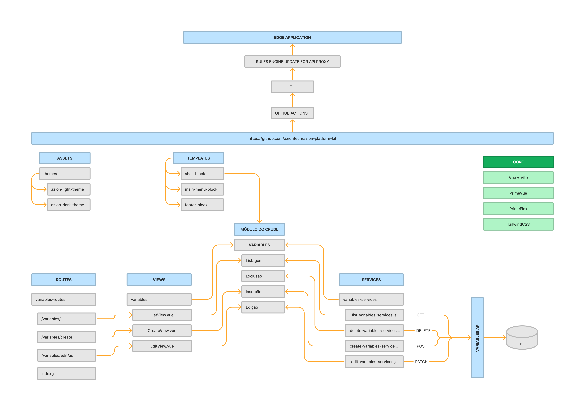

# Development Guide - PTBR

## Vai desenvolver?

### Configuração recomendada da sua IDE

Caso você opte pelo VSCode sugere-se o uso dos seguintes Plugins de forma a manter e controlar o pattern de desenvolvimento aumentando a velocidade:

[VSCode](https://code.visualstudio.com/) + [Volar](https://marketplace.visualstudio.com/items?itemName=Vue.volar) (and disable Vetur) + [TypeScript Vue Plugin (Volar)](https://marketplace.visualstudio.com/items?itemName=Vue.vscode-typescript-vue-plugin).

[Prettier](https://marketplace.visualstudio.com/items?itemName=esbenp.prettier-vscode)

Outra sugestão é deixar habilitado o auto-save do VSCode configurado para aplicar as regras de formatação das definições do ESLint e Prettier.
Para isso crie uma pasta chamada `.vscode/settings.json` com a seguinte configuração:

```
{
  "editor.tabSize": 2,
  "editor.insertSpaces": true,
  "editor.detectIndentation": true,
  "editor.codeActionsOnSave": {
    "source.fixAll.eslint": true,
  },
  "eslint.validate": [
    "javascript"
  ],
  "editor.defaultFormatter": "esbenp.prettier-vscode",
  "editor.formatOnSave": true,
  "files.insertFinalNewline": true
}
```

<font color="#f3652b">Este arquivo não deve ser comitado para não afetar preferências de outros usuários na IDE</font>

## Development

A estrutura segue o seguinte padrão:

```
├── App.vue
├── assets
│   └── themes
├── router
│   ├── routes
│   │   ├── edge-application-routes
│   │   └── variables-routes
│   └── index.js
├── services
│   ├── axios
│   ├── edge-application-services
│   └── variables-services
├── stores
├── templates
│   ├── create-form-block
│   ├── footer-block
│   ├── list-table-block
│   ├── main-menu-block
│   └── shell-block
└── views
    └── EdgeApplications
        ├── ListView.vue
        └── CreateView.vue
    └── Variables
        ├── ListView.vue
        └── FormView.vue
```

Onde:
| Diretório | Descrição |
|----------|----------|
| assets | Arquivos estáticos do projeto (CSS, Imagens, etc) |
| router | Estrutura de rotas, onde `index.js` centraliza todas rotas |
| services | Serviços separados por operação do CRUD |
| stores | Dados que precisam ser compartilhados entre as UI's/rotas |
| templates | Blocos disponíveis para a construção do projeto, já programados para integração |
| views | Conjunto de pastas separados por módulos, contém cada UI necessária para cada operação do CRUDL. |

Abaixo você pode visualizar um diagrama da disposição destes arquivos e a forma que se interligam para implementar um módulo CRUDL de Variables:



### Alteração do tema

#### CSS

A aplicação é nativamente tematizada com o _"look and feel"_ da Azion, sendo que o arquivo de theme é carregado dentro do arquivo `src/main.js` conforme exemplo abaixo:

```javascript
import '@/assets/themes/scss/themes/azion-light/theme.scss'
```

Os fontes do theme estão dentro do diretório:
`src/assets/themes/scss`
sendo que ao alterar os arquivos de Tokens ou qualquer arquivo destes diretórios as mesmas refletem diretamente no seu ambiente de desenvolvimento que está sendo executado.

#### Logotipo

Dentro do diretório `assets/svg/` encontra-se o arquivo `logo.vue` que pode ser sobrescrito por um arquivo SVG customizado.

### How to: usar o ambiente de stage da api

Para fins de desenvolvimento do time da Azion, é possível apontar para a API de stage e executar ações restritas em produção.

1. Altere o target da api no arquivo `vite.config.js` para `https://stage-api.azion.net`

```js
  server: {
    proxy: {
      '/api': {
        target: 'https://stage-api.azion.net',
        changeOrigin: true,
        rewrite: (path) => path.replace(/^\/api/, ''),
      }
    }
  }
```

### How to: criando uma UI de listagem de Variables

Tomando como exemplo a rota de _Variables_, temos o seguinte fluxo para implementação para a **Listagem**:

1. Criação do Serviço
   - _src/services/variables-services_
     - _make-variables-base-url.js_: método getter da URL base da API de Variables.
     - _index.js_: interface de exposição dos métodos (Listar, Editar, Excluir, Inserir)
     - _list-variables-service.js_: camada para chamada da API (endpoint de Listagem) e tratamento de retorno do payload (normalização, adição de helper, etc)
2. Criação da View
   - _ListView.vue_: através da seleção de um dos blocos (nesse exemplo: _src/templates/list-table-block_) é realizada a implementação lógica mais detalhada se necessário.
3. Criação da Rota:
   - _src/router/index.js_: passagem junto da rota das properties de serviço que já foram implementadas para o componente.
4. Adição no Menu (opcional)
   - _src/main-menu-block_: configuração da rota, nome e ícone que serão mostrados no Side Menu (se necessário).

## Extras

### Compilar e Minificar para produção

```sh
yarn build
```

### Executar localmente a versão de build

```sh
npm run preview
```

### Executar testes unitários com [Vitest](https://vitest.dev/)

```sh
yarn test:unit
```

### Executar testes e2e com [Cypress](https://www.cypress.io/)

Antes de executar seus testes com Cypress, duplique o arquivo `cypress.env.example.json`, renomeie a cópia recém criada para `cypress.env.json` e preencha as variáveis com dados válidos ao ambiente que seus testes irão usar ( APIs de stage ou produção ).

Para executar testes com interface

```sh
yarn test:e2e:dev
```

Para executar os testes via terminal

```sh
yarn test:e2e:dev-run
```

Esse comando executa os testes e2e em um servidor de desenvolvimento Vite.
Sendo muito mais rápido que um build para produção.

Embora ainda seja recomendado executar os testes no código buildado para produção com `test:e2e` antes de executar o deploy (ex.: ambientes de CI):

```sh
yarn build
yarn test:e2e
```

### Formatação com [ESLint](https://eslint.org/)

```sh
yarn lint
```

### Deploy manual (First deploy)

Para executar o deploy você pode utilizar o Azion CLI:

Azion CLI (>= 0.70.0):

```
yarn build

azioncli edge_applications init --name azion-platform-kit --type vue --mode deliver

azioncli edge_applications publish --debug

```

### Deploy com GitHub Workflow

Para usufruir do GitHub Workflow você precisa ter configurado dentro do seu repositório as seguintes SECRETS:

| SECRET             | Descrição                                                                        |
| ------------------ | -------------------------------------------------------------------------------- |
| PLATFORM_KIT_TOKEN | seu Personal token da Azion para ser utilizado no CLI durante o deploy.          |
| APPLICATION_ID     | ID da Edge Application criada anteriormente via first deploy.                    |
| FUNCTION_ID        | ID da Edge Function criada anteriormente via first deploy.                       |
| DOMAIN_ID          | ID do Domain vinculado a Edge Application criado anteriormente via first deploy. |

---

<font color=#f3652b>\* As informações sobre os ID's necessários para os SECRETS estarão disponíveis dentro do arquivo `azion/azion.json` após o first deploy.</font>

### Issues conhecidas na versão 0.7.0 da azioncli

Devido à incompatibilidades com o vite na versão atual da azioncli os problemas abaixo podem ocorrer:

- No fluxo de deploy, na primeira vez, a cli acaba não criando o diretório `.edge/statics` e retorna uma mensagem de erro no terminal. Para solucionar esse problema, execute:

```sh
  mkdir .edge/statics && cp -r dist/* .edge/statics
  azioncli edge_applications publish
```

- Já nos casos de edição da edge application, os estáticos gerados em `dist` não sobrescrevem os que estão em `.edge/statics`. Antes publicar a edge application pela cli, verifique se os arquivos em `dist` e `.edge/statics` possuem o mesmo nome/conteúdo. Para solucionar esse problema, execute:

```sh
  rm -rf .edge/statics/* && cp -r dist/* .edge/statics
  azioncli edge_applications publish
```

### Outros links

[vee-validate guide](https://vee-validate.logaretm.com/v4/guide/composition-api/getting-started/)
[yup with vee-valide guide](https://vee-validate.logaretm.com/v4/guide/composition-api/getting-started/#validating-with-yup)
