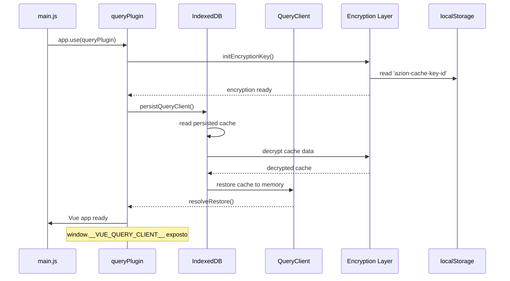
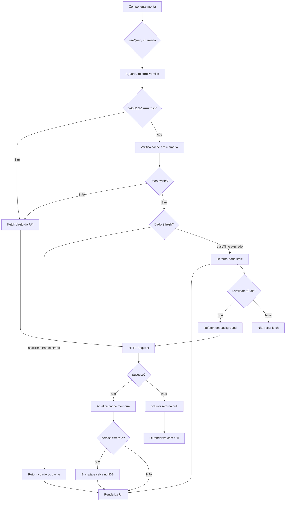
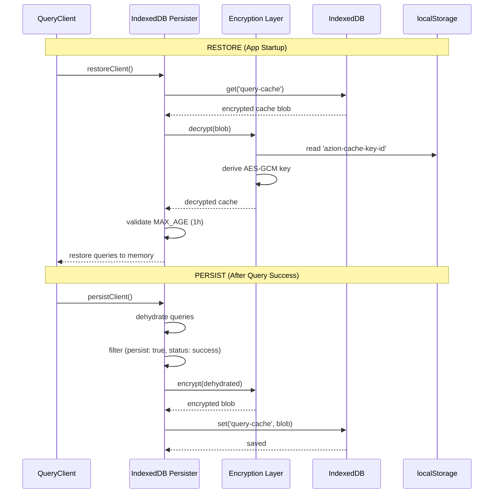
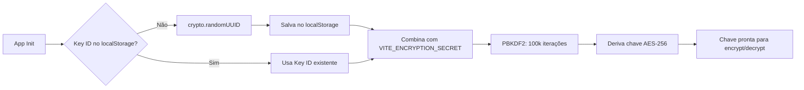
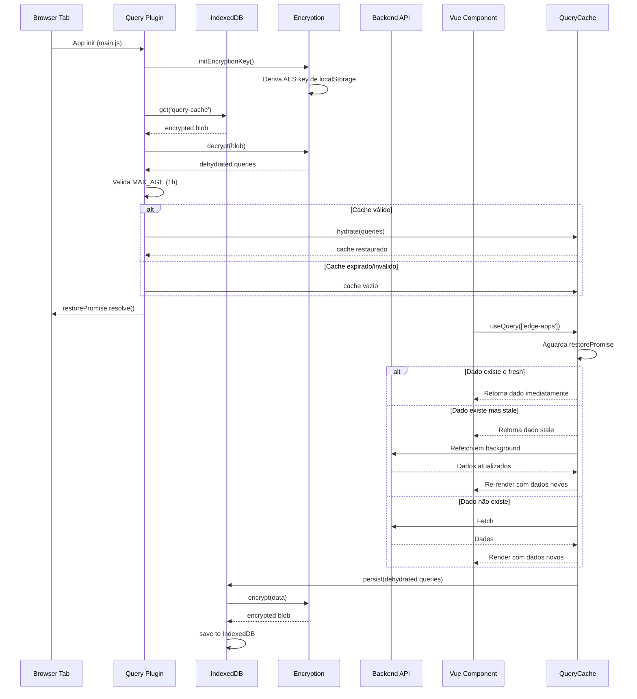
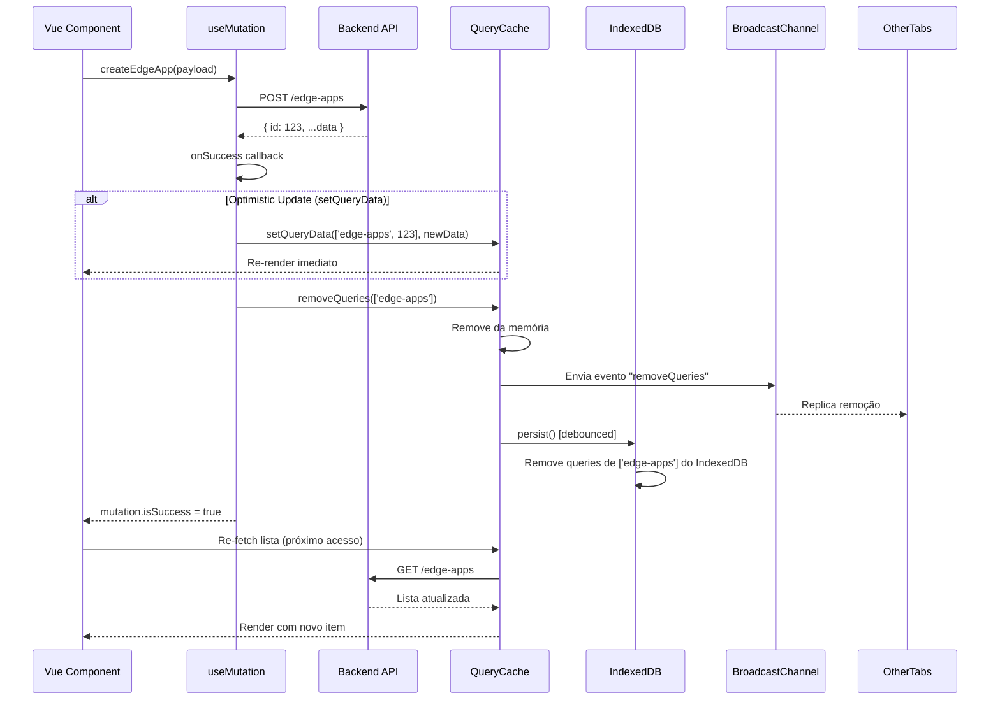

# Documentação Operacional - TanStack Query no Azion Console Kit

## 1. Fluxo de Execução das Queries

### Inicialização da Aplicação



### Fluxo de Execução de Query em Componente



### Critérios de Fresh vs Stale

**Query é considerada FRESH quando:**
- `Date.now() - lastDataUpdateAt < staleTime`
- Para GLOBAL: fresh por **3 minutos**
- Para STATIC: fresh por **30 minutos**

**Query é considerada STALE quando:**
- `Date.now() - lastDataUpdateAt >= staleTime`
- Ainda está em memória se `gcTime` não expirou
- Será refetchada se `revalidateIfStale: true`

**Query é REMOVIDA quando:**
- `Date.now() - lastDataUpdateAt >= gcTime` E nenhum observer ativo
- Para GLOBAL: após **5 minutos** sem uso
- Para STATIC: após **1 dia** sem uso

### Comportamento de `useEnsureQueryData`

```javascript
// BaseService.useEnsureQueryData
async useEnsureQueryData(queryKey, queryFn, options = {}) {
  await waitForPersistenceRestore() // CRÍTICO: aguarda cache ser restaurado

  if (queryOptions.meta?.skipCache) {
    return await queryFn() // Bypass completo do cache
  }

  return await this.queryClient.ensureQueryData({
    queryKey,
    queryFn,
    revalidateIfStale: true, // SEMPRE revalida dados stale
    ...queryOptions
  })
}
```

**Comportamento real:**
1. Bloqueia até `restorePromise` resolver (pode ser 100-500ms no primeiro load)
2. Se `skipCache: true`, ignora cache completamente e executa fetch
3. Se dado existe e é fresh, retorna imediatamente
4. Se dado existe e é stale, retorna dado antigo + refetch em background
5. Se dado não existe, aguarda fetch antes de retornar

---

## 2. Configuração Efetiva do QueryClient

### Configurações Globais

**Arquivo:** `src/services/v2/base/query/queryClient.js:3-13`

```javascript
const baseQueryClient = new QueryClient({
  defaultOptions: {
    queries: {
      refetchOnWindowFocus: false,  // NUNCA refaz ao focar janela
      refetchOnReconnect: false,    // NUNCA refaz ao reconectar
      refetchInterval: false,       // NUNCA refaz automaticamente
      refetchOnMount: false,        // NUNCA refaz ao montar
      retry: false,                 // NUNCA tenta retry automático
      persist: true,                // Persistir por padrão
      enabled: false                // Queries manuais por padrão
    },
    mutations: {
      retry: false                  // NUNCA retry em mutations
    }
  }
})
```

### Presets de Cache

**Arquivo:** `src/services/v2/base/query/queryOptions.js:5-17`

| Preset | staleTime | gcTime | Uso |
|--------|-----------|--------|-----|
| **GLOBAL** | 3 min (180.000ms) | 5 min (300.000ms) | Dados dinâmicos (Edge Apps, Workloads) |
| **STATIC** | 30 min (1.800.000ms) | 1 dia (86.400.000ms) | Dados raramente alterados (Solutions, Account Info) |

### Impacto Prático por Configuração

#### `refetchOnWindowFocus: false`
**O que significa:**
- Quando usuário volta para a tab, queries **não** são automaticamente revalidadas
- Dados permanecem no estado atual até serem manualmente invalidados

**Impacto na UI:**
- Usuário pode ver dados desatualizados ao retornar para a tab
- Evita requests desnecessários, mas **exige invalidações manuais explícitas**

#### `refetchOnReconnect: false`
**O que significa:**
- Após perda de conexão, queries **não** são revalidadas automaticamente

**Impacto na UI:**
- Se usuário perde conexão e outro cliente muda dados, **não haverá sincronização automática**
- Cache pode ficar **permanentemente desatualizado** até reload manual

#### `refetchOnMount: false`
**O que significa:**
- Componentes remontados **não** revalidam queries automaticamente
- Confia 100% no `staleTime` para decidir se refetch é necessário

**Impacto na UI:**
- Navegação entre rotas usa cache agressivamente
- Se `staleTime` ainda válido, **nunca** refaz fetch

#### `retry: false`
**O que significa:**
- Falhas de network **não** são retentadas automaticamente
- Primeira falha = erro final

**Impacto na UI:**
- **Fragilidade crítica**: timeout momentâneo = erro permanente até reload
- Usuário precisa manualmente recarregar página ou componente
- **Não há recuperação automática de falhas temporárias de rede**

#### `enabled: false`
**O que significa:**
- Queries precisam ser **manualmente ativadas** via `enabled: true` ou chamadas imperativas

**Impacto na UI:**
- `useQuery` sozinho **não executa**
- Requer `useEnsureQueryData`, `prefetchQuery` ou `enabled: computed(() => someCondition)`

---

## 3. Persistência de Cache

### Arquitetura de Persistência



### Configuração de Persistência

**Arquivo:** `src/services/v2/base/query/indexedDbPersister.js:9-29`

```javascript
export const PERSISTENCE_CONFIG = {
  IDB_NAME: 'azion',
  IDB_STORE_NAME: 'cache-store',
  CACHE_KEY: 'query-cache',
  VERSION: 'v0',
  MAX_AGE: toMilliseconds({ hours: 1 }), // Cache persiste por 1 hora

  DEHYDRATE_OPTIONS: {
    shouldDehydrateQuery: (query) => {
      // NÃO persiste se query falhou
      if (query.state.status !== 'success') return false

      // NÃO persiste se meta.persist === false
      if (query.meta?.persist === false) return false

      return true
    }
  }
}
```

### Critérios de Persistência

**Quando dados SÃO persistidos:**
- `query.state.status === 'success'`
- `query.meta.persist !== false`
- Query foi executada com sucesso pelo menos uma vez

**Quando dados NÃO SÃO persistidos:**
- `query.state.status === 'error'` ou `'pending'`
- `meta: { persist: false }` explícito
- `skipCache: true` em options (força bypass de leitura, mas não bloqueia escrita)

### Encriptação

**Arquivo:** `src/services/v2/base/query/encryption.js:58-112`

**Algoritmo:** AES-GCM (Web Crypto API)

**Processo de inicialização da chave:**



**Segurança:**
- **Key ID:** Gerado uma vez por navegador, persistido em `localStorage` (`'azion-cache-key-id'`)
- **Secret:** Variável de ambiente `VITE_ENCRYPTION_SECRET` (fallback hardcoded se não definida)
- **Derivação:** PBKDF2 com 100.000 iterações + SHA-256
- **IV:** Novo vetor de inicialização aleatório (12 bytes) por operação

**Fragmentação de segurança:**
- Se usuário limpa `localStorage`, perde Key ID → cache criptografado fica **ilegível**
- Cache IndexedDB fica órfão até ser manualmente limpo
- **Não há recuperação automática**: usuário vê app "vazio" até novo login

### Invalidação de Cache Persistido

#### 1. Por Tempo (MAX_AGE)

```javascript
// Ao restaurar, verifica timestamp
if (Date.now() - persistedCache.timestamp > MAX_AGE) {
  return undefined // Ignora cache expirado
}
```

**MAX_AGE = 1 hora:**
- Cache mais antigo que 1h é **descartado completamente** no restore
- Não é gradual: ou cache inteiro é usado, ou inteiro é ignorado

#### 2. Por Version Mismatch

```javascript
if (persistedCache.buster !== PERSISTENCE_CONFIG.VERSION) {
  return undefined // Ignora cache de versão antiga
}
```

**VERSION = 'v0':**
- Se mudar para `'v1'`, cache anterior é **ignorado** (não deletado, apenas não restaurado)
- **Problema:** cache antigo fica acumulando no IndexedDB indefinidamente

#### 3. Manual (Logout / Switch Account)

```javascript
// sessionManager.js
const clearAllData = async () => {
  await pauseQueryPersistence()
  await clearAllCache()
  await persister.removeClient() // DELETA cache do IndexedDB
}
```

**Trigger:**
- `sessionManager.logout()`
- `sessionManager.switchAccount()`

### Estratégias para Evitar Cache Incompatível Após Deploy

**Problema real:**
- App v2.0 implantado, mas usuário tem cache de v1.9 no IndexedDB
- Dados podem ter schema diferente, causando crashes

**Soluções implementadas:**

1. **MAX_AGE de 1 hora:**
   - Força cache a expirar após 1h
   - Deploy regular (< 1h entre releases) pode ter cache incompatível

2. **Version Bumping:**
   ```javascript
   // Em indexedDbPersister.js, incrementar quando schema mudar
   VERSION: 'v1' // era 'v0'
   ```
   - Cache antigo é ignorado
   - **Manual e propenso a esquecimento**

3. **shouldDehydrateQuery por feature flag (não implementado):**
   - Poderia desabilitar persistência de queries específicas via meta

**Fragilidades:**
- ❌ Não há versionamento automático por build
- ❌ Cache antigo fica acumulando no IndexedDB
- ❌ Não há limpeza automática de cache expirado
- ❌ Desenvolvedor pode esquecer de incrementar VERSION

**Recomendação para melhorar:**
```javascript
// Injetar hash do build no VERSION
VERSION: `v0-${import.meta.env.VITE_BUILD_HASH || 'dev'}`
```

---

## 4. Manipulação de Cache

### `invalidateQueries`

**Efeitos imediatos:**
- Marca queries matching como **stale**
- Se houver observers ativos (componente montado), dispara **refetch imediatamente**
- Se não houver observers, apenas marca como stale (refetch no próximo acesso)

**Efeitos diferidos:**
- Cache em memória **permanece** (não é removido)
- Cache persistido **permanece** no IndexedDB até próxima persist

**Uso real:**

```javascript
// Em BaseService.useMutation
invalidateKeysSuccess.forEach((key) => {
  this.queryClient.invalidateQueries({ queryKey: key })
})
```

**Exemplo:**
```javascript
this.useMutation(
  (data) => this.http.post('/edge-apps', data),
  {
    invalidateKeysSuccess: [queryKeys.edgeApp.all] // Invalida todas queries de edge apps
  }
)
```

**Comportamento hierárquico:**
```javascript
// queryKeys.edgeApp.all = ['edge-apps']
// Invalida:
// - ['edge-apps']
// - ['edge-apps', 123]
// - ['edge-apps', 123, 'origins']
// - ['edge-apps', 123, 'origins', 'list', {...params}]
```

### `removeQueries`

**Impacto em memória:**
- Remove **completamente** da QueryCache
- Garbage collector pode limpar dados

**Impacto em persistência:**
- **NÃO remove do IndexedDB imediatamente**
- Persistência acontece de forma assíncrona e debounced
- Cache antigo pode persistir até próximo ciclo de persist

**Uso real:**

```javascript
// EdgeAppService - após create/edit/delete
this.queryClient.removeQueries({ queryKey: queryKeys.edgeApp.all })
```

**Efeito colateral crítico:**
- Componentes com `useQuery` ativo **perdem dados imediatamente**
- UI pode mostrar loading state ou fallback
- Se componente depende de placeholder, pode crashar se placeholder também foi removido

### `setQueryData`

**Comportamento:**
- Mutação local **sem fetch**
- Atualiza cache em memória imediatamente
- Dispara re-render de observers

**Uso real (Instant Edit Pattern):**

```javascript
// Após mutation bem-sucedida, atualiza cache local
this.queryClient.setQueryData(
  queryKeys.edgeApp.detail(id),
  (oldData) => ({ ...oldData, ...updatedFields })
)
```

**Limitações:**
- **NÃO dispara onSuccess callbacks**
- **NÃO invalida queries relacionadas automaticamente**
- **Responsabilidade do desenvolvedor manter consistência entre queries relacionadas**

**Exemplo de inconsistência:**
```javascript
// Atualiza detail
setQueryData(queryKeys.edgeApp.detail(123), newData)

// Lista ainda tem dados antigos!
// queryKeys.edgeApp.list() não foi atualizada
```

### `refetchQueries`

**Execução forçada:**
- Ignora `staleTime` e `enabled: false`
- Força fetch mesmo se dado é fresh

**Uso real:**

```javascript
// Em cache-sync-service (atualmente desabilitado)
await queryClient.refetchQueries({
  queryKey: query.queryKey,
  exact: true
})
```

**Opções importantes:**

```javascript
queryClient.refetchQueries({
  queryKey: ['edge-apps'],
  exact: false,        // Refaz queries hierárquicas
  type: 'active',      // Apenas queries com observers ativos
  stale: true         // Apenas queries stale (padrão: todas)
})
```

**Comportamento com `exact: false`:**
- `queryKey: ['edge-apps']` refaz:
  - `['edge-apps']`
  - `['edge-apps', 123]`
  - `['edge-apps', 123, 'origins']`

**Comportamento com `exact: true`:**
- `queryKey: ['edge-apps']` refaz **SOMENTE**:
  - `['edge-apps']`

---

## 5. Cenários Críticos

### Cenário 1: Navegação SPA sem Reload

**Fluxo:**
1. Usuário navega: `/edge-apps` → `/edge-apps/123`
2. Componente detail monta e chama `useQuery(queryKeys.edgeApp.detail(123))`

**Comportamento esperado:**
- Se detail(123) existe em cache e staleTime válido → render instantâneo
- Se stale → render com dado antigo + refetch background

**Comportamento real problemático:**
- `refetchOnMount: false` → **NUNCA** revalida, mesmo se dado é muito antigo
- Se outro usuário editou o edge app 123, **mudanças não aparecem** até:
  - Usuário dar reload manual
  - staleTime expirar (3 min para GLOBAL)
  - Invalidação manual via mutation

**Impacto:**
- Dados podem estar até **3 minutos desatualizados** em navegação SPA
- Colaboração multi-usuário fica **silenciosamente dessincronizada**

### Cenário 2: Deploy com Assets Novos e Cache Antigo

**Situação:**
1. Deploy de versão 2.0 sai às 10:00
2. Usuário tem app aberto desde 9:30 com cache v1.9

**Problema de Schema:**
```javascript
// v1.9: { name: string }
// v2.0: { name: { first: string, last: string } }

// Cache persistido tem schema v1.9
const cachedData = { id: 1, name: "Edge App" }

// Código v2.0 tenta acessar
console.log(data.name.first) // ❌ TypeError: Cannot read 'first' of undefined
```

**Mitigações existentes:**
- ✅ `MAX_AGE: 1h` → cache expira após 1h
- ⚠️ `VERSION: 'v0'` → **precisa ser manualmente incrementado**

**Pontos frágeis:**
- ❌ Não há validação de schema ao restaurar cache
- ❌ Não há fallback automático se dados corrompidos
- ❌ App pode crashar antes de conseguir limpar cache

**Recomendação operacional:**
- Incrementar `VERSION` em **todo deploy que muda schema**
- Ou usar build hash injetado automaticamente:
  ```javascript
  VERSION: `v0-${__BUILD_HASH__}`
  ```

### Cenário 3: Falha Parcial de Rede

**Situação:**
1. Usuário carrega lista de edge apps (sucesso)
2. Clica em edge app #123 para ver detalhes
3. Request para `/edge-apps/123` retorna 504 Gateway Timeout

**Comportamento atual:**
```javascript
// BaseService.useQuery
onError: () => Promise.resolve(null)
```

**Resultado:**
- Query falha silenciosamente
- `data.value === null`
- `error.value === undefined` (foi swallowed)
- UI precisa checar `isError` manualmente

**Impacto na UI:**
- Se componente não trata `null`, pode crashar
- Erro não é logado automaticamente
- Usuário vê tela em branco sem feedback

**Fragilidade com `retry: false`:**
- **Timeout momentâneo = erro permanente**
- Não há segunda tentativa automática
- Usuário precisa:
  - Recarregar manualmente
  - Ou navegar de volta e clicar novamente

**Como deveria funcionar (não implementado):**
```javascript
retry: 3,
retryDelay: (attemptIndex) => Math.min(1000 * 2 ** attemptIndex, 30000)
```

### Cenário 4: Dados Persistidos Incompatíveis

**Situação:**
1. Usuário faz login em conta A
2. Cache é populado e persistido no IndexedDB
3. Usuário faz logout e login em conta B (ID diferente)

**Problema se não limpar cache:**
```javascript
// Cache tem dados da conta A
persistedCache = {
  queryKey: ['account', 'info'],
  data: { id: 'account-A', name: 'Company A' }
}

// Usuário logado na conta B vê dados da conta A
```

**Mitigação implementada:**
```javascript
// sessionManager.switchAccount
const clearAllData = async () => {
  await pauseQueryPersistence()
  await clearAllCache()
  await persister.removeClient() // CRÍTICO: limpa IndexedDB
}
```

**Pontos frágeis:**
- ✅ Logout limpa cache corretamente
- ✅ Switch account limpa cache corretamente
- ❌ Se `sessionManager` não é chamado (navegação direta), cache pode vazar

**Vazamento de dados possível:**
```javascript
// Usuário compartilha computador
// 1. User A faz login, usa app, fecha aba (sem logout)
// 2. User B abre nova aba, faz login
// 3. Se encryption key ID é o mesmo no localStorage...
//    Cache de User A pode ser restaurado para User B
```

**Por que não acontece na prática:**
- `sessionManager.afterLogin` força refetch de dados essenciais
- Queries com `revalidateIfStale: true` revalidam background
- Mas **cache pode aparecer brevemente antes de refetch**

### Cenário 5: Queries Órfãs ou Nunca Invalidadas

**Problema:**
```javascript
// Service cria query com chave dinâmica
const params = { page: 1, search: 'temporary-search-term', filters: {...} }
queryClient.ensureQueryData(
  queryKeys.edgeApp.list(params), // Chave única para esses params
  fetchFn
)

// Usuário navega fora, componente desmonta
// Query fica no cache por gcTime (5 min)
```

**Acúmulo de queries:**
- Cada combinação de `{ page, search, filters }` cria nova query key
- Se usuário muda filtro 50 vezes, **50 queries** ficam no cache
- Cada uma ocupa memória até `gcTime` expirar

**Impacto:**
- 📈 **Consumo de memória cresce indefinidamente** durante sessão
- 💾 **IndexedDB fica poluído** com queries antigas (não há limpeza automática)
- 🐌 **Restore do cache fica lento** (precisa desserializar centenas de queries)

**Queries nunca invalidadas:**
```javascript
// Service não invalida ao fazer mutation
edit = async (payload) => {
  await this.http.patch(`/edge-apps/${payload.id}`, payload)
  // ❌ ESQUECEU de invalidar
  // this.queryClient.removeQueries({ queryKey: queryKeys.edgeApp.all })
}
```

**Resultado:**
- Lista continua mostrando dados antigos
- Detail mostra dados atualizados (se usou `setQueryData`)
- **Inconsistência visível na UI**

**Mitigação (não implementada):**
- Configurar `queryCache.onQueryRemove` para logar queries removidas
- Monitorar tamanho do cache em produção
- Adicionar limpeza periódica de queries órfãs:
  ```javascript
  setInterval(() => {
    queryClient.getQueryCache().findAll({ stale: true, active: false })
      .forEach(query => queryClient.removeQueries({ queryKey: query.queryKey }))
  }, 60000) // A cada 1 min
  ```

---

## 6. Observabilidade

### Broadcast Query Client (Sincronização Multi-Tab)

**Implementação:** `src/services/v2/base/query/queryClient.js:15-17`

```javascript
import { broadcastQueryClient } from '@tanstack/query-broadcast-client-experimental'

const broadcastChannel = isProductionEnvironment
  ? 'app-azion-sync'
  : 'app-azion-sync-stage'

broadcastQueryClient({ queryClient, broadcastChannel })
```

**O que faz:**
- Sincroniza **mutações de cache** entre tabs em tempo real
- Quando Tab A invalida query, Tab B também invalida
- Quando Tab A atualiza setQueryData, Tab B também atualiza

**Limitações:**
- Usa BroadcastChannel API (não funciona em Safari < 15.4)
- **Não sincroniza fetches**, apenas mutações de cache
- **Não funciona cross-domain** (apenas mesma origem)

### Cache Sync Service (Atualmente Desabilitado)

**Configuração:** `src/services/v2/base/cache-sync/cache-sync-service.js:5`

```javascript
const CACHE_SYNC_POLLING_ENABLED = false
```

**Funcionalidade quando ativo:**
1. Tab primária faz polling de `/activity-history` a cada 30s
2. Detecta eventos de alteração (ex: "Edge Application Created")
3. Mapeia evento → query keys via `invalidation-map.js`
4. Invalida queries relacionadas em todas as tabs via broadcast

**Por que está desabilitado:**
- ⚠️ **Overhead de polling constante** (requests a cada 30s)
- ⚠️ **Activity History pode ter delay** (eventos não são instantâneos)
- ⚠️ **False positives** (eventos de outros usuários invalidam cache local)

**Trade-off:**
- ✅ Menos requests HTTP
- ❌ Dados podem ficar desatualizados por até `staleTime + polling interval`

### Captura de Erros de Fetch

**HTTP Layer:** `src/services/v2/base/http/httpService.js:45-56`

```javascript
try {
  const response = await this.httpClient.send({ method, data: body, url, ...config })
  return response
} catch (axiosError) {
  if (!processError) {
    const meta = this.errorHandler.createMeta(axiosError)
    if (meta) return meta
  }
  throw this.errorHandler.create(axiosError)
}
```

**Query Layer:** `src/services/v2/base/query/baseService.js:35-42`

```javascript
useQuery(queryKey, queryFn, options = {}) {
  return useQuery({
    queryKey,
    queryFn,
    ...queryOptions,
    onError: () => Promise.resolve(null) // ❌ Engole erro silenciosamente
  })
}
```

**Problema de observabilidade:**
- **Erros de fetch não são propagados para ferramentas de erro**
- `onError` retorna `null` → erro desaparece
- `error.value === undefined` sempre

**Como erros deveriam ser capturados (não implementado):**
```javascript
onError: (error) => {
  // Log para Sentry, DataDog, etc
  window.errorTracker?.captureException(error, {
    tags: { layer: 'tanstack-query' },
    extra: { queryKey, queryFn: queryFn.toString() }
  })

  return Promise.resolve(null)
}
```

### Log de Inconsistência de Cache

**Situações que deveriam ser logadas (não implementadas):**

1. **Cache restaurado com schema incompatível:**
   ```javascript
   // Em indexedDbPersister.restoreClient
   try {
     const restored = await restoreClient()
   } catch (error) {
     // ❌ Não loga: cache corrompido, decryption falhou, schema inválido
     console.error('Cache restore failed', error) // Deveria ir para Sentry
   }
   ```

2. **Queries órfãs acumulando:**
   ```javascript
   // Monitorar tamanho do cache
   const allQueries = queryClient.getQueryCache().getAll()
   if (allQueries.length > 500) {
     console.warn('Cache size exceeded', allQueries.length) // Deveria ir para Sentry
   }
   ```

3. **Mutations sem invalidação:**
   ```javascript
   // Em BaseService.useMutation
   if (invalidateKeysSuccess.length === 0 && invalidateKeysError.length === 0) {
     console.warn('Mutation without invalidation', { mutationFn })
   }
   ```

### Integração com Ferramentas de Erro

**Sentry (ou similar):**

```javascript
// Exemplo de integração (não implementada)
import * as Sentry from '@sentry/vue'

const queryClient = new QueryClient({
  queryCache: new QueryCache({
    onError: (error, query) => {
      Sentry.captureException(error, {
        tags: { layer: 'react-query' },
        extra: {
          queryKey: query.queryKey,
          queryHash: query.queryHash,
          state: query.state
        }
      })
    }
  }),
  mutationCache: new MutationCache({
    onError: (error, variables, context, mutation) => {
      Sentry.captureException(error, {
        tags: { layer: 'react-query-mutation' },
        extra: {
          variables,
          mutationKey: mutation.options.mutationKey
        }
      })
    }
  })
})
```

### DevTools e Debugging

**Exposição global do QueryClient:**

```javascript
// Em queryPlugin.js
if (typeof window !== 'undefined') {
  window.__VUE_QUERY_CLIENT__ = queryClient
}
```

**Uso no console do navegador:**

```javascript
// Inspecionar todas queries
window.__VUE_QUERY_CLIENT__.getQueryCache().getAll()

// Ver query específica
window.__VUE_QUERY_CLIENT__.getQueryData(['edge-apps'])

// Forçar invalidação
window.__VUE_QUERY_CLIENT__.invalidateQueries({ queryKey: ['edge-apps'] })

// Limpar cache completamente
window.__VUE_QUERY_CLIENT__.clear()

// Ver estatísticas
const queries = window.__VUE_QUERY_CLIENT__.getQueryCache().getAll()
console.log({
  total: queries.length,
  active: queries.filter(q => q.observers.length > 0).length,
  stale: queries.filter(q => q.isStale()).length,
  fresh: queries.filter(q => !q.isStale()).length
})
```

**Vue DevTools:**
- TanStack Vue Query v5.90.3 tem integração com Vue DevTools
- Permite inspecionar queries, mutations, e estado do cache
- **Disponível apenas em desenvolvimento** (não funciona em produção)

### Limitações de Visibilidade

**O que NÃO pode ser observado facilmente:**

1. **Por que query não foi executada:**
   - `enabled: false`? `staleTime` ainda válido? Cache foi restaurado?
   - Precisa debuggar manualmente cada ponto

2. **Performance de restore:**
   - Quanto tempo levou para descriptografar e restaurar cache?
   - Quantas queries foram restauradas?
   - Sem métricas prontas

3. **Tamanho do cache persistido:**
   - Quanto espaço IndexedDB está usando?
   - Queries maiores estão causando slowdown?
   - Precisa usar DevTools do navegador (Storage tab)

4. **Invalidações em cascata:**
   - Invalidar `['edge-apps']` invalida quantas queries?
   - Sem log automático de invalidações

5. **Broadcast events:**
   - Não há log de eventos enviados/recebidos entre tabs
   - Debugging multi-tab é manual via `console.log`

---

## Diagramas de Fluxo Completos

### Fluxo de Restore + Refetch



### Fluxo de Mutation com Invalidação



---

## Resumo dos Pontos Críticos

### ✅ Funciona Bem

1. **Persistência criptografada** protege dados sensíveis em repouso
2. **Broadcast entre tabs** mantém cache sincronizado
3. **Instant Edit Pattern** proporciona UX rápida com placeholders
4. **Cache hierárquico** com query keys facilita invalidações em lote
5. **Prefetch após login** melhora perceived performance

### ⚠️ Fragilidades

1. **`retry: false`**: Falhas de rede não são recuperadas automaticamente
2. **`refetchOnWindowFocus: false`**: Dados podem ficar desatualizados indefinidamente
3. **Erros swallowed**: `onError` retorna `null`, perde visibilidade
4. **Sem validação de schema**: Cache antigo pode crashar app em novo deploy
5. **Versionamento manual**: Desenvolvedor pode esquecer de incrementar `VERSION`
6. **Queries órfãs**: Acumulam memória durante sessão sem limpeza automática
7. **Cache Sync desabilitado**: Mudanças de outros usuários não são detectadas
8. **Sem integração com error tracking**: Falhas de cache não vão para Sentry
9. **Sem métricas de performance**: Não sabe quanto tempo restore levou
10. **IndexedDB sem limpeza**: Cache expirado acumula indefinidamente

### 🔧 Recomendações Operacionais

**Para debugging:**
```javascript
// Console do navegador
const qc = window.__VUE_QUERY_CLIENT__

// Ver todas queries
qc.getQueryCache().getAll()

// Ver queries stale
qc.getQueryCache().findAll({ stale: true })

// Limpar cache problemático
qc.removeQueries({ queryKey: ['edge-apps'] })
await qc.clear() // Limpa tudo
```

**Para evitar quebrar cache:**
- Sempre incrementar `VERSION` quando schema de dados mudar
- Sempre adicionar invalidações em mutations
- Testar navegação SPA sem reload manual
- Verificar comportamento com network throttling

**Para melhorar observabilidade:**
- Integrar `onError` com Sentry/DataDog
- Adicionar métricas de tamanho de cache
- Logar tempo de restore
- Adicionar alertas para cache > 500 queries
