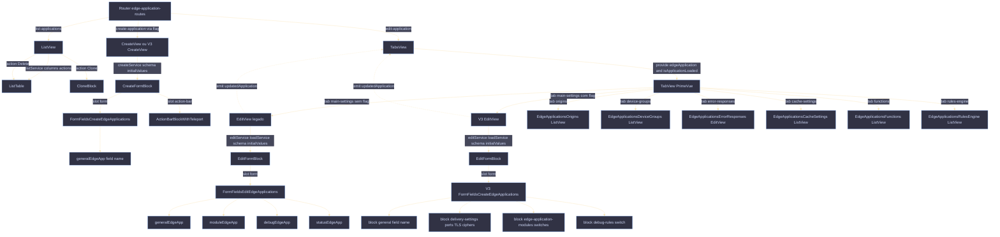
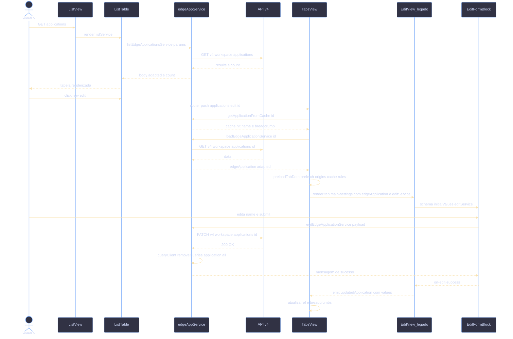

# Edge Application - Fluxo de Componentes

> Branch: `feat/versioning` - estado em 09/06/2026.
>
> Nota sobre versionamento: o briefing original referenciava arquivos novos
> (`EditDispatcher.vue`, `VersionEditorView.vue`, `VersionsListView.vue`,
> `useResourceVersions.js`, `helpers/version-state/`,
> `application-version-*.js`). Esses arquivos **não estão presentes** na working
> tree atual (verificação via `git status` real e `ls`). A seção 7
> (Versionamento) descreve o **padrão atualmente seguido pelo Workload**
> (`docs/WORKLOAD-VERSIONING.md`), que serve de referência para a implementação
> equivalente em Applications.

## 1. Visão Geral

O módulo Edge Applications segue o pipeline padrão `route -> view -> template
block -> form fields -> service v2 + adapter`. A rota raiz (`/applications`)
renderiza uma listagem paginada. A criação usa formulário enxuto. A edição é
montada em `TabsView.vue`, que orquestra sete sub-views (Main Settings, Origins,
Device Groups, Error Responses, Cache Settings, Functions, Rules Engine) e troca
entre a EditView legada e a V3 conforme a flag `hasFlagBlockApiV4`. Todas as
chamadas HTTP passam por `edgeAppService` (TanStack Query + adapter) ou pelos
services específicos de cada tab. Stores e composables são usados apenas para
breadcrumbs (`useBreadcrumbs`), prompt de saída (`provideTabUnsaved`) e
configuração de tabela (`useTableDefinitionsStore`).

## 2. Hierarquia de Componentes

### 2.1 Fluxograma



### 2.2 Tabela de Componentes

| Componente | Caminho | Props recebidas | Eventos emitidos | Filhos principais |
|---|---|---|---|---|
| `ListView.vue` | `src/views/EdgeApplications/ListView.vue` | `documentationService` | - | `ContentBlock`, `PageHeadingBlock`, `ListTable`, `DataTableActionsButtons` |
| `CreateView.vue` | `src/views/EdgeApplications/CreateView.vue` | - (usa `edgeAppService` direto) | - | `CreateFormBlock`, `FormFieldsCreateEdgeApplications`, `ActionBarBlockWithTeleport` |
| `TabsView.vue` | `src/views/EdgeApplications/TabsView.vue` | `edgeApplicationServices`, `originsServices`, `deviceGroupsServices`, `rulesEngineServices`, `functionsServices`, `edgeFunctionsServices` | recebe `@updatedApplication` dos filhos | `TabView`, `TabPanel`, `EditView` ou `V3/EditView`, listas das tabs |
| `EditView.vue` (legado) | `src/views/EdgeApplications/EditView.vue` | `updatedRedirect`, `edgeApplication`, `initialValues`, `contactSalesEdgeApplicationService` | `updatedApplication` | `EditFormBlock`, `FormFieldsEditEdgeApplications`, `ActionBarBlockWithTeleport` |
| `V3/EditView.vue` | `src/views/EdgeApplications/V3/EditView.vue` | `editEdgeApplicationService`, `updatedRedirect`, `edgeApplication`, `initialValues`, `contactSalesEdgeApplicationService` | `updatedApplication` | `EditFormBlock`, `V3/FormFields/FormFieldsCreateEdgeApplications`, `ActionBarBlockWithTeleport` |
| `FormFieldsEditEdgeApplications.vue` | `src/views/EdgeApplications/FormFields/FormFieldsEditEdgeApplications.vue` | `handleBlock`, `isDrawer` | - | `generalEdgeApp`, `moduleEdgeApp`, `debugEdgeApp`, `statusEdgeApp` |
| `V3/FormFields/FormFieldsCreateEdgeApplications.vue` | `src/views/EdgeApplications/V3/FormFields/FormFieldsCreateEdgeApplications.vue` | `handleBlock`, `contactSalesEdgeApplicationService`, `isDrawer` | - | `FormHorizontal` x N, `FieldText`, `FieldDropdown`, `MultiSelect`, `FieldGroupRadio`, `FieldGroupSwitch`, `FieldSwitchBlock` |
| `generalEdgeApp.vue` | `src/views/EdgeApplications/FormFields/block/generalEdgeApp.vue` | `isDrawer` | - | `FormHorizontal`, `FieldText` (`name`) |
| `moduleEdgeApp.vue` | `src/views/EdgeApplications/FormFields/block/moduleEdgeApp.vue` | `isDrawer` | - | `FieldGroupSwitch` com `applicationAcceleratorEnabled`, `edgeCacheEnabled`, `edgeFunctionsEnabled`, `imageProcessorEnabled` |
| `debugEdgeApp.vue` | `src/views/EdgeApplications/FormFields/block/debugEdgeApp.vue` | `isDrawer` | - | `FieldSwitchBlock` (`debug`) |
| `statusEdgeApp.vue` | `src/views/EdgeApplications/FormFields/block/statusEdgeApp.vue` | `isDrawer` | - | `FieldSwitchBlock` (`isActive`) |
| `Drawer/index.vue` | `src/views/EdgeApplications/Drawer/index.vue` | (drawer auxiliar para criação rápida) | - | reusa `FormFieldsCreateEdgeApplications` |

## 3. Roteamento

Arquivo: `src/router/routes/edge-application-routes/index.js`. Path base
`/applications`.

| Path | Name | Component | Props injetadas | Meta |
|---|---|---|---|---|
| `''` | `list-applications` | `EdgeApplications/ListView.vue` | `documentationService: documentationBuildProducts.applications` | title `Applications`, breadcrumbs `[Applications]` |
| `create` | `create-application` | `V3/CreateView.vue` se `hasFlagBlockApiV4()` else `CreateView.vue` | `createEdgeApplicationService` (de `handleServicesByFlag`) | title `Create Application` |
| `edit/:id/:tab?` | `edit-application` | `EdgeApplications/TabsView.vue` | `edgeApplicationServices` (load/edit/lock/contactSales/updatedRedirect), `originsServices` (list/prefetch/delete/create/edit/load + doc), `cacheSettingsServices` (doc), `functionsServices` (doc), `deviceGroupsServices` (doc), `rulesEngineServices` (doc + listOrigins) | title `Edit Application`, breadcrumb dinâmico via `routeParam: 'id'` |

Notas:

- `useEdgeApplicationServices` (alias `handleServicesByFlag`) escolhe entre v4 e
  legado conforme a flag. Toda navegação direta para `applications/edit/:id`
  passa por `TabsView`, que então decide entre `EditView` e `V3/EditView`.
- O parâmetro `:tab?` define qual aba abre. Mapeamento em
  `TabsView.defaultTabs` (com remapeamento quando a flag está OFF).
- Não existem `beforeEnter` guards específicos; a permissão geral vem do guard
  global em `src/router/index.js`.

## 4. Listagem (ListView)

### Composição

- `ContentBlock > PageHeadingBlock` (título "Applications", botão de criação via
  `DataTableActionsButtons` -> `/applications/create?origin=list`).
- `ListTable` recebe `listService = edgeAppService.listEdgeApplicationsService`,
  `editPagePath = '/applications/edit'`, ordenação default
  `-last_modified`, `lazy: true`.
- Colunas: `name` (com `text-format-with-popup`), `id`, `active` (tag),
  `lastEditor`, `lastModified`. Coluna `name` é frozen.
- Filtros permitidos: todas as colunas exceto `Last Modified`.

### Ações por linha

| Ação | Tipo | Service / Dialog |
|---|---|---|
| Clone | `dialog` (`CloneBlock`) | `edgeAppService.cloneEdgeApplicationService` (POST `/clone`, retorna `urlToEditView`) |
| Delete | `delete` | `edgeAppService.deleteEdgeApplicationService` |

### Eventos de tracking

`@on-before-go-to-add-page` -> `tracker.product.clickToCreate`;
`@on-before-go-to-edit` -> `tracker.product.clickToEdit`, e se
`item.isLocked` exibe toast `LOCKED_MESSAGE_TOAST` (item `disableEditClick`
vem do adapter quando `product_version === 'custom'`).

## 5. Edição

### 5.1 TabsView (orquestrador)

`TabsView.vue` é o componente raiz de `edit/:id/:tab?`. Responsabilidades:

- Resolve o id de `route.params.id` e tenta hidratar via
  `edgeAppService.getApplicationFromCache(id)` (lookup na lista cacheada do
  vue-query) para mostrar título antes do fetch.
- `handleLoadEdgeApplication()` chama
  `props.edgeApplicationServices.loadEdgeApplication(params)` (flag ON) ou
  `edgeAppService.loadEdgeApplicationService` (flag OFF). Em erro, mostra toast
  e redireciona para `updatedRedirect` (`list-applications`).
- `checkIsLocked()` consulta `loadEdgeApplicationService` com
  `fields: 'product_version'` e seta `isLocked = productVersion === 'custom'`.
- `preloadTabData()` dispara `prefetch*` paralelos: origins (flag),
  errorResponse (flag), deviceGroups, cacheSettings, functions (condicional),
  rulesEngine.
- `provide('edgeApplication', ref)` e `provide('isApplicationLoaded', ref)`
  para descendentes.
- `provideTabUnsaved(changeTab)` injeta `useTabUnsaved` (modal de saída sem
  salvar). `DialogUnsaved` renderizado no template.
- Renderiza dinamicamente o componente da aba via `<component :is>` com
  `tab.props()` calculado por tab.

### 5.2 EditView.vue (legado, flag OFF)

- Schema Yup mínimo: `{ name: yup.string().required() }`.
- `handleBlocks = ['general', 'delivery-settings', 'edge-application-modules', 'debug-rules']`
  (passado, mas o componente legado `FormFieldsEditEdgeApplications` renderiza
  sempre `general + module + debug + status` sem filtrar por essa lista).
- `EditFormBlock` recebe `editService = edgeAppService.editEdgeApplicationService`,
  `loadService = () => props.edgeApplication`, `schema`, `initialValues`,
  `disableRedirect`, `isTabs`.
- Submit (`formSubmit`): chama `onSubmit()` do template, se valido emite
  `updatedApplication(values)` para o `TabsView` atualizar o ref e breadcrumbs.
- Tracking: `productEdited` em sucesso, `failedToEdit` em erro (extraindo
  `fieldName` e `message` via `handleTrackerError`).

### 5.3 V3/EditView.vue (flag ON)

- Schema Yup ampliado:

  ```js
  yup.object({
    name: yup.string().required(),
    httpPort: yup.array().when('deliveryProtocol', {
      is: (p) => p?.includes('http'),
      then: (s) => s.min(1).required()
    }),
    httpsPort: yup.array().when('deliveryProtocol', {
      is: (p) => p?.includes('https'),
      then: (s) => s.min(1).required()
    })
  })
  ```

- `loadEdgeApplication()` aguarda `isApplicationLoaded` (injetado de
  `TabsView`) antes de retornar `props.edgeApplication`. Sem isso, o V3 só
  hidrata quando o load completa.
- `editService` é injetado via prop (`editEdgeApplicationService`), o que
  permite ao router escolher v4 vs legado.

## 6. Formulários e Validação

### 6.1 Formulário legado (`FormFieldsEditEdgeApplications`)

| Bloco | Campo (`name`) | Componente | Regra |
|---|---|---|---|
| general | `name` | `FieldText` | `yup.string().required()` (no schema da view) |
| modules | `applicationAcceleratorEnabled` | `FieldGroupSwitch` | sem regra explicita (boolean) |
| modules | `edgeCacheEnabled` | switch (disabled) | trava em `true` (locked tag) |
| modules | `edgeFunctionsEnabled` | switch | boolean |
| modules | `imageProcessorEnabled` | switch | boolean |
| debug | `debug` | `FieldSwitchBlock` | boolean |
| status | `isActive` | `FieldSwitchBlock` | boolean |

### 6.2 Formulário V3 (`V3/FormFields/FormFieldsCreateEdgeApplications`)

Renderização condicional via prop `handleBlock` (array de identificadores).

| Bloco (`handleBlock`) | Campos | Regras |
|---|---|---|
| `general` | `name` | `name`: `yup.string().required()` (schema da view de criação) |
| `delivery-settings` | `deliveryProtocol` (radio: `http`, `http,https`, `http3`), `httpPort` (multiselect), `httpsPort` (multiselect), `minimumTlsVersion` (dropdown), `supportedCiphers` (dropdown), `http3` (interno) | `httpPort`: `array().min(1).required()` se protocol contém `http`; `httpsPort`: idem para `https` (schema da V3/EditView); ao trocar para `http3` forca defaults `80`/`443` e seta `http3 = true`; trocar para `http` zera `minimumTlsVersion` para `none` |
| `default-origins` | `originType` (locked em `single_origin`), `originProtocolPolicy` (radio: `preserve`/`http`/`https`), `address`, `hostHeader` | `address` e `hostHeader` com `required` no template; schema base inclui apenas validação de portas (origins editados em sub-rotina propria) |
| `cache-expiration-policies` | `browserCacheSettings` (radio `override`/`honor`), `browserCacheSettingsMaximumTtl` (InputNumber, exibido se nao `honor`), `cdnCacheSettings` (radio), `cdnCacheSettingsMaximumTtl` | sem validacao Yup explicita; defaults aplicados pelo adapter |
| `edge-application-modules` | `applicationAccelerator`, `caching` (locked), `deviceDetection`, `edgeFunctions`, `imageOptimization`, `loadBalancer`, `websocket` (subscription) | boolean; `websocket` se ja ativo fica disabled |
| `debug-rules` | `debugRules` | boolean |

Mensagens de erro: aplicadas via `useField('<name>').errorMessage` e exibidas
em `<small class="p-error">` (ports) ou pelo proprio webkit field nos demais
campos.

### 6.3 Submit

- `EditFormBlock` (em `@/templates/edit-form-block`) e quem orquestra
  `useForm` (VeeValidate). Expõe `onSubmit`, `formValid`, `onCancel`,
  `loading`, `values` ao slot `action-bar`.
- O slot dispara `formSubmit(onSubmit, values, formValid)` da view, que
  aguarda `onSubmit()`, valida `formValid` e emite `updatedApplication` ao
  `TabsView`. Em caso de sucesso/erro o `EditFormBlock` emite
  `@on-edit-success` / `@on-edit-fail` para tracking.

## 8. Camada de Servicos

### 8.1 Service principal (`edgeAppService`)

`src/services/v2/edge-app/edge-app-service.js` - classe `EdgeAppService extends
BaseService`. Base URL: `v4/workspace/applications`. Adapter:
`EdgeAppAdapter`.

| Operacao | Metodo (service) | Endpoint | Adapter | Disparado por |
|---|---|---|---|---|
| List | `listEdgeApplicationsService` | `GET v4/workspace/applications` | `transformListEdgeApp` | `ListView` (via `ListTable`) |
| List dropdown | `listEdgeApplicationsServiceDropdown` | `GET v4/workspace/applications?fields=id,name` | `transformListDropdownEdgeApp` | consumidores externos (selects) |
| Prefetch lista | `prefetchList` | mesmo | mesmo | `MainMenu` / preload |
| Load | `loadEdgeApplicationService` | `GET v4/workspace/applications/{id}` | `transformLoadEdgeApp` | `TabsView.handleLoadEdgeApplication`, `checkIsLocked` |
| Create | `createEdgeApplicationService` | `POST v4/workspace/applications` | `transformPayload` | `CreateView` / `V3/CreateView` (via `CreateFormBlock`) |
| Clone | `cloneEdgeApplicationService` | `POST v4/workspace/applications/{id}/clone` | `transformPayloadClone` | `ListView` action `Clone` (`CloneBlock`) |
| Edit | `editEdgeApplicationService` | `PATCH v4/workspace/applications/{id}` | `transformPayload` | `EditView` / `V3/EditView` (via `EditFormBlock`) |
| Delete | `deleteEdgeApplicationService` | `DELETE v4/workspace/applications/{id}` | - | `ListView` action `Delete` |
| Cache lookup | `getApplicationFromCache` | (cache local TanStack) | normalizacao inline | `TabsView` setup |

Apos qualquer mutacao (`create`, `clone`, `edit`, `delete`) o service chama
`queryClient.removeQueries({ queryKey: queryKeys.application.all })` para
invalidar listas e detalhes.

### 8.2 Services por aba

| Aba | Service v2 | Arquivo |
|---|---|---|
| Origins | `OriginsService.*` (legado, injetado via router) | `src/services/edge-application-origins-services` |
| Device Groups | `deviceGroupService` | `src/services/v2/edge-app/edge-app-device-group-service.js` |
| Error Responses | `edgeAppErrorResponseService` | `src/services/v2/edge-app/edge-app-error-response-service.js` |
| Cache Settings | `cacheSettingsService` | `src/services/v2/edge-app/edge-app-cache-settings-service.js` |
| Functions | `edgeApplicationFunctionService` | `src/services/v2/edge-app/edge-application-functions-service.js` |
| Rules Engine | `rulesEngineService` | `src/services/v2/edge-app/edge-app-rules-engine-service.js` |

Todos estes seguem a mesma estrutura `BaseService + adapter + queryKeys`,
suportando `prefetch*` para precarregar dados quando o usuario abre uma
application (`TabsView.preloadTabData`).

### 8.3 Adapter (`EdgeAppAdapter`)

`src/services/v2/edge-app/edge-app-adapter.js`. Responsabilidades:

- `transformListEdgeApp`: gera linhas com `name` enriquecido (`parseName`
  adiciona tag `Locked` quando `product_version === 'custom'`), `active` via
  `parseStatusData`, datas formatadas (`convertToRelativeTime`,
  `formatDateToDayMonthYearHour`), flags `isLocked`/`disableEditClick` e
  switches modulares (`modules.cache.enabled`, etc).
- `transformLoadEdgeApp`: extrai shape camelCase consumido pelos forms.
- `transformPayload`: monta payload para `POST`/`PATCH` (camelCase -> snake_case
  com `modules.*`).
- `transformPayloadClone`: `{ id, name: cloneName }`.

## 9. Fluxograma de Chamadas de Servico

Jornada tipica: usuario abre listagem, edita uma application, altera o nome e
salva.



---

### Notas de inferencia

- A coluna "Filtros permitidos" da listagem foi lida de `allowedFilters`
  (`getColumns.filter(...)`).
- O mapeamento de abas (`mapTabs`) depende de `hasFlagBlockApiV4`. Quando OFF,
  origins/error-responses sao removidos e os indices sao reorganizados em
  `reindexMapTabs`.
- `EditView.vue` legado renderiza sempre `general + module + debug + status`
  apesar de receber `handleBlock = ['general', 'delivery-settings',
  'edge-application-modules', 'debug-rules']`. O contrato `handleBlock` so e
  honrado pelo `V3/FormFields`.
