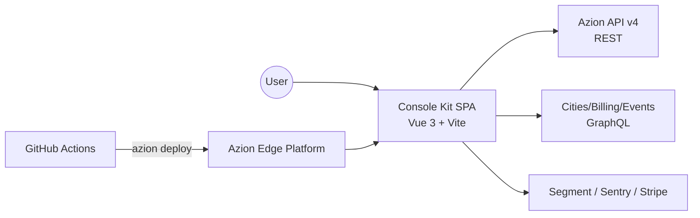

# Architecture — Azion Console Kit

> High-level architecture of the Azion Console (web management UI).
> Complements: [VERSION-SHELL.md](./VERSION-SHELL.md),
> [TESTING-VERSIONING.md](./TESTING-VERSIONING.md) and the ADRs under [docs/adr](./adr).

## 1. System context

Azion Console Kit is a **Vue 3 single-page application** that manages the full
Azion platform (edge applications, workloads, firewall, WAF, DNS, functions,
storage, analytics and billing) by consuming the public **Azion API (v4)** and
platform GraphQL endpoints. It is built with Vite and deployed as a static
bundle to the Azion Edge Platform itself (dogfooding) via the Azion CLI.

## 2. Layering

| Layer | Path | Responsibility |
| --- | --- | --- |
| Views | `src/views/<Feature>/` | Screens per product feature; v6 screens live in `<Feature>/v6/` |
| Templates (blocks) | `src/templates/` | Reusable page-composition blocks (forms, list tables, content blocks, VersionShell) |
| Components | `src/components/` | Shared presentational components |
| Composables | `src/composables/` | Reusable stateful logic (user flags, versioning context, data tables) |
| Services v2 | `src/services/v2/` | Current API layer: one dir per resource with `*-service.js` + `*-adapter.js`; shared HTTP client, TanStack query cache and query keys under `services/v2/base/` |
| Services (legacy) | `src/services/` | V1 API layer (being replaced by v2) |
| Stores | `src/stores/` | Pinia global state (account, breadcrumbs, deploy, …) |
| Router | `src/router/` | Route definitions per feature + global guards (`hooks/guards/`) |

**Rules:** views never call HTTP directly (services own I/O); adapters own the
wire↔UI transform; business logic lives in services/composables, not in
components.

## 3. Feature flags: v6 vs legacy flows

The console currently ships **two coexisting flows** switched by the
`use_v6_configurations` account flag (`client_flags`): the v6 flow (VersionShell,
resource versioning) and the legacy flow. The switch happens at four layers —
route component forks, `flagGuard` (blocks v6-only routes), services/adapters
(payload shape) and menu visibility. The complete audited inventory lives in
`src/tests/support/flag-v6/registry.js`; both modes are covered by the
`src/tests/flag-v6/` suites.

## 4. VersionShell (v6 resource versioning)

The registry-driven framework that gives 9 resources a uniform versioning
experience (draft → build → deploy/promote → archive). Fully documented in
[VERSION-SHELL.md](./VERSION-SHELL.md): capability classes (deployable vs
versioned-only), command bus, `VersionServiceBase`, adapters and the route/tab
integration.

## 5. Quality architecture

| Suite | Runner | Scope |
| --- | --- | --- |
| Unit (~4.6k tests) | Vitest (jsdom) | Services, adapters, composables, view logic |
| Functional | Vitest Browser Mode (real Chromium via Playwright) | Versioning components — focus/keyboard/overlays |
| Contracts | Vitest + yup schemas; Playwright drift vs published OpenAPI | Front payloads ⇄ API contract |
| Mutation | StrykerJS (scheduled) | Versioning pure modules |
| Flag coverage | Vitest (`src/tests/flag-v6/`) | Both flows, all fork points |

All suites converge into a single required check (`pre-merge-gate`) — see
the internal CI operations guide for the pipeline design and gate status.

## 6. Build & deploy

- `yarn build` (Vite) produces the static bundle; environment selected via
  `VITE_ENVIRONMENT` (stage/production).
- Deploys run on push: `dev` → stage, `main` → production
  (`.github/workflows/deploy-*.yml`), publishing with the Azion CLI
  (`azion deploy`). A contract-drift check runs pre-deploy (informational).
- Storybook deploys independently (`deploy-storybook.yml`).

## 7. Key decisions

Architecture Decision Records live in [docs/adr](./adr). Cross-cutting recent
decisions are also captured in the spec documents referenced by
[VERSIONING-TESTING-REPORT.md](./VERSIONING-TESTING-REPORT.md) (test
architecture) and the internal CI operations guide (CI maturity).
