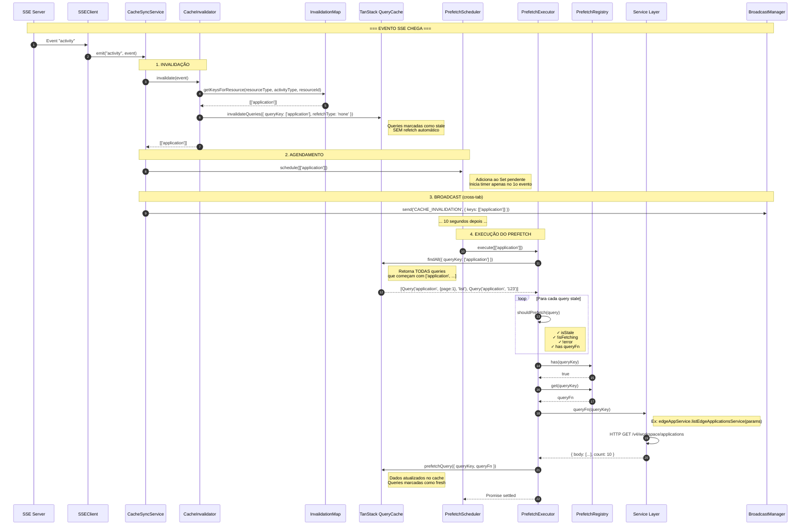
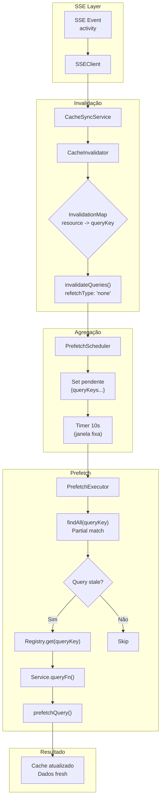
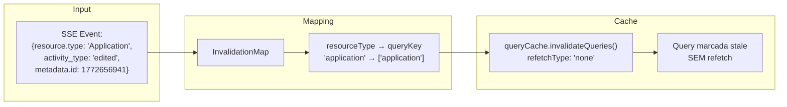
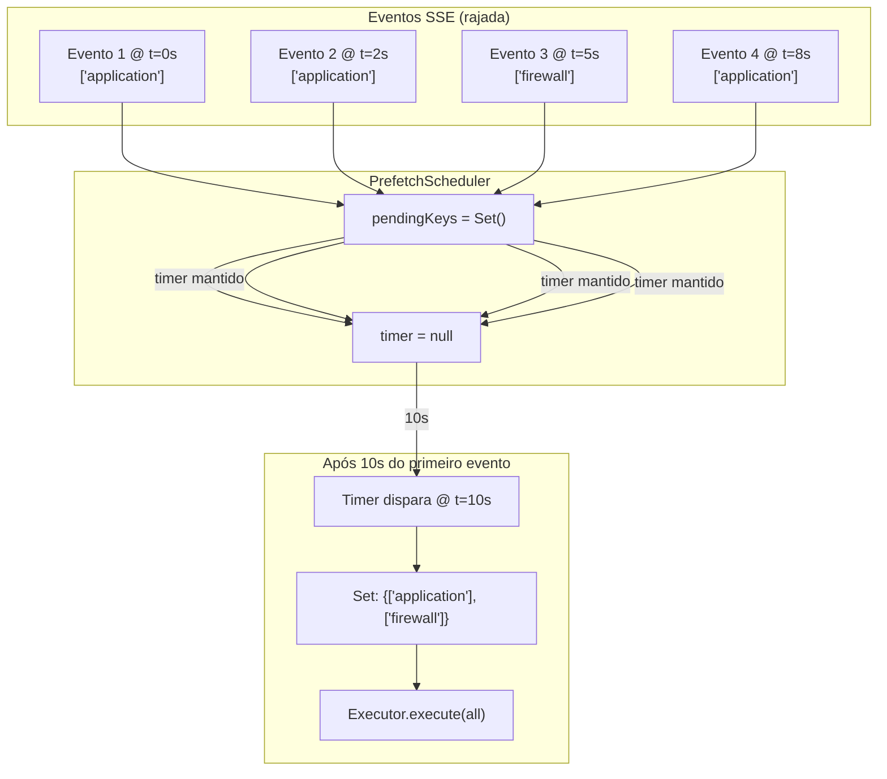
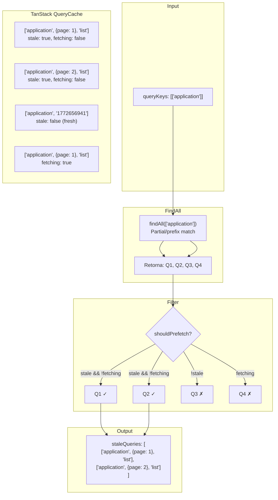
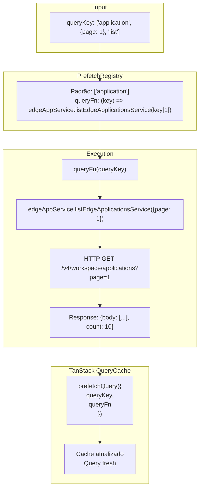
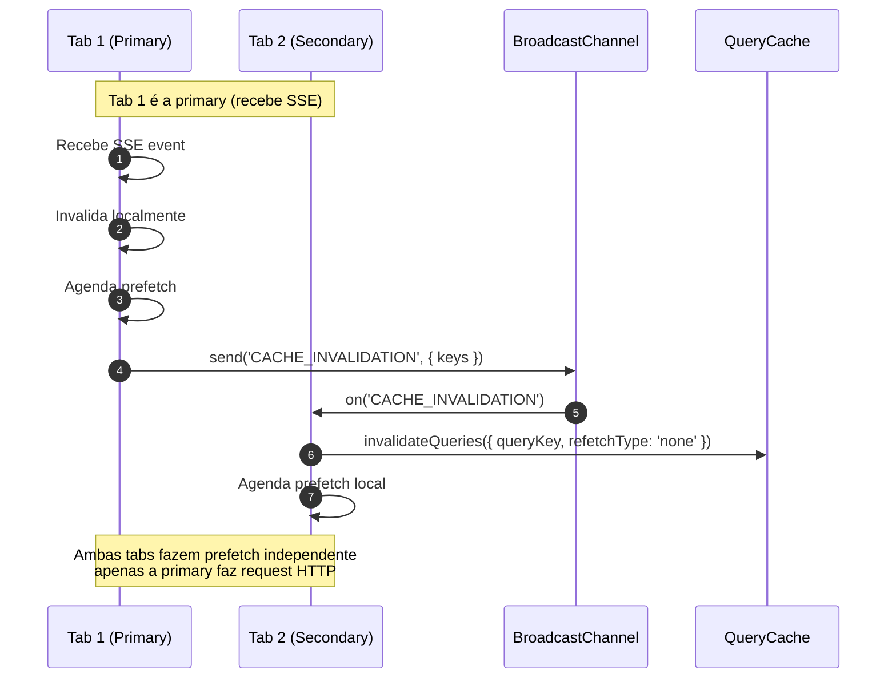
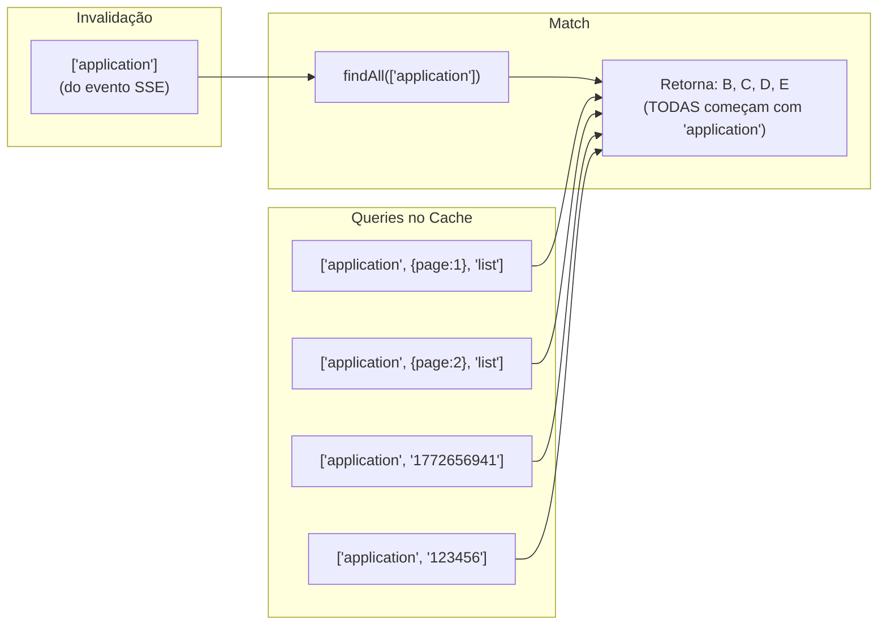

# Cache Sync & Prefetch System

> Sistema de sincronização de cache via SSE com prefetch atrasado e agregação por janela fixa.

## Visão Geral

O sistema resolve o problema de múltiplas requisições quando eventos SSE chegam em sequência rápida. Em vez de refetchar imediatamente cada invalidação, o sistema:

1. **Invalida sem refetch** (`refetchType: 'none'`)
2. **Agrega eventos** por 10 segundos (janela fixa iniciada no primeiro evento)
3. **Prefetch apenas queries stale** ao final do timer

---

## Arquitetura

### Componentes

| Componente          | Responsabilidade                | Arquivo                         |
| ------------------- | ------------------------------- | ------------------------------- |
| `SSEClient`         | Conexão SSE com servidor        | `sse-client.js`                 |
| `CacheSyncService`  | Orquestra todo o fluxo          | `cache-sync-service.js`         |
| `CacheInvalidator`  | Converte eventos → queryKeys    | `cache-invalidator.js`          |
| `InvalidationMap`   | Mapeia resources → queryKeys    | `invalidation-map.js`           |
| `PrefetchScheduler` | Timer + agregação (janela fixa) | `prefetch-scheduler.js`         |
| `PrefetchExecutor`  | Coleta + executa prefetch       | `prefetch-executor.js`          |
| `PrefetchRegistry`  | queryKey → queryFn mapping      | `prefetch-query-fn-registry.js` |

---

## Fluxo de Chamadas



---

## Fluxo Simplificado



---

## Detalhamento por Fase

### Fase 1: Recebimento e Invalidação



**Ponto importante:** `refetchType: 'none'` é crucial! Sem isso, cada invalidação dispararia um refetch imediato.

### Fase 2: Agendamento com Janela Fixa



**Benefício da janela fixa:** 4 eventos = **1 único prefetch** ao invés de 4 requests.

### Fase 3: Coleta de Queries Stale



**Ponto importante:** `findAll()` faz match parcial! `['application']` encontra todas as queries que começam com esse prefixo.

### Fase 4: Execução do Prefetch



---

## Cross-Tab Synchronization



---

## QueryKey Matching

### Estrutura das QueryKeys

```javascript
// Listagem
;['application', { page: 1, pageSize: 10, ordering: '-last_modified' }, 'list', null][
  // Detalhe
  ('application', '1772656941')
][
  // Sub-recursos
  ('application', '1772656941', 'origins', 'list', { page: 1 })
][('application', '1772656941', 'rules-engine', 'detail', '617789')]
```

### Invalidação vs Cache



---

## Configuração

### Timer de Agregação

```javascript
// Valor padrão: 10 segundos
const DEFAULT_DEBOUNCE_MS = 10000 // nome legado; representa a janela fixa

// Pode ser customizado
const scheduler = new PrefetchScheduler({
  executor,
  debounceMs: 5000 // 5 segundos
})
```

### Registry de QueryFns

```javascript
// Registrar nova queryFn
prefetchRegistry.register(['meu-recurso'], async (queryKey) => {
  const { meuService } = await import('./meu-service')

  // Extrair parâmetros da queryKey
  if (queryKey[2] === 'list') {
    const params = queryKey[1] || {}
    return meuService.list(params)
  }

  // Detalhe
  const id = queryKey[1]
  return meuService.load({ id })
})
```

---

## Logs e Debug

### Logs Disponíveis

```
[PrefetchScheduler] Scheduled keys: 1
[PrefetchScheduler] Pending keys: 2
[PrefetchScheduler] Timer fired, processing 2 keys
[PrefetchExecutor] Collected 2 stale queries
[PrefetchExecutor] Stale queries: [['application', {...}, 'list'], ['firewall', {...}, 'list']]
[PrefetchExecutor] Prefetching: ['application', {...}, 'list']
[PrefetchRegistry] Registered 25 queryFn patterns
```

### Debug no Browser

```javascript
// Ver queries stale no cache
const qc = window.__VUE_DEVTOOLS_GLOBAL_HOOK__.stores.queryClient
qc.getQueryCache().findAll({ stale: true })

// Ver padrões registrados
window.__PREFETCH_REGISTRY__?.getAllPatterns()

// Forçar execução do timer
// (adicionar ao scheduler se necessário)
```

---

## Edge Cases Tratados

| Cenário                          | Comportamento                         |
| -------------------------------- | ------------------------------------- |
| Query não existe no cache        | Ignora (não há dados para atualizar)  |
| Query já está sendo fetchada     | Pula (isFetching = true)              |
| Query está em erro               | Pula (status = 'error')               |
| Query não tem queryFn registrada | Log warning + pula                    |
| Múltiplos eventos mesma key      | Set deduplica automaticamente         |
| Novo evento durante timer        | Timer não reinicia; apenas agrega key |
| Erro no prefetch                 | Log error + continua outras queries   |
| Tab fica inativa                 | Timer pode não disparar (aceitável)   |

---

## Benefícios

| Antes                       | Depois                                |
| --------------------------- | ------------------------------------- |
| 1 evento = 1 request HTTP   | N eventos = 1 request HTTP            |
| Refetch imediato            | Prefetch após 10s                     |
| Múltiplas queries refetcham | Apenas queries stale são prefetchadas |
| Race conditions possíveis   | Janela fixa reduz rajadas e colisões  |

---

## Arquivos

```
src/services/v2/base/cache-sync/
├── cache-sync-service.js       # Orquestrador principal
├── cache-invalidator.js        # Invalidação de queries
├── invalidation-map.js         # Mapeamento resource → queryKey
├── prefetch-scheduler.js       # Timer + agregação
├── prefetch-executor.js        # Execução de prefetch
├── prefetch-query-fn-registry.js # Registro de queryFns
└── prefetch-registrations.js   # QueryFns registradas
```
