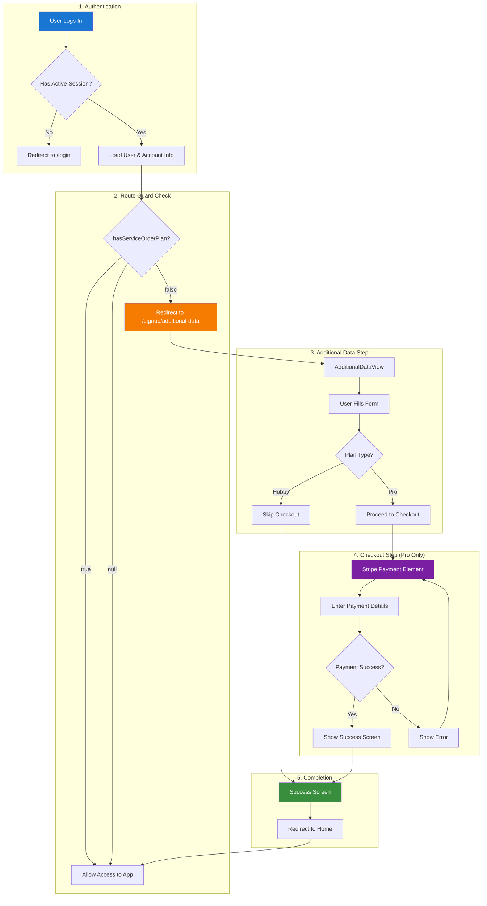
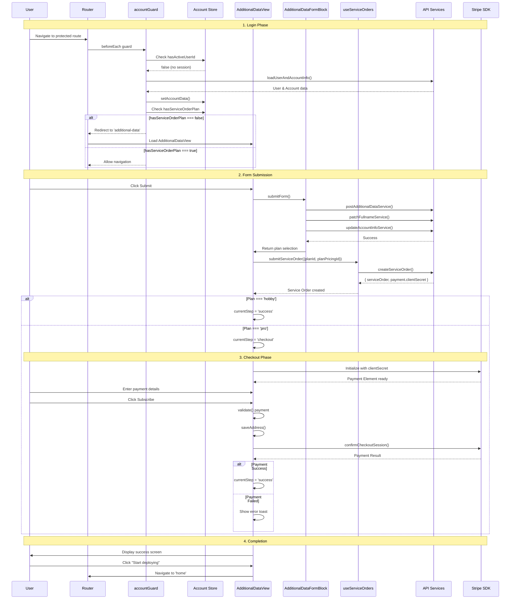
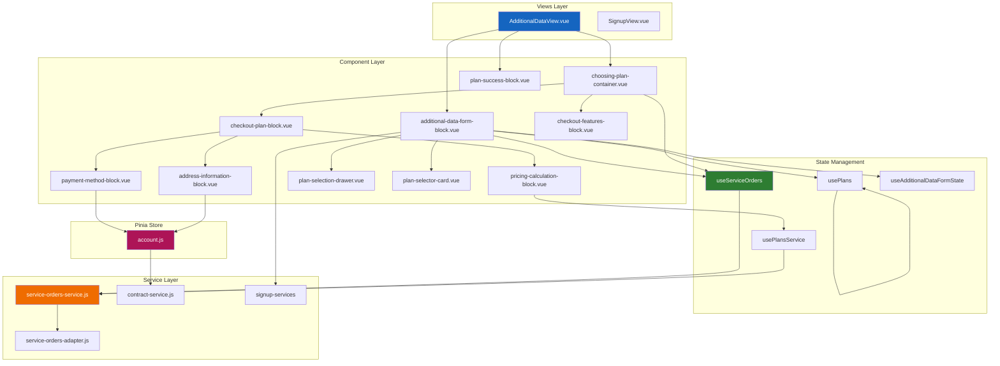
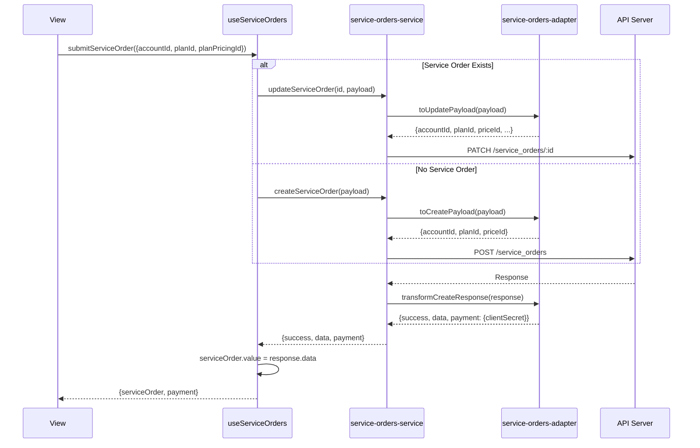
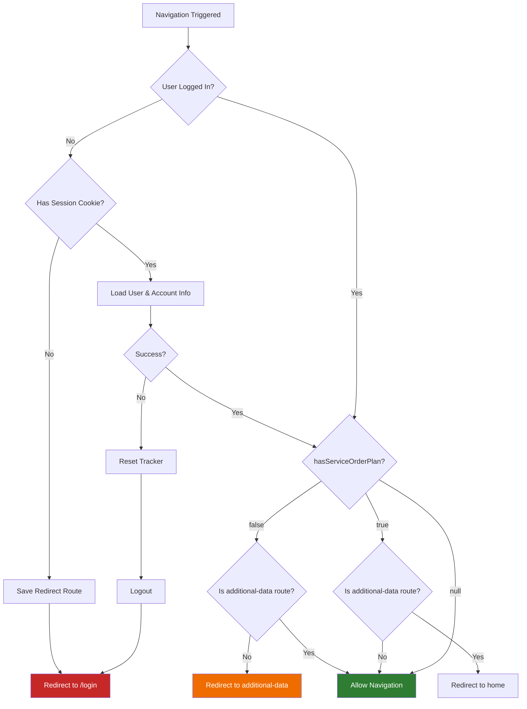

# Contracting Flow After Login - Technical Documentation

## Overview

The contracting flow is a post-login onboarding process that guides new users through plan selection and payment before they can access the main console. This flow is triggered for users who have `hasServiceOrderPlan === false` in their account state, indicating they need to complete a service order (purchase a plan).

## Flow Architecture



## Key Decision Points

| Decision Point         | Condition                       | Result                                |
| ---------------------- | ------------------------------- | ------------------------------------- |
| Session Check          | `hasSession === false`          | Redirect to `/login`                  |
| Service Order Required | `hasServiceOrderPlan === false` | Redirect to `/signup/additional-data` |
| Plan Selection         | `plan === 'hobby'`              | Skip checkout, show success           |
| Plan Selection         | `plan === 'pro'`                | Proceed to Stripe checkout            |
| Payment Status         | Payment successful              | Show success screen                   |
| Payment Status         | Payment failed                  | Show error, retry payment             |

---

## Sequence Diagram: Complete Flow



---

## Component Architecture



---

## Files and Components Reference

### Routes

| File                                       | Purpose                                                     |
| ------------------------------------------ | ----------------------------------------------------------- |
| `src/router/routes/signup-routes/index.js` | Defines `/signup/additional-data` route with access control |
| `src/router/hooks/guards/accountGuard.js`  | Post-login redirect logic based on `hasServiceOrderPlan`    |
| `src/router/hooks/beforeEachRoute.js`      | Chains all navigation guards                                |

### Views

| File                                      | Purpose                                        |
| ----------------------------------------- | ---------------------------------------------- |
| `src/views/Signup/AdditionalDataView.vue` | Main container for the 3-step contracting flow |

### Components (Templates)

| File                                                        | Purpose                                             |
| ----------------------------------------------------------- | --------------------------------------------------- |
| `src/templates/signup-block/additional-data-form-block.vue` | Form for collecting user data (role, company, plan) |
| `src/templates/signup-block/choosing-plan-container.vue`    | Wrapper for checkout UI                             |
| `src/templates/signup-block/checkout-plan-block.vue`        | Orchestrates payment flow                           |
| `src/templates/signup-block/pricing-calculation-block.vue`  | Plan pricing display and coupon handling            |
| `src/templates/signup-block/payment-method-block.vue`       | Stripe Payment Element integration                  |
| `src/templates/signup-block/address-information-block.vue`  | Billing address form                                |
| `src/templates/signup-block/plan-success-block.vue`         | Success screen after plan activation                |
| `src/templates/signup-block/plan-selection-drawer.vue`      | Plan change drawer                                  |
| `src/templates/signup-block/plan-selector-card.vue`         | Displays selected plan                              |
| `src/templates/signup-block/checkout-features-block.vue`    | Displays plan features                              |

### Composables (State Management)

| File                                            | Purpose                                      |
| ----------------------------------------------- | -------------------------------------------- |
| `src/composables/useServiceOrders.js`           | Service order CRUD operations (shared state) |
| `src/composables/usePlans.js`                   | Plan params with localStorage persistence    |
| `src/composables/usePlansService.js`            | Vue Query hooks for plans API                |
| `src/composables/useAdditionalDataFormState.js` | Form state persistence across navigation     |

### Services

| File                                                           | Purpose                               |
| -------------------------------------------------------------- | ------------------------------------- |
| `src/services/v2/service-orders/service-orders-service.js`     | API calls for service orders          |
| `src/services/v2/service-orders/service-orders-adapter.js`     | Data transformation for API responses |
| `src/services/v2/account/contract-service.js`                  | Contract plan fetching                |
| `src/services/signup-services/post-additional-data-service.js` | Submit additional user data           |
| `src/services/signup-services/patch-fullname-service.js`       | Update user name                      |
| `src/services/signup-services/update-account-info-service.js`  | Update account job role               |

### Store

| File                    | Purpose                                              |
| ----------------------- | ---------------------------------------------------- |
| `src/stores/account.js` | Account state including the `needsOnboarding` getter |

### Helpers

| File                             | Purpose                              |
| -------------------------------- | ------------------------------------ |
| `src/helpers/account-data.js`    | Load user/account info after login   |
| `src/helpers/account-handler.js` | Account switching and redirect logic |

### Session Management

| File                                          | Purpose                                     |
| --------------------------------------------- | ------------------------------------------- |
| `src/services/v2/base/auth/sessionManager.js` | Post-login prefetching and cache management |

---

## State Management

### Account Store (`needsOnboarding`)

```javascript
// src/stores/account.js
needsOnboarding(state) {
  return (
    state.account?.first_login === true &&
    state.account?.kind === 'client' &&
    state.account?.hasServiceOrderPlan !== true
  )
}
```

The account adapter maps the raw API field `has_service_order_plan` to the camelCase
`hasServiceOrderPlan` (strict boolean) in `_adaptAccountInfo`.

**Important:** `hasServiceOrderPlan` is the source of truth for the post-login plan gate. `false` sends the user to plan configuration; `true` skips the plan screen.

### Service Order State (useServiceOrders)

Shared singleton state managed by the composable:

```javascript
// Shared state
const serviceOrder = ref(null)
const isLoading = ref(false)
const isSubmitting = ref(false)
const error = ref(null)

// Actions
loadServiceOrder(accountId) // Fetch existing service order
createServiceOrder(payload) // Create new service order
updateServiceOrder(id, payload) // Update existing service order
submitServiceOrder(params) // Create or update based on existence
updatePlanPricing(planPricingId) // Update just the pricing
reset() // Clear all state
```

### Plan Params State (usePlans)

Persists plan selection to localStorage and URL:

```javascript
// Persisted fields
plan: 'hobby' | 'pro'
billingCycle: 'monthly' | 'yearly'
cupom: string | null

// Features
- localStorage persistence with 15-day expiration
- URL query param synchronization
- Automatic validation of plan values
```

### Additional Data Form State

Persists form fields across navigation:

```javascript
// Persisted fields
usageIntent: 'learn' | 'personal-project' | 'work'
role: string
companySize: string
companyWebsite: string
fullName: string
termsAccepted: boolean
```

---

## API Integrations

### Service Orders API

**Base URL:** `/edge_api/api/v1/service_orders`

| Method | Endpoint | Purpose                            |
| ------ | -------- | ---------------------------------- |
| GET    | `/`      | List service orders (with filters) |
| GET    | `/:id`   | Get single service order           |
| POST   | `/`      | Create service order               |
| PATCH  | `/:id`   | Update service order               |

### Plans API

**Base URL:** `/edge_api/api/v1/plans`

| Method | Endpoint | Purpose              |
| ------ | -------- | -------------------- |
| GET    | `/`      | List available plans |

### Coupons API

**Base URL:** `/local_api/v4/product_catalog/coupons`

| Method | Endpoint    | Purpose              |
| ------ | ----------- | -------------------- |
| POST   | `/validate` | Validate coupon code |

### Additional Data API

**Base URL:** `/v4/iam/users/:id/additional_data`

| Method | Endpoint | Purpose                     |
| ------ | -------- | --------------------------- |
| POST   | `/`      | Submit additional user data |

### Contract API

**Base URL:** `/api/v3/contract/:clientId/products`

| Method | Endpoint | Purpose                   |
| ------ | -------- | ------------------------- |
| GET    | `/`      | Get contract service plan |

---

## Data Flow: Service Order Creation



---

## Error Handling Strategies

### Form Validation

Uses **VeeValidate** with **Yup** schemas:

```javascript
const validationSchema = yup.object({
  plan: yup.string().required().oneOf(['hobby', 'pro']),
  usageIntent: yup.string().required('Usage intent is required'),
  role: yup.string().required('Role is required'),
  companySize: yup.string().when('usageIntent', {
    is: 'work',
    then: (schema) => schema.required('Company size is required'),
    otherwise: (schema) => schema.notRequired()
  }),
  companyWebsite: yup.string().when('usageIntent', {
    is: 'work',
    then: (schema) => schema.trim().required().max(255),
    otherwise: (schema) => schema.notRequired()
  }),
  fullName: yup
    .string()
    .trim()
    .max(61)
    .matches(/[A-zÀ-ž.\'-]+ [A-zÀ-ž.\'-]+/, 'Must include first and last name')
    .required()
})
```

### API Error Handling

Services return structured error responses:

```javascript
// Error types from API
400: { errorMessage: 'User already has additional data', errorType: 'field' }
403: { errorMessage: PermissionError, errorType: 'api' }
404: { errorMessage: NotFoundError, errorType: 'api' }
500: { errorMessage: InternalServerError, errorType: 'api' }
```

### Payment Errors

Stripe-specific error mapping:

```javascript
const knownStripeErrorMap = {
  authentication_required: 'Authentication is required to complete this payment.',
  card_declined: 'Your card was declined. Please use a different payment method.',
  expired_card: 'Your card is expired. Please use a different card.',
  incorrect_cvc: 'The security code is incorrect. Please review your payment details.',
  processing_error: 'Payment processing failed. Please try again in a few moments.'
}
```

### Toast Notifications

All errors are surfaced via toast:

```javascript
toast.add({
  severity: 'error',
  summary: 'Error',
  detail: errorMessage,
  closable: true
})
```

---

## User Experience Considerations

### Step Progression

The flow uses a **3-step wizard** pattern:

1. **Additional Data** - Collect user info and plan selection
2. **Checkout** - Payment for Pro plan (skipped for Hobby)
3. **Success** - Confirmation with next steps

### Progressive Disclosure

Form fields expand progressively:

- Role field appears after usage intent selection
- Company fields appear only if usage intent is "work"
- This reduces cognitive load and shows relevant fields only

### Loading States

Multiple loading indicators:

- Skeleton loaders during initial data fetch
- Spinner on submit button during form submission
- Spinner on coupon apply button
- Disabled states during async operations

### State Persistence

- Form data persists in localStorage
- Survives page refreshes
- Clears on successful completion
- Plan params have 15-day expiration

### Accessibility

- All form fields have proper labels
- ARIA labels on selection boxes
- Required field indicators
- Error messages linked to fields

---

## Route Guard Logic



---

## Guard Code Reference

### accountGuard.js

```javascript
export async function accountGuard({ to, accountStore, tracker }) {
  const userNotIsLoggedIn = !accountStore.hasActiveUserId
  const isPrivateRoute = !to.meta.isPublic

  if (userNotIsLoggedIn && isPrivateRoute) {
    if (!accountStore.hasSession) {
      setRedirectRoute(to)
      return '/login'
    }

    try {
      await loadAccountHydration()

      // Check if account still needs plan configuration.
      const needsOnboarding = accountStore.needsOnboarding
      const isAdditionalDataRoute = to.name === 'additional-data'

      // If needs plan configuration and not on additional-data route, redirect.
      if (needsOnboarding && !isAdditionalDataRoute) {
        return { name: 'additional-data' }
      }

      // If plan configuration is already done and trying to access additional-data, go home.
      if (!needsOnboarding && isAdditionalDataRoute) {
        return { name: 'home' }
      }

      if (to.meta.isPublic) {
        return '/'
      }
    } catch {
      setRedirectRoute(to)
      await tracker.reset()
      await sessionManager.logout()
      return '/login'
    }
  }
}
```

### signup-routes/index.js (beforeEnter)

```javascript
beforeEnter: (to, from, next) => {
  const accountStore = useAccountStore()

  // Only allow access to additional-data if:
  // 1. User has active session (hasActiveUserId)
  // 2. needsOnboarding === true (has_service_order_plan !== true)
  if (accountStore.hasActiveUserId && accountStore.needsOnboarding) {
    next()
  } else {
    // If user doesn't need service order, redirect to home
    next({ name: 'home' })
  }
}
```

---

### Key Test Cases

1. **accountGuard redirects correctly** based on `hasServiceOrderPlan`
2. **Service order creation/update** works correctly
3. **Plan selection** persists to localStorage and URL
4. **Coupon validation** handles success/failure
5. **Payment flow** handles Stripe responses

---

## Configuration

### Environment Variables

| Variable                 | Purpose                |
| ------------------------ | ---------------------- |
| `VITE_STRIPE_PUBLIC_KEY` | Stripe publishable key |
| `VITE_API_BASE_URL`      | API base URL           |

### Service URLs (Development)

```javascript
// Service Orders
// Production: '/v4/service-orders'
// Local dev: '/edge_api/api/v1/service_orders'

// Plans
// Production: '/v4/product_catalog/plans'
// Local dev: '/edge_api/api/v1/plans'

// Coupons
// Production: '/v4/product_catalog/coupons'
// Local dev: '/local_api/v4/product_catalog/coupons'
```

---

## Summary

The contracting flow is a carefully orchestrated post-login process that ensures new users complete plan selection and payment before accessing the main console. Key aspects include:

1. **Guard-based routing** that redirects users based on their service order status
2. **Progressive form disclosure** that shows relevant fields based on user selection
3. **Dual-path completion** - Hobby users skip checkout, Pro users go through Stripe
4. **Comprehensive state persistence** via localStorage and URL params
5. **Robust error handling** with toast notifications and form validation
6. **Post-login prefetching** to warm the cache for the main application

The flow is designed to be minimal friction for Hobby users while providing a complete checkout experience for Pro subscribers.
