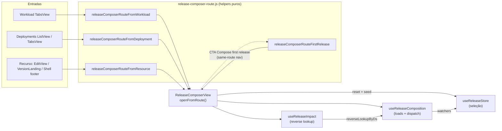
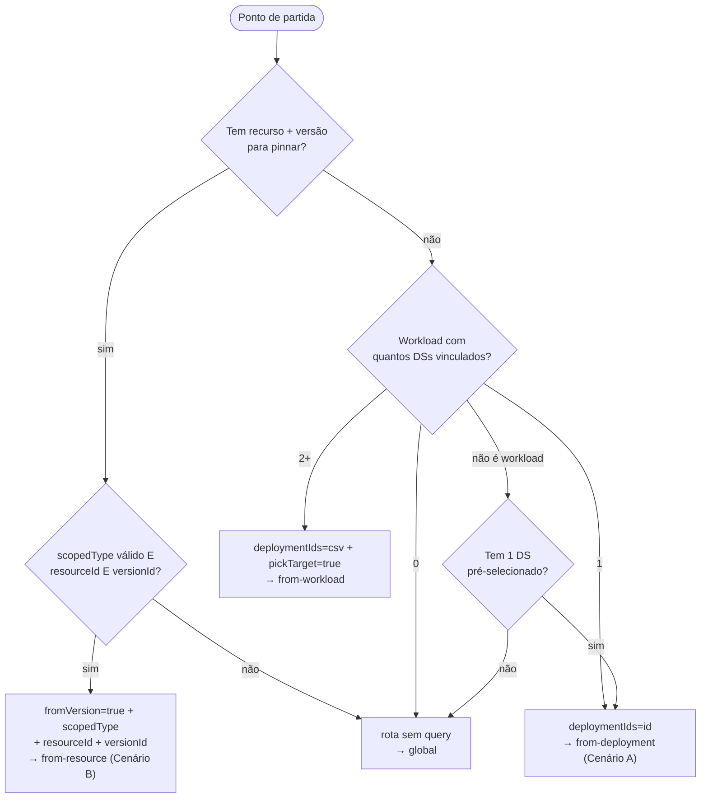
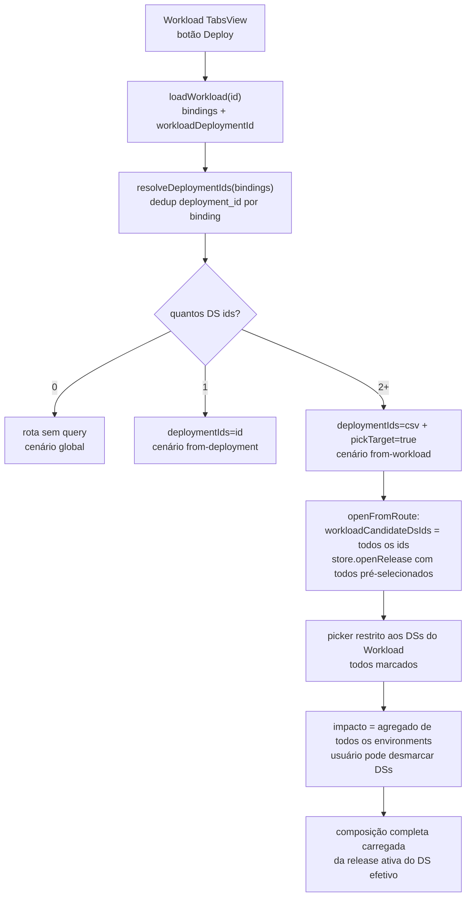
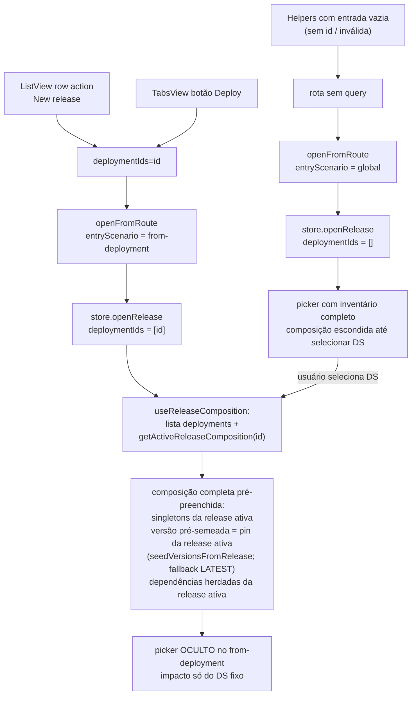
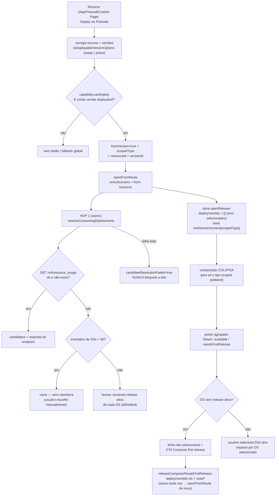
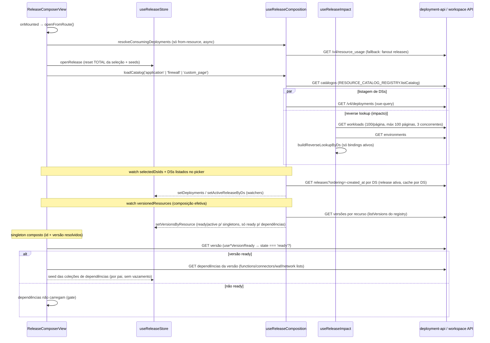
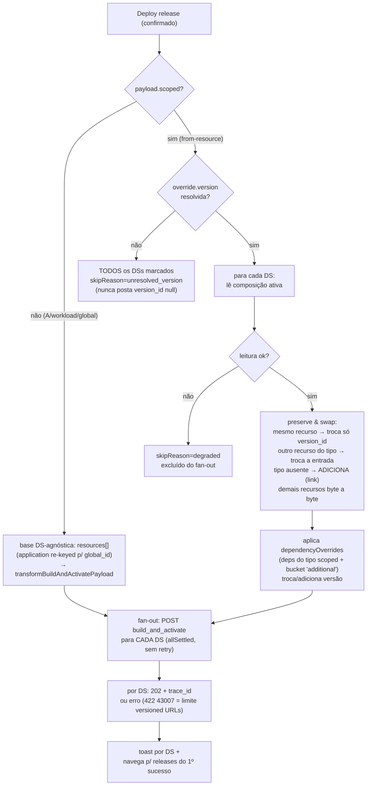

# Release Composer — Fluxos de entrada e carregamento (`releases/new`)

A tela **Review & deploy** (`src/views/Deployments/v6/ReleaseComposerView.vue`) é a tela **única e compartilhada**
para criar uma nova release. Ela atende três pontos de partida — **Workload**, **Deployment Settings** e **Recurso
(versão)** — mais duas variações derivadas (**global** e **Compose first release**). Cada ponto de partida define o
que é permitido alterar, o que vem pré-selecionado e quais verificações/carregamentos a tela executa.

- **Rota**: `/deployments/releases/new`, nome `release-composer`, gated pelo flag `use_v6_configurations`
  (`src/router/routes/deployment-routes/index.js:66`).
- **Entrada**: tudo viaja por **query params**; a tela lê a rota **uma única vez por navegação** (`openFromRoute`) e
  captura o cenário em `entryScenario` — ele nunca muda enquanto o usuário edita a seleção
  (`ReleaseComposerView.vue:120`).
- **Re-entrada**: navegação para a mesma rota (ex.: CTA "Compose first release") não remonta o componente; um watch
  em `route.fullPath` reexecuta `openFromRoute` (`ReleaseComposerView.vue:784-791`).

## Arquitetura da tela

A view é **fina**: nenhum HTTP e nenhuma regra de negócio nela.

| Camada | Arquivo | Responsabilidade |
|---|---|---|
| View | `src/views/Deployments/v6/ReleaseComposerView.vue` | Lê a rota, monta view-models, liga watchers composable→store, gates de UI |
| Store (seleção) | `src/stores/release.js` | Única fonte de verdade da **seleção** (`openRelease`, `resNames/resVers/coll`, `deployCtx`, `composePayload`) |
| Composable (loads) | `src/templates/release-composition/use-release-composition.js` | Todos os carregamentos assíncronos + dispatch `build_and_activate` |
| Impacto | `src/templates/release-composition/use-release-impact.js` + `src/services/v2/release-impact/release-impact-lookup-service.js` | Blast radius (DS → workloads/domains/environments) |
| HOP 1 | `src/services/v2/release-impact/consuming-deployments/` | Recurso → Deployment Settings consumidores |
| Dependências | `src/templates/release-composition/use-*-dependencies.js` / `use-*-version-ready.js` | Dependências descobertas da **versão** selecionada + prontidão da versão |

## Os 4 cenários de entrada (`entryScenario`)

Capturados uma única vez em `openFromRoute` (`ReleaseComposerView.vue:742-748`):

| Cenário | Query params | DSs pré-selecionados | Picker de DS | Composição |
|---|---|---|---|---|
| `from-resource` (Cenário B) | `fromVersion=true`, `scopedType`, `resourceId`, `versionId` | **Nenhum** (req 1.9) | Visível, agrupado (linked/available/needsFirstRelease) | **Colapsa para o tipo scoped** (só ele é editável) |
| `from-deployment` (Cenário A) | `deploymentIds=<id>` | O DS de origem (fixo) | **Oculto** | Completa (App + Firewall + Custom Pages), base = release ativa do DS |
| `from-workload` | `deploymentIds=<id1,id2,...>`, `pickTarget=true` | **Todos** os DSs do Workload | Visível, **restrito** aos DSs do Workload | Completa |
| `global` | (nenhum) | Nenhum | Visível, inventário completo | Completa, aparece após selecionar um DS |

O CTA **"Compose first release"** gera uma re-entrada com `deploymentIds` + `seedType/seedResourceId/seedVersionId`
— o cenário resultante é `from-deployment` (composição **completa**, não scoped), com o recurso/versão de origem
pré-preenchidos como *seed*.

## Helpers de rota (`src/templates/release-composition/release-composer-route.js`)

Todos são **puros** (montam a location; o host faz o `router.push`) e **nunca fabricam estado**: entrada inválida
degrada para a location DS-first vazia.

| Helper | Regra |
|---|---|
| `releaseComposerRouteFromResource(ctx)` (`:33`) | `versionId = ctx.version?.id ?? ctx.versions[0]?.value`. Se `scopedType ∉ {application, firewall, custom_page}` ou faltar `resourceId`/`versionId` → fallback `releaseComposerRouteFromDeployment()` |
| `releaseComposerRouteFromDeployment(id?)` (`:65`) | Com id → `{ deploymentIds: id }`; sem id → rota sem query (entrada global) |
| `releaseComposerRouteFirstRelease({...})` (`:94`) | Exige `deploymentId`; o seed viaja em chaves `seed*` justamente para **não** colapsar a composição em scoped. Seed inválido → só `deploymentIds` |
| `releaseComposerRouteFromWorkload({ deploymentIds })` (`:132`) | 0 ids → global; 1 id → delega para `FromDeployment` (vira Cenário A); 2+ ids → `deploymentIds=csv` + `pickTarget=true` |

### Fluxograma de decisão dos helpers

---

## Fluxo 1 — Entrada por Workload

**Origem**: botão **Deploy** no heading do Workload → `openRelease` (`src/views/Workload/TabsView.vue:117-124`).

**O que é carregado ANTES de navegar:**
1. O Workload via `workloadService.loadWorkload({ id })` (`TabsView.vue:87-90`, `fetchWorkload`) — traz `bindings` (um binding por
   environment) e `workloadDeploymentId` (fallback).
2. `resolveDeploymentIds(bindings)` (`src/views/Workload/utils/resolveDeploymentIds.js`) extrai e **deduplica** os
   `deployment_id` de cada binding; se vazio, usa `[workloadDeploymentId]`; senão `[]`.

**Regra central**: um Workload pode estar vinculado a vários environments — **um Deployment Settings por
environment**. A entrada carrega **todos** os DS ids, não só o primeiro:

- **0 DSs** → abre a entrada global (usuário escolhe o DS).
- **1 DS** → delega para `releaseComposerRouteFromDeployment(id)` — vira o Cenário A.
- **2+ DSs** → `pickTarget=true`: o composer mantém o picker, **restrito** aos DSs do Workload
  (`workloadCandidateDsIds`, `ReleaseComposerView.vue:127,751-753,1170`), com **todos pré-selecionados** para que
  o impacto abra como o **agregado real de todos os environments**. O usuário pode desmarcar os que quiser pular.

**Na tela** (`from-workload`):
- O picker **nunca lista DSs de fora do Workload** (filtro por `workloadCandidateDsIds` em `enrichedDeployments`).
- Aviso específico: "This Workload is bound to N Deployment Settings — one per environment…".
- Composição completa e editável; base de cada card = release ativa do DS efetivo.

---

## Fluxo 2 — Entrada por Deployment Settings

**Origens** (todas usam `releaseComposerRouteFromDeployment`):
- `src/views/Deployments/ListView.vue:54-56` — row action **New release** (`newReleaseFromDeployment`, passa `deployment.id`; guard `if (!deployment?.id) return`).
- `src/views/Deployments/TabsView.vue:72` — botão **Deploy** do heading (passa `deploymentId`).
- **Cenário `global`**: **não há mais** um botão "Deploy" global dedicado na lista de Deployments — o cenário global
  é a **degradação** dos helpers com entrada vazia (`releaseComposerRouteFromDeployment()` sem id; `FromWorkload`
  com 0 DSs; `FromResource` com entrada inválida).

**O que é carregado antes de navegar**: nada além do que a listagem já tem — o id viaja direto na query.

**Na tela** (`from-deployment`, Cenário A):
- O DS de origem é **fixo e pré-selecionado**; o **picker não é renderizado** (`v-if="!isFromDeployment"`,
  `ReleaseComposerView.vue:1623`).
- A release ativa do DS é carregada (`getActiveReleaseComposition`) e vira a **base da composição**: cada singleton
  (Application/Firewall/Custom Pages) é pré-preenchido com o recurso da release ativa. A versão de cada card é
  **pré-semeada com a versão pinada na release ativa** por `store.seedVersionsFromRelease(effDsId)`
  (`release.js:710`) — singletons **e** dependências, exclusivo do fluxo `from-deployment`
  (`ReleaseComposerView.vue:642-649` gateia o watch em `isFromDeployment`). O pin só é aplicado quando **resolve
  contra o catálogo já carregado**; num miss (versão removida/deprecada, ou catálogo ainda carregando) o slot cai
  silenciosamente para o default (`LATEST_READY` no singleton, pendente na dependência). É um seed **one-shot
  idempotente por slot** — um pick explícito do usuário sempre vence.
- Tudo é editável (é um composer de nova release); o gate fica no botão de deploy (`deployCtx`).
- Aviso específico: "This release applies to `<deployment>` and reaches every environment that uses it".
- Impacto mostra apenas esse DS.

**Cenário `global`** é o mesmo fluxo sem pré-seleção: o picker (inventário completo) é o primeiro passo e a
composição só aparece após selecionar ao menos um DS (`showComposition`, `ReleaseComposerView.vue:805`).

---

## Fluxo 3 — Entrada por Recurso (versão) — Cenário B

**Origens** (todas usam `releaseComposerRouteFromResource`):

| Origem | Arquivo | Versão passada |
|---|---|---|
| Botão **Deploy** do heading do recurso | `use-resource-version-landing.js:159` (`openRelease`) — compartilhado por EdgeApplications/Firewall/Custom Pages; `EditView.vue` delega | `version: null` + `versions` → helper resolve para a **primeira ready** |
| Row action **Promote/Deploy** no menu de versões | `use-resource-version-landing.js:171` (`openPromoteRelease`) / `use-version-menu-actions.js:167` (`deploy`) | `version: { id: pin }` → **versão pinada** |
| Landing de recurso versionado (Firewall, Custom Pages) | `src/composables/versioning/use-resource-version-landing.js:159-180` | idem (Deploy/Promote) |
| Footer **Deploy** do Version Shell (editor de versão) | `src/templates/version-shell-block/components/VersionHeadingActions.vue:48-59` (aceita `deployRoute` pré-montado ou monta via `resourceContext`) | versão **em edição** no shell |

**O que é carregado antes de navegar:**
1. O recurso (`loadEdgeApplicationService` / `loadCustomPage` / etc.).
2. A lista de versões (`useListVersionsQuery`) → `toDeployableVersionOptions`
   (`src/composables/versioning/to-version-options.js`) — filtra os estados deployáveis (`ready | active`; na
   prática hoje só `ready`, pois `active` é conceito de release sem estado de versão no backend) e mantém a ordem
   da API.

**Guards antes de navegar:**
- **Capability**: o botão Deploy/Promote só existe se `getVersionCapability(resourceType).canDeploy === true`
  (recursos *versioned-only* — function, connector, WAF, network list — **não** têm entrada própria no composer;
  são publicados como dependências de um pai).
- Sem nenhuma versão deployável → `versions` chega vazio → o helper **degrada para a entrada global** (nunca abre
  scoped sem versão).

**Na tela** (`from-resource`), em `openFromRoute` (`ReleaseComposerView.vue:660-772`):

1. **HOP 1 (async)** — resolve os Deployment Settings **consumidores** do recurso via
   `resolveConsumingDeployments({ resource_type, resource_id })`
   (`src/services/v2/release-impact/consuming-deployments/index.js`):
   - **Estratégia primária**: `resourceUsageResolver` — `GET /v4/resource_usage` (endpoint autoritativo,
     single-type, 1..100 ids); match: **todo tipo por `resource_id`** (`matchIdValue`; para `application` esse
     valor **é** o `global_id`, com `global_id` mantido só como fallback legado) — regra unificada em `f08e33f34`,
     que aposentou o antigo `matchFieldFor` (req 1.5).
   - **Fallback transparente** (endpoint fora do ar OU resultado vazio): `fanoutResolver` — lista os DSs
     (1 página de 100) e escaneia a release ativa de cada um; **acima de 50 DSs retorna vazio** (não faz fan-out
     no inventário inteiro — req 1.8). Falha por DS é isolada (`allSettled`).
   - **Falha da resolução não bloqueia a tela** (req 7.4): `candidateResolutionFailed = true` e o usuário segue
     podendo escolher no inventário completo.
2. **`store.openRelease`** com `deploymentIds: []` — a tela scoped **sempre abre com ZERO DSs selecionados**
   (req 1.9); o recurso + versão são semeados no slot do singleton (`resNames/resVers[scopedType]`,
   `release.js:332-336`).
3. A **composição colapsa** para o tipo scoped: só o card do recurso de origem é renderizado (editável — o usuário
   pode trocar a versão, o que **redescobre as dependências**).
4. O **picker agrupa** os DSs via `classifyDeploymentsForResource`
   (`src/templates/release-composition/classify-deployments-for-resource.js`):

| Grupo | Regra | Selecionável? |
|---|---|---|
| `linked` — "Already using this resource" | release ativa do DS contém **este** recurso (match por `resource_id` via `matchIdValue`; `global_id` só fallback legado) | Sim — a release nova troca a versão dele |
| `available` — "Available — not linked yet" | `binding_policy === 'FLEXIBLE'`, ou `STRICT` **sem** nenhum recurso do tipo scoped na release ativa | Sim — a release nova **adiciona/linka** o recurso |
| `needsFirstRelease` — "Needs a first release" | DS scoped **sem release ativa** (nada para preservar/override) | **Não** — vira o CTA "Compose first release" |
| `loadFailed` — "Couldn't load the active release" | leitura da release ativa do DS **falhou** (fica `null` + flag em `activeReleaseErrorByDs`), distinto de "sem release" | **Não** — oferece **Retry** (`retryActiveReleases`); nunca cai em `needsFirstRelease` (evita re-release que sobrescreveria a composição não lida) |
| `hidden` | `STRICT` já com **outro** recurso do mesmo tipo | Não aparece |

> Nota de implementação: `scopedCandidateDsIds` (resultado do HOP 1) é resolvido e mantido na view, mas hoje quem
> dá a semântica visível ao usuário é o **agrupamento** acima — o picker lista o inventário (cap de exibição 10) e
> os grupos comunicam o vínculo. A falha do HOP 1 nunca esconde linhas.

5. Deploy scoped usa **preserve & swap por DS** (ver seção "Build & activate").

**Aviso específico**: "Only the `<tipo>` version below changes. Every selected Deployment Settings keeps its own
composition and policy — each gets a new Release with just this resource swapped."

### Fluxo 3b — CTA "Compose first release"

Um DS **sem release ativa** não pode receber override scoped (não há composição a preservar). O picker então oferece
o CTA, que **reabre o composer DS-first** para aquele único DS (`ReleaseComposerView.vue:1272-1281`):

- Query: `deploymentIds=<ds>` + `seedType/seedResourceId/seedVersionId` (o recurso/versão de onde o usuário veio).
- Como as chaves são `seed*` (e não `scopedType`), a composição **não colapsa**: abre **completa**, com o seed
  pré-preenchido no slot do singleton (`release.js:342-347`) e **só a Application faltando escolher** (ela é
  obrigatória — Case 1 do `deployCtx` bloqueia publicar sem Application).
- É uma navegação para a **mesma rota** — quem reprocessa é o watch de `route.fullPath`, nunca o `onMounted`.

---

## Carregamento da tela (o que carrega, quando e por quem)

Pontos-chave do carregamento:

1. **`openRelease` reseta TODA a seleção** (`$patch(freshSelectionState())`) mas **preserva** os dados carregados
   (`deployments`, `activeReleaseByDs`, `versionsByResource`) — eles pertencem ao composable e podem já estar em
   cache (`release.js:289-320`).
2. **Release ativa por DS**: `getActiveReleaseComposition(dsId)` lista as releases do DS ordenadas por
   `-created_at` e prefere a de `traffic_role` ACTIVE (`deployment-release-service.js:345`). Carregada para cada DS
   **selecionado** e também para cada DS **listado no picker** (`ensureActiveReleases`) — é o que permite
   classificar os grupos. Falha por DS registra `null` e **não bloqueia os demais** (§7.3).
3. **Versões por recurso**: para todo par `(type, id)` da composição **efetiva** — picks explícitos, singletons
   herdados da release ativa e instâncias de dependência (`versionedResources`, `ReleaseComposerView.vue:169-197`).
   Singletons usam `toVersionOptions` (**ready | active**); dependências usam `toReadyVersionOptions`
   (**somente ready**).
4. **Dependências são descobertas da VERSÃO que será publicada** (não do recurso): trocar a versão no card
   redescobre as dependências. O carregamento é **gated** por `use*VersionReady` (`state === 'ready'`).
5. **Impacto (HOP 2/3)**: `useReleaseImpact` popula `reverseLookupByDs` via workloads + environments; o motor
   `buildDsImpact` do composable agrega por environment. **Nunca fabrica números** (Property 8): sem seleção →
   painel neutro; carregando → loading (nunca pisca zeros); falha de fetch → "unavailable" com motivo
   (`fetch_failed` × `legacy_no_bindings`); zero real → mostrado como zero.

---

## Regras comuns a todos os fluxos

1. **Uma única tela, um único store**: toda seleção vive em `useReleaseStore`; todo load vive em
   `useReleaseComposition`. A view só traduz estado em view-models.
2. **Reset total na entrada**: cada entrada (mount ou same-route) começa do zero — nunca herda seleção da entrada
   anterior.
3. **Nada é fabricado**: recurso/versão/impacto só aparecem se vierem de dados reais; falhas degradam com estado
   explícito (retry) em vez de inventar defaults.
4. **Falhas isoladas por DS**: leitura de release ativa, fan-out do HOP 1 e dispatch usam `allSettled` — um DS
   quebrado nunca derruba os demais.
5. **Versão default = `LATEST` ("Track latest Ready")**: sentinel resolvido para um id concreto só no
   `composePayload`/dispatch (`resolveLatestVersion` — prefere a marcada `isCurrent`, senão a primeira). O payload
   **nunca** carrega `LATEST` nem `version_id: null`. **Exceção**: o fluxo `from-deployment` pré-semeia cada card
   com o **pin da release ativa** (`seedVersionsFromRelease`) e só cai para `LATEST` quando o pin não resolve —
   ver Fluxo 2.
6. **Estados deployáveis**: singleton aceita versão `ready | active`; **dependência aceita somente `ready`**.
   Dependência `required` sem nenhuma versão ready **bloqueia o publish** ("No Ready version available").
7. **Gate de deploy** (botão "Deploy release"): `deployEnabled` (store: DS efetivo ok + `canDeploy` + versão do
   scoped/app escolhida + versões das dependências app-managed escolhidas) **E** fold do multi-DS — o DS **mais
   restritivo** bloqueia (`blockingDs`: qualquer DS selecionado com `!ctx.ok || !ctx.canDeploy`;
   `ReleaseComposerView.vue:1298-1307`). `canDeploy` exige **Application presente** (herdada da release ativa ou
   escolhida).
8. **Confirmação antes do dispatch**: dialog com resumo de impacto ("go live on N DSs … route X domains across Y
   workloads"; versão honesta quando o impacto está indisponível).
9. **Publish assíncrono**: `POST /v4/deployments/{id}/build_and_activate` responde `202 { trace_id }` — **sem
   polling**; um toast por DS; navegação para a aba Releases do primeiro DS cujo build iniciou; se todos falharem,
   permanece na tela.
10. **Limite de versioned URLs**: não há pré-bloqueio — o `422` com código `43007` é a barreira real, classificado
    como `errorType: versioned_urls_active_limit` para o consumidor tratar.
11. **Canary/estratégia**: opcional em todos os fluxos (`CanaryStrategyField` → `buildStrategy`), aplicada por DS
    no dispatch.
12. **Picker com cap de exibição**: no máximo 10 linhas (`DS_DISPLAY_CAP`); busca não perde seleções ocultas
    (select-all/clear-all operam só sobre as linhas listadas e selecionáveis).
13. **Caches**: catálogos por tipo, versões por `(type:id)`, release ativa por DS e o cache do vue-query — reabrir/
    reselecionar não refaz requests.

## Regras específicas por fluxo

| Regra | `from-resource` (B) | `from-deployment` (A) | `from-workload` | `global` |
|---|---|---|---|---|
| DSs pré-selecionados | **0** — usuário escolhe (req 1.9) | 1, fixo | Todos os do Workload | 0 |
| Picker de DS | Sim, com grupos scoped | **Não renderiza** | Sim, restrito ao Workload | Sim, inventário |
| Composição | **Só o tipo scoped** | Completa | Completa | Completa (após 1º DS) |
| Toggle Firewall/Custom Pages | Não (colapsada) | Sim (default ON) | Sim (default ON) | Sim (default ON) |
| Versão inicial do card | A versão da URL (pinada) | **Pin da release ativa** (`seedVersionsFromRelease`; fallback `LATEST`) | `LATEST` | `LATEST` |
| HOP 1 (consuming DSs) | **Sim**, no mount | Não | Não | Não |
| Payload de dispatch | **Scoped: preserve & swap por DS** | Compartilhado: 1 payload → N DSs | Compartilhado | Compartilhado |
| CTA "Compose first release" | Sim (DS sem release ativa) | — | — | — |
| Grupo `needsFirstRelease` | Sim, não-selecionável | — | — (tudo em `available`) | — (tudo em `available`) |
| Aviso da tela | "Only the `<tipo>` version below changes…" | "…reaches every environment that uses it" | "Workload bound to N DSs — one per environment" | (genérico) |

### Dispatch — os dois caminhos do `buildAndActivate`

O `composePayload()` do store é **puro e discriminado** por `scoped`; o composable é a única
camada que despacha. O caminho **não-scoped** é um **payload único DS-agnóstico**: a mesma base
(`resources[]`, com `application` re-keyed para `global_id`) é fanned out para cada DS selecionado.

## Dependências por tipo de recurso

Descobertas **da versão selecionada** do pai, exibidas aninhadas no card do pai (payload final é flat):

| Pai | Dependência | Fonte na versão | Extração |
|---|---|---|---|
| Application | Functions | instâncias de função da versão | `versionedFunctionService.list` (dedup por `functionId`, `instanceCount`) |
| Application | Connectors | rules engine (request+response) | behavior `set_connector` → `connectorId` (dedup, `ruleCount`) |
| Firewall | Functions | instâncias de função da versão | idem application |
| Firewall | WAF | request rules | behavior `set_waf` → `waf_id` (dedup, `ruleCount`) |
| Firewall | Network Lists | request rules | criterion `variable === '${network}'` → `argument` (dedup, `ruleCount`) |
| Custom Pages | Connectors | `config.pages` da versão | página `type === 'page_connector'` → `connector` (dedup, `pageCount`) |
| **Additional** (manual) | Connectors, Network Lists | **adicionadas pelo usuário** (não descobertas) | picker paginado (`LazyResourceSelectField`); dedup global por `usedDependencyIds` (ENG-46674) |

Regras:
- Carregam **somente** quando o pai está composto (id + versão resolvidos) **e** a versão é `ready`
  (`use*VersionReady`). Gate desabilitado → slots **limpos** (nunca vaza dependência de outro recurso/cenário).
- Todos os composables seguem o mesmo padrão: gating `enabled + id + versionId`, cache por `"${id}:${versionId}"`,
  `retry()` explícito.
- Dependências herdadas da release ativa dos DSs **não-scoped** são preservadas byte a byte no dispatch (não entram
  em `coll`).
- Versões de dependência: **somente `ready`**; sentinel `LATEST` disponível ("Track latest Ready").
- **Carga de versões e catálogos falha de forma recuperável**: uma falha **não** é cacheada como lista vazia
  (que pareceria "sem versões/recursos" para sempre) — é registrada como erro; o watcher reativo **não** re-tenta
  sozinho (evita loop de refetch), e o botão **Retry** do banner de dependências chama `retryResourceVersions()` /
  `retryCatalogs()`. Enquanto as versões carregam, o botão de deploy fica bloqueado com o hint "Loading versions…"
  (o sentinel `LATEST` resolveria para `null` no meio da carga).

### Dependências adicionais (manuais)

Além das dependências descobertas automaticamente da versão, o card de composição sempre expõe (em **qualquer**
fluxo, inclusive scoped, enquanto `showComposition`) a seção **"Additional dependencies"** — o bucket
`ADDITIONAL_PARENT` (`'additional'`, `release.js:30`). Serve para `connector`/`network_list`
(`MANUAL_DEP_TYPES`, `release.js:31`) que uma function referencia **dinamicamente** em runtime, invisíveis à
varredura estática por parent.

- **Não é um singleton**: não tem card nem versão própria; só alimenta `collectionsFor(ADDITIONAL_PARENT)` e o
  preload de catálogo. Os `seed*` de dependências nunca o tocam, então entradas manuais **sobrevivem** a um
  re-seed.
- **Um recurso, uma vez** (ENG-46674): `store.usedDependencyIds(type)` (`release.js:260`) impede adicionar o
  mesmo recurso duas vezes em qualquer parent — o picker já remove os ids em uso (`excludeUsedResourcesService`) e
  uma tentativa duplicada dispara o toast "Already in this release". A versão é gerida onde o recurso aparece.
- **Obrigatório só depois de escolhido**: uma linha em branco não bloqueia; ao escolher o recurso a linha vira
  `required` e entra em `pendingDependencySelections` (o footer pede "Select a version for each Function and
  Connector…").
- **No dispatch**:
  - fluxo **não-scoped** — as instâncias entram no `resources[]` flat como qualquer dependência (dedup por
    `(resource_id, type)`).
  - fluxo **scoped** — o `composePayload` percorre `[scopedType, ADDITIONAL_PARENT]` para montar
    `dependencyOverrides` (`release.js:889`), então as dependências manuais **também** são aplicadas
    (troca/adiciona versão) sobre a composição preservada de cada DS — a única exceção à regra "só o tipo scoped
    muda".
- **Versão compartilhada**: `connector`/`network_list` são `SHARED_VERSION_DEP_TYPES` (`release.js:52`) — a mesma
  instância fixa **uma** versão para toda a release, sincronizada entre os cards que a referenciam.

## Os 5 casos do `deployCtx` (gate por DS)

`store.deployCtx(dsId)` (`release.js:135-187`) governa edição/publicação por DS:

| Caso | Condição | Efeito |
|---|---|---|
| 1 | Sem Application (nem na release ativa nem escolhida) | **Bloqueado** — "has no Application — resolve it to publish" |
| 2 | Policy single + nunca deployado | Tudo editável |
| 3 | Policy single + já deployado | Application **read-only** (Single Version Lock) |
| 4 | `versioned_urls` + nunca deployado | Tudo editável |
| 5 | `versioned_urls` + deployado | Nova release a cada deploy; limite ativo é barreira da API (`422 43007`) |

Além dos 5 casos, `deployCtx` retorna **`degraded`**: `true` quando a **leitura da release ativa daquele DS
falhou** (distinto de "sem release"). `degraded` zera o `canDeploy` — publicar assim removeria silenciosamente
recursos que a leitura falha nunca viu (`composeResources` usa a release ativa como fallback dos singletons). O
footer oferece **Retry** (`retryActiveReleases`), e no fluxo scoped o DS cai no grupo `loadFailed` do picker (com
Retry), nunca em `needsFirstRelease`.

## Impacto (HOP 2/3)

- **Fonte**: lista de workloads (paginada, 100/página, **máx. 100 páginas**, pool de 3 requests) + lista de
  environments → `buildReverseLookupByDs` inverte para `{ dsId: [{ workload, environment, domains }] }`.
  Só **bindings ativos** contam; binding sem `deployment_id` é descartado.
- **Degradação honesta**: `fetch_failed` (retry ajuda) ≠ `legacy_no_bindings` (tenant sem dados v6; retry não
  ajuda) ≠ `isPartial` (cap de páginas atingido — totais são piso, não exatos).
- **Meta do picker**: `dsMetaFor(dsId)` fornece `workloadsCount` e `environmentNames` só quando deriváveis —
  nunca `0` fabricado.

## Robustez do fluxo (endurecimentos aplicados)

Cinco pontos que podiam ocasionar erro/perda de dados foram tratados:

1. **Falha de leitura da release ativa é distinta de "sem release"**: `loadActiveRelease` registra a falha em
   `activeReleaseErrorByDs` (mantendo `null` em `activeReleaseByDs`), o store expõe via `setActiveReleaseError`, e
   `deployCtx.degraded` **bloqueia o publish**. No fluxo scoped o DS vai para o grupo `loadFailed` (Retry), nunca
   para `needsFirstRelease`; no fluxo from-deployment (sem picker) o **footer** oferece o Retry
   (`retryActiveReleases`). Evita re-release que derrubaria recursos não lidos.
2. **Carga de versões/catálogos falha de forma recuperável**: o catch **não** cacheia `[]` (que pareceria "sem
   versões"); registra erro, o watcher não re-tenta sozinho, e o Retry do banner chama `retryResourceVersions()` /
   `retryCatalogs()`. O dispatch não-scoped ganhou o mesmo **guard de `version_id: null`** do scoped (skip-all
   `unresolved_version` sem chamar a API); o botão de deploy também espera as versões terminarem de carregar.
3. **Gate de versão com hint**: `versionGateSatisfied` (extraído de `deployEnabled`) permite o footer explicar
   "Confirm the `<Application|tipo scoped>` version to publish" em vez de desabilitar o botão em silêncio.
4. **HOP 1 sem corrida em re-entrada**: `openFromRoute` usa um token (`entrySeq`); um resolve de uma entrada
   anterior é descartado, nunca sobrescreve `scopedCandidateDsIds` da entrada atual.
5. **Candidatos HOP 1 priorizados antes do cap**: `enrichedDeployments` ordena os DSs consumidores no topo antes
   do `slice(0, 10)` (só quando scoped e resolução ok), garantindo que os `linked` caibam no cap. A busca do
   picker (`dsQuery`) é resetada a cada entrada.

## Outras notas

1. **`scopedCandidateDsIds` ordena, não filtra o picker**: o resultado do HOP 1 é usado para **priorização**
   (item 5 acima), não para filtrar — filtrar removeria os grupos `available`/`needsFirstRelease`. A semântica de
   vínculo continua vindo do agrupamento (`classifyDeploymentsForResource`).
2. **`skipReason: mismatch` é legado**: mantido por back-compat, mas não é mais produzido — DS sem o recurso scoped
   agora **recebe** o recurso (add/link) em vez de ser pulado.
3. **Drawer de release (`use-deployment-release-drawer.js`) não é entrada do composer**: é o drawer de detalhes de
   uma release existente (ReleasesTab), usado para **Rollback/Redeploy** — fluxo separado.
4. **Recursos versioned-only** (function, connector, WAF, network list) não abrem o composer diretamente
   (`capability.canDeploy === false`); entram apenas como dependências de um pai.
5. **Follow-up**: o deploy drawer (`src/composables/deploy/use-deploy-drawer.js`) tem o mesmo padrão de cache de
   erro (`[]` no catch) ainda não corrigido — tela separada, fora do escopo deste endurecimento.
