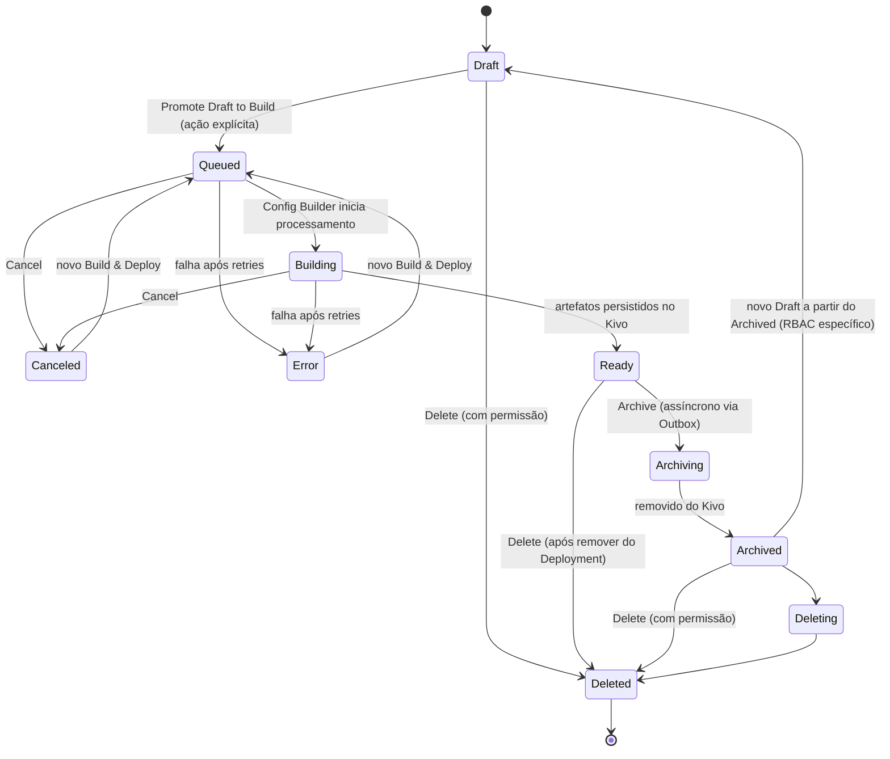

# Versionamento de Resources — Fluxo de Estados e Ações

Documento de referência sobre o ciclo de vida das **Resource Versions** (Application, Firewall, Custom Pages e demais resources versionáveis), extraído da Especificação Funcional de Versionamento de Resources Azion (v1.0 / v1.1).

O foco é descrever **cada estado observável pelo cliente**, as **transições permitidas** e as **ações disponíveis em cada estado**.

---

## 1. Conceitos-base

- **Resource ID**: definição lógica de um artefato (Application, Firewall, Function, Custom Page, etc.). Possui N versões ao longo do tempo.
- **Resource Version**: snapshot versionado de um Resource ID, identificado por um `resource_version_id` (hash opaco, imutável e não sequencial — UUID/ULID). Pertence a exatamente um Resource ID.
- **Imutabilidade por padrão**: toda versão que chega a **Ready** é estritamente imutável. Qualquer alteração exige a criação de um novo **Draft**. O versionamento não pode ser desabilitado.
- **Desacoplamento Build × Deploy**: criar/buildar uma versão (gerar o artefato no Kivo Storage) é distinto de ativá-la (Deploy via Deployment). Estar em **Ready** não significa receber tráfego — para isso é preciso um Deployment que referencie a versão a um Domain.

### Resources cobertos (versionados como artefato único)

Workloads, **Applications**, Functions, **Firewall**, WAF Rules, Network Lists, **Custom Pages**, Connectors, Edge DNS (records), Data Stream.

> Configurações internas de um Resource (ex.: Cache Settings, Rules Engine) **não** são versionadas individualmente — são versionadas em conjunto com o Resource principal. Os campos **Name** e **Description** **não geram** nova versão.

---

## 2. Modelo de Estados — visão geral

Modelo mental resumido das etapas observáveis pelo cliente:

```
Draft → Queued → Building → Ready → Archiving → Archived → Deleting → Deleted
```

Etapas de erro e cancelamento:

```
Queued / Building → Error
Queued / Building → Canceled
```

> **Queued** e **Building** são subestados do processo de **Build**. Em alguns contextos da API, `Queued`/`Building`/`Ready`/`Archiving`/`Archived`/`Canceled`/`Error`/`Deleted` aparecem como estados de primeiro nível.

### Diagrama de estados



---

## 3. Detalhamento por estado e ações

### 3.1 Draft (versão de livre edição)

Estado **puramente lógico**: existe apenas no banco da API (Postgres), não foi processado pelo Config Builder e não está no Kivo Storage nem no Edge.

**Características**
- Mutável: o usuário pode fazer múltiplas alterações em diferentes endpoints do mesmo Resource (ex.: Application e seus subcomponentes, como Rules Engine) sem qualquer deploy.
- Pode ser vinculado a um Deployment ID, mas **nada é publicado** na infraestrutura enquanto não houver Build & Deploy.
- Mantém histórico de origem: um Draft criado a partir do Resource `5232312` registra essa origem; um Draft pode ser criado a partir de outro Draft.
- Limite de **20 Drafts** por padrão (aumento via sistema de Limits).
- Se acessado no Edge antes de Build & Deploy, retorna a página de erro padrão ou a Custom Page configurada (caso já tenha havido deploy anterior).

**Ações permitidas**
- ✅ Editar livremente (vários endpoints/subcomponentes).
- ✅ Criar novo Draft a partir deste Draft.
- ✅ Vincular a um Deployment ID (sem publicação).
- ✅ Solicitar Build (**Promote Draft to Build**) — única origem válida para iniciar um Build.
- ✅ Deletar.

**Restrições**
- ❌ Não pode ser acessado pelo Edge.
- ❌ Não pode ser promovido (Promote).
- ❌ Não pode ser referenciado por um Deployment **ativo**.

---

### 3.2 Queued (subestado de Build)

A intenção de Build foi registrada na **Outbox Table**, aguardando processamento pelo Config Builder (antigo Setup Worker).

**Características**
- Só pode ser executado a partir de um **Draft** (nenhum outro estado origina um Build).
- O Draft é conceitualmente **congelado**; alterações só são possíveis criando um novo Draft.

**Ações permitidas**
- ✅ Cancelar → `Canceled`.
- ✅ Aguardar processamento → `Building`.

**Transições de falha**
- `Queued → Error` (falha após retries).

---

### 3.3 Building (subestado de Build)

O Config Builder está gerando os artefatos necessários. A versão ainda **não existe no Kivo** e **não está acessível no Edge**.

**Características**
- Functions com configurações de Build que exigem **Runners** são geradas e persistidas no Kivo Storage (e Object Storage em casos de split de assets).
- Resources nativos (Application, Firewall, WAF, etc.) têm artefatos gerados e passam por **validações estruturais e de consistência** antes de persistir no Kivo.
- Validação de **ordem em Production**: o último pedido de deploy deve prevalecer. Se um pedido anterior demorar e outro mais recente já tiver ido ao ar, o pedido antigo não pode mais ir para Production.
- Registra trigger do Build (CLI, API ou Console), usuário, data e dados de auditoria.

**Ações permitidas**
- ✅ Cancelar → `Canceled` (na prática raro pela velocidade; relevante em builds com Runners/webhooks de CI).
- ✅ Concluir com sucesso → `Ready`.

**Transições de falha**
- `Building → Error` (falha após esgotar retries).

---

### 3.4 Ready (está no Kivo e disponível para o Edge)

Versão gerada pelo Config Builder e persistida no Kivo Storage. **Estritamente imutável** — não pode ser alterada por ninguém (usuário ou Kivo).

**Características**
- Para alterar, é necessário **criar um novo Draft** a partir desta versão.
- Estar em Ready **não** garante acesso pelo Edge: é preciso um **Deployment** que referencie a versão a um Domain.
- A transição para Ready é **atômica do ponto de vista lógico**: primeiro o artefato é persistido no Kivo, só depois o estado é atualizado no Control Plane.
- Só vira Ready quando **todos os Resource Versions vinculados** já estiverem buildados e disponíveis no Kivo.

**Ações permitidas**
- ✅ Ser referenciada por um Deployment / receber Deploy.
- ✅ Promote (entre Environments) e Rollback.
- ✅ Criar novo Draft a partir desta versão.
- ✅ Arquivar (**apenas** se não estiver em uso por um Deployment ativo — primeiro remover do Deployment).
- ✅ Deletar (com permissão; exige antes deletar o Deployment Version vinculado).
- ✅ Download/exportação para auditoria.

**Restrições**
- ❌ Editar a versão (imutável).
- ❌ Re-executar o mesmo Build (para preservar determinismo).
- ❌ Arquivar/Deletar enquanto estiver em uso por um Deployment.

---

### 3.5 Archiving → Archived (removido do Kivo)

Usado quando a versão ficou velha, bugada ou simplesmente não deve mais ser usada. Arquivar uma versão publicada gera um evento na Outbox Table para exclusão no Kivo — operação **assíncrona** (subestados `Archiving` → `Archived`).

**Características**
- Ao concluir, é **removida do Kivo** e deixa de estar disponível em qualquer infraestrutura.
- **Reason obrigatório** + **Comment opcional**. Tipos de Reason: `SUPERSEDED`, `DEPRECATED_BY_DESIGN`, `SECURITY_ISSUE`, `BUGGY_OR_UNSTABLE`, `COMPLIANCE_RETENTION`, `USER_REQUEST`.
- Pré-condição: **não** pode haver Deployment usando a versão (remover do Deployment antes).

**Ações permitidas**
- ✅ Criar novo Draft a partir da versão arquivada — **apenas com permissão específica (RBAC + Policy)**.
- ✅ Download/exportação para auditoria (disponível até o estado Archived, inclusive).
- ✅ Deletar (com permissão).

**Restrições**
- ❌ Receber tráfego / estar disponível no Edge.

---

### 3.6 Deleted (cliente não vê mais)

A versão desaparece para o usuário e para a Azion via **hard delete** (conforme a Data Retention & Deletion Policy).

**Características**
- Com permissão específica, o Delete pode ser feito a partir de **qualquer estado**.
- Exige, para versões com vínculo, a deleção prévia do **Deployment Version** vinculado.

**Ações permitidas**
- Nenhuma — estado terminal.

**Restrições**
- ❌ Não fica disponível para o usuário nem para a Azion (nem para auditoria).

---

### 3.7 Canceled

O cliente optou por cancelar a execução do processo de Build & Deploy.

**Características**
- Tem o **mesmo efeito de Draft**.
- Mantém o histórico do pedido em "Deployments" com status `Canceled`.

**Ações permitidas**
- ✅ Editar (como em Draft).
- ✅ Solicitar novo Build & Deploy → `Queued`.

---

### 3.8 Error

Ocorreu falha (definitiva ou transitória) no Build/Deploy e o processo foi interrompido após todas as tentativas de retry.

**Características**
- Tem o **mesmo efeito de Draft**.
- Mantém o histórico do pedido em "Deployments" com status `Error`.
- Documentação orienta consultar os **Deployment Logs**; quando não houver build logs, o erro é apresentado na UI/API (ex.: erro de chamada da API).
- Falhas persistentes indicam quebra de contrato / defeito de software (tratadas como falha crítica do lado Azion).

**Ações permitidas**
- ✅ Editar (como em Draft).
- ✅ Solicitar novo Build & Deploy → `Queued` (rebuild manual após Fail persistente).

---

## 4. Matriz resumida — Ações por estado

| Ação | Draft | Queued | Building | Ready | Archived | Canceled | Error | Deleted |
|------|:-----:|:------:|:--------:|:-----:|:--------:|:--------:|:-----:|:-------:|
| Editar configuração | ✅ | ❌ (congelado) | ❌ (congelado) | ❌ (imutável) | ❌ | ✅ | ✅ | ❌ |
| Iniciar Build (Promote to Build) | ✅ | — | — | ❌ | ❌ | ✅ | ✅ | ❌ |
| Cancelar | — | ✅ | ✅ | — | — | — | — | — |
| Acessível no Edge | ❌ | ❌ | ❌ | ✅¹ | ❌ | ❌ | ❌ | ❌ |
| Deploy / referenciar em Deployment | ❌² | ❌ | ❌ | ✅ | ❌ | ❌ | ❌ | ❌ |
| Promote / Rollback | ❌ | ❌ | ❌ | ✅ | ❌ | ❌ | ❌ | ❌ |
| Criar novo Draft a partir dela | ✅ | — | — | ✅ | ✅³ | ✅ | ✅ | ❌ |
| Arquivar | ❌ | ❌ | ❌ | ✅⁴ | — | ❌ | ❌ | ❌ |
| Deletar | ✅ | ✅⁵ | ✅⁵ | ✅⁴ | ✅⁵ | ✅⁵ | ✅⁵ | — |
| Download/exportar (auditoria) | — | — | — | ✅ | ✅ | — | — | ❌ |

**Notas**
1. ¹ Apenas se um Deployment referenciar a versão a um Domain.
2. ² Pode ser **vinculada** a um Deployment ID em Draft, mas nada é publicado.
3. ³ Somente com permissão específica (RBAC + Policy).
4. ⁴ Exige remover/deletar antes o Deployment Version vinculado.
5. ⁵ Delete a partir de qualquer estado requer permissão específica.

---

## 5. Regras e garantias de transição

- **Origem do Build**: somente um `Draft` pode originar um Build. Estados `Canceled` e `Error` se comportam como Draft e podem solicitar novo Build & Deploy.
- **Publicação sequencial (grafo de dependência)**: uma Resource Version só vira `Ready` quando todos os artefatos vinculados estiverem buildados, persistidos no Kivo e disponíveis para o Edge.
- **Atomicidade**: não pode existir `Ready` sem o artefato fisicamente disponível no Kivo. Persiste primeiro no Kivo, depois atualiza o Control Plane (Postgres).
- **Isolamento de Draft/Build**: enquanto em `Draft` ou em Build, a versão não pode ser acessada pelo Edge, não pode ser promovida e não pode ser referenciada por um Deployment ativo.
- **Falhas de Build**: política de backoff com número máximo de retries; após esgotar, vai para `Error` (Fail persistente). Nenhum artefato inválido é publicado; nenhum impacto em produção. Rebuild manual é permitido a partir do estado de falha.
- **Determinismo**: não é permitido re-executar o mesmo Build de uma versão já em `Ready`.
- **Active/Inactive**: alterar o status Active/Inactive de uma Resource Version **gera nova versão** (é tratado como mudança de configuração versionada), mantendo a imutabilidade das demais.
- **Remoção × Deployment**: para arquivar/deletar uma versão em uso, é preciso primeiro removê-la do Deployment Version. Nunca pode existir Deployment Version referenciando Resource Version inexistente.
- **Product Version**: cada Resource Version está associada a uma Product Version imutável (ex.: WAF 1.0 vs WAF 2.0). O Build valida a configuração contra o schema dessa Product Version; incompatibilidades impedem a transição para `Ready`. Após o Build, a Product Version não pode ser alterada (migração exige nova Resource Version).

---

## 6. Estados do Runner (Build via Runners)

Quando o Build usa Runners (antigo Script Runners), estes estados são observáveis pelo cliente:

| Estado | Significado |
|--------|-------------|
| `Queued` | Job aceito, aguardando execução. |
| `Running` | Job em execução no Runner. |
| `Canceled` | Execução cancelada antes da conclusão. |
| `Error` | Execução falhou e não foi concluída. |
| `Succeeded` | Execução concluída com sucesso. |

---

## 7. Anexo — Modelo simplificado/legado (seção WIP da API)

A seção "Mudanças na API (WIP)" descreve um modelo mais simples baseado em `version_state`, usado para compatibilidade retroativa (versionamento ON/OFF por feature flag). Convive com o modelo principal, mas opera com nomenclatura diferente:

| Campo | Tipo | Descrição |
|-------|------|-----------|
| `version` | integer | Número da versão (auto-incrementado). |
| `version_state` | enum | `draft`, `active`, `released`. |
| `version_created_at` | datetime | Quando a versão foi criada. |
| `version_comment` | string | Comentário/descrição da versão. |

**Mapeamento de estados (legado):**
- `draft` → versão editável (apenas banco, sem deploy).
- `active` → versão promovida para produção (deploy no Edge).
- `released` → versão anteriormente ativa, substituída por uma nova `active`.

**Comportamento do PUT tradicional (versionamento OFF):** Clone da versão atual → Draft → aplica payload → Save → Promote automático para `active` → versão anterior vira `released`. Efeito idêntico ao "save + deploy imediato" atual.

**Comportamento com versionamento ON:** o PUT só atualiza um Draft existente; se não houver Draft, retorna erro `NO_DRAFT_VERSION`.

> Observação: este modelo legado de três estados (`draft`/`active`/`released`) é menos granular que o modelo principal (`Draft → Queued → Building → Ready → Archived → Deleted`, com `Canceled`/`Error`). O modelo principal é o que reflete a separação completa entre Build e Deploy.