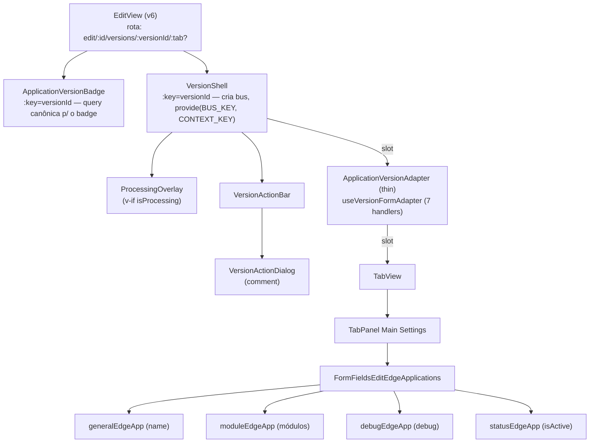
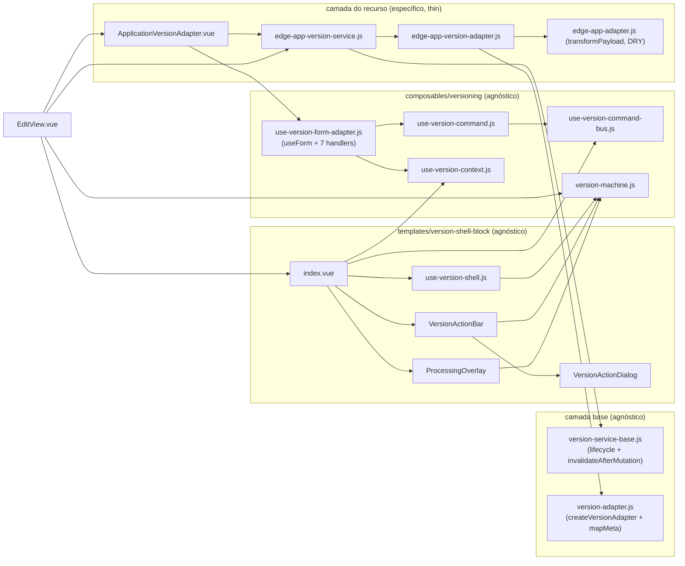
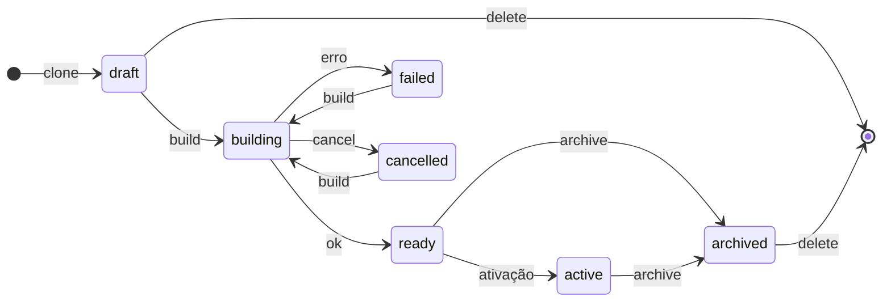
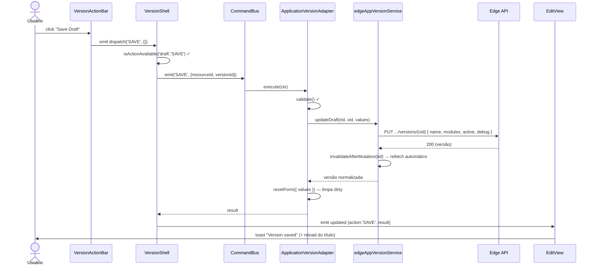
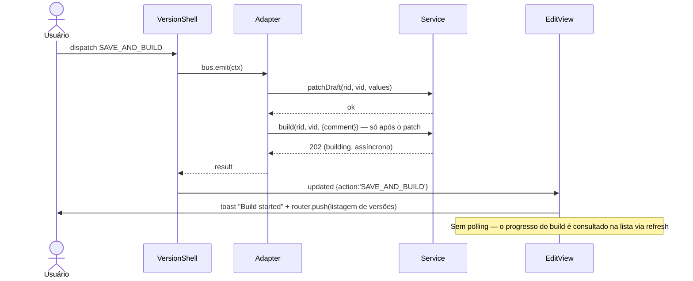
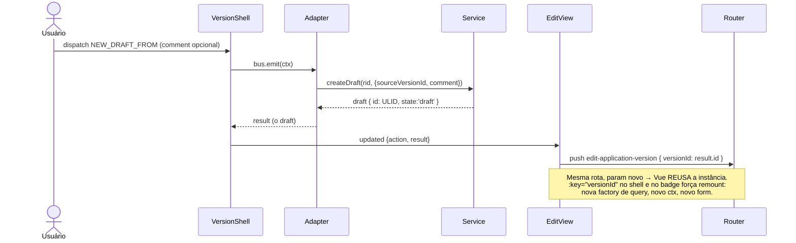
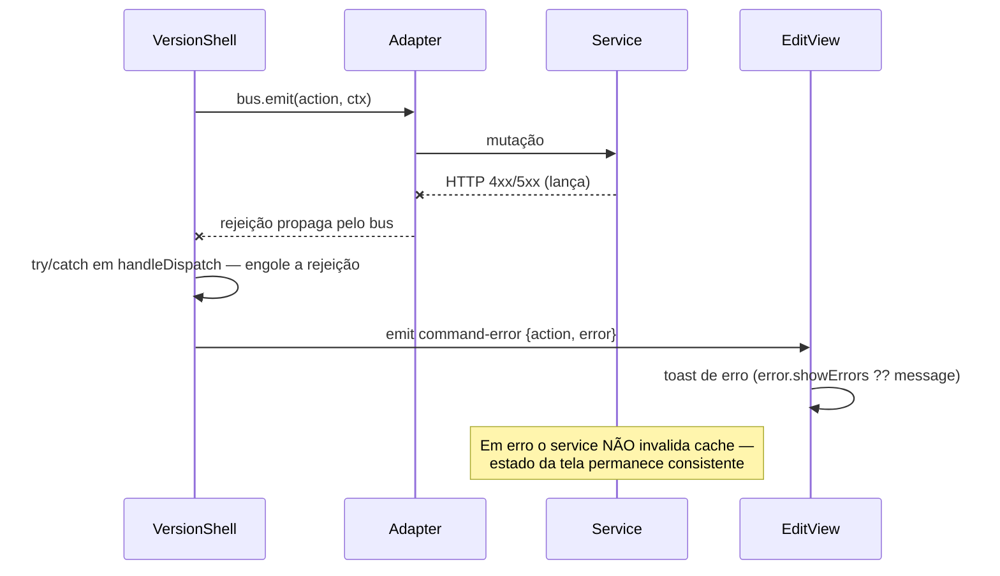

# VersionShell — Arquitetura, Máquina de Estados e Command Bus

Documentação de referência do framework de versionamento de recursos do Console
(contas v6, flag `use_v6_configurations`). Cobre o `<VersionShell>`, a máquina de
estados, a comunicação via command bus, o fluxo de dados completo e o roteiro para
plugar novos recursos.

> Implementação de referência: **Application** (`src/views/EdgeApplications/v6/`).
> Consumidores em produção: Application, Workload, Custom Page, Firewall, Deployment
> e — adicionados pelo spec `version-shell-connector-functions` — **Edge Connector**
> e **Edge Function**.
> Specs do desenvolvimento: `specs/version-shell-command-bus-fix/`,
> `specs/version-shell-connector-functions/` e
> `docs/superpowers/specs/2026-06-11-version-shell-command-bus-design.md`.

---

## 1. Visão geral

O VersionShell padroniza a edição **versionada** de qualquer recurso: o usuário
edita um *draft*, dispara *build*, e versões `ready` podem ser ativadas, arquivadas
ou forkadas em novos drafts. A arquitetura inverte o despacho clássico:

- O **shell** é dono da máquina de estados, da action bar, do dialog de comment e
  do overlay — e **não conhece nenhum recurso**.
- O **filho** (adapter do recurso, ex.: `ApplicationVersionAdapter`) é dono do form
  e da execução: registra handlers num **command bus** provido pelo shell.
- O **service** do recurso é dono de HTTP, queryKey, e invalidação de cache.

Adicionar um recurso versionável **não altera uma linha** do shell, do bus ou da
máquina de estados.

```
┌────────────────────────── EditView (caller) ──────────────────────────┐
│ toasts • navegação pós-comando • carrega o recurso pai                │
│  ┌──────────────────── <VersionShell> (agnóstico) ─────────────────┐  │
│  │ state machine • action bar • dialog de comment • overlay • bus  │  │
│  │  ┌─── <ResourceVersionAdapter> thin (específico) ───────────┐  │  │
│  │  │ useVersionFormAdapter: useForm + 7 handlers no bus        │  │  │
│  │  │  ┌──────────────── form fields / tabs ─────────────────┐  │  │  │
│  │  │  │ useField auto-conecta • readOnly via versionContext │  │  │  │
│  │  │  └──────────────────────────────────────────────────────┘ │  │  │
│  │  └────────────────────────────────────────────────────────────┘  │  │
│  └──────────────────────────────────────────────────────────────────┘  │
└────────────────────────────────────────────────────────────────────────┘
```

---

## 2. Responsabilidade de cada entidade

| Entidade | Arquivo | Responsabilidade | NÃO faz |
|---|---|---|---|
| **VersionShell** | `src/templates/version-shell-block/index.vue` | Cria/provê o bus; lê a versão via factory `useVersionQuery`; deriva `state`/`readOnly`; renderiza ActionBar/Overlay; provê `VERSION_CONTEXT_KEY`; captura erro de comando e emite `updated`/`command-error` | Não conhece recurso, form ou service de mutação; **não toca cache** |
| **useVersionShell** | `src/templates/version-shell-block/use-version-shell.js` | Deriva `version`, `state`, `readOnly`, `availableActions` (estado ∩ registrados), `disabledActions` (via `ready`); `dispatch()` com state-gate e retorno do resultado do handler | Não abre dialog (é a ActionBar), não invalida cache |
| **Command bus** | `src/composables/versioning/use-version-command-bus.js` | Registro único por comando (throw em duplicado); `emit` (throw sem handler); `registered` reativo via `shallowRef<Map>` | Não valida estado (é o dispatch), não conhece comandos específicos |
| **onVersionCommand** | `src/composables/versioning/use-version-command.js` | API do filho: registra handler (atalho `fn` ou `{ execute, ready }`); desregistra em `onBeforeUnmount`; throw fora do shell | Não executa nada por conta própria |
| **version-machine** | `src/composables/versioning/version-machine.js` | Fonte da verdade do domínio: `VERSION_STATES`, `VERSION_ACTIONS`, matriz `STATE_ACTIONS`, predicados (`isEditable`, `isProcessing`, `isImmutable`, `isTerminal`) | Não tem estado próprio; só funções/constantes puras |
| **useVersionContext** | `src/composables/versioning/use-version-context.js` | Inject de `{ state, readOnly, version }` com default seguro (`readOnly=false`) fora do shell | Não provê (quem provê é o shell) |
| **VersionActionBar** | `.../components/VersionActionBar.vue` | Renderiza botões por `availableActions`/`disabledActions`; decide ação primária por estado (`PRIMARY_BY_STATE`); abre o dialog quando o comando exige comment (`REQUIRES_COMMENT`); emite `dispatch(action, { comment? })` | Não executa comandos; não conhece services |
| **VersionActionDialog** | `.../components/VersionActionDialog.vue` | Coleta o comment (obrigatório ou opcional); confirma/cancela | Não sabe qual comando está confirmando |
| **ProcessingOverlay** | `.../components/ProcessingOverlay.vue` | Bloqueia a UI quando `isProcessing(state)` (`building`); botão Cancel quando `CANCEL_BUILD` está disponível | Não despacha direto (emite `cancel` pro shell) |
| **VersionStateBadge** | `.../components/VersionStateBadge.vue` | Badge visual do estado | — |
| **useVersionFormAdapter** | `src/composables/versioning/use-version-form-adapter.js` | **Fonte única** do filho do shell: hospeda o `useForm` (schema do recurso); merge `recurso ⊕ version.config` como initial values; re-sync via `watch` + `resetForm`; registra **7 handlers** (os 6 do ciclo + `DEPLOY` no-op) chamando o service via `saveStrategy`; expõe `ready: isFormValid` (gate dos botões SAVE) | Não renderiza UI; não toca cache; não mostra toast |
| **`<Recurso>VersionAdapter.vue`** (ex.: `CustomPageVersionAdapter`) | `src/views/<Recurso>/v6/<Recurso>VersionAdapter.vue` | **Thin** (≤35 linhas, template `<slot/>`): só chama `useVersionFormAdapter({ resource, resourceId, versionId, versionService, validationSchema, saveStrategy })`. Cada recurso fornece apenas essas 3 especializações | Não tem handler inline; não conhece bus/máquina |
| **Version service** (ex.: `edgeAppVersionService`) | `src/services/v2/edge-app/edge-app-version-service.js` | HTTP dos endpoints `/versions` (herdado de `VersionServiceBase`); `useLoadVersionQuery`/`useListVersionsQuery` (lista aceita `params`/`skipCache`) com queryKey canônico; **toda mutação chama o hook `invalidateAfterMutation(rid)`** (default: `removeQueries(versionKeys.all(rid))`, sobrescrevível) | Não importa composables (regra ESLint `services-http-only`) |
| **Version adapter** (ex.: `EdgeAppVersionAdapter`) | `src/services/v2/edge-app/edge-app-version-adapter.js` | Único ponto que conhece o contrato de payload, criado por `createVersionAdapter({ normalizeConfig, mapResourceFields, mapMeta? })`: form values → campos do recurso **no nível raiz** + `comment?`/`source_version?` (strip de `undefined`); `GET` → `{ id, state, comment, timestamps, ...mapMeta, config }`, onde `config` extrai os campos do recurso do raiz do snapshot no shape de form UI (descarta `null`). `mapMeta` adiciona campos extras de meta (ex.: Workload: `deploymentId`/`environmentId`/`lastError`) | Não chama HTTP; não reimplementa `stripUndefinedDeep`/`normalizeVersion` |
| **EditView** (caller) | `src/views/EdgeApplications/v6/EditView.vue` | Carrega o recurso pai; passa a factory `useVersionQuery`; guarda de rota sem `versionId`; toasts de sucesso/erro; navegação pós-comando; `:key="versionId"` no shell e no badge | Não executa comandos; não conhece o bus |

---

## 3. Hierarquia de componentes e dependências

### 3.1 Árvore de componentes (runtime)



### 3.2 Dependências de módulo (imports)



Regras de direção: a camada do recurso depende do framework (composables + shell);
o framework **nunca** depende do recurso. Services **nunca** importam de
`src/composables/**` (lint `azion-architecture/services-http-only`).

---

## 4. Máquina de estados

Fonte da verdade: `src/composables/versioning/version-machine.js`, espelhando a
Version API (`docs/edge-api/APPLICATIONS.md`).

### 4.1 Estados e transições



Legenda das transições (endpoint por trás de cada label):

| Label | Endpoint / origem |
|---|---|
| `clone` | `POST .../versions` (com `source_version` opcional) |
| `build` | `POST .../versions/{vid}/build` — assíncrono (202); de `failed`/`cancelled` retoma o mesmo draft |
| `ok` / `erro` | desfecho assíncrono do build na plataforma |
| `cancel` | `POST .../versions/{vid}/cancel` |
| `archive` | `POST .../versions/{vid}/archive` (comment obrigatório) |
| `ativação` | feita pela plataforma (fora do shell) |
| `delete` | `DELETE .../versions/{vid}` |

### 4.2 Matriz `STATE_ACTIONS` (estado → comandos permitidos)

| Estado | SAVE | SAVE_AND_BUILD | CANCEL_BUILD | NEW_DRAFT_FROM | ARCHIVE | DELETE | `readOnly`? |
|---|:-:|:-:|:-:|:-:|:-:|:-:|:-:|
| `draft` | ✔ | ✔ | — | ✔ | — | ✔ | não |
| `building` | — | — | ✔ | — | — | — | sim (overlay) |
| `ready` | — | — | — | ✔ | ✔ | ✔ | sim |
| `active` | — | — | — | ✔ | ✔ | ✔ | sim |
| `archived` | — | — | — | ✔ | — | ✔ | sim |
| `cancelled` | ✔ | ✔ | — | ✔ | — | ✔ | não |
| `failed` | ✔ | ✔ | — | ✔ | — | ✔ | não |

- `cancelled`/`failed` herdam o set de `draft` (estados recuperáveis — usuário retoma o trabalho).
- Estado desconhecido → `getAvailableActions` retorna `[]` (**fail-closed**: nenhum botão errado).
- `readOnly = !isEditable(state)`; `isEditable = draft | cancelled | failed`.
- Comment por comando (UI, `REQUIRES_COMMENT` na ActionBar): **ARCHIVE obrigatório**;
  CANCEL_BUILD e NEW_DRAFT_FROM opcionais; SAVE/SAVE_AND_BUILD/DELETE sem dialog.
  O service de archive revalida o comment (defesa em profundidade).

### 4.3 O que o shell deriva da máquina

```js
availableActions = getAvailableActions(state) ∩ bus.registered        // botões visíveis
disabledActions  = comandos registrados com ready.value === false      // botões desabilitados
readOnly         = !isEditable(state)                                  // provido via VERSION_CONTEXT_KEY
showOverlay      = isProcessing(state)                                 // overlay de building
```

---

## 5. Comunicação pelo command bus

### 5.1 Contrato

```js
// Shell (provê)
const bus = createVersionCommandBus()
provide(VERSION_COMMAND_BUS_KEY, bus)

// Filho (consome) — atalho ou forma completa
onVersionCommand('DELETE', (ctx) => service.deleteVersion(ctx.resourceId, ctx.versionId))
onVersionCommand('SAVE', {
  ready: isFormValid,            // Ref<boolean> — gate do botão; opcional (default: sempre habilitado)
  execute: async (ctx) => { ... } // retorno viaja de volta pro caller via evento `updated`
})
```

- **Push-only**: o shell empurra `bus.emit(command, ctx)`; o filho nunca expõe API por props.
- **Um handler por comando** — duplicado lança erro (filho único por shell).
- **Cleanup automático** em `onBeforeUnmount`.
- `ctx = { resourceId, versionId, comment? }` — form values **não** viajam no ctx; o
  handler coleta do form local.

### 5.2 ⚠️ Armadilha de reatividade (decisão gravada em código)

O bus usa `shallowRef(new Map())` + `shallowReadonly` — **nunca** `ref`/`readonly`.
`ref()` converteria o Map num proxy reativo profundo, e proxies reativos
**desembrulham refs no acesso à propriedade**: ao iterar, `entry.ready` viraria o
boolean (não a ref) e `entry.ready.value` daria `undefined`, **invertendo o gate**
(form válido → botão desabilitado). A reatividade vem da substituição do Map
inteiro a cada register/unregister. Regressão coberta em
`src/tests/templates/version-shell-block/version-shell-events.test.js`.

---

## 6. Fluxo de dados e chamadas

Quatro canais, cada um com uma direção única:

| Canal | Direção | O que carrega |
|---|---|---|
| **Props** | EditView → Shell → Adapter | `useVersionQuery` (factory), `resourceId`, `versionId`, `application` |
| **Provide/inject** | Shell → descendentes | `VERSION_COMMAND_BUS_KEY` (bus) e `VERSION_CONTEXT_KEY` (`{ state, readOnly, version }`) |
| **Bus (push)** | Shell → Adapter | `emit(command, ctx)`; resultado do handler retorna pelo `await` |
| **Eventos** | Shell → EditView | `updated { action, result }` e `command-error { action, error }` |

### Ciclo de cache (dono: service)

```
mutação no service (updateDraft/build/...)
  → HTTP
  → this.invalidateAfterMutation(rid)   // default: removeQueries(versionKeys.all(rid))
  → o useQuery canônico (shell + badge, deduplicado por queryKey) refetcha sozinho
  → version.value atualiza → state recomputa → action bar / readOnly / overlay reagem
```

`invalidateAfterMutation` é o hook sobrescrevível da base — recursos que mudam
mais de um cache estendem-no (ex.: Deployment invalida também `deployments.detail`).

O shell e a EditView **nunca** invalidam cache. Não há polling: o estado atualiza
por invalidação pós-mutação e por ação do usuário (decisão de produto — pós-build
o usuário é levado à listagem de versões).

---

## 7. Encadeamento de métodos (cadeia completa de um comando)

```
1. Click no botão
   VersionActionBar.handleClick(action)
2. Comment gate (UI)
   REQUIRES_COMMENT[action]? → abre VersionActionDialog → handleDialogConfirm(comment)
3. Emissão pra cima
   VersionActionBar emit('dispatch', action, { comment? })
4. Shell captura
   index.vue → handleDispatch(action, payload)        [try/catch — nunca rejeita]
5. State gate + ctx
   use-version-shell.dispatch(action, payload)
     ├─ isActionAvailable(state, action)?  senão: warn + return
     ├─ bus.registered.has(action)?        senão: warn + return
     └─ ctx = { resourceId, versionId, comment }
6. Bus
   return await bus.emit(action, ctx) → entry.execute(ctx)
7. Handler (useVersionFormAdapter) — exemplo SAVE
   validate() → inválido? throw (shell emite command-error; nenhum HTTP)
   saveStrategy.save(ctx) → service.updateDraft(rid, vid, values)  // SAVE = PUT (full replace)
     └─ EdgeAppVersionAdapter.transformDraftPayload(values)   // form → campos no raiz
     └─ PUT /v4/workspace/applications/{rid}/versions/{vid}
     └─ this.invalidateAfterMutation(rid)                     // removeQueries(versionKeys.all)
   resetForm({ values })                                      // baseline novo, limpa dirty
   return result                                              // volta pelo bus
8. Shell emite o desfecho
   sucesso → emit('updated', { action, result })
   falha   → emit('command-error', { action, error })
9. EditView decide UI
   toast por ação; navegação: DELETE/SAVE_AND_BUILD → listagem; NEW_DRAFT_FROM → novo draft (result.id)
```

---

## 8. Diagramas de sequência

### 8.1 SAVE (caminho feliz)



### 8.2 SAVE_AND_BUILD (com navegação pós-build)



### 8.3 NEW_DRAFT_FROM (navegação in-place + remount)



### 8.4 Caminho de erro (qualquer comando)



---

## 9. Armadilhas conhecidas (lições da implementação de Application)

1. **`shallowRef` no bus** (§5.2) — nunca trocar por `ref`/`readonly`; proxies
   reativos desembrulham a ref `ready` e invertem o gate de disabled.
2. **`:key="versionId"` obrigatório** no `<VersionShell>` e no componente de badge:
   o `BaseService.useQuery` exige queryKey **estático** (array), e o
   `useVersionShell` captura `resourceId`/`versionId` por valor no setup. Navegação
   in-place (pós-NEW_DRAFT_FROM) sem remount deixaria query e ctx presos à versão
   antiga — comandos atingiriam a versão errada.
3. **Re-sync do form**: initialValues são snapshot; a sincronização é explícita —
   `watch(mergedValues)` com guard `!meta.dirty` (preserva edição pendente) +
   `watch(versionId)` incondicional. Pós-save, `resetForm({ values })` zera o dirty
   para liberar o re-sync do refetch.
4. **`normalizeConfig` descarta `null`** — a API pode devolver campos de config
   com valor nulo no snapshot da versão; `null` no merge esvaziaria campos válidos
   do form (e derrubaria a validação silenciosamente).
5. **Contrato de payload no nível raiz** (confirmado com o time de API em 2026-06-12):
   `POST`/`PUT`/`PATCH` de versão recebem os campos da Application (`name`, `modules`,
   `active`, `debug`) **no raiz** do body — não há wrapper `override`. O `GET` da
   versão é um snapshot do recurso e expõe esses campos no raiz; `normalizeConfig`
   os extrai para `version.config`. Se o `GET` retornar só metadados, `config` é `{}`
   e o form inicializa a partir do recurso pai.
5. **Spinner global só no load inicial** da EditView — religar o spinner em
   re-loads desmontaria o shell/form e perderia estado de tabs.
6. **readOnly nos form fields** vem exclusivamente de `useVersionContext()` —
   default seguro `false` mantém o fluxo não-versionado intacto. Componentes nunca
   leem `user-flag.js` (fork é no router — `docs/V6-GUIDELINES.md`).

---

## 10. Testes existentes

| Suite | Cobre |
|---|---|
| `src/tests/services/v2/edge-app/edge-app-version-adapter.test.js` | P2 — form→payload no raiz (campo a campo, strip de `undefined`, `comment`/`source_version` na raiz), `transformCreateDraftPayload` (clone puro/com alterações), `transformLoadVersion.config` com/sem/parcial/`null` no snapshot |
| `src/tests/templates/version-shell-block/version-shell-events.test.js` | P3 — `updated`/`command-error` sem unhandled rejection; retorno do handler; **regressão do `ready` desembrulhado** (disabledActions reativo) |
| `src/tests/views/EdgeApplications/v6/application-version-adapter.test.js` | SAVE inválido não muta; SAVE válido + payload; ordem patch→build; re-sync pristine/dirty; retorno do NEW_DRAFT_FROM |
| `src/tests/views/EdgeApplications/FormFields/block/*.test.js` | P4 — `readOnly=true` desabilita os 4 blocks; default mantém habilitado |
| `src/tests/services/v2/edge-connectors/edge-connector-version-{service,adapter}.test.js` | Connector polimórfico (HTTP/Storage/LiveIngest): `baseURL`, queryKeys, herança da base; form→payload no raiz e `config` do snapshot |
| `src/tests/services/v2/edge-function/edge-function-version-{service,adapter}.test.js` | Function: `baseURL`, herança da base; mapeamento `runtime`/`execution_environment`/`default_args`/`code`; `config` do snapshot |
| `src/tests/views/EdgeFunctions/v6/code-editor-readonly.test.js` | P6 — `code-editor` não-editável em estado imutável via `useVersionContext().readOnly` |

---

## 11. Adicionar um recurso ao VersionShell

A API expõe versionamento com o **mesmo contrato** para todos os recursos sob
`v4/workspace/<recurso>`: estados `draft/building/ready/archived`, clone com
`source_version`/`comment` + campos do recurso **no nível raiz**, PATCH de draft,
archive/build/cancel. Plugar um recurso é só fornecer os artefatos **thin** abaixo
— **zero linha** no shell/bus/máquina/`use-version-form-adapter` (gate P8 em CI).

### 11.0 Recursos já plugados

| Recurso | Base URL das versões | Adapter component |
|---|---|---|
| Application | `v4/workspace/applications` | `EdgeApplications/v6/ApplicationVersionAdapter.vue` |
| Workload | `v4/workspace/workloads` | (via `useVersionFormAdapter` + `workloadSaveStrategy`) |
| Custom Page | `v4/workspace/custom_pages` | `CustomPages/v6/CustomPageVersionAdapter.vue` |
| Firewall | `v4/workspace/firewalls` | — |
| Edge Connector | `v4/workspace/connectors` | `EdgeConnectors/v6/EdgeConnectorVersionAdapter.vue` |
| Edge Function | `v4/workspace/functions` | `EdgeFunctions/v6/EdgeFunctionVersionAdapter.vue` |
| Deployment | `/deployment-api/v4/deployments` | — (consome a base direto) |

### 11.1 Checklist por recurso (nada no framework muda)

| # | Entrega | Base de cópia | Esforço |
|---|---|---|---|
| 1 | Namespace em `queryKeys` (`<recurso>.version.all/list/detail`) | `queryKeys.application.version` | Trivial |
| 2 | `<recurso>-version-service.js` — `extends VersionServiceBase`, seta `adapter`/`baseURL = 'v4/workspace/<recurso>'`/`versionKeys`. Ciclo de vida + invalidação herdados; sobrescreva `invalidateAfterMutation` só se precisar invalidar cache extra (ex.: Deployment) | `custom-page-version-service.js` | Trivial |
| 3 | `<recurso>-version-adapter.js` — `createVersionAdapter({ normalizeConfig, mapResourceFields, mapMeta? })`; **não** reimplemente `stripUndefinedDeep`/`normalizeVersion` | `custom-page-version-adapter.js` | **Único ponto de pensamento real** — campos do recurso são específicos |
| 4 | `<Recurso>VersionAdapter.vue` (thin, ≤35 linhas) — só chama `useVersionFormAdapter` com `versionService`/`validationSchema`/`saveStrategy` | `CustomPageVersionAdapter.vue` | Trivial — o schema yup já existe nas telas atuais |
| 5 | `v6/EditView.vue` + `v6/VersionEditView.vue` + `v6/tabs/*` (landing + edit screen compartilhados) | os de Custom Page | Baixo — já trazem as lições do §9 embutidas |
| 6 | Fork no router (`hasFlagUseV6Configurations` / `meta.flag`) + rota `edit/:id/versions/:versionId` | `workload-routes` | Trivial |
| 7 | readOnly nos form fields do recurso (`useVersionContext` + `:disabled`) | os blocks de Connector/Function | Baixo |
| 8 | Entrada no `RESOURCE_RESOLVERS` do Release Drawer (`resolveReleaseResources.js`, chave = `resource_type`) | entradas `connector`/`function` | Trivial |
| 9 | Testes (espelhar as suites do §10) | suites de Custom Page/Connector/Function | Baixo |

> `saveStrategy` é o ponto de variação do write: `defaultSaveStrategy` (SAVE = PUT;
> SAVE_AND_BUILD = PUT + build). Recursos com semântica própria fornecem o seu
> (ex.: `workloadSaveStrategy` — build implícito no PUT; Custom Page —
> `customPageSaveStrategy`, salva conteúdo via endpoint base).

### 11.2 WAF — fora de escopo (status real)

**WAF não tem versionamento.** Não há API de versões confirmada para WAF; o recurso
fica **deferido** até o backend expor o contrato. Não existem service/adapter/views
v6 para WAF, e nenhuma `baseURL` `/edge_firewall/api/wafs` é consumida pelo
framework. (Versões anteriores deste doc afirmavam, incorretamente, que o WAF
compartilhava a máquina de estados do Firewall com API pronta.)

### 11.3 Mudanças no framework: nenhuma obrigatória, uma a vigiar

`STATE_ACTIONS`, `PRIMARY_BY_STATE` (ActionBar) e `REQUIRES_COMMENT` (ActionBar)
são **constantes globais compartilhadas** por todos os recursos. Hoje isso é
correto — os lifecycles dos recursos plugados são idênticos. **Se** um recurso divergir um dia
(ex.: archive sem comment obrigatório, recurso sem etapa de build), esses três
mapas precisam ser promovidos a props/configuração do `<VersionShell>`, com os
valores atuais como default. Não parametrizar antes da divergência existir
(YAGNI) — o custo da promoção é pequeno e localizado.

