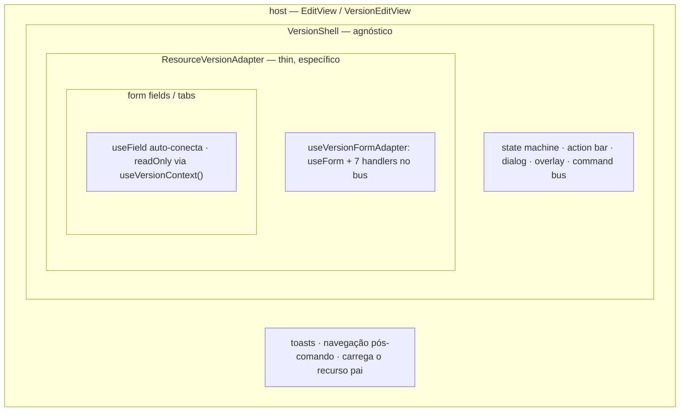
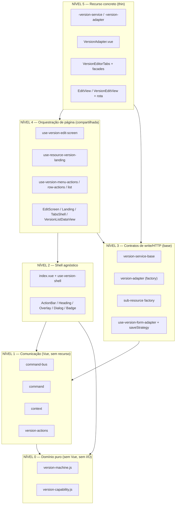
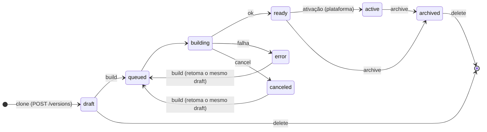
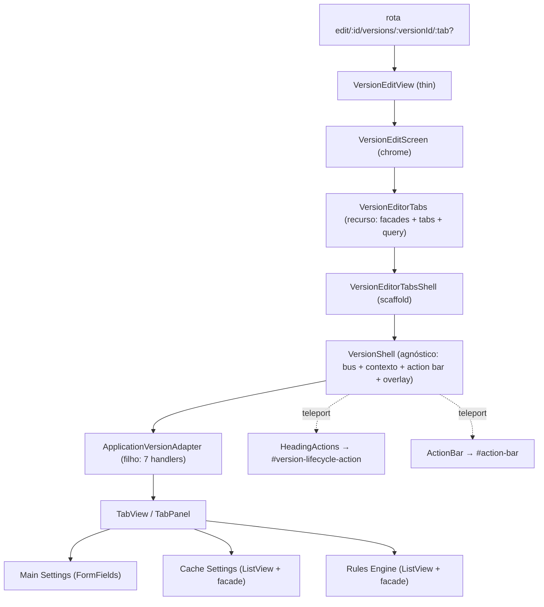
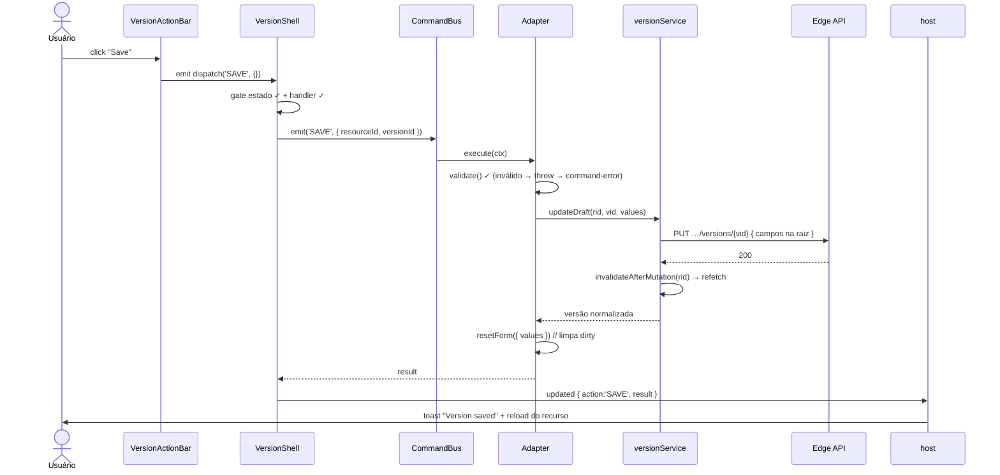
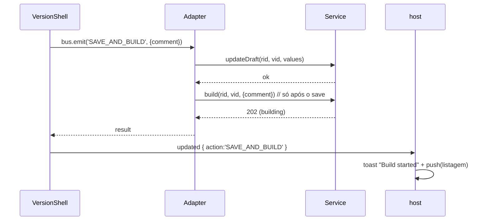
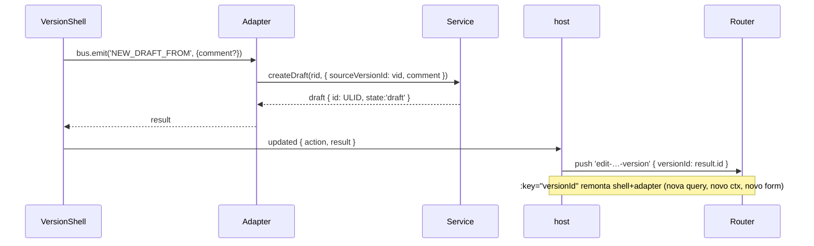
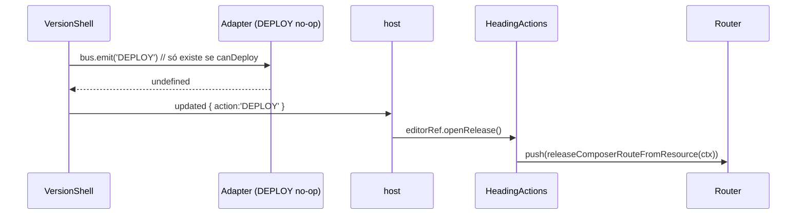
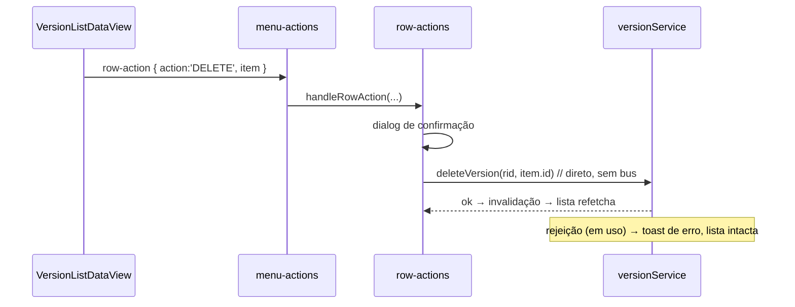
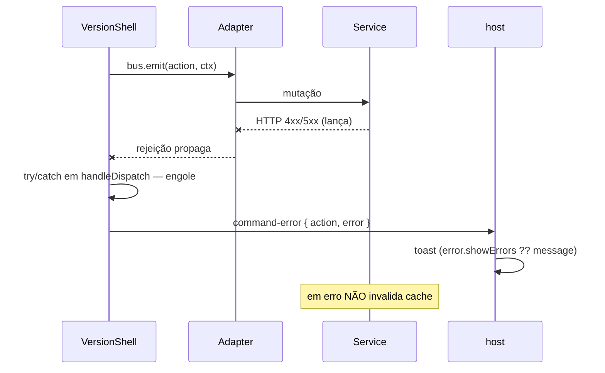

# VersionShell — Deep Dive (referência completa)

> Documento de referência do framework de versionamento de recursos do Azion Console
> Kit (contas v6, flag `use_v6_configurations`). Cobre filosofia, padrões, hierarquia
> de abstrações, todos os arquivos, todos os fluxos, o catálogo de recursos plugados, e
> o passo-a-passo para criar um recurso novo.
>
> Base de código: `azion-console-kit`. Implementação de referência: **Application**
> (`src/views/EdgeApplications/v6/`).

## Índice

- [0. Glossário](#0-glossario)
- [1. Filosofia e o problema que resolve](#1-filosofia)
- [2. Conceitos fundamentais](#2-conceitos)
- [3. Índice completo de arquivos](#3-indice-arquivos)
- [4. Padrões de projeto adotados](#4-padroes)
- [5. Hierarquia de abstrações](#5-hierarquia)
- [6. Convenções de nomenclatura](#6-convencoes)
- [7. Domínio — máquina de estados e capability](#7-dominio)
- [8. Comunicação — command bus, command, context](#8-bus)
- [9. Shell — VersionShell e action bar](#9-shell)
- [10. Form-adapter — o filho do shell](#10-form-adapter)
- [11. Apresentação — version-actions](#11-apresentacao)
- [12. Orquestração de página](#12-orquestracao)
- [13. Listagem — VersionListDataView](#13-listagem)
- [14. Service/adapter — a base HTTP](#14-service)
- [15. Sub-recursos versionados](#15-subrecursos)
- [16. View + roteamento (2 variantes de landing)](#16-view-router)
- [17. Release — composer full-page](#17-release)
- [18. Quatro canais de dados e ciclo de cache](#18-dados)
- [19. Catálogo de recursos plugados](#19-catalogo)
- [20. Fluxos completos (sequência)](#20-fluxos)
- [21. Como criar um recurso novo](#21-criar-recurso)
- [22. Invariantes e armadilhas](#22-armadilhas)
- [23. Comparação com o padrão legado](#23-legado)
- [24. Mapa de testes](#24-testes)

---

<a name="0-glossario"></a>

## 0. Glossário

| Termo                           | Significado                                                                                   |
| ------------------------------- | --------------------------------------------------------------------------------------------- |
| **Recurso**                     | Entidade de negócio versionável (Application, Workload, WAF…). Tem um id próprio              |
| **Versão**                      | Snapshot do recurso num ponto do tempo. Identidade = `version_id` (ULID), **≠** id do recurso |
| **Draft**                       | Versão editável (`draft`, ou recuperáveis `canceled`/`error`)                                 |
| **Build**                       | Transição assíncrona (HTTP 202) que congela um draft num artefato imutável                    |
| **Estado**                      | Um dos 8 valores da Version API (ver §7)                                                      |
| **Capability**                  | Classe imutável `{canDeploy, canPromote, canRollback}` do recurso (§7.4)                      |
| **Command**                     | Intenção (`SAVE`, `ARCHIVE`, `DEPLOY`…) despachada pelo bus                                   |
| **Handler**                     | Função registrada pelo filho que executa um command                                           |
| **Shell**                       | `<VersionShell>` — o componente agnóstico que orquestra estado+UI                             |
| **Filho**                       | O adapter do recurso (`<ResourceVersionAdapter>`) que hospeda o form                          |
| **config**                      | Subconjunto do snapshot que vira valores do form (extraído por `normalizeConfig`)             |
| **ctx**                         | Payload que viaja no bus: `{ resourceId, versionId, comment? }`                               |
| **deployable / versioned-only** | As duas classes de recurso (§7.4)                                                             |
| **Landing**                     | Tela de listagem de versões (`EditView`)                                                      |
| **Editor**                      | Tela full-page de edição de uma versão (`VersionEditView`)                                    |
| **Composer**                    | Tela full-page "Review & deploy" (rota `release-composer`)                                    |

---

<a name="1-filosofia"></a>

## 1. Filosofia e o problema que resolve

**Problema:** vários recursos passaram a ter ciclo de vida versionado (draft → build →
ready → active/archived). As ações disponíveis **dependem do estado**. Resolver recurso
a recurso geraria N telas quase iguais, cada uma reimplementando barra de ações, gates
por estado, dialogs e invalidação — com divergência garantida.

**Solução — inversão de despacho:** três donos com fronteiras rígidas.

| Dono                | Responsabilidade                                          | **NÃO** faz                      |
| ------------------- | --------------------------------------------------------- | -------------------------------- |
| **Shell**           | máquina de estados, action bar, dialog, overlay, contexto | não conhece recurso/form/service |
| **Filho** (adapter) | hospeda o form, registra handlers no bus                  | não conhece a máquina de estados |
| **Service**         | HTTP, queryKey, invalidação de cache                      | não importa composables (lint)   |

Consequência: **adicionar um recurso não altera uma linha** do shell/bus/máquina
(Open-Closed garantido por gate de CI).

O aninhamento de containment (quem renderiza dentro de quem):



---

<a name="2-conceitos"></a>

## 2. Conceitos fundamentais

A cadeia mental que amarra tudo:

```
estado → ações permitidas → botões → command → handler → service → HTTP
       → invalidação → refetch → novo estado
```

Cada elo é dono de uma única coisa e não conhece os vizinhos distantes: os botões não
sabem o que o handler faz; o handler não sabe que botão o disparou; o service não sabe
que existe um shell.

---

<a name="3-indice-arquivos"></a>

## 3. Índice completo de arquivos

### Domínio + comunicação (`src/composables/versioning/`)

| Arquivo                                | Responsabilidade                                                             |
| -------------------------------------- | ---------------------------------------------------------------------------- |
| `version-machine.js`                   | Estados, transições, predicados, `STATE_ACTIONS`, `getAvailableActions`      |
| `version-capability.js`                | Classes `deployable`/`versioned-only`; `getVersionCapability`                |
| `use-version-command-bus.js`           | Bus push-only (`register`/`emit`/`registered` reativo)                       |
| `use-version-command.js`               | `onVersionCommand` — API do filho para registrar handlers                    |
| `use-version-context.js`               | `useVersionContext()` — inject de estado/readOnly/dispatch/capability        |
| `use-version-form-adapter.js`          | Fonte única do filho: `useForm` + 7 handlers + `saveStrategy`                |
| `version-actions.js`                   | Apresentação: `ACTION_META`, `getVersionBarActions`, `buildVersionMenuItems` |
| `use-version-edit-screen.js`           | Lógica da tela de editor full-page (rota, load, nav, toasts)                 |
| `use-resource-version-landing.js`      | Lógica da landing tabbed (Versions+Settings)                                 |
| `use-version-menu-actions.js`          | Roteador único das 5 ações do kebab                                          |
| `use-version-row-actions.js`           | Archive/Delete da lista (fora do bus)                                        |
| `use-version-list.js`                  | Search/filter/sort headless da lista                                         |
| `to-version-options.js`                | Versões → opções deployáveis (`DEPLOYABLE_STATES`)                           |
| `use-deploy-resource-context.js`       | Monta o `resourceContext` do DeployDrawer no heading                         |
| `use-deployment-release-drawer.js`     | Drawer de detalhe de release de Deployment                                   |
| `use-workload-version-environments.js` | Resolve environments das versões `ready` de Workload                         |

### Shell (`src/templates/version-shell-block/`)

| Arquivo                                | Responsabilidade                                                                |
| -------------------------------------- | ------------------------------------------------------------------------------- |
| `index.vue`                            | `<VersionShell>` — cria/provê bus+contexto, deriva estado, teleporta action bar |
| `use-version-shell.js`                 | Deriva `version/state/readOnly/availableActions/disabledActions/dispatch`       |
| `components/VersionActionBar.vue`      | Footer fixo (banner + botões por estado)                                        |
| `components/VersionHeadingActions.vue` | Botões no heading (teleport); Deploy → composer                                 |
| `components/VersionActionDialog.vue`   | Dialog de comment / confirmação destrutiva                                      |
| `components/ProcessingOverlay.vue`     | Overlay de building (com Cancel)                                                |
| `components/VersionStateBadge.vue`     | Badge dos 8 estados (`active` = "Current")                                      |
| `VersionEditScreen.vue`                | Chrome do editor full-page (loading/erro/heading + slot `editor`)               |
| `ResourceVersionLanding.vue`           | Chrome da landing tabbed (Versions+Settings+DeployDrawer)                       |
| `VersionEditorTabsShell.vue`           | Scaffold: shell → adapter → TabView dirigido por `tabs[]`                       |

### Base service/adapter (`src/services/v2/`)

| Arquivo                                                       | Responsabilidade                                      |
| ------------------------------------------------------------- | ----------------------------------------------------- |
| `versioning/version-service-base.js`                          | Template Method: ciclo de vida HTTP + invalidação     |
| `versioning/version-adapter.js`                               | Factory `createVersionAdapter` + `stripUndefinedDeep` |
| `edge-app/versioned/create-versioned-sub-resource-service.js` | Factory de CRUDL de sub-recurso versionado            |
| `base/query/queryKeys.js`                                     | Namespaces de queryKey (`<recurso>.version.*`)        |
| `<recurso>/<recurso>-version-service.js`                      | Subclasse thin (`adapter`/`baseURL`/`versionKeys`)    |
| `<recurso>/<recurso>-version-adapter.js`                      | `createVersionAdapter` com os campos do recurso       |

### View + componentes

| Arquivo                                                   | Responsabilidade                                          |
| --------------------------------------------------------- | --------------------------------------------------------- |
| `components/VersionListDataView/index.vue`                | Tabela de versões (grid + kebab + estados + mobile cards) |
| `views/<R>/v6/EditView.vue`                               | Landing (lista de versões)                                |
| `views/<R>/v6/VersionEditView.vue`                        | Editor full-page (thin, via `useVersionEditScreen`)       |
| `views/<R>/v6/<R>VersionAdapter.vue`                      | Filho thin (via `useVersionFormAdapter`)                  |
| `views/EdgeApplications/v6/tabs/VersionEditorTabs.vue`    | Corpo de abas do Application                              |
| `views/EdgeApplications/v6/tabs/use-versioned-facades.js` | Facades dos sub-recursos pré-amarrados                    |
| `views/EdgeApplications/v6/tabs/VersionTabAddButton.vue`  | Botão "+ Add" da aba ativa                                |
| `router/routes/<recurso>-routes/index.js`                 | Fork de rota (flag) + rota de versão                      |

### Release (`src/templates/release-composition/` e `src/views/Deployments/`)

| Arquivo                                              | Responsabilidade                              |
| ---------------------------------------------------- | --------------------------------------------- |
| `release-composition/release-composer-route.js`      | Builder puro da rota do composer              |
| `release-composition/use-release-composition.js`     | Orquestração de dados do composer             |
| `views/Deployments/v6/ReleaseComposerView.vue`       | Tela full-page "Review & deploy"              |
| `views/Deployments/utils/resolveReleaseResources.js` | `RESOURCE_RESOLVERS` (nomes/labels na árvore) |

---

<a name="4-padroes"></a>

## 4. Padrões de projeto adotados

| Padrão                               | Onde                                                                      | Para quê                                         |
| ------------------------------------ | ------------------------------------------------------------------------- | ------------------------------------------------ |
| **Dependency Inversion / IoC**       | Shell depende do bus, nunca do recurso                                    | desacoplar shell de N recursos                   |
| **Command**                          | `use-version-command-bus.js` (`{execute, ready}`)                         | ações despacháveis sem conhecer a implementação  |
| **Mediator**                         | Bus medeia Shell ↔ filho                                                  | comunicação push-only sem props                  |
| **State Machine (pura)**             | `version-machine.js`                                                      | fonte única das regras; fail-closed              |
| **Template Method**                  | `VersionServiceBase` (hook `invalidateAfterMutation`)                     | reuso de HTTP/cache entre recursos               |
| **Factory Method**                   | `createVersionAdapter`, `createVersionedSubResourceService`               | gerar adapters/services por config               |
| **Strategy**                         | `saveStrategy` (default/workload/customPage/deployment)                   | variar a semântica de _write_                    |
| **Adapter**                          | adapters de recurso + `useVersionedFacades`                               | isolar payload; reusar ListViews legadas         |
| **Provide/Inject (scoped)**          | bus, contexto, seam `versionMenuHost`                                     | passar dependências sem prop-drilling            |
| **Single Source of Truth**           | regras em `version-machine`; UI em `version-actions`                      | footer/heading/kebab nunca divergem              |
| **Capability config over fork**      | `version-capability.js`                                                   | divergência por dado, não por código             |
| **Headless composable**              | `use-version-list.js`                                                     | lógica de lista reusável e testável              |
| **Teleport / Portal**                | action bar → `#action-bar`; heading → `#version-lifecycle-action`         | renderizar no chrome a partir da árvore do shell |
| **Null Object / Fail-safe defaults** | DEPLOY no-op; defaults de `useVersionContext`; estado desconhecido → `[]` | nunca quebrar fora do shell; nunca botão errado  |
| **Registry**                         | `RESOURCE_VERSION_ROUTES`, `RESOURCE_RESOLVERS`, `RESOURCE_CAPABILITY`    | extensão por entrada, sem `switch` espalhado     |

---

<a name="5-hierarquia"></a>

## 5. Hierarquia de abstrações

Do mais abstrato (não sabe de UI nem de recurso) ao mais concreto. **A dependência só
aponta para baixo** — o framework nunca importa do recurso.



Tudo que um recurso novo escreve está no **Nível 5**.

---

<a name="6-convencoes"></a>

## 6. Convenções de nomenclatura

| Convenção           | Exemplo                                                   | Regra                            |
| ------------------- | --------------------------------------------------------- | -------------------------------- |
| Composable          | `use-version-*.js` → `useVersion*`                        | lógica reativa, prefixo `use`    |
| Service de versão   | `<recurso>-version-service.js`                            | `extends VersionServiceBase`     |
| Adapter de versão   | `<recurso>-version-adapter.js`                            | `createVersionAdapter(...)`      |
| Adapter `.vue` thin | `<Recurso>VersionAdapter.vue`                             | só chama `useVersionFormAdapter` |
| Rota de versão      | `edit-<recurso>-version`                                  | em `RESOURCE_VERSION_ROUTES`     |
| Provide key         | string literal (`'edgeApplication'`)                      | injetada por `provideKey`        |
| Constante de ação   | `VERSION_ACTIONS.SAVE` etc.                               | UPPER_SNAKE                      |
| Idioma              | código/identificadores em EN; **toda a copy de UI em EN** | padrão do shell host             |

---

<a name="7-dominio"></a>

## 7. Domínio — máquina de estados e capability

Arquivo: `version-machine.js`. **Módulo puro** (constantes + funções; sem Vue, sem I/O).

### 7.1 Estados e predicados

```js
VERSION_STATES = { DRAFT, QUEUED, BUILDING, READY, ACTIVE, ARCHIVED, CANCELED, ERROR }

isEditable(state) // draft | canceled | error   → readOnly = !isEditable
isProcessing(state) // queued | building          → mostra overlay
isImmutable(state) // ready | active | archived
isReady(state) // ready                       → habilita Promote no kebab
canArchive(state) // ready | error | canceled    → habilita Archive no kebab
canDelete(state) // ≠ 'deleted'
```



### 7.2 Matriz autoritativa `STATE_ACTIONS`

```js
STATE_ACTIONS = {
  draft: ['SAVE', 'SAVE_AND_BUILD', 'NEW_DRAFT_FROM', 'DELETE'],
  queued: ['CANCEL_BUILD'],
  building: ['CANCEL_BUILD'],
  ready: ['NEW_DRAFT_FROM', 'ARCHIVE', 'DELETE', 'DEPLOY'],
  active: ['NEW_DRAFT_FROM', 'ARCHIVE', 'DELETE', 'DEPLOY'],
  archived: ['NEW_DRAFT_FROM', 'DELETE'],
  canceled: ['SAVE', 'SAVE_AND_BUILD', 'NEW_DRAFT_FROM', 'DELETE'], // herda de draft
  error: ['SAVE', 'SAVE_AND_BUILD', 'NEW_DRAFT_FROM', 'DELETE'] // herda de draft
}
```

### 7.3 Gate de capability

```js
CAPABILITY_GATED_ACTIONS = { DEPLOY:'canDeploy', PROMOTE:'canPromote', ROLLBACK:'canRollback' }

getAvailableActions(state, capability = DEFAULT_CAPABILITY) =>
  (STATE_ACTIONS[state] ?? [])                       // estado desconhecido = [] (FAIL-CLOSED)
    .filter(a => isAllowedByCapability(a, capability)) // só DEPLOY/PROMOTE/ROLLBACK são filtradas
```

### 7.4 Capability (`version-capability.js`)

```js
DEFAULT_CAPABILITY = Object.freeze({ canDeploy:true,  canPromote:true,  canRollback:true })  // deployable
VERSIONED_ONLY     = Object.freeze({ canDeploy:false, canPromote:false, canRollback:false })

RESOURCE_CAPABILITY = Object.freeze({ function:VERSIONED_ONLY, network_list:VERSIONED_ONLY, waf:VERSIONED_ONLY })

getVersionCapability(resourceType) => RESOURCE_CAPABILITY[resourceType] ?? DEFAULT_CAPABILITY
```

Só as divergências são listadas; qualquer recurso é deployable **até ser declarado o
contrário**. É a única forma de divergência suportada — **sem fork** do shell.

### 7.5 O que muda para `versioned-only` (e o que NÃO muda)

`versioned-only` (Function/Network List/WAF) remove **todas** as affordances de deploy
**por capability** — sem tocar `STATE_ACTIONS` nem `version-actions`:

| Superfície         | Comportamento `versioned-only`                                                                                                                     |
| ------------------ | -------------------------------------------------------------------------------------------------------------------------------------------------- |
| Footer (ActionBar) | DEPLOY não chega (interseção `availableActions ∩ registered`); banners `ready`/`active` ramificam só a **copy** (`subtitleVersionedOnly`)          |
| Heading            | botão Deploy é `v-if=capability.canDeploy`; `DeployDrawerBlock` só monta com `canDeploy && resourceContext`                                        |
| Form adapter       | `onVersionCommand('DEPLOY')` é condicional a `canDeploy` — versioned-only **nem registra** (belt-and-suspenders com o filtro da máquina)           |
| Landing            | não constrói `deployResourceContext` (null), não provê `openPromoteDrawer`, drawer não monta                                                       |
| Kebab da lista     | `!canPromote` → omite PROMOTE/ROLLBACK e insere NEW_DRAFT_FROM ("New version from this") → `[OPEN_CONFIGURATION, NEW_DRAFT_FROM, ARCHIVE, DELETE]` |
| Release picker     | Function/Network List/WAF filtrados para fora do seletor de recursos deployáveis (frontend/BFF; sem tocar a API)                                   |

**Mantido (não regride):** máquina de estados, bus, comment-gate, read-only/fork-on-edit,
ciclo de cache e todos os comandos não-deploy (SAVE/SAVE_AND_BUILD/CANCEL_BUILD/
NEW_DRAFT_FROM/ARCHIVE/DELETE). Garantia: teste de enumeração `(classe, estado) → ações`
nos 8 estados × {deployable, versioned-only} (§24).

---

<a name="8-bus"></a>

## 8. Comunicação — command bus, command, context

### 8.1 O bus (`use-version-command-bus.js`)

```js
createVersionCommandBus() {
  const registered = shallowRef(new Map())          // shallowRef, NÃO ref (ver §22.1)

  register(command, { execute, ready = null }) {
    if (registered.value.has(command)) throw …       // 1 handler por comando
    const next = new Map(registered.value)            // substitui o Map → dispara reatividade
    next.set(command, { execute, ready }); registered.value = next
    return () => { /* unregister: delete + novo Map */ }
  }
  emit(command, ctx) {
    const entry = registered.value.get(command)
    if (!entry) throw …                               // emitir sem handler lança
    return entry.execute(ctx)
  }
  return { register, emit, registered: shallowReadonly(registered) }
}
```

**Contrato:** push-only; 1 handler por comando (duplicado lança → filho único); reatividade
pela substituição do Map inteiro.

### 8.2 API do filho (`use-version-command.js`)

```js
onVersionCommand(command, options) {
  const bus = inject(VERSION_COMMAND_BUS_KEY, null)
  if (!bus) throw 'use inside <VersionShell>'
  const config = typeof options === 'function' ? { execute: options } : options
  onBeforeUnmount(bus.register(command, config))     // cleanup automático
}
```

### 8.3 O contexto (`use-version-context.js`)

```js
useVersionContext() => inject(VERSION_CONTEXT_KEY, {
  state: readonly(ref('draft')), readOnly: readonly(ref(false)), version: readonly(ref(null)),
  availableActions: readonly(ref([])), disabledActions: readonly(ref([])),
  isVersioned: readonly(ref(false)), capability: DEFAULT_CAPABILITY, dispatch: async () => {}
})
```

Defaults **seguros** fora do shell: `readOnly=false` (fluxo legado intacto), `deployable`,
`dispatch` no-op.

---

<a name="9-shell"></a>

## 9. Shell — VersionShell e action bar

### 9.1 `index.vue` — o orquestrador

```js
const capability = readonly(ref(getVersionCapability(props.resourceType))) // resolve 1× no mount
const bus = createVersionCommandBus()
provide(VERSION_COMMAND_BUS_KEY, bus)
const {
  version,
  state,
  readOnly,
  availableActions,
  disabledActions,
  dispatch,
  isLoading,
  isError
} = useVersionShell({ useVersionQuery, resourceId, versionId, bus })

const handleDispatch = async (action, payload) => {
  // NUNCA rejeita
  try {
    emit('updated', { action, result: await dispatch(action, payload) })
  } catch (error) {
    emit('command-error', { action, error })
  }
}
provide(VERSION_CONTEXT_KEY, {
  state,
  readOnly,
  version,
  availableActions,
  disabledActions,
  isVersioned: readonly(ref(true)),
  capability,
  dispatch: handleDispatch
})
// overlay quando isProcessing(state); <teleport to="#action-bar"> da VersionActionBar (guard isMounted)
```

O shell **não toca cache** e **não conhece service**. A action bar é teleportada para a
`<div id="action-bar">` que o `ContentBlock` fornece.

### 9.2 `use-version-shell.js` — a derivação reativa

```js
const versionQuery = useVersionQuery() // factory passada por prop
const version = computed(() => versionQuery.data.value ?? null)
const state = computed(() => version.value?.state ?? 'draft')
const readOnly = computed(() => !isEditable(state.value))

const availableActions = computed(() =>
  // INTERSEÇÃO crucial:
  getAvailableActions(state.value).filter((c) => bus.registered.value.has(c))
) // estado ∩ registrados

const disabledActions = computed(() => {
  // visível mas desabilitado:
  const out = []
  for (const [cmd, e] of bus.registered.value) if (e.ready && !e.ready.value) out.push(cmd)
  return out
})

const dispatch = async (action, payload = {}) => {
  if (!isActionAvailable(state.value, action)) return warn // GATE 1: estado
  if (!bus.registered.value.has(action)) return warn // GATE 2: handler existe
  return bus.emit(action, { resourceId, versionId, comment: payload.comment }) // ctx mínimo
}
```

`availableActions = getAvailableActions(state) ∩ registered` é o coração: um botão só
aparece se **o estado permite** E **o filho registrou um handler**.

### 9.3 Componentes do shell

| Componente              | Pontos-chave                                                                                                                                                                                                                 |
| ----------------------- | ---------------------------------------------------------------------------------------------------------------------------------------------------------------------------------------------------------------------------- |
| `VersionActionBar`      | `BANNER[state]` (cópia; `subtitleVersionedOnly` quando `!canDeploy`); botões = `getVersionBarActions(state, cap) ∩ availableActions`; ações com `ACTION_META.dialog` abrem o dialog antes de emitir                          |
| `VersionHeadingActions` | Mesmos botões, teleportados a `#version-lifecycle-action`; **Deploy → `openRelease` (router.push composer)**; demais → `dispatch` do contexto; `DeployDrawerBlock` só se `canDeploy && resourceContext`; expõe `openRelease` |
| `ProcessingOverlay`     | Bloqueia a UI em `isProcessing(state)`; Cancel emite `cancel`                                                                                                                                                                |
| `VersionActionDialog`   | comment obrigatório/opcional (`requireComment`) ou confirmação (`showComment:false`, `confirmSeverity:'danger'`)                                                                                                             |
| `VersionStateBadge`     | 8 estados; `active` rotulado **"Current"**; prop `isCurrent` marca uma `ready`/`active` como Current quando a API não tem campo de "atual"                                                                                   |

---

<a name="10-form-adapter"></a>

## 10. Form-adapter — o filho do shell

Arquivo: `use-version-form-adapter.js`. **Fonte única** do filho; todo recurso usa este
mesmo composable, mudando só `versionService`/`validationSchema`/`saveStrategy`.

### 10.1 Form + re-sync

```js
const { version, capability: contextCapability } = useVersionContext()
const mergedValues = computed(() => ({
  ...(toValue(resource) ?? {}),
  ...(version.value?.config ?? {})
})) // versão vence
const { values, meta, validate, resetForm } = useForm({
  validationSchema,
  initialValues: mergedValues.value
})

watch(mergedValues, (next) => {
  if (!meta.value.dirty) resetForm({ values: next })
}) // re-sync só se não-sujo
watch(
  () => toValue(versionId),
  () => resetForm({ values: mergedValues.value })
) // troca de versão: incondicional
const isFormValid = computed(() => meta.value.valid)
```

### 10.2 Os 7 handlers

```js
const runSave = async ({ build, comment }) => {
  const { valid } = await validate()
  if (!valid) throw new Error('Please review the highlighted fields and try again.') // THROW, não return
  const ctx = { service: versionService, resourceId, versionId, resource, values, comment }
  const result = build ? await saveStrategy.saveAndBuild(ctx) : await saveStrategy.save(ctx)
  resetForm({ values: { ...values } }) // novo baseline limpo
  return result
}
onVersionCommand('SAVE', { ready: isFormValid, execute: () => runSave({ build: false }) })
onVersionCommand('SAVE_AND_BUILD', {
  ready: isFormValid,
  execute: ({ comment }) => runSave({ build: true, comment })
})
onVersionCommand('ARCHIVE', ({ resourceId, versionId, comment }) =>
  versionService.archive(resourceId, versionId, { comment })
)
onVersionCommand('CANCEL_BUILD', ({ resourceId, versionId, comment }) =>
  versionService.cancelBuild(resourceId, versionId, { comment })
)
onVersionCommand('NEW_DRAFT_FROM', ({ resourceId, versionId, comment }) =>
  versionService.createDraft(resourceId, { sourceVersionId: versionId, comment })
)
onVersionCommand('DELETE', ({ resourceId, versionId }) =>
  versionService.deleteVersion(resourceId, versionId)
)
if (resolvedCapability.value.canDeploy) onVersionCommand('DEPLOY', () => {}) // Null Object, só deployable
```

- **SAVE inválido lança** (não retorna): senão o shell emitiria `updated` (falso sucesso → toast+nav sem nada salvo).
- **DEPLOY é Null Object** (registra só p/ deployable); o trabalho real (rotear ao composer) é do heading/host. `versioned-only` nem registra → interseção exclui + dispatch fail-closes.

### 10.3 Strategy de write (`saveStrategy`)

| Strategy                 | `save`                                         | `saveAndBuild`                         |
| ------------------------ | ---------------------------------------------- | -------------------------------------- |
| `defaultSaveStrategy`    | `updateDraft` (PUT)                            | `updateDraft` → `build`                |
| `workloadSaveStrategy`   | `updateDraft`                                  | `updateDraft` (build implícito no PUT) |
| `customPageSaveStrategy` | salva conteúdo no **endpoint base**            | base → `build` no endpoint de versão   |
| `deploymentSaveStrategy` | `updateDeploymentAdapter` (mutação do recurso) | recurso → `build`                      |

É o **ponto de variação** do _write_; o ciclo (validar → salvar → opcional build →
resetForm → retornar) é fixo.

---

<a name="11-apresentacao"></a>

## 11. Apresentação — version-actions

Arquivo: `version-actions.js`. Separa **apresentação** (labels/ícones/dialog/ordem) das
**regras** (em `version-machine`). Garante que footer, heading e kebab nunca divirjam.

### 11.1 `ACTION_META` + dialogs

| Ação                               | Dialog                                                                   |
| ---------------------------------- | ------------------------------------------------------------------------ |
| `ARCHIVE`                          | comment **obrigatório** (`required:true`)                                |
| `CANCEL_BUILD`, `NEW_DRAFT_FROM`   | comment **opcional**                                                     |
| `DELETE`                           | confirmação destrutiva (`showComment:false`, `confirmSeverity:'danger'`) |
| `SAVE`, `SAVE_AND_BUILD`, `DEPLOY` | sem dialog                                                               |

### 11.2 Botões da barra (footer + heading)

```js
VERSION_BAR_ACTIONS = {
  draft:[SAVE,SAVE_AND_BUILD], canceled:[SAVE,SAVE_AND_BUILD], error:[SAVE,SAVE_AND_BUILD],
  building:[CANCEL_BUILD], queued:[CANCEL_BUILD],
  ready:[NEW_VERSION, DEPLOY], active:[NEW_VERSION, REDEPLOY], archived:[NEW_VERSION]
}
getVersionBarActions(state, cap) => (VERSION_BAR_ACTIONS[state] ?? [NEW_VERSION])
  .filter(a => !BAR_CAPABILITY_FLAG[a.key] || cap[BAR_CAPABILITY_FLAG[a.key]])
```

> O footer mostra um **subconjunto** de `STATE_ACTIONS`: em `ready` a matriz permite
> ARCHIVE/DELETE, mas o footer só renderiza New Version + Deploy — Archive/Delete vivem
> no **kebab da lista**.

### 11.3 Kebab da lista (`buildVersionMenuItems`)

```
deployable (canPromote):  [OPEN_CONFIGURATION, PROMOTE, ROLLBACK(disabled), ARCHIVE, DELETE]
versioned-only:           [OPEN_CONFIGURATION, NEW_DRAFT_FROM("New version from this"), ARCHIVE, DELETE]
```

Padrão "never hide": itens ficam visíveis+desabilitados com tooltip (ex.: ROLLBACK
diferido); só `DELETE` é omitido se já `deleted`. `mapVersionMenuItemsToMenu` converte
para o modelo PrimeVue (separador antes do Delete, `stopPropagation` para não borbulhar
na linha).

---

<a name="12-orquestracao"></a>

## 12. Orquestração de página

Composables **compartilhados** que cuidam de tudo **fora** do shell: rota, load do recurso
pai, navegação pós-comando, toasts, e o roteador das ações de lista.

### 12.1 `use-version-edit-screen.js` — o editor full-page

Config: `{ load, provideKey?, listRoute, versionRouteName, titleWithVersion?, supportsDeployDrawer? }`.

```js
const versionId = computed(() => route.params.versionId ? String(...) : null)
if (!versionId.value) router.replace(listRoute(resourceId.value))   // guard: sem versionId → lista
if (provideKey) provide(provideKey, resource)                        // form fields injetam o recurso
watch(resourceId, loadResource, { immediate: true })

handleCommandSuccess({ action, result }) {
  if (action === DEPLOY && supportsDeployDrawer) return editorRef.value?.openRelease()  // → composer
  toast.add(SUCCESS_SUMMARY[action])
  if (action ∈ {DELETE, SAVE_AND_BUILD}) goToVersionsList()
  if (action === NEW_DRAFT_FROM && result?.id) router.push({ name: versionRouteName, params:{ versionId: result.id }})
  if (action === SAVE) loadResource()   // recarrega título/recurso pai
}
```

### 12.2 `use-resource-version-landing.js` — a landing tabbed

Config: `{ load, provideKey, versionService, resourceType, routeName, versionRouteName }`.

- **Seam `versionMenuHost`** (provide): a aba Versions slottada consome isso para ligar o
  roteador de ações de lista, sem lógica de menu por recurso. `openPromoteDrawer` só é
  provido se `capability.canDeploy`.
- `latestVersionId`; `activeTab` dirigido pela rota (`?tab=settings`).
- **Deploy/Promote → composer**; `deployResourceContext` é `null` para `versioned-only`.

### 12.3 `use-version-menu-actions.js` — roteador único do kebab

```js
RESOURCE_VERSION_ROUTES = { application:'edit-application-version', firewall:'…', custom_page:'…', … }
handleRowAction({ action, item }) {
  OPEN_CONFIGURATION → router.push(editor de resourceType, { id, versionId })
  PROMOTE            → openPromoteDrawer({ scopedType, pin:item.id, workloadId })  // → composer
  NEW_DRAFT_FROM     → versionService.createDraft(rid, { sourceVersionId:item.id }) → push novo draft
  ROLLBACK           → no-op (fase 2)
  ARCHIVE | DELETE   → delega a useVersionRowActions
}
```

### 12.4 `use-version-row-actions.js` — Archive/Delete fora do bus

A lista gerencia **muitas** versões e roda **fora** da árvore do shell → o bus (escopo de
1 shell/1 versão) não existe aqui. Mutações vão **direto ao service**:

- `ARCHIVE` imediato (comment default `'Archived from the versions list'`) + toast.
- `DELETE` abre dialog de confirmação.
- **Backend é a autoridade** sobre "em uso": rejeição vira toast, lista intacta (sem
  remoção otimista, sem navegação em falha). Guard `isExecuting`. O service já invalida →
  a lista refetcha.

### 12.5 Headless (`use-version-list.js` / `to-version-options.js`)

- `use-version-list`: search/filter/sort puro (campos pesquisáveis, dropdown de status de
  `VERSION_STATES`, comparadores). Sem service/HTTP.
- `to-version-options`: versões → opções deployáveis (`DEPLOYABLE_STATES = [ready, active]`),
  com flag `isCurrent`.

### 12.6 Composables auxiliares

- `use-deploy-resource-context.js`: monta o `resourceContext` do DeployDrawer no heading do
  **editor** (lê o recurso do `provide` via `injectionKey`; null para versioned-only;
  fallback p/ a versão corrente quando não há deployáveis).
- `use-deployment-release-drawer.js`: drawer de **detalhe** de release de Deployment
  (visibilidade, fetch, resolução de nomes, botão Rollback/Redeploy por `isCurrent`).
- `use-workload-version-environments.js`: para Workload, resolve em quais environments as
  versões `ready` estão (agrupa por `environmentId`, mantém a maior versão por environment).

---

<a name="13-listagem"></a>

## 13. Listagem — VersionListDataView

Arquivo: `src/components/VersionListDataView/index.vue`. Componente **genérico** (grid
sobre `DataView`) que toda landing usa para exibir versões.

### 13.1 Props principais

| Prop                                                               | Função                                                                                            |
| ------------------------------------------------------------------ | ------------------------------------------------------------------------------------------------- |
| `items`                                                            | versões já filtradas/ordenadas (vindas de `use-version-list`)                                     |
| `columns`                                                          | descritores `{ key, label, size, align?, optional?, mobileSlot?, mobileLabel? }`                  |
| `loading` / `isError` / `errorKind`                                | estados; `errorKind`: `network`→Retry, `forbidden`(403)→sem retry, `notFound`(404)→voltar à lista |
| `hasVersions`                                                      | distingue "nenhuma versão" de "filtro sem resultado"                                              |
| `emptyState` / `errorState`                                        | `{ title, description, buttonLabel, buttonAction }`                                               |
| `searchTerm` / `filters` / `filterValues` / `sort` / `sortOptions` | v-model de volta ao host                                                                          |
| `showRowActions`                                                   | renderiza o kebab                                                                                 |
| `resourceType`                                                     | passado a `buildVersionMenuItems` (capability)                                                    |
| `paginatorRows` / `lazy` / `totalRecords`                          | paginação                                                                                         |

### 13.2 Comportamentos embutidos

- **Clique na linha** → emite `row-action { action:'OPEN_CONFIGURATION', item }` (+ `row-click`
  legado). Abrir a versão = mesmo resultado do "Open configuration" do menu.
- **Kebab** → `mapVersionMenuItemsToMenu(state, { resourceType }, onAction, item)`; `stopPropagation`
  para não borbular na linha; tooltip + estilo danger.
- **Renderers de célula por `key`**: `version` (hash + tag "Current" se `active` + comment),
  `status` (`VersionStateBadge`), `created` (data + `lastEditor`), `inUse` (`referenceCount`,
  `'--'` se ausente).
- **Auto-hide de coluna**: coluna `optional` sem slot e sem dados sai (`isColumnVisible`) —
  é assim que "In use" desaparece para recursos que não expõem `referenceCount` (Network
  List/WAF).
- **Responsivo**: grid no desktop; **card layout** no mobile (slots `mobileSlot`: primary/
  secondary/badge/body/footer).
- Emits: `update:searchTerm/filterValues/sort`, `refresh`, `page`, `row-click`, `row-action`.

---

<a name="14-service"></a>

## 14. Service/adapter — a base HTTP

### 14.1 `VersionServiceBase` (Template Method)

```js
class VersionServiceBase extends BaseService {
  getUrl(rid, vid, suffix='') => `${baseURL}/${rid}/versions[/${vid}]${suffix}`
  invalidateAfterMutation(rid) { queryClient.removeQueries({ queryKey: this.versionKeys.all(rid) }) }  // HOOK

  // queries
  loadVersion(rid, vid)              // useEnsureQueryData, persist:false (one-shot)
  useLoadVersionQuery(rid, vid)      // useQuery, persist:false (detalhe reativo — o shell usa esta)
  useListVersionsQuery(rid, params)  // useQuery; #splitListParams separa skipCache do queryKey/HTTP
  listVersions(rid, params)          // async p/ watchers; retorna result.body ?? []

  // mutações — TODAS chamam invalidateAfterMutation(rid)
  createDraft(rid, body)        // POST                 → transformCreateDraftPayload
  updateDraft(rid, vid, values) // PUT (full replace)   → transformDraftPayload
  patchDraft(rid, vid, partial) // PATCH                → transformDraftPayload
  deleteVersion(rid, vid)       // DELETE
  build(rid, vid, body)         // POST …/build         → transformBuildPayload
  archive(rid, vid, body)       // POST …/archive       → exige comment não-vazio (throw)
  cancelBuild(rid, vid, body)   // POST …/cancel
}
```

A subclasse de Application é só isto:

```js
class EdgeAppVersionService extends VersionServiceBase {
  constructor() {
    super()
    this.adapter = EdgeAppVersionAdapter
    this.baseURL = 'v4/workspace/applications'
    this.versionKeys = queryKeys.application.version
  }
}
export const edgeAppVersionService = new EdgeAppVersionService()
```

> **O único ponto que invalida cache é o service.** Shell e host nunca invalidam. Em erro,
> não invalida (tela permanece consistente).

### 14.2 `createVersionAdapter` (Factory)

```js
createVersionAdapter({ normalizeConfig, mapResourceFields, mapMeta }) => {
  normalizeVersion(raw) => ({                  // meta.* vence; senão chaves flat
    id: meta?.version_id ?? raw.version_id ?? raw.id,   // ULID da VERSÃO, não do recurso
    state, version, comment, createdAt, readyAt, lastModified, lastEditor,
    sourceVersionId, referenceCount,            // informativo; null quando a API omite
    ...(mapMeta ? mapMeta(raw) : {}),            // meta extra (ex.: Workload: deploymentId)
    config: normalizeConfig(raw)                 // o que vira valores do form
  })
  transformLoadVersion(raw)   => normalizeVersion(raw?.data ?? raw)
  transformListVersions(raw)  => { count, body: results.map(normalizeVersion) }
  transformCreateDraftPayload(body) => { source_version?, comment?, ...stripUndefinedDeep(mapResourceFields(body)) }
  transformDraftPayload(values)     => { comment?, source_version?, ...stripUndefinedDeep(mapResourceFields(values)) }
  transformArchivePayload({comment})=> ({ comment })
  transformBuildPayload({trace_id,comment}) => { trace_id?, comment? }
}
```

**Contrato de payload:** campos do recurso vão **no nível raiz** do body (sem wrapper);
`comment`/`source_version` na raiz. O `GET` é snapshot; `normalizeConfig` extrai os campos
para `version.config`. `stripUndefinedDeep` remove `undefined`, **preserva `null` e arrays**.

Adapter de Application:

```js
const normalizeConfig = (raw) => {
  // descarta chaves ausentes (não envia null ao form)
  const ui = {},
    modules = raw.modules ?? {}
  if (raw.name != null) ui.name = raw.name
  if (modules.cache?.enabled != null) ui.edgeCacheEnabled = modules.cache.enabled
  if (modules.functions?.enabled != null) ui.edgeFunctionsEnabled = modules.functions.enabled
  // … application_accelerator, image_processor, tiered_cache …
  if (raw.active != null) ui.isActive = raw.active
  if (raw.debug != null) ui.debug = raw.debug
  return ui
}
export const EdgeAppVersionAdapter = createVersionAdapter({
  normalizeConfig,
  mapResourceFields: (values) => EdgeAppAdapter.transformPayload(values) // reusa o adapter não-versionado (DRY)
})
```

---

<a name="15-subrecursos"></a>

## 15. Sub-recursos versionados

Recursos compostos têm coleções aninhadas também versionadas (Cache Settings, Device
Groups, Functions, Rules Engine no Application; Exceptions no WAF), em
`{baseURL}/{id}/versions/{vid}/{path}`.

### 15.1 `createVersionedSubResourceService` (Factory)

```js
createVersionedSubResourceService({ path, adapter, queryKeyGroup, baseURL, idKey, createdMessage, updatedMessage })
  → { list, load, create, edit, remove }   // todos invalidam queryKeyGroup.all(appId, versionId)
```

`create`/`edit` retornam **no mesmo shape** dos irmãos não-versionados (`{ [idKey]: id,
feedback }` / a string de mensagem), para reusar o `CreateDrawerBlock` compartilhado sem
mudança. WAF usa a mesma factory com `baseURL:'v4/workspace/wafs'`, `path:'exceptions'`.

### 15.2 `useVersionedFacades` (Adapter de assinatura)

Pré-amarra `(resourceId, versionId)` e expõe **a mesma assinatura** que as ListViews
legadas já esperam (`props.service.list(appId, …)`), tornando a ListView legada um _drop-in_
dentro do editor versionado:

```js
useVersionedFacades(resourceId, versionId) => ({
  cacheSettings: { list:(q)=>svc.list(resourceId, versionId, q), load, create, edit, remove },
  deviceGroups: {…}, functions: {…}, rulesEngine: {…}   // versionId injetado em todas
})
```

### 15.3 queryKeys aninhados

```js
queryKeys.application.version = {
  all:(id)=>[...detail(id),'versions'], list:(id,p)=>…, detail:(id,vid)=>[...all(id),'detail',vid],
  cacheSettings:{ all:(id,vid)=>[...detail(id,vid),'cache-settings'], list, detail },
  deviceGroups:{…}, functions:{…}, rulesEngine:{…}
}
```

O queryKey do sub-recurso descende de `version.detail` → invalidação precisa e localizada.

---

<a name="16-view-router"></a>

## 16. View + roteamento (2 variantes de landing)

### 16.1 Fork de rota (flag `use_v6_configurations`)

```js
// src/router/routes/edge-application-routes/index.js
{ path:'edit/:id/:tab?', name:'edit-application',
  component: () => hasFlagUseV6Configurations()
    ? import('@views/EdgeApplications/v6/EditView.vue')   // landing v6
    : import('@views/EdgeApplications/TabsView.vue') },    // legado
{ path:'edit/:id/versions/:versionId/:tab?', name:'edit-application-version',
  component: () => import('@views/EdgeApplications/v6/VersionEditView.vue'),
  meta: { flag:'use_v6_configurations' } }                  // editor full-page
```

O fork é **no router**; componentes nunca leem `user-flag.js`.

### 16.2 Duas variantes de **landing**

**(A) Direta** — usada pelo Application (`EdgeApplications/v6/EditView.vue`): a view orquestra
tudo:

```js
provide('edgeApplication', application)
watch(id, loadApplication, { immediate: true })
const versionsQuery = edgeAppVersionService.useListVersionsQuery(id)
const { items, searchTerm, filterValues, sort, filters, sortOptions } = useVersionList(rawVersions)
const {
  handleRowAction,
  dialogConfig,
  dialogProps,
  dialogVisible,
  handleConfirm,
  handleVisibility
} = useVersionMenuActions({
  resourceType: 'application',
  resourceId: id,
  versionService,
  router,
  openPromoteDrawer: openPromoteRelease,
  onSuccess: () => versionsQuery.refetch?.()
})
// heading "Deploy" → openRelease (composer); toolbar "New Version" → createDraft → goToVersion
// <VersionListDataView> + <VersionActionDialog> + <DeployDrawerBlock>
```

**(B) Composable** — usada por Custom Page/Firewall (`CustomPages/v6/EditView.vue`), thin:

```js
const { resource, resourceId, isLoading, loadError, isDeployDrawerOpen, deployResourceContext } =
  useResourceVersionLanding({
    load,
    provideKey: 'customPage',
    versionService,
    resourceType: 'custom_page',
    routeName: 'edit-custom-pages',
    versionRouteName: 'edit-custom-pages-version'
  })
// <ResourceVersionLanding> com slot #versions = <VersionsTab> (que consome o seam versionMenuHost)
```

> Diferença: (A) inlineia a lógica de lista; (B) delega ao composable + chrome e injeta a
> aba via slot. Ambas terminam no mesmo `VersionListDataView`.

### 16.3 O **editor** full-page

`VersionEditView.vue` (thin) → `useVersionEditScreen(...)` → `<VersionEditScreen>` (chrome)
envolvendo `<VersionEditorTabs :key="versionId">` → `<VersionEditorTabsShell>` → `<VersionShell>`
→ `<ApplicationVersionAdapter>` (filho) → TabView.

`VersionEditorTabs.vue` (especificidade do Application):

- `useVersionedFacades(rid, vid)` → services dos sub-recursos.
- Lê os **módulos da VERSÃO** (config merged sobre a Application, mesma query do shell,
  deduplicada por queryKey) para gatear a aba Functions e os avisos do Rules Engine.
- `applicationTabs`: Main Settings (`FormFieldsEditEdgeApplications`, `canCreate:false`,
  persiste via SAVE do bus) + Cache/Device/Functions(gated)/Rules (ListViews com `service:
facade.*`).
- `useVersionQuery = () => edgeAppVersionService.useLoadVersionQuery(rid, vid)`.

`ApplicationVersionAdapter.vue` (filho, ≤35 linhas):

```vue
<script setup>
  import * as yup from 'yup'
  import { useVersionFormAdapter } from '@/composables/versioning/use-version-form-adapter'
  import { edgeAppVersionService } from '@/services/v2/edge-app/edge-app-version-service'
  const props = defineProps({ resource: Object, resourceId: [String, Number], versionId: String })
  useVersionFormAdapter({
    resource: () => props.resource,
    resourceId: () => props.resourceId,
    versionId: () => props.versionId,
    versionService: edgeAppVersionService,
    validationSchema: yup.object({ name: yup.string().required() })
  })
</script>
<template><slot /></template>
```

### 16.4 Composição de componentes (runtime)



---

<a name="17-release"></a>

## 17. Release — composer full-page

A evolução mais recente: **Deploy e Promote não usam mais drawer** — roteiam para uma tela
full-page ("Review & deploy", rota `release-composer`, path `releases/new`). O
`DeployDrawerBlock` fica montado só como fallback.

```js
// release-composer-route.js (builder PURO de rota)
releaseComposerRouteFromResource({ resourceType, resourceId, version, versions }) {
  const versionId = version?.id ?? versions?.[0]?.value ?? null
  if (!SCOPED_RESOURCE_TYPES.includes(resourceType) || resourceId == null || versionId == null)
    return releaseComposerRouteFromDeployment()    // cai p/ DS-first
  return { name:'release-composer', query:{ fromVersion:'true', scopedType, versionId, resourceId } }
}
// SCOPED_RESOURCE_TYPES = ['application','firewall','custom_page']
```

Entradas que convergem para a mesma tela:

- **Heading/footer DEPLOY** → `VersionHeadingActions.openRelease()` (o footer dispara o
  no-op DEPLOY → `handleCommandSuccess` chama `editorRef.openRelease()`).
- **Kebab PROMOTE** → `use-version-menu-actions.promote` → `openPromoteDrawer({ pin })`.
- **Deployments → New Release** → `releaseComposerRouteFromDeployment(dsId?)`.

`RESOURCE_RESOLVERS` (`resolveReleaseResources.js`): registry por `resource_type` com
`{ listNames(), resolveVersionName(id, versionId) }` (7 tipos: application, firewall,
connector, function, custom_page, network_list, waf). Resolve nomes de recurso + labels de
versão exibidos na árvore do composer; tipos não-registrados passam intactos.

`versioned-only` (Function/Network List/WAF) é filtrado para fora do seletor de recursos
deployáveis (sem tocar a API).

---

<a name="18-dados"></a>

## 18. Quatro canais de dados e ciclo de cache

| Canal              | Direção                | Carrega                                                                                                        |
| ------------------ | ---------------------- | -------------------------------------------------------------------------------------------------------------- |
| **Props**          | host → Shell → Adapter | `useVersionQuery` (factory), `resourceId`, `versionId`, `resourceType`, `resource`                             |
| **Provide/Inject** | Shell → descendentes   | `VERSION_COMMAND_BUS_KEY` (bus), `VERSION_CONTEXT_KEY` (`{state, readOnly, version, capability, dispatch, …}`) |
| **Bus (push)**     | Shell → Adapter        | `emit(command, ctx)`; resultado volta pelo `await`                                                             |
| **Eventos**        | Shell → host           | `updated {action, result}`, `command-error {action, error}`                                                    |

### Ciclo de cache (dono: service)

```
mutação (updateDraft/build/archive/…)
  → HTTP
  → invalidateAfterMutation(rid)        // removeQueries(versionKeys.all(rid))
  → o useQuery canônico (shell + badge, deduplicado por queryKey) refetcha sozinho
  → version.value muda → state recomputa → action bar / readOnly / overlay reagem
```

**Sem polling.** Em **erro**, o service **não** invalida.

---

<a name="19-catalogo"></a>

## 19. Catálogo de recursos plugados

| Recurso        | `resource_type` | baseURL das versões              | Classe             | saveStrategy | Particularidade do adapter                                                      |
| -------------- | --------------- | -------------------------------- | ------------------ | ------------ | ------------------------------------------------------------------------------- |
| Application    | `application`   | `v4/workspace/applications`      | deployable         | `default`    | recurso de referência; reusa `EdgeAppAdapter`                                   |
| Workload       | `workload`      | `v4/workspace/workloads`         | deployable         | `workload`   | `mapMeta` (deploymentId/environmentId/lastError); `rollback`; auto-build no PUT |
| Custom Page    | `custom_page`   | `v4/workspace/custom_pages`      | deployable         | `customPage` | salva conteúdo no endpoint base; composto (pages[])                             |
| Firewall       | `firewall`      | `v4/workspace/firewalls`         | deployable         | `default`    | —                                                                               |
| Edge Connector | `connector`     | `v4/workspace/connectors`        | deployable         | `default`    | polimórfico HTTP/Storage/LiveIngest                                             |
| Edge Function  | `function`      | `v4/workspace/functions`         | **versioned-only** | `default`    | coalesce de campos legados; `reference_count` → coluna "In use"                 |
| Network List   | `network_list`  | `v4/workspace/network_lists`     | **versioned-only** | `default`    | atômico (IP/ASN/Country no snapshot)                                            |
| WAF            | `waf`           | `v4/workspace/wafs`              | **versioned-only** | `default`    | composto: exceptions versionadas (sub-recurso)                                  |
| Deployment     | —               | `/deployment-api/v4/deployments` | deployable         | `deployment` | invalida `deployments.detail`; desembrulha envelopes                            |

### 19.1 Workload — auto-build e rollback

```js
class WorkloadVersionService extends VersionServiceBase {
  // baseURL='v4/workspace/workloads'; versionKeys=queryKeys.workload.version
  rollback(rid, vid, body) // POST …/rollback (Workload tem endpoint próprio)
}
// adapter: createVersionAdapter({ normalizeConfig (guarda protocols/tls/mtls; reusa WorkloadAdapter.transformLoadWorkload),
//                                 mapResourceFields (guarda name/protocols; reusa transformCreateWorkload),
//                                 mapMeta (deploymentId, environmentId, lastError) })
//          + override transformDraftPayload (payload completo na raiz), transformActionPayload (rollback: só comment)
// workloadSaveStrategy: save = saveAndBuild = updateDraft (não há endpoint /build; o PUT já builda)
```

### 19.2 Deployment — envelope + invalidação dupla

```js
class DeploymentVersionService extends VersionServiceBase {
  // baseURL='/deployment-api/v4/deployments'; versionKeys=queryKeys.deployments.versions
  invalidateAfterMutation(id) { super.invalidateAfterMutation(id);
    queryClient.invalidateQueries({ queryKey: queryKeys.deployments.detail(id) }) }  // muda a linha do deployment também
  useListVersionsQuery / useLoadVersionQuery   // override: desembrulha { results|data, count } / { data }
  listVersionsService / createVersionService   // wrappers thin que preservam o shape { body, count } / { data }
}
```

---

<a name="20-fluxos"></a>

## 20. Fluxos completos

### 20.1 SAVE (caminho feliz)



### 20.2 SAVE_AND_BUILD



### 20.3 NEW_DRAFT_FROM (remount via :key)



### 20.4 DEPLOY (footer/heading → composer)



### 20.5 Ação de lista (ARCHIVE/DELETE — fora do bus)



### 20.6 Erro (qualquer comando do bus)



---

<a name="21-criar-recurso"></a>

## 21. Como criar um recurso novo

A API expõe versionamento com o **mesmo contrato** sob `v4/workspace/<recurso>`. Plugar =
fornecer artefatos thin; **zero linha** no shell/bus/máquina/form-adapter.

> **Único ponto de pensamento real:** os campos do recurso (passo 3). Resto é cópia
> (Custom Page = simples; Edge Connector = polimórfico; WAF = composto com sub-recurso).

**Passo 1 — queryKeys** (`base/query/queryKeys.js`, dentro de `<recurso>`):

```js
version: {
  all:(id)=>[...queryKeys.<r>.detail(id),'versions'],
  list:(id,p)=> p===undefined ? [...all(id),'list'] : [...all(id),'list',normalizeParams(p)],
  detail:(id,vid)=>[...all(id),'detail',vid]
  // + sub-recursos aninhados se houver
}
```

**Passo 2 — Version service** (`<recurso>-version-service.js`):

```js
export class FooVersionService extends VersionServiceBase {
  constructor() {
    super()
    this.adapter = FooVersionAdapter
    this.baseURL = 'v4/workspace/foos'
    this.versionKeys = queryKeys.foo.version
  }
  // sobrescreva invalidateAfterMutation SÓ se invalidar cache extra
}
export const fooVersionService = new FooVersionService()
```

**Passo 3 — Version adapter** (← o trabalho real):

```js
const normalizeConfig = (raw) => {
  const ui = {}
  if (raw.name != null) ui.name = raw.name
  /* só chaves presentes; descarte null */ return ui
}
export const FooVersionAdapter = createVersionAdapter({
  normalizeConfig,
  mapResourceFields: (values) => FooAdapter.transformPayload(values) // reuse o adapter não-versionado (DRY)
  // mapMeta: (raw) => ({ … })  // só se precisar de meta extra
})
```

**Passo 4 — Adapter `.vue` thin** (`<Recurso>VersionAdapter.vue`): chama `useVersionFormAdapter`
com `versionService`/`validationSchema` (e `saveStrategy` só se o write divergir).

**Passo 5 — Views:** landing (`EditView` direta **ou** via `useResourceVersionLanding`) +
editor (`VersionEditView` via `useVersionEditScreen` + `<VersionEditScreen>` + um
`<…VersionEditorTabs :key="versionId">` usando `<VersionEditorTabsShell>`).

**Passo 6 — Fork de rota** + registrar o nome em `RESOURCE_VERSION_ROUTES`:

```js
{ path:'edit/:id/:tab?', name:'edit-foo',
  component:()=> hasFlagUseV6Configurations()? import('…/v6/EditView.vue'): import('…/Legacy.vue') },
{ path:'edit/:id/versions/:versionId/:tab?', name:'edit-foo-version',
  component:()=> import('…/v6/VersionEditView.vue'), meta:{ flag:'use_v6_configurations' } }
```

**Passo 7 — readOnly nos blocks:** ler `useVersionContext().readOnly` e aplicar `:disabled`.
Nunca ler `user-flag.js`.

**Passo 8 — Classe (se versioned-only):** adicionar `foo: VERSIONED_ONLY` em
`RESOURCE_CAPABILITY`. Nada mais muda.

**Passo 9 — Sub-recursos (se composto):** `createVersionedSubResourceService(...)` + facade.

**Passo 10 — Registry de release (se deployável):** entrada em `RESOURCE_RESOLVERS`.

**Passo 11 — Testes:** espelhar as suites do §24.

### Checklist

| #   | Entrega                                  | Esforço            | Base de cópia                            |
| --- | ---------------------------------------- | ------------------ | ---------------------------------------- |
| 1   | `queryKeys.<r>.version`                  | trivial            | `application.version`                    |
| 2   | `<r>-version-service.js`                 | trivial            | `edge-app-version-service`               |
| 3   | `<r>-version-adapter.js`                 | **médio (campos)** | `edge-app-version-adapter`               |
| 4   | `<R>VersionAdapter.vue`                  | trivial            | `ApplicationVersionAdapter`              |
| 5   | views v6 (landing + editor)              | baixo              | Custom Pages/v6                          |
| 6   | fork de rota + `RESOURCE_VERSION_ROUTES` | trivial            | `edge-application-routes`                |
| 7   | readOnly nos blocks                      | baixo              | blocks de Connector                      |
| 8   | capability (se versioned-only)           | trivial            | `version-capability`                     |
| 9   | sub-recursos (se composto)               | médio              | `versioned-cache-settings-service` / WAF |
| 10  | registry de release (se deployável)      | trivial            | `resolveReleaseResources`                |
| 11  | testes                                   | baixo              | suites de Custom Page                    |

---

<a name="22-armadilhas"></a>

## 22. Invariantes e armadilhas (decisões gravadas em código)

1. **`shallowRef` no bus — nunca `ref`/`readonly`.** Um proxy reativo profundo desembrulha
   refs no acesso: `entry.ready` viraria o boolean e `entry.ready.value` daria `undefined`,
   **invertendo o gate** (form válido → botão desabilitado). Regressão em
   `version-shell-events.test.js`.
2. **`:key="versionId"` obrigatório** no editor/shell e no badge. O `useQuery` exige queryKey
   estático e o `use-version-shell` captura `resourceId`/`versionId` por valor no setup. Sem
   remount, comandos atingiriam a versão antiga.
3. **Re-sync explícito do form.** `watch(mergedValues)` com guard `!meta.dirty` + `watch(versionId)`
   incondicional; pós-save `resetForm({ values })`.
4. **`normalizeConfig` descarta `null`.** `null` no merge esvaziaria campos válidos. Copie só
   chaves `!= null`.
5. **Payload no nível raiz** (sem wrapper); `comment`/`source_version` na raiz.
6. **SAVE inválido lança** (não retorna) — senão `updated` = falso sucesso.
7. **Fail-closed:** estado desconhecido → `[]`; `dispatch` com duplo gate.
8. **DEPLOY é Null Object** (só deployable); o trabalho real é rotear ao composer.
9. **readOnly vem só de `useVersionContext()`** (default `false`); fork é no router.
10. **Cache só é tocado pelo service.** Em erro, não invalida.
11. **Ações de lista ficam fora do bus** (escopo de N versões) — vão direto ao service.
12. **Coluna "In use" auto-some** quando `referenceCount` é null (Network List/WAF).
13. **Loading global só no load inicial.** `use-version-edit-screen`/landing fazem
    `if (!resource.value) isLoading = true` — re-loads (ex.: pós-SAVE) **não** religam o
    spinner; religá-lo desmontaria shell/form e perderia o estado das tabs.

---

<a name="23-legado"></a>

## 23. Comparação com o padrão legado (não-versionado)

Fora das telas v6, o Console usa um padrão **plano e form-cêntrico**: `EditView` →
`ContentBlock` → `PageHeadingBlock` + `EditFormBlock` (hospeda `useForm`, `loadInitialData`,
e no `onSubmit` chama **direto** `editService(values)` → toast → `goBackToList`). A action
bar (`action-bar-block`) é **estática** (`Save` + `Cancel`). Ações de linha são um **array
literal embutido na view**, cada uma com seu `service`/`dialog`.

| Dimensão                    | Legado                                  | VersionShell                                                  |
| --------------------------- | --------------------------------------- | ------------------------------------------------------------- |
| Conjunto de ações           | Estático (`Save`/`Cancel`)              | Derivado (`getVersionBarActions ∩ availableActions`), gateado |
| Ações de lista              | Array literal por view                  | Kebab central (`buildVersionMenuItems`), mapper único         |
| Quem executa                | `EditFormBlock` chama o service direto  | Inversão via bus; shell não conhece service                   |
| Estado de ciclo de vida     | Inexistente (só dirty/loading)          | Explícito (8 estados), readOnly, overlay, fail-closed         |
| Cache / pós-ação            | Toast → sai da tela; cache ad-hoc       | Service invalida → refetch; permanece na tela (SAVE)          |
| Lógica de UI das ações      | Espalhada (view + template + block)     | Centralizada (version-actions + machine + form-adapter)       |
| Custo por recurso           | ~constante (copiar EditView + ações)    | Decrescente (~4 thin files; zero no framework)                |
| Coerência entre superfícies | Tendem a divergir                       | Fonte única → nunca divergem                                  |
| Unsaved changes             | Central (`DialogUnsaved` + route guard) | Menos central (modelo de draft salva incremental)             |

**Veredito.** O VersionShell **não substitui** o legado — resolve um problema que o legado
não modela (ciclo de vida versionado com ações sensíveis a estado). Aplicá-lo a um CRUD
simples seria super-engenharia; manter o CRUD no `edit-form-block` continua correto.

| Use o **legado** quando…        | Use o **VersionShell** quando…                     |
| ------------------------------- | -------------------------------------------------- |
| edição direta sem ciclo de vida | há estados de ciclo de vida (draft→build→ready)    |
| sem build/deploy/promote        | ações condicionais a estado/capability             |
| tela isolada                    | múltiplas superfícies que precisam concordar       |
| otimizar simplicidade           | otimizar extensibilidade/correção entre N recursos |

---

<a name="24-testes"></a>

## 24. Mapa de testes

| Suite                                                                     | Cobre                                                                                                    |
| ------------------------------------------------------------------------- | -------------------------------------------------------------------------------------------------------- |
| `services/v2/.../<r>-version-adapter.test.js`                             | form→payload na raiz (strip de `undefined`; `comment`/`source_version`); `config` com/sem/parcial/`null` |
| `templates/version-shell-block/version-shell-events.test.js`              | `updated`/`command-error` sem unhandled rejection; **regressão do `ready` desembrulhado**                |
| `templates/version-shell-block/versioned-only-deploy-affordances.test.js` | versioned-only não expõe Deploy/Promote/Rollback em nenhuma superfície                                   |
| `views/.../v6/...-version-adapter.test.js`                                | SAVE inválido não muta; payload; ordem save→build; re-sync; retorno do NEW_DRAFT_FROM                    |
| `composables/versioning/version-capability.enumeration.test.js`           | `(classe, estado) → ações` nos 8 estados × {deployable, versioned-only}                                  |
| `composables/versioning/no-version-shell-fork.test.js`                    | gate: recurso novo não altera o framework                                                                |
| `views/.../code-editor-readonly.test.js`                                  | campos não-editáveis em estado imutável via `useVersionContext().readOnly`                               |

---

> **Revisão:** reflete o estado atual — **release composer full-page** (Deploy/Promote →
> `releases/new`, não mais drawer), capability `deployable`/`versioned-only`, e os
> composables de orquestração de página/lista.
