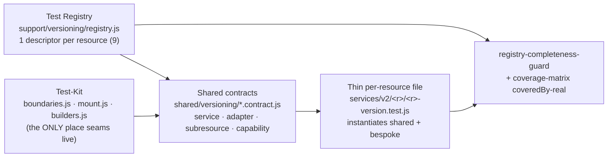

# Versioning (v6) — Testing Report & Architecture

> Snapshot: 2026-07-21 · branch `feat/versioning` · spec: `versioning-test-coverage`
> Companion docs: [`TESTING-VERSIONING.md`](./TESTING-VERSIONING.md) (the rule / quality bar) ·
> `TEST-ARCHITECTURE.md` (full architecture rationale, kept with the spec workspace)

---

## 1. Executive summary

| Metric | Value |
|---|---|
| Unit suite | **486 files · 4,556 tests · 0 failures** (baseline at spec start: 30 files failing) |
| Functional suite (real Chromium) | 9 files · **37 tests** |
| Contract suite | consumer **56** + drift engine **20+** unit tests; drift vs the real published spec: **stage 8/8 resources PASSED** |
| Mutation scores (Stryker) | `version-capability` **100%** · `version-actions` **100%** · `version-machine` **95.7%** · `version-adapter` **91.3%** (13 remaining survivors analyzed — all equivalent mutants) |
| Journey coverage matrix | 9 resources × 10 journeys: **48 covered · 39 partial · 0 missing · 3 n/a** — gate PASSED, now machine-verified |
| Sub-resources | **7/7** versioned sub-resource services with CRUD + version-isolation tests |
| Real defects found & fixed by the suite | fail-closed crash (`getAvailableActions('toString')`), double-submit (2 builds per double-click), `undefined`-in-arrays payload leak, 19 placebo tests, 1 order-dependent flaky (root-caused) |

**The core property**: the suite is **registry-driven, like the code it tests**. Plugging a
new versioned resource into the test architecture is **one descriptor + one thin file
(≤50 lines)** — and a completeness guard makes it impossible to skip.

---

## 2. The layers — what runs where

| Layer | Runner / env | Lives in | Command |
|---|---|---|---|
| **Unit** | Vitest 4, jsdom | `src/tests/**` | `yarn test:unit:headless` |
| **Functional** | Vitest **browser mode** — real Chromium via Playwright | `src/tests/functional/*.browser.test.js` | `yarn test:functional` |
| **Contract (consumer)** | Vitest | `src/tests/contracts/**` | part of the unit suite |
| **Contract (drift)** | Playwright `request` — **no browser, no token** | `tests/contracts/*.contract.spec.js` | `OPENAPI_SCHEMA_URL=… npx playwright test --project=contract-drift` |
| **Mutation** | StrykerJS + vitest-runner | `stryker.config.mjs` | `yarn test:mutation` |
| **Property-based** | fast-check (≥200 runs) inside the unit suite | `*.pbt.test.js` | with the unit suite |
| **Governance guards** | Vitest (source-reading tests) | `*-guard.test.js` | with the unit suite |
| **Journey matrix gate** | node script | `tests/coverage-matrix.json` | `yarn check:coverage-matrix` |

Why two runtimes: jsdom silently no-ops focus/layout/`<Teleport>` — the functional layer
runs in a **real browser** so keyboard, focus, teleported overlays and mobile viewports
are real. The unit layer stays on jsdom for speed (the CI unit job runs in
`node:22-alpine`, no Chromium — hence the **separate** `vitest.functional.config.js`).

---

## 3. The registry-driven architecture (how it works)



### 3.1 Test-Kit (`src/tests/support/versioning/`)

The canonical seams — **no test re-implements them**:

- `boundaries.js` — `spyHttpRequest()` (spy on `httpService.request` with respond helpers),
  `stubVersionQueryCache(service)` (queryClient stubs with real `queryFn` passthrough).
  Only **external** boundaries are ever mocked (HTTP, router, toast) — mocking versioning
  code under test is blocked by ESLint (`azion-architecture/no-versioning-module-mock`).
- `mount.js` — `provideVersionContext()`, `mountWithVersionContext()`, real command bus.
- `builders.js` — `buildVersionResponse(resourceKey, overrides)`: loads the canonical
  fixture (`tests/contracts/fixtures/*.version.json`), applies overrides and **validates
  the result against the resource's yup contract schema** — an invalid fixture throws at
  construction. One fixture source for unit, functional and contract layers.

### 3.2 Test Registry (`support/versioning/registry.js`)

One descriptor per resource, mirroring (and validated against) the production
registries. Divergences are **declared as data**, never as scattered if/else:

| Descriptor field | Declares |
|---|---|
| `capabilityClass` | `deployable` vs `versioned-only` (checked against `RESOURCE_CAPABILITY`) |
| `envelope` | `standard` vs `wrapped` (deployment) |
| `saveStrategy`, `updateVerb` | write semantics (default / workload / customPage / deployment) |
| `mapMetaFields`, `extraMutations` | workload meta + `rollback` |
| `configMarkers`, `payloadMarkers`, `metadataOnly` | per-resource assertion data for the shared suites |
| `subresources[]` | path/idKey/queryKeyGroup/buildPayload per versioned sub-resource |
| `draftCarriesSourceVersion`, `polymorphic` | adapter divergences |

### 3.3 Shared behavioral contracts (`src/tests/shared/versioning/*.contract.js`)

Inherited behavior tested **once**, parameterized by descriptor (`.contract.js` files are
not collected as tests — they export `describeX(descriptor)` functions):

- `version-service.contract.js` — the full lifecycle vs the HTTP boundary: reads
  (`fetchList`/`fetchOne`), mutations (create/update/delete/build/cancel), the
  archive comment guard, cache invalidation on every mutation, base bindings,
  services-http-only purity, `extraMutations` (rollback).
- `version-adapter.contract.js` — envelopes (bare array / `{results,count}` / `{data}` /
  null), `config` extraction (full via `configMarkers`, metadata-only, null-discard),
  root-level payloads + `stripUndefinedDeep`, `comment`/`source_version`, `mapMeta`.
- `subresource-crud.contract.js` — versioned sub-resource CRUD **scoped to
  `(resourceId, versionId)`**, drawer-compatible return shapes, and the isolation proof:
  a mutation on `(A, v1)` never invalidates `(A, v2)` or `(B, v1)`.
- `capability-surfaces.contract.js` — per class, across all 8 states and 3 surfaces
  (machine actions, bar buttons, row menu): versioned-only never exposes
  DEPLOY/PROMOTE/ROLLBACK.

The **thin per-resource file** instantiates the contracts and keeps only genuine
divergence as bespoke tests (e.g. deployment is fully bespoke — wrapped envelope,
double cache invalidation; connector keeps its HTTP/Storage/LiveIngest polymorphism).

### 3.4 Completeness is structural, not declared

- `registry-completeness-guard.test.js` — every `resource_type` in
  `RESOURCE_VERSION_ROUTES` must have a descriptor, valid fields, a class matching
  `RESOURCE_CAPABILITY`, and a thin instantiator file. **A new resource cannot ship
  untested — the suite goes red.**
- `check-coverage-matrix.mjs` (CI, `yarn check:coverage-matrix`) — beyond structural
  checks, the **coveredBy-real** check greps each cell's evidence files for the
  journey's actual command tokens: a cell claiming coverage whose file never mentions
  the behavior fails as a *stale coverage claim*.
- Other source guards: `no-version-shell-fork` (framework untouched by resources),
  `version-editor-remount-guard` (`:key="versionId"` present in all 8 editor views).

---

## 4. The anti-placebo mechanism (why green means something)

Every layer has a **machine-verifiable** honesty mechanism (see
[`TESTING-VERSIONING.md`](./TESTING-VERSIONING.md) for the full bar):

| Layer | Mechanism |
|---|---|
| Unit | **Stryker** (mutation — breaks the code on purpose; a surviving mutant = a test that would not notice) + **fast-check** (property-based, kills happy-path-only) + ESLint rules in `error`: no `.only/.skip`, no `wrapper.vm`/class-string asserts, no mocking versioning modules |
| Functional | real browser (no jsdom no-ops) + floor: every test drives a **real user action** and asserts an **observable consequence** |
| Contract | yup schema is the single source; every fixture must validate against it; drift validates the **published OpenAPI spec** |
| Matrix | coveredBy-real (evidence must mention the behavior) |

Proof it works: enabling the rules surfaced **19 real placebo tests** in the legacy
suite (all rewritten against real boundaries), and mutation testing exposed a whole
presentation module at 30.8% — now 100%.

---

## 5. Contract drift — validating against the published OpenAPI

The drift check compares **what the front depends on** (the yup schemas, derived from
the real adapters) against **what the API publishes** (the open OpenAPI YAML — no
token, no tenant):

- Prod spec: `https://api.azion.com/v4/openapi/openapi.yaml`
- Stage spec: `https://stage-api.azion.com/v4/openapi/openapi.yaml`
- Engine (`tests/contracts/openapi-drift-engine.js`): path discovery per resource,
  cyclic-safe `$ref` resolution, polymorphic (`oneOf`) property merge, envelope
  detection, field/type compatibility — 20+ unit tests against a local fixture.
- **Known, accepted divergences** live in `tests/contracts/known-drift.json` (each entry
  carries a reason + action for the API team); matching issues become report
  annotations, anything NEW fails.

First real run findings (reported to the API team via `known-drift.json`): the published
spec models version responses as the bare resource schema (the version envelope —
`state`, `meta`, timestamps — is undocumented), version request bodies are declared
stricter than the agreed contract, and **production does not publish the version
endpoints yet** (the pre-deploy check will keep saying so until it ships).

Where it runs: scheduled workflow (`versioning-contract-drift.yml`, weekdays 06:00 UTC)
and a **pre-deploy step** in `deploy-stage.yml` / `deploy-production.yml`
(`continue-on-error: true` until the team flips it to blocking — a one-line change).

---

## 6. CI map (pre-merge)

```
changes (paths-filter: versioning touched?)
├── run-tests            unit + coverage           node:22-alpine   (unchanged, required)
├── functional           browser suite, 2 shards   playwright image (reporting → required)
├── contract-consumer    src/tests/contracts        node:22-alpine   (reporting → required)
└── versioning-tests-gate  single status: success OR skipped
```

Scheduled: `versioning-contract-drift.yml` (drift) · `versioning-mutation.yml`
(Stryker, Mondays, reporting-only until the score gate is calibrated).

---

## 7. How to plug a new versioned resource (the recipe)

1. Add the canonical fixture: `tests/contracts/fixtures/<resource>.version.json`
   (validated by the fixture gate) and the yup schema in `tests/contracts/schemas/`.
2. Add the descriptor to `RESOURCE_TEST_REGISTRY` (`src/tests/support/versioning/registry.js`)
   — including `FORM_VALUES` in `builders.js` and any declared divergences.
3. Create the thin file `src/tests/services/v2/<r>/<r>-version.test.js`:

   ```js
   import { RESOURCE_TEST_REGISTRY } from '../../../support/versioning/registry'
   import { describeVersionServiceContract } from '../../../shared/versioning/version-service.contract'
   import { describeVersionAdapterContract } from '../../../shared/versioning/version-adapter.contract'

   const descriptor = RESOURCE_TEST_REGISTRY.myResource
   describeVersionServiceContract(descriptor)
   describeVersionAdapterContract(descriptor)
   describe('myResource — bespoke', () => {
     /* only genuinely unique behavior */
   })
   ```

4. Add the journey rows to `tests/coverage-matrix.json` (the coveredBy-real check keeps
   them honest) and, if deployable, the `RESOURCE_RESOLVERS` entry for the release tree.

Until you do steps 2–3, `registry-completeness-guard` keeps the suite **red** — that is
the point.

---

## 8. History of this effort (for context)

Built under the spec `versioning-test-coverage` (requirements → design → tasks →
execution in waves), on top of an explicit **anti-placebo requirement** and a
**ratchet** (cut point `27d1c9d`: legacy is grandfathered; the hard bar applies to the
active branches). The suite then went through a deep gap analysis (which found and fixed
two real product defects) and a full architecture migration (copy-paste per-resource
files → registry-driven shared contracts: **−2,652 lines deleted, +274 net new tests**,
mutation floors preserved throughout).
