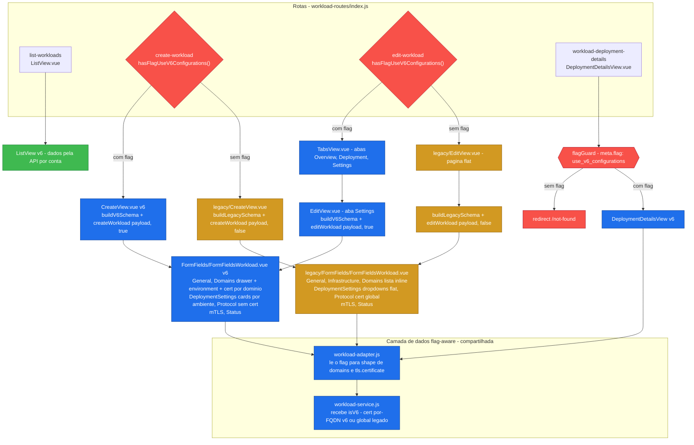

# Workload — Versionamento (`use_v6_configurations`)

Como a tela de Workload atende **dois tipos de conta** (com e sem versionamento), diferenciados pelo client flag
`use_v6_configurations` — lido via `hasFlagUseV6Configurations()` em `src/composables/user-flag.js`.

## Contexto

O formulário de Workload foi redesenhado por completo para o fluxo **v6** (versionado). Para que contas **sem** o
flag continuem com a experiência **legada**, o fluxo é bifurcado. A estratégia é **híbrida, por camada**, conforme o
tamanho da divergência:

- **Fork no router** onde a divergência é *estrutural* (Create, Edit e composição do formulário) — cada variante é um
  arquivo independente carregado por `import()` dinâmico no router.
- **Gating de rota** nas rotas/abas *exclusivas do v6*.
- **Flag-aware** na camada de dados onde a divergência é *localizada* (adapter de payload, estratégia de certificado).
- **Compartilhado** onde os dois fluxos são idênticos.

Os pontos de decisão são dois: **rota** (carregamento condicional do componente + gating de `deployment-details`) e
**dados** (adapter/service). Não há mais dispatcher de runtime no nível dos componentes.

## Diagrama do fork

**Legenda:** azul = v6 · laranja = legado · verde = compartilhado · vermelho = ponto de decisão por flag.

## Etapas do fork

1. **Rota** (`src/router/routes/workload-routes/index.js`)
   - `list` permanece compartilhada entre os dois tipos de conta.
   - `create-workload` e `edit-workload` definem `component: () => hasFlagUseV6Configurations() ? import(<v6>) : import(<legacy>)`,
     o mesmo padrão usado em `edge-application-routes` para `hasFlagBlockApiV4`. A flag é avaliada na navegação e
     o chunk correto é lazy-loaded — nenhum componente carregado contém branching.
   - `workload-deployment-details` é a única rota gated por `flagGuard` (`meta.flag: 'use_v6_configurations'`) → conta
     legada vai para `/not-found`.
   - `edit/:id/:tab?` continua com o mesmo nome de rota (`edit-workload`); o `:tab` é lido pelo `TabsView` (v6) e
     simplesmente ignorado pelo `legacy/EditView`.

2. **Create** — dois arquivos independentes
   - `src/views/Workload/CreateView.vue` (v6): `buildV6Schema()`, `initialValues` v6, `createWorkload(payload, true)`.
   - `src/views/Workload/legacy/CreateView.vue` (legado): `buildLegacySchema()`, `initialValues` legado,
     `createWorkload(payload, false)`.
   - Nenhum dos dois importa `user-flag.js`.

3. **Edit** — sem dispatcher de runtime
   - V6 carrega `TabsView.vue` (Overview / Deployment / Settings); a aba Settings monta `EditView.vue` com
     `buildV6Schema()` + `editWorkload(payload, true)`.
   - Legado carrega `legacy/EditView.vue` diretamente (página flat) com `buildLegacySchema()` +
     `editWorkload(payload, false)`.

4. **Composição** (`FormFields/FormFieldsWorkload.vue`) — duas variantes, sem seletor
   - `src/views/Workload/FormFields/FormFieldsWorkload.vue` (v6): General, Domains, DeploymentSettings, ProtocolSettings,
     MutualAuthentication, Status. **Não** monta `Infrastructure`.
   - `src/views/Workload/legacy/FormFields/FormFieldsWorkload.vue`: idem v6 + `Infrastructure`; importa
     `domains/deploymentSettings/protocolSettings` de `legacy/blocks/`. Os blocos `General`, `MutualAuthentication`,
     `Infrastructure` são reusados de `FormFields/blocks/` (compartilhados).
   - Nenhuma das duas tem `v-if`/`v-else` por flag — só uma das variantes é carregada pelo router por vez.

5. **Validação** (`Config/validation.js`)
   - Dois exports independentes: `buildV6Schema()` e `buildLegacySchema()`. Não há mais parâmetro `isV6`.
   - Os schemas internos (`baseSchema`, `v6Extras`, `legacyExtras`) seguem inalterados — só mudou a fronteira pública.

6. **Dados** (`services/v2/workload/`) — inalterado pela refatoração de rota
   - `workload-adapter.js` lê o flag diretamente para escolher o *shape* de `domains` e de `tls.certificate`.
   - `workload-service.js` recebe `isV6` por **parâmetro** (não importa o composable, por causa da regra ESLint
     `services-http-only`) e escolhe a estratégia de certificado: **por-FQDN** (v6) ou **global** (legado). As views v6
     passam `true` e as legadas passam `false`.
   - `fetch` / `list` / `deployment` / `cache` são idênticos e permanecem compartilhados.

## Mapa de arquivos

**Criados**
- `src/views/Workload/legacy/CreateView.vue`
- `src/views/Workload/legacy/EditView.vue`
- `src/views/Workload/legacy/FormFields/FormFieldsWorkload.vue`
- `src/views/Workload/legacy/blocks/{domainsBlock,deploymentSettingsBlock,protocolSettingsBlock}.vue`

**Modificados**
- `src/router/routes/workload-routes/index.js` (dispatch por flag em create/edit)
- `src/views/Workload/Config/validation.js` (`buildV6Schema` / `buildLegacySchema`)
- `src/views/Workload/FormFields/FormFieldsWorkload.vue` (agora v6-only)
- `src/views/Workload/CreateView.vue` (agora v6-only)
- `src/views/Workload/EditView.vue` (usa `buildV6Schema`)
- `src/services/v2/workload/workload-adapter.js`
- `src/services/v2/workload/workload-service.js`

**Removidos**
- `src/views/Workload/EditDispatcher.vue` (substituído pelo dispatch no router)

**Reutilizados / sem mudança**
- `TabsView.vue`, `DeploymentDetailsView.vue`, `Tabs/**`, drawers v6, blocos v6
- `FormFields/blocks/{generalBlock,mutualAuthenticationSettingsBlock,infrastructureBlock}.vue`
- `src/composables/user-flag.js`, `src/router/hooks/guards/flagGuard.js`

## Como verificar

Alternar `use_v6_configurations` em `client_flags` (fixture `cypress/fixtures/account/info/*` ou conta de teste):

- **Com flag:** ao navegar para `/workloads/create` ou `/workloads/edit/:id`, o router carrega o chunk v6
  (`CreateView.vue` / `TabsView.vue`); abas Overview/Deployment/Settings; certificado por domínio; sem bloco
  Infrastructure; `/workloads/edit/:id/deployment/:versionId` carrega.
- **Sem flag:** o router carrega o chunk legado (`legacy/CreateView.vue` / `legacy/EditView.vue`); bloco Infrastructure
  presente; dropdown de certificado global no Protocol; dropdowns flat de deployment; edição em página única sem abas;
  `/workloads/edit/:id/deployment/:versionId` → `/not-found`. Observação: rotas como `/workloads/edit/:id/overview`
  permanecem renderizando a página legada (o `:tab` é silenciosamente ignorado).
