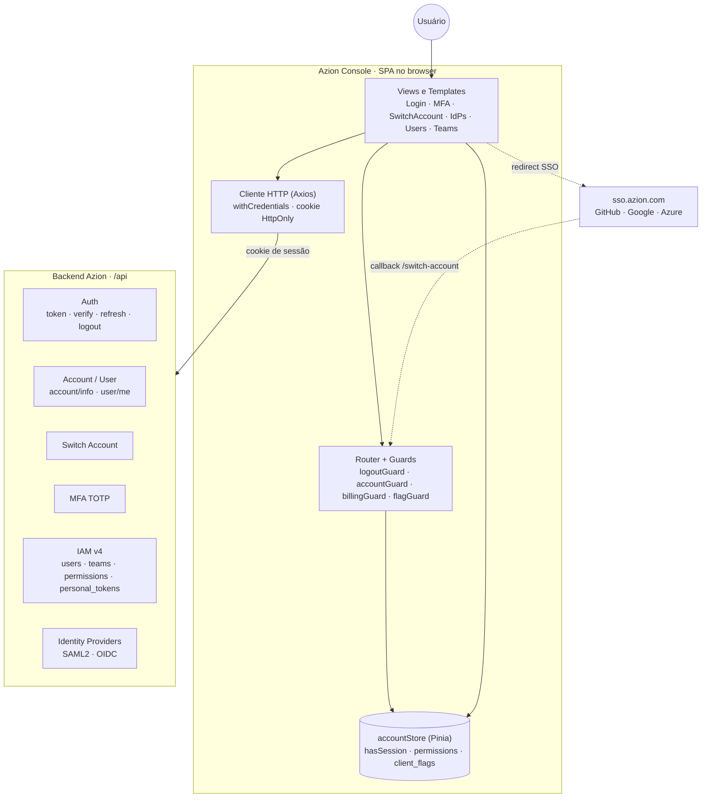
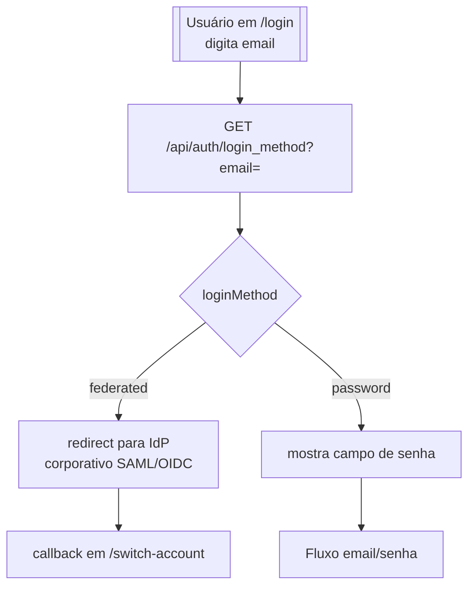
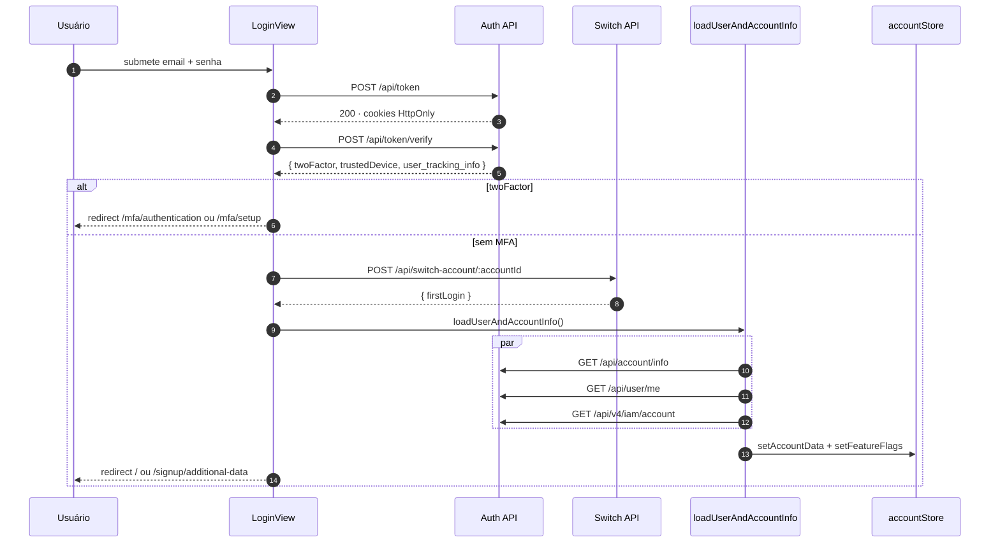
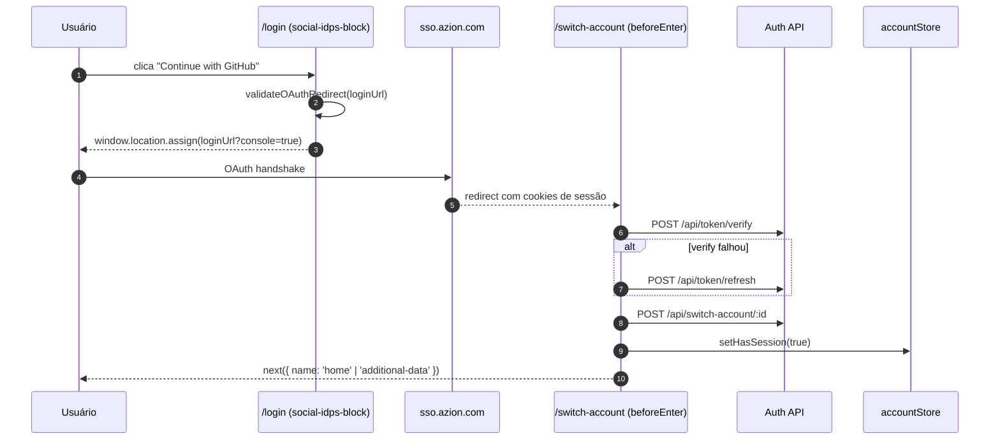
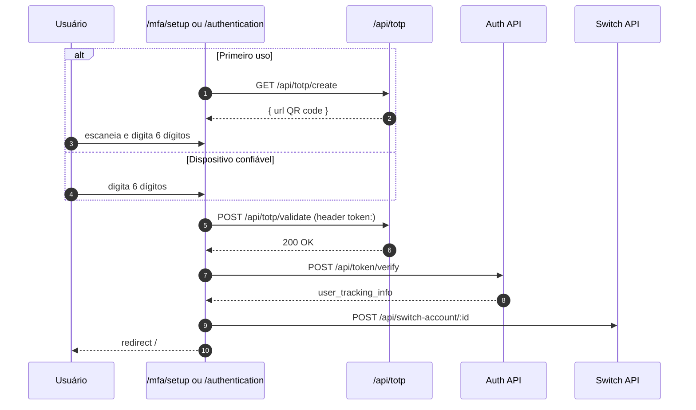
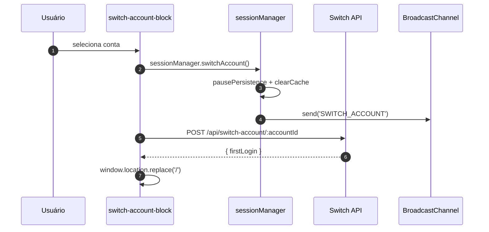
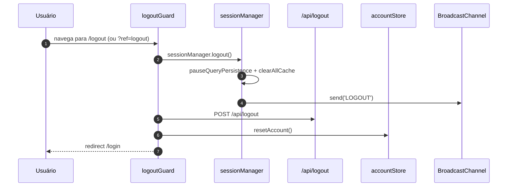
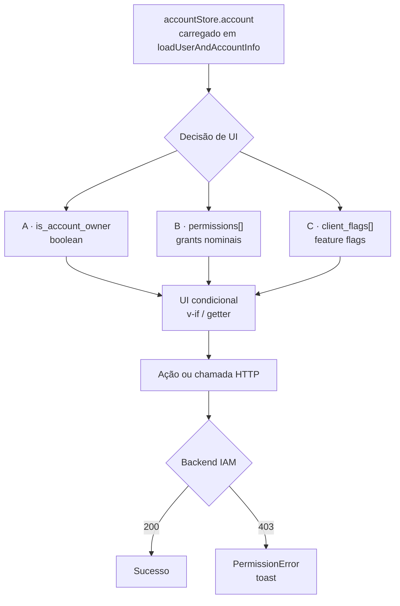
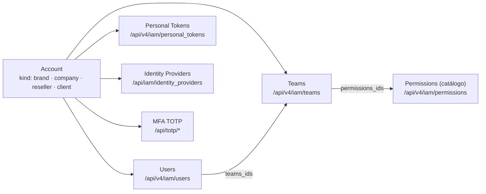

# Autenticação e Autorização no Azion Console

Referência completa sobre como o `azion-console-kit` consome IAM e SSO da Azion.
Fonte primária: código-fonte em `src/`.

## Sumário

- [TL;DR](#tldr)
- [1. Arquitetura](#1-arquitetura)
- [2. Modelo de sessão](#2-modelo-de-sessão)
- [3. Fluxos de autenticação](#3-fluxos-de-autenticação)
  - [3.1 Entrada: detecção do método de login](#31-entrada-detecção-do-método-de-login)
  - [3.2 Login com senha](#32-login-com-senha)
  - [3.3 SSO social (GitHub / Google / Azure)](#33-sso-social-github--google--azure)
  - [3.4 SSO corporativo (SAML2 / OIDC)](#34-sso-corporativo-saml2--oidc)
  - [3.5 MFA (TOTP)](#35-mfa-totp)
  - [3.6 Switch account](#36-switch-account)
  - [3.7 Logout](#37-logout)
- [4. Autorização](#4-autorização)
  - [4.1 As três camadas](#41-as-três-camadas)
  - [4.2 Guards de rota](#42-guards-de-rota)
  - [4.3 Hierarquia de contas](#43-hierarquia-de-contas)
- [5. IAM — recursos gerenciáveis](#5-iam--recursos-gerenciáveis)
- [6. Referência](#6-referência)
  - [6.1 Endpoints consolidados](#61-endpoints-consolidados)
  - [6.2 Mapa de arquivos](#62-mapa-de-arquivos)
  - [6.3 Variáveis de ambiente](#63-variáveis-de-ambiente)
  - [6.4 Tratamento de erros](#64-tratamento-de-erros)

---

## TL;DR

- Sessão é **cookie HttpOnly** emitido pelo backend; o front nunca vê o token.
- Todas as chamadas saem de `/api` com `withCredentials: true`.
- O front só guarda um flag `hasSession` em `localStorage` (via Pinia persist).
- A **autorização é 100% backend**: o front apenas esconde UI por `client_flags[]` e confia em `403` para barrar ações.
- **Único guard de rota por flag**: `/identity-providers` exige `federated_auth`. Todas as demais rotas IAM são liberadas e dependem do backend.
- Dois provedores de SSO: **social** (sso.azion.com para GitHub/Google/Azure) e **corporativo** (SAML2/OIDC configurado pelo cliente).

---

## 1. Arquitetura

Três atores apenas: o browser (onde a SPA roda inteira), o backend Azion em `/api` e o domínio externo `sso.azion.com`.



---

## 2. Modelo de sessão

| Item | Como funciona |
|---|---|
| **Autenticação** | Cookie HttpOnly emitido por `POST /api/token`. Validade gerenciada pelo backend. |
| **Refresh** | `POST /api/token/refresh` é chamado após falha em `verify`. Não há refresh automático por timer. |
| **Verificação** | `POST /api/token/verify` em pontos críticos (login, MFA, callback SSO). |
| **Estado no front** | `accountStore` (Pinia) com `hasSession`, `account`, `identifySignUpProvider`. |
| **Persistência** | Apenas `hasSession` e `identifySignUpProvider` persistidos no `localStorage`. |
| **Multi-tab** | `BroadcastChannel('session-sync')` propaga eventos `LOGOUT` e `SWITCH_ACCOUNT` entre abas. |
| **Rota alvo antes do login** | Salvo em `localStorage.redirectRoute` (base64, TTL 60min) e restaurado pelo `redirectGuard` após autenticar. |

---

## 3. Fluxos de autenticação

### 3.1 Entrada: detecção do método de login

O usuário sempre começa em `/login`, digita o email e o front decide a rota:



### 3.2 Login com senha



### 3.3 SSO social (GitHub / Google / Azure)

Os IdPs sociais são listados estaticamente em `src/helpers/social-idps.js` usando UUIDs vindos de `VITE_SSO_GITHUB`, `VITE_SSO_GOOGLE`, `VITE_SSO_AZURE`.



Observação: MFA é pulada no fluxo social (`EnableSocialLogin = true` em `switchAccountFromSocialIdp`).

### 3.4 SSO corporativo (SAML2 / OIDC)

Acionado quando `login_method` retorna `federated`. O front redireciona para o `loginUrl` do IdP configurado pelo cliente e o callback cai no mesmo `/switch-account` do fluxo social.

O **CRUD de Identity Providers** (`/identity-providers`) é protegido pelo guard `checkSSOAccess`, que exige `client_flag = federated_auth`. Endpoints:

- `GET /api/iam/identity_providers`
- `POST /api/iam/identity_providers/saml2` · `PATCH` · `DELETE`
- `POST /api/iam/identity_providers/oidc` · `PATCH` · `DELETE`

### 3.5 MFA (TOTP)



### 3.6 Switch account

O usuário pode alternar entre contas que possui acesso. A troca força reload total para invalidar cache e re-bootstrap do estado.



### 3.7 Logout



---

## 4. Autorização

### 4.1 As três camadas

Não há RBAC unificado. A UI decide o que mostrar combinando três sinais. A decisão final sempre pertence ao backend.



**Camada A — `is_account_owner`**
Booleano vindo de `GET /api/user/me`. Usos diretos no front:
- Getter `hasPermissionToEditDataStream` (owner OU grant nominal)
- Checkbox "is_account_owner" em criar/editar usuário

**Camada B — `permissions[]`**
Array de grants nomeados em `account.permissions`. **Só dois grants são avaliados localmente:**
- `View Data Stream`
- `Edit Data Stream`

O catálogo completo (`GET /api/v4/iam/permissions`) é usado apenas no formulário de Team Permissions, não no resto da UI.

**Camada C — `client_flags[]`**
Principal gatekeeper de navegação. Ativadas por conta no backend.

| Constante no store | Backend string | Efeito |
|---|---|---|
| `FULL_CONSOLE_ACCESS` | `allow_console` | Flag mestre de acesso ao console |
| `RESTRICT_ACCESS_TO_METRICS_ONLY` | `allow_only_metrics_on_console` | Restringe console a métricas |
| `SSO_MANAGEMENT` | `federated_auth` | Libera `/identity-providers` |
| `DATA_STREAM_SAMPLING` | `data_streaming_sampling` | Amostragem em Data Stream |
| `MARKETPLACE_PRODUCTS` | `marketplace_products` | Seção Marketplace Products no menu |
| `HIDE_CREATE_OPTIONS` | `hide_create_options` | Esconde botões de criar |
| `FORCE_REDIRECT_TO_CONSOLE` | `force_redirect_to_console` | Oculta banner do painel clássico |
| `ENABLE_WAF_TUNING` | `enable_waf_tuning_details_save` | Libera WAF tuning |
| — | `block_apiv4_incompatible_endpoints` | Controla menu/itens API v3 vs v4 (via `user-flag.js`) |

### 4.2 Guards de rota

Arquivo: `src/router/hooks/beforeEachRoute.js`. Cada guard pode cortar a navegação.

```
logoutGuard → themeGuard → accountGuard → cliGuard → billingGuard → redirectGuard → flagGuard
```

| Guard | Responsabilidade |
|---|---|
| `logoutGuard` | `/logout` ou `?ref=logout` → logout completo → `/login`. |
| `themeGuard` | Aplica tema do `localStorage`. |
| `accountGuard` | **Core da auth.** Não logado em rota privada: sem `hasSession` → `/login` (com rota alvo salva). Com `hasSession` → `loadUserAndAccountInfo()`; falha → logout. |
| `cliGuard` | Setup de callback CLI (`/login?next=cli&callback_port=`). |
| `billingGuard` | Bloqueia `/billing` se `billingAccessPermitted === false`. Status `BLOCKED`/`DEFAULTING` força redirect para `/billing/bills?paymentSession=true`. |
| `redirectGuard` | Em `/`, restaura rota alvo e trata CLI redirect. |
| `flagGuard` | Roteamento condicional por `hasFlagBlockApiV4()` vs `meta.flag`. |

**Rotas públicas** (`meta.isPublic: true`): `/login`, `/signup`, `/signup/additional-data`, `/switch-account`, `/mfa/*`, `/password/new/*`, `/cli-callback`.

**Único guard por permissão**: `checkSSOAccess` em `/identity-providers`. As demais rotas IAM (`/users`, `/teams-permission`, `/personal-tokens`, `/mfa-management`, `/credentials`, `/reseller|group|client/management`) não têm guard — o backend barra via 403.

### 4.3 Hierarquia de contas

O campo `account.kind` define qual tela de administração aparece no menu de perfil:

```
brand  →  reseller  →  group (company)  →  client
```

| `kind` | Menu extra |
|---|---|
| `brand` | Resellers Management (`/reseller/management`) |
| `company` | Groups Management (`/group/management`) |
| `reseller` | Clients Management (`/client/management`) |
| `client` | Activity History |

---

## 5. IAM — recursos gerenciáveis

Todos os CRUDs administrativos do console operam sobre a API IAM v4.



- **Teams** agrupam `permissions_ids` do catálogo. Usuários herdam grants via `teams_ids`.
- **Personal Tokens** são usados por CLI e integrações externas. O escopo é resolvido no backend.
- **Identity Providers** permitem login federado; cada IdP tem um `protocol` (`saml2` ou `oidc`).

---

## 6. Referência

### 6.1 Endpoints consolidados

| Categoria | Método · Path | Finalidade |
|---|---|---|
| Auth | `POST /api/token` | login com senha |
| Auth | `POST /api/token/verify` | valida sessão, retorna 2FA info |
| Auth | `POST /api/token/refresh` | renova cookie |
| Auth | `POST /api/logout` | logout |
| Auth | `GET /api/auth/login_method?email=` | detecta SSO federado |
| Switch | `POST /api/switch-account/:id` | fixa conta ativa |
| Switch | `GET /api/switch-account?account_type=` | lista contas |
| Password | `POST /api/password/new` | reset |
| Password | `POST /api/v4/iam/user/password` | set |
| Password | `POST /api/v4/iam/user/password/request` | email de reset |
| MFA | `GET /api/totp/create` | gera QR |
| MFA | `POST /api/totp/validate` | valida 6 dígitos |
| Account | `GET /api/account/info` | conta |
| Account | `GET /api/user/me` | usuário |
| Account | `GET /api/v4/iam/account` | job role |
| IAM user | `GET · PATCH /api/v4/iam/user` | próprio perfil |
| IAM users | `GET · POST /api/v4/iam/users` | listar/criar |
| IAM users | `PATCH · DELETE /api/v4/iam/users/:id` | editar/remover |
| IAM teams | `GET · POST /api/v4/iam/teams` | listar/criar |
| IAM teams | `GET · PUT · DELETE /api/v4/iam/teams/:id` | CRUD |
| IAM perms | `GET /api/v4/iam/permissions` | catálogo de grants |
| IAM tokens | `GET · POST · DELETE /api/v4/iam/personal_tokens` | CRUD |
| IdP SAML | `POST · PATCH · DELETE /api/iam/identity_providers/saml2[/:id]` | CRUD |
| IdP OIDC | `POST · PATCH · DELETE /api/iam/identity_providers/oidc[/:id]` | CRUD |
| IdP | `GET /api/iam/identity_providers` | lista |
| SSO social | `https://sso.azion.com/api/sp/social/:uuid/login` | OAuth externo |
| Signup | `POST /api/v3/signup` | cadastro |

### 6.2 Mapa de arquivos

**Autenticação e sessão**
- `src/services/auth-services/` — login, logout, refresh, verify, switch, password
- `src/services/v2/base/auth/sessionManager.js` — cache, prefetch, logout, switch
- `src/services/v2/base/auth/session-broadcast.js` — sync multi-tab
- `src/router/hooks/beforeEachRoute.js` e `src/router/hooks/guards/*.js`
- `src/helpers/account-data.js` — bootstrap pós-login
- `src/helpers/account-handler.js` — orquestra switch-account
- `src/helpers/login-redirect-manager.js` — restaura rota alvo
- `src/helpers/oauth-security.js` — hardening OAuth
- `src/helpers/social-idps.js` — config dos IdPs sociais

**Autorização**
- `src/stores/account.js` — store central (getters por flag/permissão)
- `src/composables/user-flag.js` — flags voláteis em memória
- `src/router/routes/identity-providers-routes/index.js` — único guard por flag

**IAM**
- `src/services/v2/users/users-service.js`
- `src/services/v2/teams/teams-service.js`
- `src/services/v2/team-permission/team-permission-service.js`
- `src/services/v2/personal-token/personal-token-service.js`
- `src/services/v2/account/*`
- `src/services/identity-providers-services/*`
- Versões legacy: `src/services/users-services/*`, `src/services/team-permission/*`, `src/services/personal-tokens-services/*`, `src/services/account-services/*`

**MFA**
- `src/services/mfa-services/*` (legacy) e `src/services/v2/mfa/*`
- `src/templates/mfa-setup-block`, `src/templates/mfa-authenticate-block`
- `src/views/MultifactorAuthentication/*`, `src/views/MFAManagement/*`

**UI de autenticação e perfil**
- `src/templates/sign-in-block/index.vue`
- `src/templates/social-idps-block/index.vue`
- `src/templates/switch-account-block/index.vue`
- `src/layout/components/menu-profile/index.vue`
- `src/layout/components/menu-production/index.vue` — sidebar filtrada por `client_flag`
- `src/services/sidebar-menus-services/menus.js`

### 6.3 Variáveis de ambiente

| Variável | Finalidade |
|---|---|
| `VITE_SSO_GITHUB` | UUID IdP social GitHub |
| `VITE_SSO_GOOGLE` | UUID IdP social Google |
| `VITE_SSO_AZURE` | UUID IdP social Azure |
| `VITE_SSO_IDP_SCIM_E2E` | UUID IdP E2E (SCIM) |
| `VITE_ENVIRONMENT` | Alterna `sso.azion.com` vs `stage-sso.azion.com` |
| `VITE_PERSONAL_TOKEN` | **Só dev** — injeta `Authorization: token <pt>` |
| `VITE_DEBUG_LOGIN` | **Só dev** — pula logout e força `hasSession=true` |

### 6.4 Tratamento de erros

| Caso | Comportamento |
|---|---|
| `401` | `InvalidApiTokenError`. Sem redirect automático; o `accountGuard` detecta na próxima navegação e força logout. |
| `403` | `PermissionError` — "You do not have permission to do this action.". Exibido via toast. |
| Sessão expirada entre abas | Broadcast `LOGOUT` força limpeza em todas as abas. |
| Rota alvo após login | `localStorage.redirectRoute` (base64, TTL 60min) restaurada pelo `redirectGuard`. |
| Dois clientes HTTP coexistem | Legacy (`AxiosHttpClientAdapter`) e v2 (`HttpService` + TanStack Query). Migração em andamento. |
