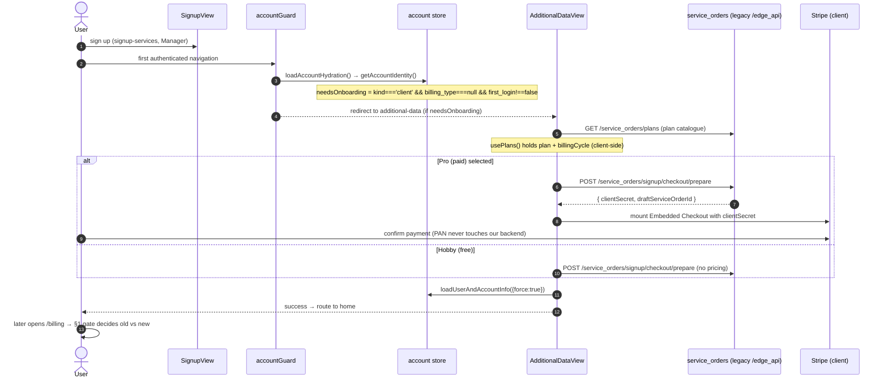

# Billing & onboarding flow — console-kit

**Branch:** `feat/plans-experience` · **Issue family:** ENG-46458 (billing-api v4) / ENG-37160 (plans experience).
Companion docs: [`billing-api-v4-ready-surface.md`](billing-api-v4-ready-surface.md) (what the API actually serves), [`billing-api-v4-coverage-matrix.md`](billing-api-v4-coverage-matrix.md), [`billing-api-v4-contract-gap-analysis.md`](billing-api-v4-contract-gap-analysis.md).

This is **our** end-to-end description of how a user goes from signup to the billing screen, which of the two billing experiences renders and why, exactly which network surface each step hits (legacy vs billing-api v4), and **how to test each piece** (stage curls + the console flag).

---

## 0. TL;DR

- The onboarding→billing flow that ships today runs **entirely on the legacy Manager surface** (`/edge_api/v4/service_orders/**`) plus **client-side Stripe**. It does **not** call billing-api v4. Paid signup works because it never touches the 501 `POST /v4/account/subscriptions`.
- There are **two billing screens**, chosen by one gate (`billingExperience`, ultimately driven by the account `billing_type`, overridable via env for testing):
  - **Old / legacy** billing (`billing_type` = `custom` | `internal`).
  - **New / plans** billing (`billing_type` = `plan`, the default).
  - `billing_type` = `null` → the user is sent to **onboarding** (`additional-data`).
- billing-api v4 exposes only **23 READY ops**; the rest are 501 stubs. **The console integrates only against READY ops.** See §4.
- Everything here is testable: §6 has copy-paste stage curls, plus how to flip the console between experiences.

---

## 1. The gate — which billing experience renders

### 1.1 Resolution chain (`billing_type` → experience)

`billing_type` comes from `GET /api/account/info` (Manager) and is normalized in [`src/services/v2/account/account-service.js`](../src/services/v2/account/account-service.js) by `resolveBillingType`:

```
VITE_BILLING_TYPE_OVERRIDE (env)            ─┐  first non-empty wins
localStorage "billing_type_override"        ─┤  ("null" string ⇒ real null)
response.billing_type (real, from the API)  ─┘
```

The store getter [`billingExperience`](../src/stores/account.js) then maps it:

| `billing_type` | `billingExperience` | Screen |
|---|---|---|
| `custom` | `custom` | **Old** (`legacy/LegacyBillingScreen.vue`) |
| `internal` | `internal` | **Old** (`legacy/LegacyBillingScreen.vue`) |
| `plan` (or anything else) | `plan` | **New** (`TabsView.vue`, plans) |
| `null` | `null` | redirect → `additional-data` (onboarding) |

The switch lives in [`src/views/Billing/index.vue`](../src/views/Billing/index.vue):

```
custom | internal  → <LegacyBillingScreen>
null               → router.replace({ name: 'additional-data' })
else (plan)        → <TabsView>
```

### 1.2 The flag (already exists) — use it to test/switch

`VITE_BILLING_TYPE_OVERRIDE` in `.env` forces the experience regardless of the real account (it is a **local/dev override**, `.env` is git-ignored):

```
VITE_BILLING_TYPE_OVERRIDE=internal   # force OLD billing
VITE_BILLING_TYPE_OVERRIDE=plan       # force NEW (plans) billing
VITE_BILLING_TYPE_OVERRIDE=null       # force onboarding redirect
# (unset / empty)                     # use the account's real billing_type
```

Runtime alternative (no rebuild): set `localStorage.billing_type_override` in devtools to `internal` / `plan` / `null`.

> The per-account-type routing (which real accounts get old vs new) is a **product decision still open**; for now the env/localStorage override is the switch.

---

## 2. Onboarding → billing (new user)

**All legacy + client-side Stripe. No billing-api v4 dependency. No 501 dependency.**



### Step detail (files)

1. **Signup** — [`SignupView.vue`](../src/views/Signup/SignupView.vue) via `@/services/signup-services` (Manager). No billing-api.
2. **Post-login gate** — [`accountGuard.js`](../src/router/hooks/guards/accountGuard.js): awaits `loadAccountHydration()`, reads `needsOnboarding`, redirects to `additional-data`, warms plans (`ensurePlansList()`).
3. **`needsOnboarding`** — [`account.js`](../src/stores/account.js) = `kind==='client' && billing_type===null && first_login!==false`. Fields from Manager `GET /api/account/info`.
4. **Plan catalogue** — [`AdditionalDataView.vue`](../src/views/Signup/AdditionalDataView.vue) → `usePlansService` → `serviceOrdersService.listPlansService()` → `GET /edge_api/v4/service_orders/plans`. **Legacy Manager catalogue** (unrelated to billing-api's 501 subscriptions list).
5. **Pro pre-checkout** — debounced `prepareProCheckout` → `preparePaidSignupCheckout` → `serviceOrdersService.prepareSignupCheckout` → **`POST /edge_api/v4/service_orders/signup/checkout/prepare`** → Stripe `clientSecret` + draft SO id. **This is the paid-signup workhorse — NOT `POST /v4/account/subscriptions`.**
6. **Submit (hobby/pro)** — same legacy prepare; pro reuses the clientSecret and mounts Stripe.
7. **Payment confirmation** — client-side `stripe.confirmCheckoutSession()` (`payment-method-block.vue` + `get-stripe-client-service`). No billing-api call.
8. **Success** — post-payment flag, cache invalidation, `loadUserAndAccountInfo({force:true})`, route to **home** (not directly to `/billing`).
9. **Later `/billing` visit** — the §1 gate picks old vs new.

---

## 3. The billing screen(s)

Route: [`src/router/routes/billing-routes/index.js`](../src/router/routes/billing-routes/index.js) → `BillingLayout.vue` → child `billing-tabs` (`:tab?`) → `index.vue` (the §1 gate).

### 3.1 New (plans) — `billing_type = plan`
[`TabsView.vue`](../src/views/Billing/TabsView.vue) → the plans `BillsView.vue`: SubscriptionPlanCard, upgrade/downgrade (`DialogDowngradePlan`, `DialogCancelDowngrade`), `DrawerPlanInfo`, `DialogChangePaymentMethod`, `DowngradePendingBanner`. **The plans rewrite gutted the tab shell here** — it is currently tab-less.

### 3.2 Old (legacy) — `billing_type = custom | internal`
[`legacy/LegacyBillingScreen.vue`](../src/views/Billing/legacy/LegacyBillingScreen.vue) → `legacy/BillsView.vue` (the two-card layout). This is what regular accounts saw historically, minus the tabs.

### 3.3 What the plans rewrite removed (to restore for "old billing with tabs")
Recoverable from `origin/dev`:
- `src/views/Billing/PaymentListView.vue` (−241) — the **Payment Methods tab** (saved-cards table, set-default, delete, +credit/+payment).
- `src/views/Billing/Drawer/DrawerPaymentMethod.vue` (−60) — the **add-card drawer**.
- `TabsView.vue` tab shell (`TabView`/`TabPanel`, `TABS_MAP`, routing) — gutted 206→108.
- `helpers/account-data.js` `loadBillingData` (credit + trial expiration), the `TRIAL` banner in `notification-payment.vue`, and plumbing in `BillingLayout.vue`.

> **Decision recorded:** keep BOTH experiences, selected by the flag; the OLD experience must behave like `main` (tabbed, with the Payment Methods tab). Restoration is Track B (see §7).

---

## 4. billing-api v4 — what the console MAY call (READY) + divergences

Base (stage): `https://billing-api-stage.azion.app` · Prod: `https://api.azion.com`. Full detail in [`billing-api-v4-ready-surface.md`](billing-api-v4-ready-surface.md).

### READY (safe to integrate)
| Area | Ops | Key notes |
|---|---|---|
| **Plan change** | `POST /v4/account/subscriptions/{id}/change/preview` · `/change` · `GET/DELETE .../scheduled_changes[/{scid}]` | **`{id}` = service_order UUID**. preview **responds 200** (contract says 202). change 202, `pending_transition` only on scheduled (downgrade / annual→monthly). delete **204** (unknown→404). `free→paid` rejected here (that's signup). |
| **Payment methods** | list · setup_session · get · delete · set-default | list is a **raw array** (no v4 envelope, may send `X-Stale:true`). setup_session ignores `type` (always card). delete **204** (409 if default/in-use). set-default 202, body `{}`. |
| **Payments** | `GET /v4/account/payments` · `/{id}` | v4 envelope; `{id}` detail has `attempts[]` (dunning). read-only. |
| **Credits** | `GET /v4/account/billing/balance` · `/credits` | read-only; credits only `page`+`page_size`. Grant is server-to-server only. |
| **Billing accounts** | list · create · current · get · patch · cost_breakdown | create body `{currency,country,account_type,tax_id,legal_entity_name}` — **`owner_account_id` from the token, not the body**; 409 if exists. current **404** if none → offer create. patch only `tax_id`+`legal_entity_name`. `{id}` = resource id (not IAM id). cost_breakdown `?period=YYYY-MM` (invalid→400). |

### Real-contract corrections vs our earlier DRAFT-based layers
- `ScheduledChange.id` / `subscription_id` / `change.plan_id` are **UUID strings** (not int64).
- `Subscription` (real) has **no `service_order_id`** field (the DRAFT had it). Required: id, created_at, last_modified, last_editor, status, cancel_at_period_end.
- `PaymentSetupSession` response = `{ setup_session_id, client_secret, gateway }` inside `{ data: ... }`.
- Money is integer **cents** everywhere.

### NOT READY (501) — do not integrate
`POST /v4/account/subscriptions` (**the paid-signup blocker**), subscriptions list/current/get/versions/cancel, invoices (all), payments refunds, service_orders (all 9), commitments/credit_limits/members, spend_alerts/spend_limits, webhook endpoints.

---

## 5. The paid-signup blocker (be explicit)

Paid signup end-to-end via billing-api v4 is blocked at the **API**, not the console: `POST /v4/account/subscriptions` is 501. Ready pieces of signup: payer pre-registration (`POST /v4/billing_accounts`) and card capture (`POST /v4/account/payments/payment_setup_sessions`). The step that *creates the subscription and returns the first-payment `client_secret`* does not exist yet.

**Handling:** keep signup on the legacy `POST /service_orders/signup/checkout/prepare` path (it works). Do **not** wire the console's `subscriptionsService.createSubscription` to anything until the op turns READY.

> ⚠️ Backend proxy risk: if the legacy `signup/checkout/prepare` is ever re-pointed server-side at the 501 v4 create, paid signup breaks with **no console change**. Confirm with the billing-api team before assuming stability.

---

## 6. Testing

> **You need a STAGE token to hit the API.** The API probes below require a bearer token for stage — **request one** from the billing-api / platform team, or generate a **Personal Token on the stage console** (Account → Personal Tokens) for a stage account, then `export AZION_STAGE_TOKEN=…`. Never commit or log it.
>
> **Testing the console-implemented pieces (Tracks A/B) is deferred until we have that token** and the code lands. The console-experience checks in §6.1 need **no** token and can be done now.

### 6.1 Test the console experiences (no API needed)
Flip the flag and open `/billing`:

| `.env` | Expect at `/billing` |
|---|---|
| `VITE_BILLING_TYPE_OVERRIDE=internal` | OLD billing screen |
| `VITE_BILLING_TYPE_OVERRIDE=plan` | NEW (plans) billing screen |
| `VITE_BILLING_TYPE_OVERRIDE=null` | redirect to `additional-data` (onboarding) |

Or at runtime in devtools: `localStorage.setItem('billing_type_override','internal')` then reload.

### 6.2 Test the READY API against stage (curl)
Base and auth (never commit the token):
```bash
export BASE="https://billing-api-stage.azion.app"
export H_AUTH="Authorization: Bearer $AZION_STAGE_TOKEN"
export H_JSON="Content-Type: application/json"
```

**Auth / payer discovery**
```bash
curl -sS "$BASE/v4/billing_accounts/current" -H "$H_AUTH" | jq   # 200 payer, or 404 → create (step 1)
```

**Contract (paid signup)**
```bash
# 1) Create the payer — READY (owner_account_id comes from the token)
curl -sS -X POST "$BASE/v4/billing_accounts" -H "$H_AUTH" -H "$H_JSON" -d '{
  "currency":"USD","country":"US","account_type":"self_serve",
  "tax_id":"12-3456789","legal_entity_name":"Acme Inc" }' | jq   # 201 | 409 if exists

# 2) Capture a card (setup session) — READY (type ignored; always card)
curl -sS -X POST "$BASE/v4/account/payments/payment_setup_sessions" -H "$H_AUTH" -H "$H_JSON" \
  -d '{"type":"card"}' | jq
# 201 { data: { setup_session_id, client_secret: "seti_...", gateway: "stripe" } }
# client_secret → front mounts Stripe Embedded Checkout; the card never hits the service.

# 3) Create the subscription — 🔴 501 (blocks paid signup end-to-end)
curl -sS -X POST "$BASE/v4/account/subscriptions" -H "$H_AUTH" -H "$H_JSON" \
  -d '{"plan_id":"<PLAN_UUID>","period":"monthly"}' | jq   # 501 today
```

**Plan change (READY)** — `{id}` is the **service_order UUID**
```bash
export SO_ID="<service_order_uuid>"; export PLAN_ID="<plan_uuid>"
curl -sS -X POST "$BASE/v4/account/subscriptions/$SO_ID/change/preview" -H "$H_AUTH" -H "$H_JSON" \
  -d '{"plan_id":"'"$PLAN_ID"'","period":"monthly"}' | jq   # 200 (contract says 202)
curl -sS -X POST "$BASE/v4/account/subscriptions/$SO_ID/change" -H "$H_AUTH" -H "$H_JSON" \
  -d '{"plan_id":"'"$PLAN_ID"'","period":"monthly","proration_behavior":"create_prorations"}' | jq  # 202
curl -sS "$BASE/v4/account/subscriptions/$SO_ID/scheduled_changes" -H "$H_AUTH" | jq
curl -sS -X DELETE "$BASE/v4/account/subscriptions/$SO_ID/scheduled_changes/<SC_ID>" -H "$H_AUTH" -i   # 204 | 404
```

**Wallet (READY)**
```bash
curl -sS "$BASE/v4/account/payments/payment_methods" -H "$H_AUTH" | jq   # RAW ARRAY (D1); may send X-Stale:true
curl -sS "$BASE/v4/account/payments/payment_methods/<PM_REF>" -H "$H_AUTH" | jq
curl -sS -X POST "$BASE/v4/account/payments/payment_methods/<PM_REF>/default" -H "$H_AUTH" -H "$H_JSON" -d '{}' | jq  # 202
curl -sS -X DELETE "$BASE/v4/account/payments/payment_methods/<PM_REF>" -H "$H_AUTH" -i   # 204 | 409
```

**Payments / credits / cost (READY, read-only)**
```bash
curl -sS "$BASE/v4/account/payments" -H "$H_AUTH" | jq
curl -sS "$BASE/v4/account/payments/<payment_id>" -H "$H_AUTH" | jq
curl -sS "$BASE/v4/account/billing/balance" -H "$H_AUTH" | jq
curl -sS "$BASE/v4/account/billing/credits?page=1&page_size=20" -H "$H_AUTH" | jq
curl -sS "$BASE/v4/billing_accounts/<BA_ID>/cost_breakdown?period=2026-07" -H "$H_AUTH" | jq
```

> Internal (`POST /internal/v1/credits`, `x-internal-secret`) is server-to-server; the console never calls it. Never log or commit the secret.

---

## 7. Next execution (from the decisions taken)

- **Track A — prune duplicates:** delete `service-orders-v4/` + `invoices/` (100% 501; `invoices/` name-collides with the live billing invoices service); trim `subscriptions/` to the 5 READY ops (change/preview/scheduled); trim `payments/`/`credits/`/`billing-accounts/` to READY; re-align kept adapters to the **real** contract (§4 corrections); prune dead `queryKeys`.
- **Track B — old/new billing behind the flag:** keep the `billingExperience` gate; make the OLD experience faithful to `main` (restore the Payment Methods tab + add-card drawer + tab shell + `loadBillingData` + TRIAL banner from `origin/dev`); keep the NEW plans screen as-is.
- **Track C — READY cutovers:** deferred. Layers stay ready-but-unwired; wire per-flow behind the flag later.
