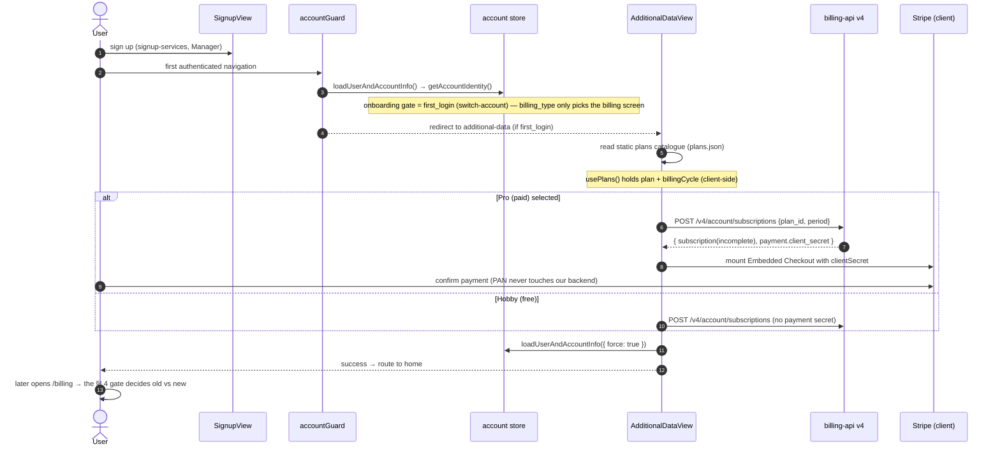

# Billing — Single Spec (console-kit)

> **Fresh session? Start here.** This is the **narrative** billing/plans/subscription doc in this repo. It replaces and folds in the former `billing-flow.md`, `billing-api-v4-ready-surface.md`, `billing-api-v4-coverage-matrix.md`, `billing-api-v4-contract-gap-analysis.md`, `billing-api-v4-frontend.spec.md`, `billing-v4-flows/FLOW-GUIDE.md` and `CONTRACTING_FLOW.md`. Three artifacts stay separate on purpose: the **endpoint catalogue** (`docs/billing-api-endpoints.md` — the spec-view route reference, expanded from §II.12), the **runnable `.http` collection** (`docs/billing-flow.http` + `docs/billing-v4-flows/http/`, cookie-authenticated, not versioned) and the **OpenAPI reference** (`docs/billing-api-v4-openapi.reference.yaml`, a DRAFT-era machine artifact — the authoritative contract is the `openapi.yaml` in `aziontech/billing-api@main`).
>
> **How this doc points at things:** by concept and **searchable name** (env vars, store getters, service/composable names) so nothing dead-ends when a file moves. Part I keeps a few links because it is the navigation entry point; everywhere else, grep the name.
>
> **Read order:** Part I (what is real today) → Part III (what the API actually answers) → the rest as reference.

**Status.** Architecture Committee spec is *in review*. Phase 1 = Hobby/PRO (monthly/annual) + Enterprise on-demand. Everything else is **[Future]** framework, not delivered. Branch: `feat/plans-experience`. Issue family: ENG-46458 (billing-api v4), ENG-37160 (plans experience).

---

# PART I — Current reality in this repo

## I.1 Golden rules (do not violate)

1. **The console integrates ONLY against READY (wired) billing-api ops.** 501 stubs exist only to populate the OpenAPI/registry — never build a screen or a network call against them. (23 READY / 49 stub at handoff.)
2. **The gateway (Stripe) is an executor, not the source of truth.** Plan, price, subscription, invoice, charge and history are local. The gateway only "charges X on card Y". Only the card PAN lives in the gateway vault; we keep a reference. The front end never sees a PAN — only a `client_secret`.
3. **Money is integer minor units (cents) everywhere.** Never `/100` in adapters; format only at render.
4. **Wire is snake_case; app contract is camelCase.** Adapters translate both ways with conditional-spread payloads (honour `additionalProperties: false`).
5. **Do NOT rewire consumers** onto the new layer until an endpoint is READY *and* a flow is cut over deliberately. The new layer ships unwired.
6. **Two billing UIs coexist, chosen by one gate** (§I.4). Keep both working; the legacy one must behave like `main`.

## I.2 The new billing-api v4 layer (what we built)

Isolated in a dedicated **`billing-api` namespace under the v2 services** (grep `services/v2/billing-api`; it carries a README explaining the new↔legacy boundary). Each resource is a `BaseService` subclass + pure adapter + frozen constants, trimmed to **READY ops only**, and **unwired** except where noted. Grep the singleton:

| Resource (grep) | Ops wired to the plans screen |
|---|---|
| `subscriptionsService` | `current` · `create` · `change` + `change/preview` · `cancel` · `scheduled_changes` (list/get/delete) — nested routes key on **`{subscription_id}`** |
| `paymentMethodsService` | list (raw array) · setup session · get · delete · set-default |
| `billingInvoicesService` | list (payment-history table + current-invoice card) · detail `?format=json\|pdf` (PDF download) |
| `paymentsService` | **unwired** — `GET /v4/account/payments` left the screen when the history table moved to invoices (endpoint-doc model); kept as read-only scaffolding |
| `creditsService` | balance · statement — unwired scaffolding |
| `billingAccountsService` | product-deferred ("não será feito agora"), kept as inert scaffolding |

`serviceOrdersService` (v4) and every `/edge_api/v4/service_orders/*` consumer were **deleted** (2026-08): the SO namespace no longer exists in the API. That removal took with it `legacy-wallet-service` + `useLegacyWallet` + the legacy `DialogChangePaymentMethod` (SO setup intents), `legacy-invoices-service` and the payment-history merge (`listPaymentHistoryWithInvoicesService` — the legacy table now uses `listPaymentHistoryService` alone).

Foundation (grep the name): `generateIdempotencyKey` (UUID key for x-idempotent ops), per-resource query-key domains, `isNotFound` / `isNotImplemented` status helpers, `normalizeSubscriptionStatus` + status predicates. The shared `ErrorHandler` understands the JSON:API envelope: it exposes `requestId` (`errors[].meta.request_id` — the only handle support has) and a per-error `{status, code, title, detail, pointer, field}` list, and reads both `/data/<field>` and `/data/attributes/<field>` pointers. What is still missing is **error UX** that surfaces the request id, not the parsing.

**LEGACY (long-standing; retire as the new layer takes over — do NOT extend), by responsibility:** the GraphQL/REST billing services and the contract services (grep `billingGqlService`); the legacy payments service (`/v4/payments/credit_cards|credits|history`). All of it is reachable only from the legacy (regular-account) screens now.

## I.3 What is NOT built (correctly absent)

Anything the handoff marks 501 or the spec marks **[Future]**: `POST /subscriptions` (create — **the paid-signup blocker**), subscription list/current/get/versions/cancel, invoices (all), payments refunds, service_orders (all 9), commitments, credit_limits, members/consolidation, spend_alerts/spend_limits, webhook endpoints, and the entire legal/agreement model (CustomerAgreement, TermsAndConditions, AgreementExecution…), SpendCommitment, CapacityReservation, postpaid/NET.

## I.4 The gate — which billing experience renders

One source feeds one gate: **`account.status`** (Manager `GET /api/account/info`, already in the store when `/billing` mounts).

```
account.status === 'REGULAR'  → OLD billing — LegacyBillingScreen
anything else (or no status)  → NEW plans experience — TabsView
```

The switch lives in [`src/views/Billing/index.vue`](../src/views/Billing/index.vue), reading the store getter **`isRegularAccount`**. The decision is synchronous — no skeleton hold, no extra request.

Retired with the status gate (endpoint-doc model, 2026-08): `billing_type` and the whole override chain (`resolveBillingType`, `VITE_BILLING_TYPE` / `VITE_BILLING_TYPE_OVERRIDE`, localStorage `billing_type_override`), `resolveBillingExperience` + the store getters `billingExperience` / `isPlansBillingAccount` / `isManagedBillingAccount` / `accountMode`, `useBillingExperience`, `BillingGateSkeleton`, the `subscription.account_mode` store sync, and the `VITE_BILLING_V4` route-tree flag with the `BillingV4` debug view. `accountIsNotRegular` is now simply `status !== 'REGULAR'`.

`internal` / `custom` accounts are no longer special-cased: under the endpoint-doc model only **regular** accounts see the legacy screens; everyone else gets the plans experience.

## I.5 The billing screens

Route tree: a single billing route tree → `BillingLayout` → child `billing-tabs` (`:tab?`) → the gate component of §I.4. `BillingLayout` only runs its legacy bootstrap (`loadBillingData`, `loadContractData`, default card) for regular accounts. The plans screen keeps exactly ONE legacy call by product decision (2026-08-05): `loadCurrentInvoiceService` (billing GraphQL `getBillDetail`) feeds the Current Invoice card's **Details** navigation to `billing-invoice-details` — the v4 invoice has no equivalent of the legacy `billId`/`redirectId` that screen needs. Billing error messages surface as toasts, never inline inside drawers/dialogs; the pending-downgrade banner is fed exclusively by `GET …/scheduled_changes` (never by `pending_transition`).

- **NEW (plans)** — `TabsView` → the plans `BillsView`: `SubscriptionPlanCard`, upgrade/downgrade (`DialogDowngradePlan`, `DialogCancelDowngrade`), `DrawerPlanInfo`, `DialogChangePaymentMethod`, `DowngradePendingBanner`. The plans rewrite gutted the tab shell here — it is currently tab-less.
- **OLD (legacy)** — `LegacyBillingScreen` → the legacy `BillsView` (two-card layout), Bills + Payment Methods tabs, add-card drawer, credit/TRIAL banner. Must stay faithful to `main`.
- **What the plans rewrite removed** (recoverable from `origin/dev` if the tabbed old billing must be restored): `PaymentListView` (Payment Methods tab: saved-cards table, set-default, delete, +credit/+payment), `DrawerPaymentMethod` (add-card drawer), the `TabsView` tab shell (`TabView`/`TabPanel`, `TABS_MAP`, routing), `loadBillingData` (credit + trial expiration), the `TRIAL` banner in `notification-payment`, and the `BillingLayout` plumbing.

## I.6 Onboarding → billing (the flow that ships today)

**Already migrated to the v4 contract** (commit `88875b271`): nothing calls `/edge_api/.../signup/checkout/prepare` any more — the subscription is created by `POST /v4/account/subscriptions` and the first-payment secret is read from `data.payment.client_secret`. Card capture is the v4 setup session; Stripe confirmation stays client-side.

⚠️ **This makes paid signup depend on an op that answers `501`.** Confirm with the billing-api team whether the create is wired on stage before validating or shipping this branch — if it is not, paid *and* free signup are broken here, whereas the previous legacy path worked. This reverses decision 11 in Part VI.



**Step detail**

1. **Signup** — `SignupView` via `signup-services` (Manager). No billing-api.
2. **Post-login routing** — `AccountHandler.switchAndReturnAccountPage` returns `additional-data` when `POST /api/switch-account/{id}` answers `first_login: true`. The `accountGuard` only hydrates the account (`loadUserAndAccountInfo`) — it does not decide onboarding.
3. **Onboarding gate** — `first_login`, revalidated by the `additional-data` route's `beforeEnter` via the store getter `isFirstLogin`. `has_service_order_plan` is **not** read; the former `needsOnboarding` / `hasServiceOrderPlan` getters no longer exist.
4. **Plan catalogue** — `AdditionalDataView` → `usePlansService`. Sourced from a **static JSON shipped with the app** (`src/services/v2/products/plans.json`, adapted by `ProductsPlansAdapter`) — this is the official data source, not a temporary mock. Grep `productsPlansService`.
5. **Pro pre-checkout** — debounced `prepareProCheckout` → `preparePaidSignupCheckout` → `useSubscriptionPlanChange().createSubscription` → **`POST /v4/account/subscriptions`** → `payment.clientSecret` (grep `extractCheckoutClientSecret`; the old multi-key secret hunt is gone). `Idempotency-Key` is minted per intent.
6. **Submit (hobby/pro)** — `submitSignupPlan`, same create op; pro reuses the `clientSecret` and mounts Stripe. `tos_acceptance` is **not** sent: the composable accepts `tosVersion` but the real create schema has no such field (§III.12) — contract question, not console work.
7. **Payment confirmation** — client-side `stripe.confirmCheckoutSession()` (grep `payment-method-block`, `get-stripe-client-service`). No billing-api call.
8. **Success** — post-payment flag, cache invalidation, then **poll `current` until the subscription is entitled** (grep `waitForActiveSubscription`: 4 attempts × 1.2s, short-circuits when the read is `unavailable` so a 501/409 costs nothing, clears the `so:awaiting-active` flag on success) because activation happens on the gateway webhook, not in the payment response — then `loadUserAndAccountInfo({ force: true })` and route to **home** (not straight to `/billing`).

**Two async rules the webhook model forces on the UI:** (a) a `DRAFT`/`incomplete` subscription means the checkout was never completed — changing plan there is a **re-POST of the create** (new `client_secret`), not a card setup session (grep `needsFirstPayment`); (b) a captured card only lands after `payment_method.attached`, so the wallet is re-read until the reference appears before setting it as default (grep `waitForPaymentMethod`).

**Decision points**

| Decision point | Condition | Result |
|---|---|---|
| Session check | `hasSession === false` | redirect to `/login` |
| Onboarding required | `first_login === true` | redirect to `/signup/additional-data` |
| Plan selection | `plan === 'hobby'` | skip checkout, show success |
| Plan selection | `plan === 'pro'` | proceed to Stripe checkout |
| Payment | success / failure | success screen / error + retry |

**Form + error handling.** The additional-data form validates with VeeValidate + Yup: `plan` ∈ `hobby|pro`; `usageIntent` and `role` required; `companySize` and `companyWebsite` required only when `usageIntent === 'work'`; `fullName` must contain first + last name (≤61 chars). API errors are surfaced as toasts, typed by the service (`400` field error, `403/404/500` api error). Stripe failures are mapped by a known-error map (grep `knownStripeErrorMap`): `authentication_required`, `card_declined`, `expired_card`, `incorrect_cvc`, `processing_error`.

The legacy `signup/checkout/prepare` path no longer exists in the console, so there is no fallback if the v4 create stays `501` — the only way back is a revert.

**Relevant env vars:** `VITE_STRIPE_PUBLIC_KEY`.

## I.7 Testing

**Console experiences (no token needed)** — the screen follows `account.status`:

| Account | Expect at `/billing` |
|---|---|
| `status === 'REGULAR'` | OLD billing screen |
| any other status (TRIAL, ONLINE, BLOCKED, DEFAULTING) or none | NEW (plans) billing screen |

There is no env/localStorage override any more — to see the legacy screen, use an account whose Manager status is `REGULAR`. Restart Vite after service moves (`rm -rf node_modules/.vite` if imports look stale).

**Unit** — `TZ=UTC VITE_DEBUG_LOGIN= npx vitest run` (the empty `VITE_DEBUG_LOGIN` mirrors CI; a local `.env` `VITE_DEBUG_LOGIN=true` makes the account-guard test fail locally only — not a regression).

**READY API against stage (needs a token — request one from the billing-api/platform team, or mint a stage Personal Token; never commit or log it).**

```bash
export BASE="https://billing-api-stage.azion.app"        # prod: https://api.azion.com
export H_AUTH="Authorization: Bearer $AZION_STAGE_TOKEN"
export H_JSON="Content-Type: application/json"

# payer discovery
curl -sS "$BASE/v4/billing_accounts/current" -H "$H_AUTH" | jq       # 200 payer | 404 → create

# 1) create the payer (owner_account_id comes from the token)
curl -sS -X POST "$BASE/v4/billing_accounts" -H "$H_AUTH" -H "$H_JSON" \
  -d '{"currency":"USD","country":"US","tax_id":"12-3456789","legal_entity_name":"Acme Inc"}' | jq  # 201 | 409

# 2) capture a card (type is ignored; always a card SetupIntent)
curl -sS -X POST "$BASE/v4/account/payments/payment_setup_sessions" -H "$H_AUTH" -H "$H_JSON" \
  -d '{"type":"card"}' | jq   # 201 { data: { setup_session_id, client_secret: "seti_…", gateway } }

# 3) create the subscription — 501 today (blocks paid signup end-to-end)
curl -sS -X POST "$BASE/v4/account/subscriptions" -H "$H_AUTH" -H "$H_JSON" \
  -d '{"plan_id":"<PLAN_UUID>","period":"monthly"}' | jq

# plan change (READY) — {id} is the service_order UUID
export SO_ID="<service_order_uuid>"; export PLAN_ID="<plan_uuid>"
curl -sS -X POST "$BASE/v4/account/subscriptions/$SO_ID/change/preview" -H "$H_AUTH" -H "$H_JSON" \
  -d '{"plan_id":"'"$PLAN_ID"'","period":"monthly"}' | jq            # 200 (contract says 202)
curl -sS -X POST "$BASE/v4/account/subscriptions/$SO_ID/change" -H "$H_AUTH" -H "$H_JSON" \
  -d '{"plan_id":"'"$PLAN_ID"'","period":"monthly","proration_behavior":"create_prorations"}' | jq   # 202
curl -sS "$BASE/v4/account/subscriptions/$SO_ID/scheduled_changes" -H "$H_AUTH" | jq
curl -sS -X DELETE "$BASE/v4/account/subscriptions/$SO_ID/scheduled_changes/<SC_ID>" -H "$H_AUTH" -i # 204 | 404

# wallet (READY)
curl -sS "$BASE/v4/account/payments/payment_methods" -H "$H_AUTH" | jq   # RAW ARRAY; may send X-Stale:true
curl -sS -X POST "$BASE/v4/account/payments/payment_methods/<PM_REF>/default" -H "$H_AUTH" -H "$H_JSON" -d '{}' | jq  # 202
curl -sS -X DELETE "$BASE/v4/account/payments/payment_methods/<PM_REF>" -H "$H_AUTH" -i               # 204 | 409

# payments / credits / cost (READY, read-only)
curl -sS "$BASE/v4/account/payments" -H "$H_AUTH" | jq
curl -sS "$BASE/v4/account/payments/<payment_id>" -H "$H_AUTH" | jq
curl -sS "$BASE/v4/account/billing/balance" -H "$H_AUTH" | jq
curl -sS "$BASE/v4/account/billing/credits?page=1&page_size=20" -H "$H_AUTH" | jq
curl -sS "$BASE/v4/billing_accounts/<BA_ID>/cost_breakdown?period=2026-07" -H "$H_AUTH" | jq
```

Internal (`POST /internal/v1/credits`, `x-internal-secret`) is server-to-server; the console never calls it. Never log or commit the secret.

**Runnable scenarios** — `docs/billing-v4-flows/http/` has one cookie-authenticated file per journey (identity conditionals · signup→Hobby · billing-screen fan-out · upgrade · downgrade · cancel scheduled downgrade · monthly→annual · wallet · cancel subscription · credits & history), plus its own README for setup. **Deliberately not versioned** — the files carry a real stage session while in use. Point `AZION_COOKIE` at your own `azsid_stg`; never paste the value into a committed file.

---

# PART II — Authoritative model (Architecture Committee spec)

## II.1 Objective & premises

One billing engine serving every commercial model with the same code. **Phase 1 now:** Hobby & PRO (monthly/annual) — signup, upgrade, downgrade, period change, activation via IAM; Enterprise fully on-demand (no Support, Savings Plan, capacity reservation, or NET/postpaid). **[Future]:** Support/SLA, Savings Plan, capacity reservation, advanced enterprise support, custom terms (as ServiceOrders/addenda under the existing Subscription); consolidated billing (one payer aggregating accounts, AWS/GCP-style).

Premises:
- **Gateway is executor, not truth.** Plan/price/subscription/invoice/charge/history are local. Guarantees portability, bank reconciliation, resilience. Sole exception: card PAN in the gateway PCI vault; we keep only the reference.
- **Gateway has no Subscription/Plan/Price.** Plan lifecycle (upgrade/downgrade/pro-rata/periodicity) is internal.
- **billing-engine** (private, formerly `azion-billing`) computes Bill/overage/thresholds and calls billing-api internal endpoints. **billing-api** (public surface) emits Invoice/Charge, talks to Stripe/gateway, records Settlement/CreditEntry.
- **service-order-api → billing-api** (multi-domain service: public, private, webhook routes).
- **Every async event has an outbox.**
- **Account status is owned by IAM.** billing-api emits a delinquency event via outbox; IAM blocks/unblocks and fires the worker events that act on Resources.
- **Where things live:** `products-api` = what is sold; `billing-engine` = how much is owed and when a Bill/overage/threshold exists; `billing-api` = emits Invoice/Charge, talks to gateway, records who/how/when paid, Settlement, CreditEntry.

## II.2 Domains

| Domain | Responsibility | Public? |
|---|---|---|
| `products-api` | Catalog: Product, Plan, limits/service quotas, included allowances, recurring fee, allowed modes. (Today via generated JSON; out of scope.) | read public |
| `billing-engine` (`azion-billing`) | Price-table, consumption consolidation, immutable per-account Bill (rating). | private |
| `billing-api` (ex `service-order-api`) | Service Order, Subscription, SpendCommitment, CapacityReservation, Billing Account, payment methods, Invoice(+PDF), Charge ledger, Settlement, gateway adapter, reconciliation, outbox. | public |

Deaths/renames: `service-order-api`→`billing-api`; `payments-api` (cards/credits/history) → consolidated into billing-api, dedupe payment methods, remove; old PDF-only `billing-api` → dead (Invoice/PDF absorbed).

Structural decisions: billing-api is **one service** (internal Subscriptions + Payments modules — splitting would add synchronous calls on the critical path). Cards saved **only in the gateway** (persist the gateway's data in DB as reference). Cross-service latency only on write/lifecycle (signup, upgrade, anniversary); limit/quota enforcement reads local cache invalidated by event.

## II.3 Core concepts (glossary — market meaning · where it lives)

- **Product** — sellable unit (Delivery, WAF, Edge Functions). `products-api`.
- **Plan** — commercial package/rate plan: recurring fee + period + included allowances + service quotas + modes. No live mutable price. `products-api`.
- **Price/Rate** — immutable-per-version pricing rule (recurrence, tiers, unit, currency, tax behavior). `products-api`/`billing-engine`.
- **Limit** — technical/capacity ceiling; hit ⇒ denied (no charge). `products-api` + enforcement cache.
- **Quota** — measured allowance included in plan/contract; beyond ⇒ overage or block per policy. `products-api` + `billing-engine`.
- **Customer Agreement** — governing contract between SellerLegalEntity and CustomerLegalEntity (self-service = online clickwrap; future = MSA/e-sign). Incorporates base docs by reference (ToS/AUP/Privacy) but does **not** replace the separate acceptance of applicable TermsAndConditions.
- **TermsAndConditions** — offer/variant-specific terms (Azion Plans, Savings Plan, Capacity Reservation, incentive credits, marketplace, SO terms); require their own acceptance.
- **Service Order (SO)** — optional commercial addendum under a Subscription; future use for add-ons, support, Savings Plan, capacity reservation, custom terms. References CustomerAgreement; needs its own TermsAndConditions/Order Form when it has its own terms.
- **OrderAction/Amendment** — versioned action inside an SO: create, change, renew, cancel, commitment_change.
- **Subscription** — the live, stable subscription of the plan/account mode; controls plan, custom, period, status, anniversary, entitlement.
- **SubscriptionVersion** — immutable effective snapshot over time (incl. changes from SO/addendum).
- **SpendCommitment** — financial/spend commitment for a term in exchange for a discount (Savings Plan). Capacity is a separate CapacityReservation.
- **BudgetAlert** — spend visibility/governance; informative by default, optional action.
- **SpendLimit** — enforced spend cap; customer chooses block/pause/require-payment/manual-approval + notification.
- **OverageCeiling** — internal ceiling that triggers an intermediate invoice/charge to reduce credit risk.
- **Enterprise/on-demand** — paid usage without mandatory quota/commitment; the base Subscription, not an SO by itself.
- **Price-table** — versioned usage-cost composition (tiers, unit price); every commercial execution uses `price_table_ref{id,version}`.
- **Bill** — how much is owed, immutable, per account at the anniversary; always monthly regardless of payment cadence. `billing-engine`.
- **Invoice** — the billing document Azion issues to the payer; gateway only executes collection/settlement. `billing-api`.
- **PaymentMethod** — tokenized payment rail (card/wallet/PayPal/ACH/SEPA/PIX/boleto/wire…). `billing-api`.
- **Charge** — intent/attempt to collect via an automatic/gateway rail (public API calls it Payment). `billing-api`.
- **Settlement** — money actually received/applied (gateway/PIX/boleto/wire/bank/credit). `billing-api`.
- **Credit Balance / CreditEntry** — internal prepaid/credit balance; not an external payment method. `billing-engine`/`billing-api`.

## II.4 Limit ≠ Quota ≠ BudgetAlert ≠ SpendLimit (the enforcement decision)

- **Limit** — hit = denied (403/429), no charge. "Up to 10 edge applications."
- **Quota** — measured included allowance. Cross = overage charged (on-demand) or block per policy. "1 TB included; beyond = $X/GB."
- **BudgetAlert** — financial alert. Cross = notification (+ optional automated action). Does not promise a cap.
- **SpendLimit** — enforced financial cap. Cross = block / pause / advance charge / manual approval.

Rule: **crossing costs money → quota + overage; crossing is blocked → limit/service quota; crossing only alerts → budget alert.**

## II.5 One engine, all models (difference is data, not code)

| Axis | Prepaid + SpendLimit | On-demand | Postpaid w/ commitment |
|---|---|---|---|
| billing_mode | prepaid/postpaid/credits | postpaid/credits | postpaid |
| Agreement + T&C | clickwrap | clickwrap | signed MSA/contract |
| Service Order | not by default | optional for add-ons | explicit for commitments/addenda |
| Recurring fee | yes (plan) | zero | yes + committed |
| Included quotas | plan's | up to plan limit | plan + commitment |
| Overage | on-demand up to SpendLimit | is the main product | above quota/commitment (commitment_trueup) |
| SpendCommitment | no | no | yes (with discount) |
| Good-payer (advance) | yes (new accounts) | yes | no |
| Invoice settled by | Charge | Charge | finance/account manager |
| When it charges | anniversary + partial (ceiling) | anniversary + partial (ceiling) | committed + excess |
| Delinquency | dunning → suspend | dunning → suspend | finance/account manager |

## II.6 Subscription vs ServiceOrder — when to create each

**2026-07-02 decision: Subscription comes first; ServiceOrder only appears with an addendum, commitment, support, capacity reservation, marketplace, or independent commercial term.** Subscription = which plan/account mode is active and charging now. SO = which addendum/commitment/extra term was accepted.

| Event | New SO? | New Subscription? | New SubscriptionVersion? | Changes existing Subscription? | Recorded in |
|---|---|---|---|---|---|
| Self-service signup | no (default) | **yes** | yes | — | Subscription + CustomerAgreement exec + TermsAndConditions(azion_plans) exec |
| Upgrade/downgrade (incl. Pro↔Enterprise) | no | no | yes | yes (plan_id/price) | PlanTransition |
| Period change (monthly↔annual) self-service | no | no | yes | yes (period) | PlanTransition |
| Suspend/reactivate (delinquency) | no | no | no | yes (status) | Subscription status |
| Cancel + re-subscribe later | no (default) | **yes** | yes | — (old stays cancelled) | new Subscription + execs if versions require |
| [Future] independent add-on (support/SLA/marketplace/integration) | **yes** | no | yes if entitlement changes | yes if capability/benefit enabled | ServiceOrder + SubscriptionVersion |
| [Future] Savings Plan / capacity reservation / Spend Commitment | **yes** | no | yes if entitlement/price changes | yes (benefit/precedence) | ServiceOrder + SpendCommitment/CapacityReservation |
| Admin plan→custom | no | no | yes | yes (account_mode) | Admin override + SubscriptionVersion |
| prepaid→postpaid contract | yes (if term/addendum) | no | yes | yes (billing_mode, terms) | T&C/Order Form exec + SubscriptionVersion |
| Change payer (consolidation/reseller) | no | no | no | no | BillingLink |
| Change payment method | no | no | no | no | PaymentMethod |
| Change BudgetAlert / SpendLimit | no | no | no | no | BudgetAlert / SpendLimit |

**Plan-change matrix (minimum):** upgrade Hobby→PRO or Pro→Enterprise = immediate w/ proration/credit; downgrade PRO→Hobby or Enterprise→Pro = scheduled to period end by default; monthly→annual = may be immediate w/ credit/proration; annual→monthly = end of term by default (unless explicit refund policy); a change with a failed payment stays pending/failed and does not change entitlement without idempotent rollback; if CustomerAgreement or applicable TermsAndConditions requires (re)acceptance, the transition does not complete without a valid AgreementExecution for both scopes.

**Practical rules:** plan/period/account-mode changed (incl. Pro↔Enterprise) → same Subscription + new SubscriptionVersion + PlanTransition. Addendum/commitment/reservation/independent term → ServiceOrder under the Subscription (may create SpendCommitment/CapacityReservation/SubscriptionVersion). Simple catalog add-on with no independent term → SubscriptionItem/SubscriptionVersion (no SO). Payer changed → BillingLink. Custom/manual → admin override/account_mode on the Subscription (the public API never offers custom as a choice).

## II.7 Legal model, acceptance & signature

Mandatory separation: **CustomerAgreement** = Contrato de Cliente/MSA governing the seller↔customer relationship; incorporates base docs by reference (incl. ToS). **TermsAndConditions** = offer/variant-specific document requiring its own acceptance. **LegalDocumentVersion** = each versioned public doc by URL. **AgreementExecution** = immutable proof of acceptance/signature. Subscription/ServiceOrder are **not** contracts — they reference these.

- **Phase 1:** signup of Hobby/PRO/Enterprise-on-demand creates the Subscription, creates/reuses `CustomerAgreement(type=customer_agreement_online)` + clickwrap `AgreementExecution`; also creates/uses `TermsAndConditions(type=azion_plans)` + a **separate** clickwrap execution (public_url, version, checksum). UX may show both acceptances on one screen but persistence must distinguish them. No ServiceOrder.
- **Future MSA:** signed contract → `CustomerAgreement(type=msa|enterprise_agreement)`; signature → `AgreementExecution(method=e_signature|signed_pdf)`; detail in AgreementExecutionDocument + AgreementSigner. Future SOs sit under the same CustomerAgreement and get their own terms/order-form executions.
- **Precedence:** Order Form/ServiceOrder wins for its specific item; MSA/CustomerAgreement governs the general relationship (incorporates base docs); specific TermsAndConditions govern their variant; SubscriptionVersion + price_table_ref govern the commercial/price snapshot. Never use one generic execution as the sole legal truth.

## II.8 Payment rails — rail ≠ contract ≠ collection

`PaymentMethod` authorizes/identifies a rail; `Charge` attempts to collect; `Settlement` proves money arrived; `CreditEntry` applies internal balance.

| Rail | Handling | Primary entity |
|---|---|---|
| Card, Apple/Google Pay, Link | token in gateway PCI vault; auto-charge; failure → dunning | PaymentMethod + Charge + Settlement |
| [Future] PayPal/wallet | external redirect/approval; settle via gateway | PaymentMethod + Charge + Settlement |
| [Future] ACH/SEPA/bank debit | async confirmation, late failure possible | PaymentMethod + Charge + webhook |
| [Future] PIX/boleto/wire/check | manual/offline; later reconciliation | Settlement (authoritative payment event) |
| Credits/prepay/auto-recharge | internal balance vs invoice/usage | CreditEntry/CreditBalance |
| Refund/dispute/chargeback | async reversible financial event | Refund + ChargeAttempt + WebhookEvent |

Consequence: the gateway may hold Customer/PaymentMethod/PaymentIntent/Charge/Refund but not Plan/Price/Subscription. For PIX/boleto/wire the authoritative payment is the reconciled Settlement; for card/wallet the Charge records intent and Settlement records receipt.

## II.9 Main flows

**Signup self-service (prepaid).** `POST /v4/account/subscriptions {plan}` → create/use SellerLegalEntity + CustomerLegalEntity + BillingAccount (1:1 if absent) → create/use CustomerAgreement + clickwrap execution (incorporates base docs) → create/use TermsAndConditions(azion_plans) + separate clickwrap execution → create `Subscription(incomplete)` + SubscriptionVersion with both execution ids → gateway setup/payment intent when paid → on gateway confirm, billing-api activates the Subscription, records PaymentMethod/Charge/Settlement → outbox → IAM activates/provisions. **No ServiceOrder at simple signup.** Async-confirm endpoints may return `202 Accepted` + a status query. A later change to CustomerAgreement (incl. an incorporated doc like ToS) or applicable TermsAndConditions creates an `AgreementRequirement` and forces re-acceptance.

**Billing (anniversary, partial, good-payer).** Monthly: plan + cycle overage. Annual: annuity upfront; overage charged during the year, reconciled at renewal. **Good-payer/interim:** OverageCeiling starts at $500 and doubles per paid Charge ($500→$1k→$2k…) up to `max_overage_ceiling`/SpendLimit. Interim collection is always advance/credit: once paid it becomes `CreditEntry(type=prepay)` applied against the final anniversary invoice (the official cycle consolidation). **Failure does not raise the ceiling. A webhook never decides entitlement alone.** Idempotency: interim Bill/Charge and final invoice use `operation_key` per Subscription/cycle/threshold; `CreditEntry/prepay` prevents double economic charge; `billed_to_date/overage_cursor` prevents recomputing the same consumption window.

**[Future] Postpaid/contract.** Phase-1 Enterprise/on-demand stays a plan Subscription. NET/postpaid is future: Invoice with `due_date` → settled by reconciled Settlement; no auto-block (delinquency → finance/account-manager event); SpendCommitment enters as discount/commitment and true-up (`commitment_trueup`) on the Bill.

**3-way reconciliation.** Charge ledger (intent) ↔ gateway (receipt via webhook/API) ↔ bank (statement). The webhook updates the ledger but is never the source of truth; if the webhook endpoint is down, the gateway retries and a periodic job reconciles by API/statement; divergence raises an operational alert.

**PDF generation.** On Invoice issue → outbox `generate_invoice_pdf` → worker composes (Invoice + line snapshot) → writes to bucket → sets `invoice.pdf_url`. Generate once, serve the URL.

## II.10 Canonical state machines

```
Subscription:
  incomplete -> active -> past_due -> suspended -> cancelled
  active -> pending_reacceptance -> active (accepted)
  pending_reacceptance -> suspended (deadline expired / freeze policy)
  active -> cancelled (when=now|period_end)
SubscriptionVersion: effective_from/effective_to; immutable; created on signup, upgrade, downgrade, Pro<->Enterprise, period change, account_mode/custom, admin_override
AgreementRequirement: pending -> satisfied|expired ; expired -> IAM freeze/block per access_freeze_policy
ServiceOrder: draft -> pending_acceptance -> active -> expired|cancelled (addendum state, not account operational state)
Charge: created -> processing -> succeeded|failed -> disputed|refunded
Invoice: open -> partially_paid -> paid | void | uncollectible
```

Rule: Subscription carries the operational lifecycle + execution ids + AgreementRequirement ref. ServiceOrder carries the addendum lifecycle. Charge/Invoice/Settlement never change entitlement without explicit correlation, outbox and idempotent rollback.

⚠️ **The wire does NOT speak this enum yet.** Reads still project the `service_order`, so `status` comes back **UPPERCASE** (`DRAFT ACTIVE PAST_DUE BLOCKED CANCELED EXPIRED`) until the internal cutover (ENG-46534); the lowercase enum above is the next phase. The console normalizes both onto the uppercase canonical set (grep `normalizeSubscriptionStatus`; the raw value is preserved as `rawStatus`), with `incomplete→DRAFT`, `suspended→BLOCKED`, `cancelled→CANCELED`. Use the predicates — `isEntitledStatus`, `isTerminalStatus`, `isCheckoutPendingStatus`, `isSuspendedStatus` — never a bare string comparison.

## II.11 Data model (condensed)

Source-of-truth split: **Bill stays authoritative in billing-engine (the calculation); billing-api is the truth of invoicing/collection/settlement.** Commercial origin lives in BillLineItem/InvoiceLineItem (not the Bill header) to support multiple SOs/commitments/reservations on one invoice.

- **billing-engine (private):** `PriceTable`, `PriceTableItem`, `Bill{kind:cycle|interim, price_table_ref, recurring/usage/commitment_trueup amounts, status}`, `BillLineItem{type, source_type, source_id…}`, `OverageLedger{accrued_overage, overage_billed_to_date, overage_ceiling}`.
- **billing-api (public):** `SellerLegalEntity`, `CustomerLegalEntity`, `BillingAccount{owner_account_id, payer_legal_entity_id, seller_legal_entity_id, currency, country, account_type, status, gateway_customer_ref, default_payment_method_id}`, `BillingLink{consuming_account_id, billing_account_id, role}`, `LegalDocumentVersion`, `CustomerAgreement`, `TermsAndConditions`, `AgreementExecution`, `AgreementExecutionDocument`, `AgreementSigner`, `AgreementRequirement`, `Subscription{account_id, billing_account_id, customer_agreement_id, plan_id?, account_mode, current_version_id, status, billing_mode, current_period_*, anniversary_day, cancel_at_period_end, execution ids…}`, `ServiceOrder{subscription_id, customer_agreement_id, type, status, commercial_items[], terms/order-form exec ids?, price_table_ref?, commercial_terms?}`, `OrderAction`, `SubscriptionVersion`, `GoodPayerState{overage_ceiling, max_overage_ceiling, trust_tier}`, `SpendCommitment`, `CapacityReservation`, `CustomBillingOverride`, `BudgetAlert`, `SpendLimit`, `PaymentMethod{type, gateway, payment_method_ref, brand, last4, exp_*, is_default, status}` (reference only, never PAN), `Invoice{billing_account_id, bill_refs[], amount, currency, status, billing_mode, due_date, issued_at, net_terms_days?, pdf_url, line_items_snapshot[]}`, `InvoiceLineItem`, `Charge{invoice_id, amount, currency, payment_method_id?, idempotency_key, gateway, status}` (append-only ledger; public = Payment), `ChargeAttempt`, `Settlement{source, amount, received_at, status, reconciled}`, `Refund`, `CreditEntry{type:incentive|refund|adjustment|prepay|auto_recharge, amount, remaining_amount, source_*}`.
- **Reused infra:** `PlanTransition{from/to plan+version, transition_type, status, operation_key}`, `WebhookEvent{gateway_event_id UNIQUE, …}`, `Outbox{dedupe_key UNIQUE, status, lease_token, retry_count…}`.

## II.12 Endpoints (spec view)

> Full catalogue, organized by surface and resource, with the conventions and the internal-payload detail: **`docs/billing-api-endpoints.md`**. The digest below stays here for reading continuity.

Surfaces: public (`/v4`, JWT/API key) · webhook (HMAC) · internal (`/internal/v1`, shared secret). Conventions: `/v4`; `Idempotency-Key` on every POST that moves money; cursor pagination (`?page_size=&starting_after=`); `?expand=`; errors as `application/problem+json`; non-CRUD action = sub-resource with a verb.

- **Subscriptions (canonical for plan/account-mode):** `GET/POST /v4/account/subscriptions`, `GET /current` (409 if ambiguous), `GET /{id}`, `GET /{id}/versions`, `POST /{id}/change`, `POST /{id}/change/preview`, `POST /{id}/cancel` (`when=now|period_end`), `GET/DELETE /{id}/scheduled_changes[/{sc_id}]`.
- **Service Orders (addenda; future canonical):** `GET/POST /v4/account/service_orders`, `GET /v4/account/subscriptions/{id}/service_orders`, `GET/PATCH /{id}`, `GET/POST /{id}/actions`, `GET /{id}/terms`, `POST /{id}/cancel`.
- **Billing Accounts (payer) — [não será feito agora]:** `GET/POST /v4/billing_accounts`, `GET /current`, `GET/PATCH /{id}`, `GET /{id}/cost_breakdown`, `GET/POST/DELETE /{id}/members` (phase 2).
- **Payment Methods · Invoices · Payments · Settlements · Credits · Budget Alerts:** `GET/POST /v4/account/payments/payment_methods`, `GET/DELETE /{pm}`, default toggle; `GET /v4/account/billing/invoices[?…]`, `GET /{id}(?format=json|pdf)`, `GET /{id}/settlements`, `POST /{id}/pay`; `GET /v4/account/payments[?…]` + `/{id}`; `GET /v4/account/billing/balance`; `GET/POST /v4/account/billing/credits`; `GET/POST/PATCH/DELETE /v4/account/billing/budget_alerts[/{id}]`; `GET/POST/PATCH/DELETE /v4/account/billing/spend_limits`. Public `Payment` = customer-facing view of `Charge`; `Settlement` is read-only.
- **Webhooks:** `POST /webhooks/{provider}` (HMAC, outside `/v4`) — async result/dispute/chargeback/refund → ledger; `GET/POST/DELETE /webhook_endpoints[/{id}]` — customer-registered event URLs (serves the "email or webhook" option of `BudgetAlert`).
- **Internal:** `POST /internal/v1/charges`, `POST /internal/v1/overage_notices`, `GET/PATCH /internal/v1/accounts/{account_id}/billing-profile` (returns `{account_id, gateway_customer_id, on_demand_enabled, spending_limit, last_on_demand_charge_value, legacy, birthday_date, plan_id?, renew?}`).

⚠️ **The deployed `openapi.yaml` diverges from this section** — pagination is offset (`page`/`page_size`) not cursor, projection is `fields` not `?expand=`, `idempotency-key` is declared on only 4 ops, and the billing-profile route does not exist in the yaml (`/internal/v1/credits` does). See §III.10 and §III.12.

## II.13 Phase 1 scope vs Future

**Phase 1 delivers:** plan Subscription for Hobby & PRO (monthly/annual); Enterprise on-demand; upgrade/downgrade/period change via SubscriptionVersion/PlanTransition (incl. Pro↔Enterprise, same consuming account + base product); CustomerAgreement online + clickwrap; TermsAndConditions(azion_plans) + separate clickwrap; tokenized PaymentMethod; Charge/Settlement/CreditEntry; Invoice issued by billing-api; IAM status events via outbox. **Not:** Support, Savings Plan, capacity reservation, NET/postpaid.

**Future (framed, not delivered):** Support/SLA, Savings Plan, reserve capacity, NET/postpaid, N:1 consolidation, advanced enterprise support, marketplace/integration, custom terms — all via ServiceOrder + SpendCommitment + CapacityReservation without inverting Subscription cardinality.

---

# PART III — The billing-api v4 surface (what it actually answers)

Authoritative source: the **`openapi.yaml` in `aziontech/billing-api@main`** (v1.0.0, 54 paths), plus the billing-api→console handoff (READY vs 501) and a live probe of the deployed hosts. The DRAFT reference yaml in this docs folder is superseded; where the two disagreed, **the handoff was right and the DRAFT wrong**.

## III.1 Status taxonomy

| Flag | Meaning | May the console call it? |
|---|---|---|
| 🟢 **READY** | wired handler, real behaviour | yes — build UI on it |
| 🟡 **STUB-501** | route mounted, returns `501` (exists only to populate the contract registry) | no — but model the flow and flag the dependency |
| 🔴 **ABSENT** | `404` on that host — not deployed | no |

**A route answering `401` only proves it is mounted, not implemented** (a 501 stub also answers `401` unauthenticated).

## III.2 Layer map

```
┌─ identity / authorization ─────────────────────────────────────────────┐
│  Manager API        GET /api/account/info        who am I, account     │
│                     GET /api/v3/contract/{client_id}/products          │
│                                                   support tier         │
└────────────────────────────────────────────────────────────────────────┘
┌─ catalogue (what is sellable) ─────────────────────────────────────────┐
│  products-api       GET /plans                   plan_id, sku, prices  │
└────────────────────────────────────────────────────────────────────────┘
┌─ billing-api (payer · entitlement · money) ────────────────────────────┐
│  /v4/billing_accounts…            the payer                            │
│  /v4/account/subscriptions…       the entitlement + lifecycle          │
│  /v4/account/payments…            charge ledger + card wallet          │
│  /v4/account/billing/…            balance, credits, invoices           │
└────────────────────────────────────────────────────────────────────────┘
┌─ gateway (executor only) ──────────────────────────────────────────────┐
│  Stripe Embedded Checkout / Elements — consumes client_secret only     │
└────────────────────────────────────────────────────────────────────────┘
```

## III.3 The conditionals — "does this account have a plan, and what kind of account is it?"

Target: one call, `GET /v4/account/subscriptions/current` — *"Get the active subscription of the self-service context. ADR-13: 409 when the context resolves to more than one subscription."*

| Response | Meaning for the console |
|---|---|
| `200` + `Subscription` | has entitlement → read `status`, `plan_id`, period, anniversary |
| `404` | no subscription → never contracted → onboarding / plan picker |
| `409` | ambiguous context → filter via `GET /v4/account/subscriptions?…` |

🟡 **STUB-501 today ⛔ BLOCKER.** Until it is wired, *nothing in billing-api* tells the console the current plan. The console treats `501` as `unavailable` (not as "no subscription") and falls back to the Manager identity surface:

| Field (Manager `/api/account/info`) | Values | What it decides |
|---|---|---|
| `kind` | `client` · `reseller` · `group` · `brand` | only `client` is a self-service billable account; the rest have no plan UI |
| `billing_type` | `plan` · `internal` · `custom` · `null` | which billing experience (§I.4) — **being removed by spec §9.3** |
| `has_service_order_plan` | bool | "already contracted" — **not consumed by the console** (the gate is `first_login`) |
| `status` | `REGULAR` · `TRIAL` · `ONLINE` · `DEFAULTING` · `BLOCKED` | account lifecycle / dunning state |
| `first_login` | bool | **the onboarding gate** |
| `client_flags[]` | e.g. `allow_console` | feature gating (UI hiding only; authorization is 100% backend) |

**Do not confuse three different "account types":** `billing_type` (how the account is billed — the managed vs self-service split); the **support/service tier** (`Developer`/`Business`/`Enterprise`/`Mission Critical`, derived from `GET /api/v3/contract/{client_id}/products` by inspecting product slugs — needs `Accept: application/json; version=3`, plain JSON answers `406`); and the **catalogue plan** (`hobby`/`pro`/`scale`/`enterprise` from products-api `sku`). `Enterprise` exists in two of these vocabularies with different meanings.

**Post-login decision matrix**

| `kind` | `billing_type` | has plan | Destination | Billing screen |
|---|---|---|---|---|
| `client` | `null` | – | onboarding (plan picker) | plans |
| `client` | `plan` | `false` | onboarding (plan picker) | plans |
| `client` | `plan` | `true` | home | plans |
| `client` | `internal` / `custom` | any | home (managed onboarding: profile only, no plan picker, no checkout) | managed/legacy — **no** self-service change |
| `reseller` / `group` / `brand` | any | any | home | no plan UI |
| any | any | any + `status ∈ {BLOCKED, DEFAULTING}` | dunning gate first | payment-review state |

**Also missing from the `current` payload:** `pending_transition` (scheduled downgrade) is returned by `POST …/change` but is not a field of `Subscription`/`ServiceOrder`, so it cannot be read back on page load without `GET …/scheduled_changes`. This spec accepts the extra call.

## III.4 Session & errors

billing-api derives `account_id` from the token context — **never pass it in a body**.

| Mode | Header |
|---|---|
| Browser / console | `Cookie: azsid=…` (prod) · `azsid_stg=…` (stage) — also what the `.http` files use |
| Machine / CI | `Authorization: Bearer <token>` (scheme `bearerAuth`) |

Errors are JSON:API (`content-type: application/vnd.api+json`), **not** the v4 success envelope:

```json
{ "errors": [ { "status": "401", "code": "10002", "title": "Not Authenticated",
  "detail": "Authentication credentials were not provided",
  "meta": { "request_id": "21004a5f-…" } } ] }
```

Always surface `meta.request_id` in error UI/logs — it is the only handle for support.

## III.5 The payer (billing account) — 🟢 READY, but product-deferred

One payer per account in phase 1 (1:1). Create it **before** any money moves.

| Call | Notes |
|---|---|
| `GET /v4/billing_accounts/current` | 1:1 alias for the context payer; **404 if not created → offer to create**; 409 if ambiguous |
| `POST /v4/billing_accounts` | 201; required `currency, country`; optional `tax_id, legal_entity_name` — **nothing else** (no `owner_account_id`, no `account_type`; owner comes from auth); **409 if one exists** — never call speculatively |
| `GET /v4/billing_accounts` | phase 1 returns 0 or 1, scoped to the token owner |
| `GET /v4/billing_accounts/{id}` | `{id}` is the RESOURCE id, **not** the IAM account id |
| `PATCH /v4/billing_accounts/{id}` | strict schema: only `tax_id` + `legal_entity_name`, ≥1 field. `billing_emails`, `address`, `default_payment_method_id` are DEFERRED — do not send, do not build forms |
| `GET /v4/billing_accounts/{id}/cost_breakdown` | showback per `period=YYYY-MM` (invalid → 400); phase 1 = one line |

## III.6 The catalogue (products-api)

`GET https://stage-products-api.azion.net/plans` (prod `products-api.azion.net`) — 🟡 not publicly reachable yet (probe: `403` at the edge); the console consumes a mock of the same shape. Never hardcode plan ids in UI logic; resolve by `sku`.

| Field | Use |
|---|---|
| `plan_id` | **UUID string** — the id you send to billing-api |
| `sku` | `hobby` · `pro` · `scale` · `enterprise` — the stable key for UI logic |
| `type` | `free` · `fixed_fee` — drives whether checkout is needed |
| `pricings[].periodicity` | **`monthly` · `yearly`** |
| `pricings[].price_value` | **major units** (e.g. `25`, `240`) |
| `fallback_plan_id` | the downgrade target (Pro → Hobby) — use it instead of hardcoding |
| `allow_self_service` · `is_public_catalog` | show a plan only when both are `true` |
| `requires_manual_approval` · `req_contract` · `whitelist_only` | route to "talk to sales" instead of checkout |

**Three boundary translations (mandatory, easy to get wrong):** (1) period vocabulary — products-api says `yearly`, billing-api says **`annual`**; translate in the adapter, rename neither side. (2) id type clash — products-api `plan_id` is a **UUID string**, the billing-api DRAFT typed it `integer int64`; treat it as an **opaque token**, never `Number()` it ⛔ flag for the API owners. (3) money unit — catalogue prices are major units, billing-api amounts are cents; multiply once, at the boundary.

## III.7 Entitlement & lifecycle

**Signup / first contract — 🟡 STUB-501 ⛔ THE blocker.** `POST /v4/account/subscriptions` (*"Create a self-service subscription (implicit SO 1:1)"*) creates it `incomplete` and returns `payment.client_secret` on first payment. Body `{plan_id, period, payment_method_id?, tos_acceptance{version}}`; response `201 {state, data:{subscription, payment:{client_secret, gateway}|null}}`. **This single 501 blocks paid *and* free signup end-to-end** — there is no other implemented way to mint a subscription in the new model. Everything around it is READY (payer create + card capture). Target flow once it lands:

```
POST /v4/billing_accounts                            (if 404 on current)
POST /v4/account/payments/payment_setup_sessions     → client_secret  [paid only]
  → Stripe Embedded Checkout confirms the SetupIntent
POST /v4/account/subscriptions {plan_id, period, payment_method_id}
  → 201 subscription(incomplete) [+ payment.client_secret]
  → gateway webhook → billing-api activates → outbox → IAM provisioning
GET  /v4/account/subscriptions/current                → poll until status=active
```

Endpoints depending on async gateway confirmation may answer `202`; **poll, never assume**. A webhook never decides entitlement on its own.

**Reading state — all 🟡 STUB-501:** `GET /current`, `GET /subscriptions` (filters `billing_account`, `service_order`, `account`, `product`, `status`), `GET /{id}`, `GET /{id}/versions` (the audit trail of every plan/period/price change). `Subscription.status`: `incomplete → active → past_due → suspended → cancelled`, plus `active → cancelled` (`when=now|period_end`).

**Changing the plan — the one lifecycle that is fully 🟢 READY:** `POST /{id}/change/preview` and `POST /{id}/change` (*"Local pro-rata (no gateway subscription). A new SubscriptionVersion + PlanTransition is recorded."*). Body `{plan_id, period, proration_behavior, when}` — `proration_behavior`: `create_prorations` (default) · `none` · `always_invoice`; `when`: `now` (default) · `period_end`.

| Transition | Applies | Money |
|---|---|---|
| Hobby → Pro (upgrade) | immediately | pro-rata charge |
| monthly → annual | immediately | pro-rata credit for the unused month |
| Pro → Hobby (downgrade) | **scheduled** to period end | none now; `pending_transition` returned |
| annual → monthly | **scheduled** to period end | none now (refund only under explicit policy) |
| free → paid | **rejected here** — use the create op | – |

Usage rules that bite: **`{id}` in `change`, `change/preview` and every `scheduled_changes` route is the `service_order` id, not the subscription id** (the route reads `subscriptions/{id}` but the wired handler keys on the SO — resolve the SO id first). Always `preview` before `change` and show `immediate_total` — never surprise the user with a pro-rata charge; `preview` is read-only and safe on every selection change, and **declares `202` but answers `200`**. Send `Idempotency-Key` on both. `change` answers `202` and may be `pending`; read `pending_transition` from the response to render the scheduled-downgrade state without a second round trip. A failed payment leaves the change `pending`/`failed` and **must not** alter entitlement. `SubscriptionChangePreview` = `currency`, `immediate_total` (cents), `proration_behavior`, `line_items[{description, amount}]`, `next_period_start`, `next_period_end`.

**Scheduled changes (the downgrade lifecycle) — 🟢 READY:** `GET …/scheduled_changes`, `GET …/{sc_id}`, `DELETE …/{sc_id}`. `ScheduledChange`: `type: change|cancel`, `effective_at`, `status: scheduled|applied|cancelled`, `change:{plan_id, period}` (ids are **UUID strings**). Call the list on every billing-screen load — it is the only way to survive a refresh with a pending-downgrade banner. `DELETE` answers **`204`** (contract says 200); already applied / already cancelled / unknown → `404`, which must read as "no longer cancellable", not a generic error. Cancelling a scheduled change is **not** cancelling the subscription.

**Cancellation — 🟡 STUB-501.** `POST /{id}/cancel` (`{when, reason}`, default `period_end`). No implemented cancellation path in the new model; `cancel_at_period_end` is the flag to render once wired. Re-subscribing after a closed cancellation creates a **new** Subscription, not a reactivation.

## III.8 The card wallet — 🟢 READY (Stripe Embedded Checkout)

The PAN never touches billing-api. Capture happens in the gateway against a `client_secret`.

| Call | Notes |
|---|---|
| `POST /v4/account/payments/payment_setup_sessions` | 201 → `{setup_session_id, client_secret, gateway}`. **Ignores the body `type` — always a card SetupIntent.** Works with **no subscription** (creates the gateway customer on demand) — that is what makes "add a card before contracting" possible |
| `GET /v4/account/payments/payment_methods` | handoff says **raw ARRAY**, the cutover briefing says **v4 envelope** — the adapter accepts both (grep `toResults`), so the answer no longer matters to us. `X-Stale: true` on a degraded gateway read is read by `listPaymentMethodsWithMeta` and exposed as `isStale` on the wallet composable → the screen must show a soft "may be out of date" note, never fail (**the visual is still to be designed**) |
| `GET …/payment_methods/{id}` | `brand`, `last4`, `exp_month/year`, `is_default`; `{id}` is an **opaque gateway ref**; 404 if no gateway customer |
| `POST …/payment_methods/{id}/default` | 202, empty or `{}` body |
| `DELETE …/payment_methods/{id}` | **204** (contract says 200); `409` if default/in-use → "make another card default first" |

After the Embedded Checkout confirms, re-fetch the list — the wallet is the gateway's state, not ours.

## III.9 Composing the billing screen

Everything is independent: **fan out in parallel**, degrade per card, never block the whole screen on one failure.

| Call | Flag | Purpose |
|---|---|---|
| `GET /v4/account/billing/balance` | 🟢 | `available_amount` (cents), sum of live non-expired entries |
| `GET /v4/account/billing/credits` | 🟢 | statement, paginated newest-first, only `page`/`page_size` |
| `GET /v4/account/payments` | 🟢 | charge-ledger view; filters `invoice`, `status` |
| `GET /v4/account/payments/{id}` | 🟢 | `attempts[]` (`attempt_no`, `status`, `error_code`, `created_at`) = the dunning timeline |
| `GET /v4/billing_accounts/{id}/cost_breakdown?period=YYYY-MM` | 🟢 | showback per cost center |
| `GET /v4/account/billing/invoices` (+ `/{id}`, `/lines`, `/pdf`, `/settlements`) | 🟡 | invoices — legacy equivalent is `/service_orders/billing/invoices` |
| `POST /v4/account/billing/invoices/{id}/pay` | 🟡 ⛔ | the "pay now"/retry button for `past_due` |

```
identity ──▶ GET /api/account/info                    (gate: §III.3 / §I.4)
   │
   ├─▶ GET /v4/billing_accounts/current               → payer card   (404 ⇒ CTA "create")
   ├─▶ GET /v4/account/subscriptions/current          → plan card    🟡 blocker
   │     └─▶ GET …/{so_id}/scheduled_changes          → pending-downgrade banner
   ├─▶ GET /v4/account/payments/payment_methods       → wallet (raw array!)
   ├─▶ GET /v4/account/billing/balance                → credit card
   ├─▶ GET /v4/account/payments                       → payment history
   ├─▶ GET /v4/billing_accounts/{id}/cost_breakdown   → month-to-date cost
   └─▶ GET /v4/account/billing/invoices               → invoices     🟡 blocker
```

**Naming (ADR-14):** `Charge` is internal; the public API calls it **Payment**. `Settlement` is money actually applied and is read-only — never let a customer mutate it. **Credit** is an internal balance, not a payment rail: it abates an invoice, it does not pay it; granting is server-to-server only (`POST /internal/v1/credits`), never exposed. `CreditEntry.type`: `incentive` · `refund` · `adjustment` · `prepay` · `auto_recharge` (a downgrade credit shows up here as an "unused time" entry).

**Server-to-server (context only — the console never calls these):** `POST /internal/v1/charges` 🟢 · `POST /internal/v1/overage_notices` 🟢 · `POST /internal/v1/credits` 🟢. Their effects surface on the public reads above — which is why an invoice or credit can appear with no console action.

## III.10 Cross-cutting rules

**Idempotency.** `Idempotency-Key` (lowercase `idempotency-key` on the wire) on every POST that can move money: subscription create, change, invoice pay, refund, credit. Generate one per user **intent**, not per retry, and reuse it across retries of that intent. The deployed yaml declares the header on only 4 ops (create subscription, `/change`, `/service_orders/{id}/actions`, `/invoices/{id}/pay`) — **not** on `/change/preview`, `/cancel` or set-default.

**Envelopes.** Single: `{ "state": "executed", "data": {…} }`. List: `{ count, total_pages, page, page_size, next, previous, results[] }`. Known **raw array** exceptions: `payment_methods` (list), `invoices/{id}/lines`, `invoices/{id}/settlements`, `payments/{id}/refunds`, `spend_alerts`, `spend_limits`, `budget_alerts`, `webhook_endpoints`, `credit_limits`, `members`. Composite `data` sub-objects: create → `data.subscription` + `data.payment`.

**Pagination & projection.** `page` (1-indexed, max 10000) + `page_size` (max 100); projection is `fields`. The committee spec mentions cursor `starting_after` and `?expand=` — the implementation does neither. Follow the implementation.

**Strictness.** 28 request schemas set `additionalProperties: false` — one extra field is a `400`. Payload builders must use conditional spread.

**Path param types.** Subscriptions use **`string/uuid`** (`/{id}`, `/change`, `/change/preview`, `/cancel`, `/scheduled_changes[/{sc_id}]`); **everything else is `integer/int64`** (service_orders, billing_accounts, payment_methods, payments, invoices). Open with the API team: `/{subscription_id}/versions` and `/{id}/service_orders` are typed int64 while their sibling routes are uuid (probable yaml bug); `payment_method_id` is typed int64 but is in practice an opaque gateway ref (`pm_1abc…`); `/internal/v1/accounts/{account_id}/billing-profile` is in the committee spec but **not** in the yaml.

**Contract divergences to code against (observed > documented).**

| Operation | Contract says | Reality |
|---|---|---|
| `change/preview` | `202` | `200` |
| `DELETE scheduled_changes/{id}` | `200` | `204` |
| `DELETE payment_methods/{id}` | `200` | `204` |
| `GET payment_methods` | v4 envelope | raw array (+ maybe `X-Stale: true`) |
| `POST payment_setup_sessions` | honours `type` | ignores it; always card |
| `change` / `scheduled_changes` `{id}` | subscription id | **service_order id** |
| `plan_id` | `integer` int64 | UUID string in the catalogue |
| period enum | `monthly` / `annual` | catalogue says `yearly` |
| `Subscription` schema | has `service_order_id` | **no such field** (required: id, created_at, last_modified, last_editor, status, cancel_at_period_end) |
| `ScheduledChange` ids | int64 | UUID strings |

**Never do.** Never treat a gateway webhook as the source of entitlement. Never let a refund revert a plan on its own — only with correlated metadata that still matches the current transition. Never build UI against a 🟡 STUB-501 op; model the flow, ship the fallback, flag the gap. Never send `account_id` in a body to select the account.

## III.11 What is actually deployed — probe, 2026-07-27

| Route family | stage `billing-api-stage.azion.app` | prod `jkjuyhi0gza.map.azionedge.net` |
|---|---|---|
| `/v4/billing_accounts` (+`current`, `{id}`, `cost_breakdown`) | `401` mounted | `404` |
| `/v4/account/subscriptions` (+`current`, `{id}`, `versions`, `scheduled_changes`) | `401` mounted | `404` |
| `/v4/account/payments` (+`{id}`, `payment_methods`, `payment_methods/{id}`) | `401` mounted | `404` |
| `/v4/account/billing/balance` · `credits` · `invoices` | `401` mounted | `404` |
| `/v4/account/service_orders` (new-model SO) | `404` | `404` |
| `/v4/service_orders` (legacy SO) | `404` **removed** | `401` mounted |

Consequences: **only stage can exercise the new flow** (prod still serves the legacy service-order surface and none of the v4 billing namespace); `billing-api.azion.app` does not route to the service (`404` everywhere — use the map domain for prod probing); stage lost the legacy `/v4/service_orders` namespace entirely, so any interim fallback leaning on it is dead there; the new-model `/v4/account/service_orders` namespace is deployed nowhere, so `ServiceOrder`/`OrderAction` cannot be part of any near-term flow.

## III.12 Contract alignment applied to our adapters (2026-07-29)

Fields removed from payload builders because they **do not exist** in the corresponding schema:

| Builder | Removed | Where the field really lives |
|---|---|---|
| `billingAccountsAdapter.toCreatePayload` | `owner_account_id`, `account_type` | nowhere; owner comes from the token |
| `billingAccountsAdapter.toUpdatePayload` | `default_payment_method_id`, `billing_emails`, `address` | deferred; PATCH accepts only `tax_id` + `legal_entity_name` |
| `billingAccountsAdapter.toListParams` | `account`, `status` | list accepts only `page`, `page_size`, `fields` |
| `subscriptionsAdapter.toCreatePayload` | `account_id`, `payment_method_id`, `tos_acceptance`, `plan_pricing_id` | on `POST /v4/account/service_orders`; the subscription create accepts only `plan_id` + `period` |
| `subscriptionsAdapter.toChangePayload` | `plan_pricing_id`, `when` | `plan_pricing_id` nowhere (v4 has no pricing id); `when` only on `/cancel` |
| `paymentsAdapter.toListParams` | `billing_account` | `GET /v4/account/payments` accepts only `page`, `page_size`, `fields`, `invoice`, `status` |

## III.13 Model → wired-today mapping

The spec (Part II) is the **target**; this is what is **wired**. The console builds only against the wired subset.

| Concern | Spec target | Wired today (READY) | Console layer |
|---|---|---|---|
| Plan change | `POST /subscriptions/{id}/change` (+preview, cancel) | change + preview + scheduled_changes; preview **200**, delete **204**, **`{id}` = service_order UUID** | `billing-api/subscriptions` |
| Paid signup create | `POST /subscriptions` | **501 — but the console already calls it** | wired in signup (§I.6) — blocked on the API |
| Subscription list/current/get/versions/cancel | canonical | **501** | `current` mapped (reports `unavailable`), rest not built |
| Payment methods | full wallet | list (raw array, `X-Stale`) / setup session (`type` ignored) / get / delete (204) / set-default (202) | `billing-api/payment-methods` |
| Payments | public Charge ledger | list + get (`attempts[]`) | `billing-api/payments` |
| Credits | balance + statement | READY (grant is server-to-server) | `billing-api/credits` |
| Billing accounts | payer entity | READY on the API but **product-deferred** | `billing-api/billing-accounts` (inert) |
| Invoices | full | **501** | not built (legacy Stripe-list) |
| Legal/agreement, SpendCommitment, CapacityReservation, postpaid | Part II | **[Future]** | not built |

---

# PART IV — Legacy → v4 mapping (cutover reference)

The new API is a **structural rewrite**, not a field tweak: paths move from `/edge_api/v4/service_orders/**` + `/v4/payments/**` + GraphQL to a single `/v4/account/**` REST surface (+ payer at `/v4/billing_accounts/**`); **Subscription becomes a first-class resource** split from ServiceOrder; money becomes integer cents; `plan_pricing_id` disappears; several enums are renamed.

## IV.1 Endpoint mapping

| Domain | Current console-kit | billing-api v4 | Status |
|---|---|---|---|
| List plans | `GET /edge_api/v4/service_orders/plans` | *(none — catalogue is products-api / billing-engine PriceTable)* | ❌ removed |
| Current plan | `GET …/plans/current` | *(none)* | ❌ removed |
| List / get / current SO | `GET /edge_api/v4/service_orders[…]` | `GET /v4/account/service_orders[…]` | ⚠️ path |
| Create SO | `POST /edge_api/v4/service_orders` | `POST /v4/account/service_orders` (admin/sales) **or** `POST /v4/account/subscriptions` (self-service) | ⚠️ path+semantics |
| Update SO | `PATCH …/{id}` (sends `plan_id`,`plan_pricing_id`) | `PATCH …/{id}` (**only `order_number`**) | ❌ semantics changed |
| Signup checkout | `POST …/signup/checkout/prepare` | *(none — `POST /v4/account/subscriptions`)* | ❌ removed |
| Upgrade / downgrade | `POST …/{id}/upgrade` · `/downgrade` | `POST /v4/account/subscriptions/{id}/change` (`when=period_end` for downgrade) | 🔀 moved |
| Cancel downgrade | `POST …/{id}/cancel_downgrade` | `DELETE /v4/account/subscriptions/{id}/scheduled_changes/{scid}` | 🔀 moved |
| Cancel SO | `POST …/{id}/cancel` | SO cancel **and/or** subscription cancel | ⚠️ split |
| Change preview | *(none — read `proration.amount_due` off upgrade resp)* | `POST /v4/account/subscriptions/{id}/change/preview` | ➕ new |
| Subscriptions | *(none — SO doubles as entitlement)* | `/v4/account/subscriptions`, `/current`, `/{id}`, `/{id}/versions`, `/{id}/scheduled_changes` | ➕ new resource |
| SO amendments | *(none)* | `GET/POST /v4/account/service_orders/{id}/actions` | ➕ new |
| Billing payment methods | `GET /edge_api/…/billing/payment_methods` | `GET /v4/account/payments/payment_methods` (**bare array**) | ⚠️ path+shape |
| Legacy credit cards | `/v4/payments/credit_cards[/{id}]` | `/v4/account/payments/payment_methods` + `DELETE /{id}` | 🔀 consolidated |
| Setup intent | `POST …/payment_methods/setup_intents` → `{client_secret}` | `POST /v4/account/payments/payment_setup_sessions` → `{setup_session_id, client_secret, gateway}` | ⚠️ path+shape |
| Set default PM | `POST …/{id}/set_default` | `POST …/payment_methods/{id}/default` | ⚠️ path |
| Default card | `GET /v4/payments/credit_cards?is_default=True` | list + filter `is_default` client-side | 🔀 client-side |
| Invoices list | `GET /edge_api/…/billing/invoices?limit&starting_after` (Stripe list) | `GET /v4/account/billing/invoices?page&page_size&status&period` | ❌ envelope+params |
| Invoice detail / lines | GraphQL `billDetail` / `list-service-and-products-changes` | `GET …/invoices/{id}` · `/lines` (bare array) | 🔀 REST |
| Invoice PDF | client-built URL / Stripe `invoice_pdf` | `GET …/invoices/{id}/pdf` → `{pdf_url}` | ⚠️ new endpoint |
| Invoice settlements / pay | *(none)* | `GET …/settlements` · `POST …/pay` | ➕ new |
| Payment history | `GET /v4/payments/history` + GraphQL `accountingDetail` | `GET /v4/account/payments` (charge ledger) | 🔀 REST |
| Payment detail / refunds | *(none)* | `GET /v4/account/payments/{id}` · `/refunds` | ➕ new |
| Add credit | `POST /v4/payments/credits {amount}` | `POST /v4/account/billing/credits` (admin/internal) | ⚠️ path+body |
| Credit balance / ledger | *(none)* | `GET /v4/account/billing/balance` · `/credits` | ➕ new |
| Client debt / your plan | GraphQL `paymentsClientDebt` | *(none — superseded by balance/invoices)* | ❌ removed |
| Consumption breakdown | GraphQL `billDetail` / `accountingDetail` | *(none in this API — separate consumption surface)* | ⚠️ out of scope |
| Billing address | `PATCH /v4/iam/account` | `PATCH /v4/billing_accounts/{id}` (deferred server-side) | 🔀 moved to payer |
| Payer profile | *(none — implicit via account)* | `/v4/billing_accounts`, `/current`, `/{id}` | ➕ new resource |
| Budget alerts / spend limits | *(none)* | `/v4/account/billing/{budget_alerts,spend_limits}` | ➕ new |

Legend: ⚠️ same concept, breaking path/shape · 🔀 relocated/consolidated · ➕ net-new · ❌ removed.

## IV.2 Cross-cutting breaking changes

- **Base host / proxy.** The `/edge_api` hop and both GraphQL endpoints go away for these flows; v4 is a single REST surface on `api.azion.com`. Base URLs are relative (`/v4/account/subscriptions`) and resolve through the vite proxy `/v4 → api.azion.com` — do not reintroduce `make-*-base-url` helpers for v4.
- **Envelope.** Single/list envelopes mostly already match the SO service; the breaks are the **bare-array** lists and **invoices** (Stripe cursor list → Azion page list; the adapter must be rewritten).
- **Money.** v4 is cents everywhere; today's SO `pricing.price_value` and all GraphQL amounts are decimal while Stripe invoices are already cents. Anything treating `priceValue`/`totalValue` as decimal must switch (grep `useCurrentSubscription`, `subscription-helpers.toFiniteNumber`, invoice formatting).
- **Enum renames (silent killers).** Period `yearly` → **`annual`**. SO status `DRAFT/ACTIVE/PAST_DUE/BLOCKED/CANCELED/EXPIRED` (upper) → subscription `incomplete/active/past_due/suspended/cancelled` (lower, **`cancelled`** with two l's). Billing mode becomes explicit `prepaid|postpaid`. Plan SKU has no API counterpart (`plan_id` only). Client submit actions `create/patch/upgrade/noop` map to SO `action_type` `create/change/renew/cancel/commitment_change`. Entitlement gating uses `[active, past_due]`; terminal `[cancelled]`.
- **Plan identity.** `plan_pricing_id` **does not exist** in v4: a plan is `plan_id` + `period`, and the recurring price is a server snapshot (`recurring_fee_snapshot` + `price_table_ref`). Dead adapter fields with no v4 home: `priceId`, `downgradePending`, `invoiceAmountCharged`, `clientSecret` (on SO).
- **ToS acceptance.** v4 create ops accept `tos_acceptance {version[, accepted_at, ip]}`; the terms checkbox exists in the UI (grep `terms-acceptance-block`) but current payloads do not send it. Add it when wiring.
- **Idempotency & errors.** See §III.10 and §V.3.
- **Downgrade-pending state.** The `pending_transition`/`downgrade_pending`/`metadata` heuristic is replaced by `scheduled_changes`.

## IV.3 Resource field deltas (high value)

- **ServiceOrder** — v4 adds `order_number`, `billing_mode`, `period`, `price_table_ref`, `commercial_items[]`, `tos_acceptance`, `contract{…}`; loses the old `priceId`/`downgradePending`/`invoiceAmountCharged`/`clientSecret` (those move to Subscription/Payment).
- **Subscription (new)** — `{id, current_version_id, status, current_period_start/end, anniversary_day, cancel_at_period_end}` (+ `account_mode`/`billing_mode` in the spec, missing from the deployed schema); history via `SubscriptionVersion`; pending changes via `ScheduledChange`.
- **SubscriptionCreateResponse** — `{subscription, payment:{client_secret, gateway}}`; collapses today's multi-key `stripe-payment-resolver` hunt into one field.
- **PaymentMethod** — v4 `{id, account_id, type, gateway, payment_method_ref, brand, last4, exp_month, exp_year, is_default, status}`; unify away from both the billing-PM shape (`funding`, `customer_email`, `billing_address`, `stale`) and the legacy `card_*` fields.
- **Invoice** — v4 `{id, account_id, bill_refs[], amount(cents), currency, status(open/paid/partially_paid/void/uncollectible), billing_mode, due_date, issued_at, net_terms_days, pdf_url, line_items_snapshot[]}`; today's Stripe fields (`number`, `invoice_pdf`, `hosted_invoice_url`, `amount_paid`, unix dates) all change.
- **Payment (new)** — charge ledger with `attempts[]`; replaces `/v4/payments/history` rows (preformatted `amount_with_currency`, `payment_intent_id`, `invoice_number`).
- **CreditBalance / CreditEntry (new)** — `{available_amount(cents), currency}` and `{amount, remaining_amount, type, source_ref, expires_at}`; today only a fire-and-forget `POST /v4/payments/credits`.
- **BillingAccount (new payer)** — `{owner_account_id, currency, country, tax_id, account_type, legal_entity_name, status, gateway_customer_ref, default_payment_method_id}`; address moves off `PATCH /v4/iam/account`.

## IV.4 What already lines up

SO single + list envelopes (the service/adapter already speak `{state,data}` and `{results,count,…}` — mostly a base-path swap); the Stripe.js loader (client-side, gateway-agnostic; `payment.gateway` keeps us multi-gateway); the `/current` singleton pattern (just add the **409 ambiguous** case — only 404 is handled today).

---

# PART V — Implementation conventions (how to build/extend the layer)

## V.1 The layer pattern (copy the subscriptions resource)

- **`*-service.js`** — a `BaseService` subclass with a private `#baseURL`, arrow-function methods (one per operationId), `useQuery`/`useEnsureQueryData` wrappers via query keys, and `#idempotencyConfig` for x-idempotent ops only. All shaping delegated to the adapter. Exports a singleton.
- **`*-adapter.js`** — pure functions only: `transformX` (wire→app, snake→camel, `?? null` for nullable) and `toXPayload` (app→wire) with **conditional spread** so unknown/undefined fields never reach the body. Exposed as one frozen object.
- **`*-constants.js`** — `Object.freeze`d enum maps mirroring the contract, plus derived sets (entitled/terminal status).
- **queryKeys** — one domain per resource with `list(params)`, detail, `current` and sub-collection keys.

## V.2 Response shapes & money

Four shapes — do not assume, check per endpoint: single `{state, data}`; Azion paginated list; **bare array**; composite `data` sub-objects. Money is integer cents; keep cents in the adapter and convert only at render.

## V.3 Idempotency & errors

The `idempotency-key` helper auto-mints a UUID when the caller omits one, so the header is always present on x-idempotent ops. **The key must be STABLE across retries** — generate it once per logical user action and thread the same value on retry, or double-charge protection is defeated. Ops that will need it when wired: `pay_invoice`, `create_payment_refund`, `create_service_order_action`.

**JSON:API errors** are parsed by the shared `ErrorHandler`: `requestId`, per-error `{status, code, title, detail, pointer, field}`, and both pointer shapes (`/data/<field>` and `/data/attributes/<field>`). Covered by tests. **409 "ambiguous context"** (ADR-13) is a typed signal, not a generic error: the current-subscription read returns `reason: UNAVAILABLE_REASON.AMBIGUOUS_CONTEXT` (vs `NOT_IMPLEMENTED` for a 501 stub), exposed as `unavailableReason` / `isAmbiguousContext`. **Still open (UX, not parsing):** no screen surfaces `requestId` to the user, and the ambiguous case has no "filter by billing_account/account" affordance — it cannot be built until `GET /subscriptions` leaves 501.

## V.4 Testing conventions

Tests live under `src/tests/services/v2/<resource>/`. Mock the client as `service.http = { request: vi.fn().mockResolvedValue({ data: <envelope> }) }` and assert the **exact** request with `toHaveBeenCalledWith({ method, url, body, config })`. Mandatory per-resource checklist (the subscriptions suite is the bar):

- the enum constants module is imported and its values asserted (catches `cancelled`→`canceled`, `annual`→`yearly`);
- every operation, including detail transforms — not just list/URL;
- list transforms fed a **populated** envelope (assert mapped results + pagination);
- nullable/`?? null` branches exercised with a null-heavy fixture;
- `additionalProperties:false` defended — pass a stray field, assert it is stripped;
- money asserted as raw cents;
- idempotency: header present on create/change (incl. auto-generated), absent on preview/cancel.

## V.5 Do-not-rewire rule

Build and test the v4 layer only; leave views/composables on the old contract. The `/edge_api` and `/v4/payments/**` services stay live because their v4 replacements are 501. Consumer cutover + legacy retirement is a separate, later change, **per consuming flow** (not per resource): point the composable at the v4 service, map the contract into the component, route errors through the normalizer, thread a stable idempotency key, retire the legacy call — one flow, one commit, under green tests, and only after that endpoint leaves 501.

---

# PART VI — Decisions log

**Model-level (Architecture Committee)**

1. **Gateway is executor, truth is local** — portability, reconciliation, resilience; only the PAN in the vault.
2. **Subscription-first; ServiceOrder only for addenda/commitments (2026-07-02)** — keeps plan history/proration/credits/entitlement in one continuous line; matches Stripe's "update the subscription on tier change" practice.
3. **Legal model split** (CustomerAgreement ⟂ TermsAndConditions ⟂ AgreementExecution) — Subscription/SO are not contracts; enables auditable per-scope legal truth.
4. **Limit vs Quota vs BudgetAlert vs SpendLimit** — one clear enforcement taxonomy (deny vs charge vs alert vs cap).
5. **Billing Accounts deferred** — "não será feito agora" for the payer feature.

**Implementation-level (this branch)**

6. **Console integrates only READY ops** — 501 stubs are contract-only; avoids building dead UI.
7. **Prune the DRAFT-based over-build** — deleted the duplicate `service-orders-v4/` and `invoices/` layers (100% 501; the latter name-collided with the live invoices service); trimmed the rest to READY ops and re-aligned adapters to the real yaml (§III.12).
8. **Isolate the new layer in a dedicated `billing-api` namespace** under the v2 services — clear new↔legacy boundary so legacy can be retired later.
9. **Keep BOTH billing UIs behind one gate** — the old tabbed billing stays faithful to `main` for managed accounts; the plans experience serves `plan`. Real account-type routing is a product decision still open.
10. **Restore the old billing faithfully to `main`** — resurrected the GraphQL billing service, `loadBillingData`, `PaymentListView`, `DrawerPaymentMethod`, `notification-payment`, `BillingLayout`; the new experience is unaffected (it self-hides the payment button).
11. ~~**Do NOT wire signup-create to v4**~~ — **reversed in `88875b271`**: signup now calls `POST /v4/account/subscriptions` and the legacy `signup/checkout/prepare` path was removed. Paid signup therefore depends on that op leaving `501` (§I.6).
12. **`{id}` = service_order UUID for change/scheduled today** — modeled as `serviceOrderId`; rename when the backend reaches the spec target.
13. **The billing gate derives from `Subscription.account_mode`, with `billing_type` as a transitional fallback** — one pure resolver, the dev override wins, and the gate holds on a skeleton while nothing decides, so removing `billing_type` costs one request instead of a wrong-screen flash (§I.4).
14. **`501` is `unavailable`, not "no subscription"** — the current-subscription read reports it explicitly instead of letting a stub masquerade as an account without a plan.

---

# PART VII — Open items

**Blocked on the backend (ordered by what unblocks the console most)**

| # | Missing | Blocks |
|---|---|---|
| 1 | `POST /v4/account/subscriptions` | **paid *and* free signup end-to-end** — nothing else can mint a subscription |
| 2 | `GET /v4/account/subscriptions/current` **+ `account_mode`/`billing_mode` in the payload** | the conditionals: "has a plan?", "which plan?", "managed or self-service?" — and the removal of `billing_type` (§I.4) |
| 3 | A public representation of `internal`/managed (or the explicit decision to collapse it into `custom`) | deleting the `billing_type` fallback; the `Internal/Free Plan` label |
| 4 | `GET /subscriptions` · `{id}` · `versions` · `cancel` | plan-card detail, change history, cancellation |
| 5 | Invoices (list · detail · lines · pdf · settlements · **pay**) | the invoice tab and the `past_due` recovery path |
| 6 | `plan_id` type + period vocabulary reconciliation | any real catalogue → billing-api call |
| 7 | `{id}` semantics in `change`/`scheduled_changes` (SO vs subscription) | correct wiring of the only READY lifecycle |
| 8 | `pending_transition` on the subscription payload | one fewer request per screen load |
| 9 | products-api `/plans` public availability | plan names, prices and cycles (mocked today) |

**Console-side, waiting on the above**

- Delete `resolveBillingType` + the `billingType` input of the resolver, and the `internal` entry in the legacy plan-label map, once `account_mode` is live and item 3 is decided. Consider renaming `VITE_BILLING_TYPE_OVERRIDE` to an experience-based name at the same time.
- Move the `current` read into the account bootstrap to drop the extra request and the first-visit skeleton (only worth it once the endpoint answers).
- `billing_mode` is mapped through the adapter and exposed by the subscription composable but no UI consumes it yet — plumbed on purpose.
- The READY cutovers (Track C): layers stay ready-but-unwired; wire per flow, behind the flag, when the endpoint is READY.

---

# Appendix — where to look (searchable names)

**Code**

- New v4 client layer — the `billing-api` namespace under the v2 services; singletons `subscriptionsService`, `paymentMethodsService`, `paymentsService`, `creditsService`, `billingAccountsService`, `serviceOrdersService`.
- The gate — `resolveBillingExperience`, the store getters `billingExperience` / `isManagedBillingAccount` / `accountMode`, `useBillingExperience`, `BillingGateSkeleton`, `resolveBillingType`, env `VITE_BILLING_TYPE_OVERRIDE`.
- Subscription state — `useSubscriptionState` (`setSubscriptionAccountMode`, `ensureCurrentSubscription`), `useCurrentSubscription`, `useSubscriptionPlanChange`.
- Billing UI — `TabsView`, `LegacyBillingScreen`, `BillsView` (both), `PaymentListView`, `DrawerPaymentMethod`, `SubscriptionPlanCard`, `DowngradePendingBanner`.
- Onboarding — `AdditionalDataView`, `usePlansService`, `productsPlansService` / `PLANS_MOCK_RESPONSE`, `preparePaidSignupCheckout`, `AccountHandler.switchAndReturnAccountPage`, store getter `isFirstLogin`.
- Foundation — `generateIdempotencyKey`, `isNotFound`, `isNotImplemented`, `isBillingV4Enabled`.

**Other artifacts in this docs folder**

- `billing-v4-flows/http/` — the runnable, cookie-authenticated scenario collection (not versioned; see its README).
- `billing-api-v4-openapi.reference.yaml` — DRAFT-era OpenAPI, kept for archaeology only. The authoritative contract is `openapi.yaml` in `aziontech/billing-api@main`.
