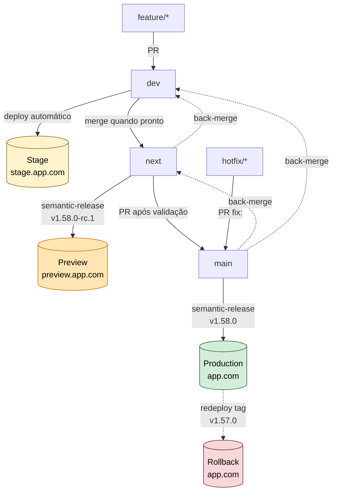
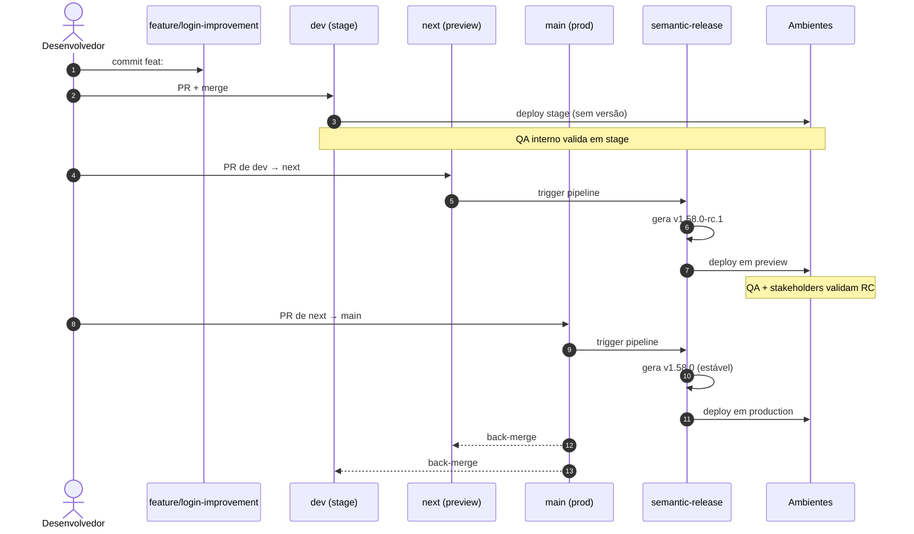
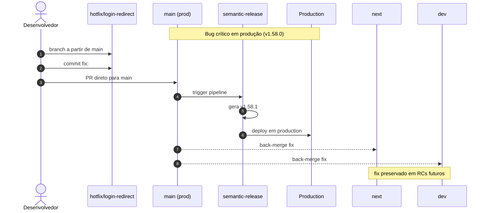
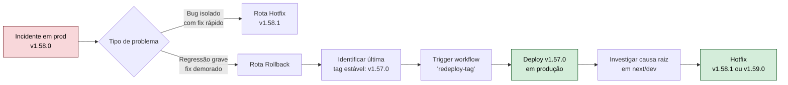
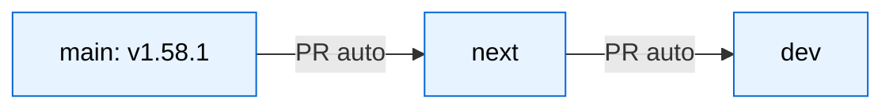
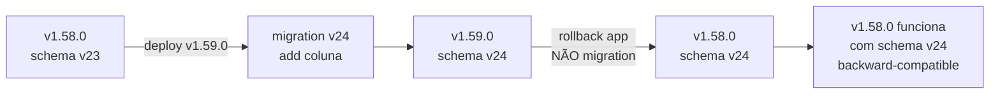

# Estratégia de Release — Análise, Fluxo e Recomendações

> Documento de análise da proposta de fluxo de branches, RC, hotfix e rollback usando `semantic-release`.

---

## 1. Resumo executivo

A proposta revisada **acerta na arquitetura central** ao corrigir o erro mais grave do desenho original — gerar Release Candidates a partir da `main`. A separação em três canais (`dev` para staging, `next` para RC/preview, `main` para produção) é o padrão de mercado mais sólido para times que querem automação completa com `semantic-release` sem comprometer a estabilidade da branch principal.

**Veredito:** proposta aprovada com ressalvas. As ressalvas não invalidam o desenho — são lacunas operacionais que precisam ser tratadas antes do go-live, especialmente sincronização entre branches, gates de qualidade e procedimento de rollback.

---

## 2. Análise de qualidade da proposta

### 2.1 Pontos fortes

| # | Acerto | Por que importa |
|---|--------|-----------------|
| 1 | RC isolado em `next`, não em `main` | A `main` permanece sempre representando o que está em produção. Auditoria e rollback ficam triviais. |
| 2 | Uso de `channel: "next"` no semantic-release | Mantém histórico de tags limpo e separa pre-releases na npm/registry. |
| 3 | Rollback por redeploy de tag estável | Não polui o histórico SemVer com versões artificiais (anti-pattern comum). |
| 4 | Hotfix como `fix:` direto na `main` | Aproveita o pipeline normal — sem branch especial que precise de regras próprias. |
| 5 | Preview URL dedicada por RC | Permite validação real (URL pública, dados próximos do prod) sem risco. |
| 6 | Tabela comparativa explícita com a proposta original | Documenta a decisão e o porquê — útil para onboarding e auditoria. |

### 2.2 Lacunas e riscos

| # | Lacuna | Risco se ignorado |
|---|--------|-------------------|
| 1 | **Sincronização back-merge** após release não está descrita | `next` e `dev` divergem da `main`, causando conflitos crescentes e RCs com base desatualizada. |
| 2 | **Backport de hotfix** para `next`/`dev` não mencionado | O fix some no próximo release porque foi aplicado só na `main`. |
| 3 | **Branch protection rules** ausentes | Push direto em `main`/`next`, RCs sem revisão, regressão de qualidade. |
| 4 | **Quality gates** (tests, lint, security, build) não mapeados por canal | RCs ou releases quebrados chegando em ambiente público. |
| 5 | **Migrations de banco** não consideradas | Rollback de aplicação ≠ rollback de schema. Pode quebrar produção. |
| 6 | **CHANGELOG e release notes** mencionados apenas implicitamente | Equipe consome as notes; precisam de plugin configurado. |
| 7 | **RCs concorrentes** (duas features grandes) não tratados | Bloqueio mútuo na fila de release ou misturas indesejadas. |
| 8 | **Procedimento de rollback** não documentado passo-a-passo | Em incidente, ninguém sabe o comando exato sob pressão. |
| 9 | **Convencional Commits enforce** não definido | `semantic-release` depende de mensagens corretas; sem `commitlint` o pipeline silenciosamente erra a versão. |
| 10 | **Exposição de versão em runtime** apenas via meta tag | OK para frontend; backend/API precisa de `/version` ou `/health` para observabilidade. |

---

## 3. Diagrama do fluxo recomendado

### 3.1 Visão completa do ciclo de vida



> Linhas pontilhadas representam **back-merges** e **redeploys** — ações que não geram nova versão SemVer.

### 3.2 Fluxo de uma feature até produção



### 3.3 Fluxo de hotfix



### 3.4 Fluxo de rollback (sem nova versão)



---

## 4. Configuração recomendada do `semantic-release`

### 4.1 `.releaserc.json`

```json
{
  "branches": [
    "main",
    {
      "name": "next",
      "channel": "next",
      "prerelease": "rc"
    }
  ],
  "plugins": [
    "@semantic-release/commit-analyzer",
    "@semantic-release/release-notes-generator",
    [
      "@semantic-release/changelog",
      { "changelogFile": "CHANGELOG.md" }
    ],
    "@semantic-release/npm",
    [
      "@semantic-release/github",
      {
        "successComment": false,
        "failComment": false
      }
    ],
    [
      "@semantic-release/git",
      {
        "assets": ["CHANGELOG.md", "package.json", "package-lock.json"],
        "message": "chore(release): ${nextRelease.version} [skip ci]"
      }
    ]
  ]
}
```

### 4.2 Mapeamento branch → versão → ambiente

| Branch   | Tag gerada      | Canal npm  | Ambiente   | URL exemplo                 |
|----------|-----------------|------------|------------|-----------------------------|
| `dev`    | nenhuma         | —          | Stage      | `stage.app.com`             |
| `next`   | `v1.58.0-rc.1`  | `next`     | Preview    | `preview.app.com`           |
| `main`   | `v1.58.0`       | `latest`   | Production | `app.com`                   |
| hotfix/* | (via main)      | `latest`   | Production | `app.com`                   |

### 4.3 Convenção de commits e impacto na versão

| Tipo de commit             | Bump SemVer | Aparece no CHANGELOG |
|----------------------------|-------------|----------------------|
| `feat:`                    | minor       | sim, seção Features  |
| `fix:`                     | patch       | sim, seção Bug Fixes |
| `perf:`                    | patch       | sim, seção Performance |
| `BREAKING CHANGE:` no body | major       | sim, em destaque     |
| `chore:`, `docs:`, `refactor:`, `style:`, `test:` | nenhum | não (configurável) |

---

## 5. Sugestões de melhoria (gaps a fechar)

### 5.1 Estratégia de back-merge automático

Após cada release na `main`, abrir PR automático de volta para `next` (e de `next` para `dev`). Sem isso, as branches divergem.



**Implementação sugerida:** GitHub Action que dispara após release na `main`:

```yaml
# .github/workflows/back-merge.yml
name: Back-merge after release
on:
  push:
    tags: ["v*.*.*"]
jobs:
  back-merge:
    runs-on: ubuntu-latest
    steps:
      - uses: actions/checkout@v4
        with: { fetch-depth: 0 }
      - name: Open PR main → next
        run: gh pr create --base next --head main --title "chore: back-merge ${{ github.ref_name }}"
        env: { GH_TOKEN: ${{ secrets.GITHUB_TOKEN }} }
```

### 5.2 Quality gates por ambiente

Cada promoção entre canais deve passar por checks específicos:

| Estágio          | Checks obrigatórios                                                          |
|------------------|------------------------------------------------------------------------------|
| PR → `dev`       | lint, type-check, unit tests, build                                          |
| PR `dev` → `next`| tudo acima + e2e + security scan + bundle size                               |
| PR `next` → `main`| tudo acima + smoke tests no preview + aprovação humana                      |
| Hotfix → `main`  | tudo do PR para main + revisão de 2 reviewers                                |

### 5.3 Branch protection rules

| Regra                                                  | `dev` | `next` | `main` |
|--------------------------------------------------------|-------|--------|--------|
| Require pull request                                   | sim   | sim    | sim    |
| Require approvals                                      | 1     | 1      | 2      |
| Dismiss stale approvals on push                        | sim   | sim    | sim    |
| Require status checks to pass                          | sim   | sim    | sim    |
| Require branches to be up to date                      | sim   | sim    | sim    |
| Require signed commits                                 | opcional | sim | sim   |
| Require linear history                                 | sim   | sim    | sim    |
| Block force pushes                                     | sim   | sim    | sim    |
| Block deletions                                        | sim   | sim    | sim    |
| Require deployments to succeed                         | —     | preview| prod   |

### 5.4 Migrations de banco — estratégia expand/contract

Rollback de aplicação não desfaz migration. Adotar:

1. **Migrations forward-only**: nunca escrever `down`.
2. **Expand/contract**: deploy 1 adiciona coluna nova; deploy 2 escreve nas duas; deploy 3 lê só da nova; deploy 4 remove a antiga.
3. Migrations rodam **antes** do deploy da app, em job separado, com lock.
4. Versão da app declara qual versão mínima de schema requer.



### 5.5 Endpoint de versão em runtime

Adicionar a todo backend:

```http
GET /version
{
  "version": "1.58.0",
  "commit": "abc123",
  "buildTime": "2026-04-30T12:00:00Z",
  "environment": "production"
}
```

Frontend mantém meta tags como já proposto.

### 5.6 Enforce de Conventional Commits

`commitlint` + `husky`:

```json
// .commitlintrc.json
{ "extends": ["@commitlint/config-conventional"] }
```

```json
// package.json
{
  "scripts": { "prepare": "husky install" }
}
```

```sh
# .husky/commit-msg
npx --no -- commitlint --edit $1
```

### 5.7 RCs concorrentes — estratégia

Quando duas features grandes precisam de RC em paralelo:

- **Opção A (simples):** serializar — RC2 só entra em `next` após RC1 ir para `main`.
- **Opção B (avançado):** feature flags — ambas as features sobem na mesma RC, controladas por flag, validadas independentemente.

Recomendação: começar com Opção A. Migrar para feature flags quando a frequência justificar.

### 5.8 Procedimento de rollback documentado

Criar `docs/runbooks/rollback.md` com comandos exatos:

```bash
# 1. Identificar última versão estável
git tag --sort=-v:refname | head -5

# 2. Disparar workflow de redeploy
gh workflow run redeploy-tag.yml -f tag=v1.57.0

# 3. Validar
curl https://app.com/version
# esperado: { "version": "1.57.0", ... }

# 4. Comunicar incidente (#status)
# 5. Abrir issue de RCA
```

### 5.9 Resumo das melhorias

| Melhoria                                   | Esforço | Prioridade |
|--------------------------------------------|---------|------------|
| Back-merge automático main → next → dev    | baixo   | alta       |
| Branch protection rules                    | baixo   | alta       |
| commitlint + husky                         | baixo   | alta       |
| Endpoint /version em backend               | baixo   | média      |
| Quality gates por estágio                  | médio   | alta       |
| Estratégia expand/contract de migrations   | alto    | alta       |
| Runbook de rollback                        | baixo   | alta       |
| Backport de hotfix automático              | médio   | média      |
| Estratégia para RCs concorrentes           | médio   | média      |
| Plugin de CHANGELOG configurado            | baixo   | média      |

---

## 6. Conclusão

A proposta revisada é tecnicamente correta e segue boas práticas estabelecidas para o uso de `semantic-release` com múltiplos canais. O ajuste em relação à proposta original — mover RCs para uma branch dedicada (`next`) — é a decisão certa.

As **lacunas identificadas não são erros de desenho, mas omissões operacionais**. Antes do go-live, recomenda-se priorizar:

1. Configurar branch protection e quality gates (impede regressões básicas).
2. Implementar back-merge automático (impede divergência crescente).
3. Escrever runbook de rollback (reduz tempo de recuperação em incidentes).
4. Decidir estratégia de migrations (impede o cenário "rollback impossível").

Com esses quatro pontos resolvidos, o fluxo proposto é robusto o suficiente para sustentar o ciclo completo de release sem fricção operacional significativa.
