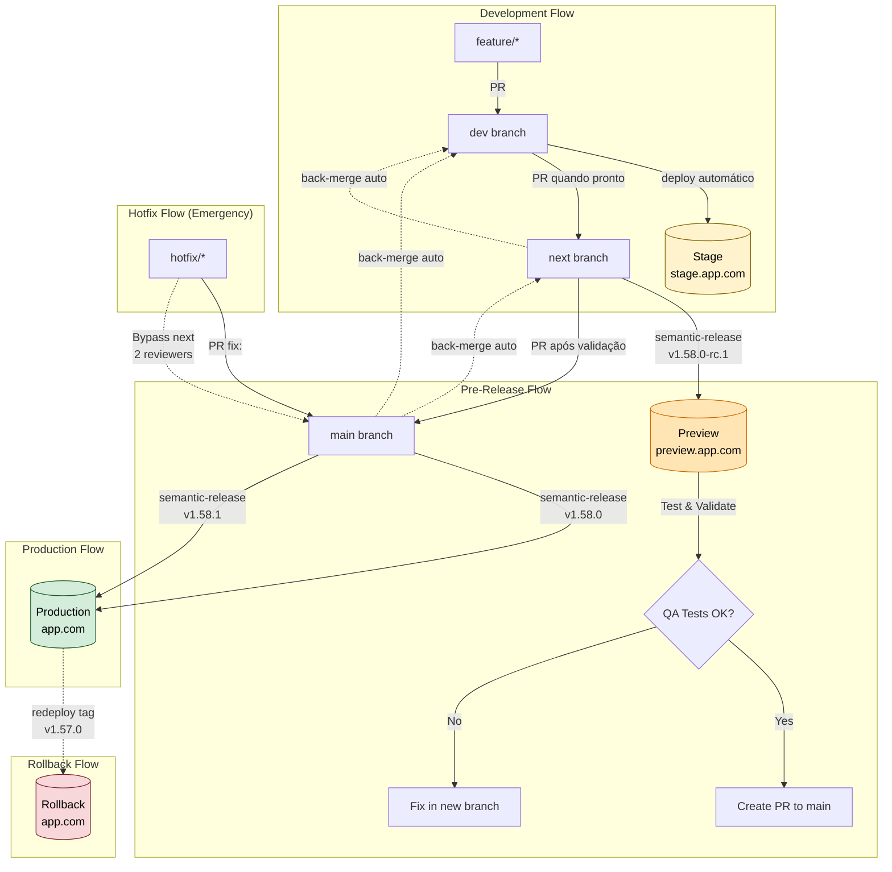
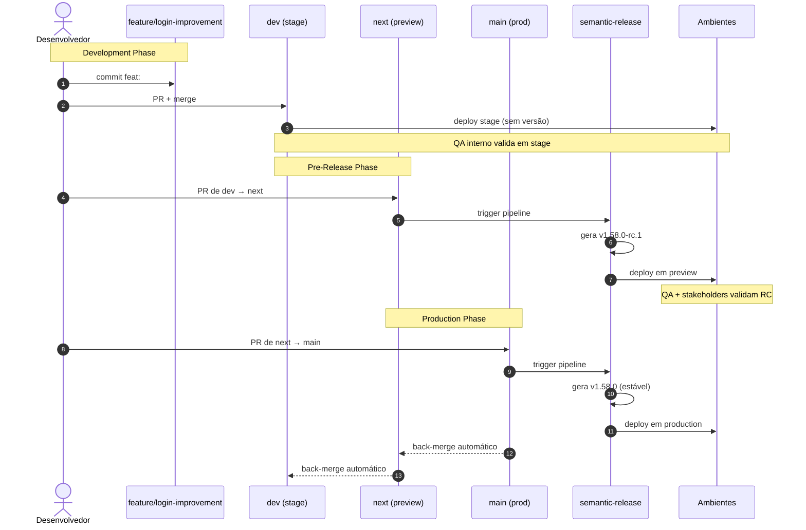
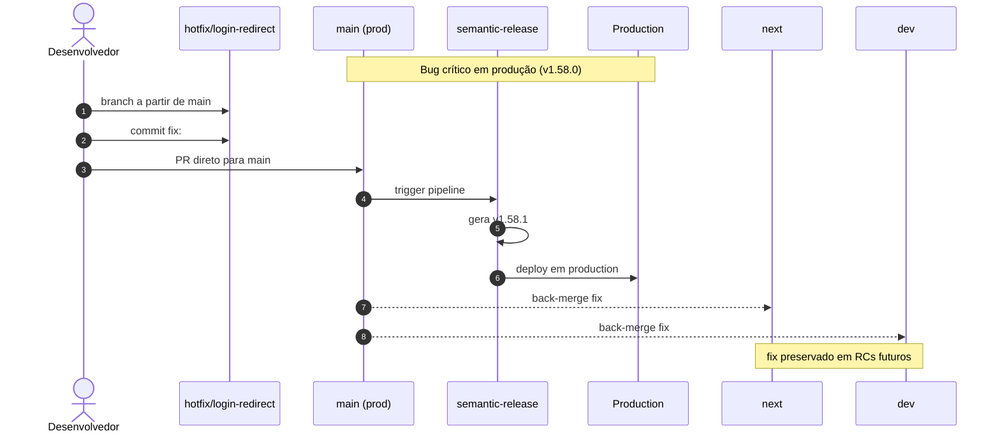
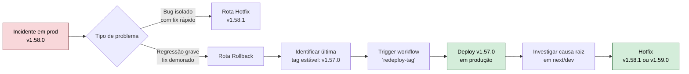
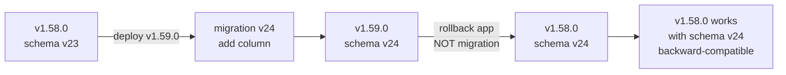

# Semantic Version Tag Implementation Plan

## Context

The current project uses manual version management (v1.57.0 in package.json) with no automated versioning, tagging, or release process. This creates operational overhead and makes rollback difficult. The team wants a simple, automated semantic versioning system using semantic-release that creates pre-release candidates when merging to main, enabling easy rollback capabilities.

**Current State:**
- Manual version bumps in package.json
- No automated git tags or GitHub releases
- No version tracking in deployed application
- Conventional commits already configured (commitlint)
- Deployment workflow: dev branch → stage, main branch → production
- Build tool: Vite with existing define section for environment variables

**Goal:** Implement semantic-release with a three-branch strategy (dev → next → main) to automatically version, tag, and create pre-release candidates, with version injection into the deployed application.

## Design Principles

1. **Three-Branch Strategy**: Separate channels for development (dev), pre-release (next), and production (main)
2. **Pre-Release Validation**: RCs in `next` branch allow validation before production
3. **Standard Tooling**: Use semantic-release (industry-standard, no custom bash scripts)
4. **Convention-Driven**: Leverage existing conventional commits (feat/fix/hotfix)
5. **Traceable**: Three-layer tracking (git tags + GitHub releases + HTML meta tags)
6. **Rollback-Ready**: Every tag is an immutable checkpoint
7. **Automated Synchronization**: Back-merge after releases to prevent branch divergence

## Implementation Approach

### Version Bump Strategy

```
Commit Type         → Bump Type    → Example
---------------------------------------------------
feat:               → MINOR        → 1.57.0 → 1.58.0
fix:                → PATCH        → 1.57.0 → 1.57.1
BREAKING CHANGE     → MAJOR        → 1.57.0 → 2.0.0
chore/docs/style    → NONE         → stays 1.57.0
```

**Hotfix Workflow (Emergency):**
- Hotfix = regular `fix:` commit merged directly to `main`
- Bypasses `next` branch and RC validation
- Immediate production release (no -rc suffix)
- Used for emergency fixes only

### Pre-Release Candidate Workflow

```
1. PR merged to dev → stage deployment (no version change)
   - Feature branches merge to dev
   - Deploys to stage environment (stage.app.com)
   - No semantic-release trigger
   - Internal QA validation

2. PR from dev → next → semantic-release creates PRE-RELEASE CANDIDATE
   - Analyzes commits to determine version bump
   - Updates package.json with pre-release version (e.g., 1.58.0-rc.1)
   - Updates CHANGELOG.md
   - Creates git tag: v1.58.0-rc.1
   - Creates GitHub PRE-RELEASE (marked as pre-release, not latest)
   - Deploys to preview URL (preview.app.com)

3. QA/Validation on pre-release candidate:
   - Test the deployed version on preview URL
   - Verify version is v1.58.0-rc.1 in HTML meta tags
   - Review the pre-release notes on GitHub
   - Verify changelog accuracy
   - Stakeholder approval

4. Manual decision point:
   - IF tests OK → create PR from next → main
   - IF issues found → don't promote, fix issues in new branch

5. PR merged from next → main → PRODUCTION RELEASE:
   - Semantic-release detects merge to main
   - Creates production release v1.58.0 (removes -rc suffix)
   - Git tag v1.58.0 created
   - GitHub release published and marked as "latest"
   - Deploys to production URL (app.com)

6. Automatic back-merge:
   - After release, main → next PR created automatically
   - After next update, next → dev PR created automatically
   - Keeps all branches synchronized
```

**Branch → Environment Mapping:**

| Branch | Version Pattern | Environment | URL |
|--------|----------------|-------------|-----|
| `dev` | None | Stage | stage.app.com |
| `next` | v1.58.0-rc.1 | Preview | preview.app.com |
| `main` | v1.58.0 | Production | app.com |

### Hotfix Workflow (Emergency Only)

```
1. Create hotfix branch from main: hotfix/fix-critical-bug
2. Make fix and commit: git commit -m "fix: critical security vulnerability"
3. Create PR directly to main (bypass next branch)
4. Merge PR → IMMEDIATE PRODUCTION RELEASE
   - Semantic-release processes fix: commit
   - Creates production release v1.57.1 (NO -rc suffix)
   - Bypasses pre-release candidate stage completely
   - Directly deploys to production
   - Creates GitHub release marked as "latest"
5. Production is immediately updated with the fix
6. Back-merge workflow propagates fix to next and dev
```

**Key Points:**
- Uses standard `fix:` commit type (simpler than special `hotfix:` type)
- Merges directly to main, skipping next branch
- Uses same approval process as regular PRs
- Back-merge ensures fix is in all future releases

**Key Benefits:**
- Clear distinction between release candidates and production releases
- Version tag v1.58.0-rc.1 vs v1.58.0 makes rollback obvious
- Production URL always has testable pre-release candidate
- Manual decision point prevents accidental releases
- **Hotfix bypass for emergencies** - immediate production releases without pre-release stage
- Clean git history with proper semantic versioning

## Workflow Diagram



### Complete Lifecycle Sequence Diagram



### Hotfix Sequence Diagram



### Rollback Decision Flow



### Workflow Legend

| Color | Meaning | Examples |
|-------|---------|----------|
| 🟡 Yellow | Stage Environment | dev branch, stage deployment, internal QA |
| 🟠 Orange | Preview/RC | next branch, v1.58.0-rc.1, stakeholder validation |
| 🟢 Green | Production | main branch, v1.58.0, production releases |
| 🔴 Red | Rollback/Emergency | v1.57.0 redeploy, incident recovery |

## GitHub Repository Configuration

### Required Settings

**Branch Protection:**
Configure via GitHub UI: Settings → Branches → Branch protection rules

Create separate rules for each branch (`dev`, `next`, `main`) with settings from Section 5.1.

**Secrets Required:**
Configure via GitHub UI: Settings → Secrets and variables → Actions

| Secret | Used By | Description |
|--------|---------|-------------|
| `GITHUB_TOKEN` | All workflows | Auto-provided by GitHub Actions |
| `PLATFORM_KIT_TOKEN` | Deploy workflows | Azion CLI authentication token |
| `PROD_STRIPE_TOKEN` | deploy-production.yml | Stripe API token |
| `PROD_RECAPTCHA_SITE_KEY` | deploy-production.yml | reCAPTCHA site key |
| `PROD_SEGMENT_TOKEN` | deploy-production.yml | Segment analytics token |
| `PROD_CROSS_EDGE_SECRET` | deploy-production.yml | Cross-edge authentication |
| `PROD_SENTRY` | deploy-production.yml | Sentry DSN |
| `PROD_SENTRY_AUTH_TOKEN` | deploy-production.yml | Sentry auth token |
| `PROD_SSO_GITHUB` | deploy-production.yml | GitHub SSO config |
| `PROD_SSO_GOOGLE` | deploy-production.yml | Google SSO config |
| `APPCUES_ACCOUNT_ID` | deploy-production.yml | Appcues ID |

**Environments:**
Create environments for deployment tracking:
- `stage` - For dev branch deployments
- `preview` - For next branch deployments
- `production` - For main branch deployments (require approval)

**Workflow Permissions:**
Via Settings → Actions → General → Workflow permissions:
- Select "Read and write permissions"
- Check "Allow GitHub Actions to create and approve pull requests"

## Implementation Steps

### Step 1: Install Semantic Release Dependencies

**File:** `package.json`

Add semantic-release and required plugins to devDependencies:

```json
"devDependencies": {
  "semantic-release": "^24.0.0",
  "@semantic-release/git": "^10.0.1",
  "@semantic-release/changelog": "^6.0.3",
  "@semantic-release/github": "^11.0.0",
  "@semantic-release/commit-analyzer": "^13.0.0",
  "@semantic-release/release-notes-generator": "^14.0.0",
  "@semantic-release/npm": "^12.0.1",
  "conventional-changelog-conventionalcommits": "^8.0.0"
}
```

**Plugin Purposes:**
- `commit-analyzer`: Analyzes conventional commits to determine version bump
- `release-notes-generator`: Generates formatted release notes from commits
- `changelog`: Updates CHANGELOG.md automatically
- `git`: Commits version changes back to repository
- `github`: Creates GitHub draft releases
- `npm`: Updates package.json version (without publishing to npm)

### Step 2: Create Semantic Release Configuration

**File:** `.releaserc.json`

Configure semantic-release for three-branch strategy:

```json
{
  "branches": [
    "main",
    {
      "name": "next",
      "channel": "next",
      "prerelease": "rc"
    }
  ],
  "plugins": [
    [
      "@semantic-release/commit-analyzer",
      {
        "preset": "conventionalcommits",
        "releaseRules": [
          { "type": "feat", "release": "minor" },
          { "type": "fix", "release": "patch" },
          { "type": "perf", "release": "patch" },
          { "breaking": true, "release": "major" }
        ]
      }
    ],
    [
      "@semantic-release/release-notes-generator",
      {
        "preset": "conventionalcommits",
        "presetConfig": {
          "types": [
            { "type": "feat", "section": "Features" },
            { "type": "fix", "section": "Bug Fixes" },
            { "type": "perf", "section": "Performance Improvements" },
            { "type": "chore", "hidden": true },
            { "type": "docs", "hidden": true },
            { "type": "style", "hidden": true },
            { "type": "refactor", "hidden": true },
            { "type": "test", "hidden": true }
          ]
        }
      }
    ],
    [
      "@semantic-release/changelog",
      {
        "changelogFile": "CHANGELOG.md",
        "changelogTitle": "# Changelog"
      }
    ],
    [
      "@semantic-release/npm",
      {
        "npmPublish": false
      }
    ],
    [
      "@semantic-release/git",
      {
        "assets": ["package.json", "CHANGELOG.md"],
        "message": "chore(release): ${nextRelease.version} [skip ci]\n\n${nextRelease.notes}"
      }
    ],
    [
      "@semantic-release/github",
      {
        "draftRelease": false,
        "releaseNameTemplate": "v${nextRelease.version}",
        "successComment": false,
        "failComment": false
      }
    ]
  ]
}
```

**Critical Settings:**
- `branches: ["main", { "name": "next", "channel": "next", "prerelease": "rc" }]`:
  - `main` branch → production releases (v1.58.0)
  - `next` branch → pre-release candidates (v1.58.0-rc.1) with npm channel "next"
- `npmPublish: false` - Only updates package.json, doesn't publish to npm
- `[skip ci]` in commit message - Prevents infinite CI loops
- Conventional commits preset for automatic version detection

### Step 3: Create Release Workflows

**File:** `.github/workflows/release-next.yml` (Pre-Release Candidate)

Automated semantic-release workflow for next branch:

```yaml
name: Release Candidate

on:
  push:
    branches:
      - next

permissions:
  contents: write
  issues: write
  pull-requests: write

jobs:
  release:
    runs-on: ubuntu-latest
    container:
      image: node:22-alpine

    steps:
      - name: Checkout code
        uses: actions/checkout@v4
        with:
          fetch-depth: 0
          token: ${{ secrets.GITHUB_TOKEN }}

      - name: Install dependencies
        run: yarn install --frozen-lockfile

      - name: Release
        run: npx semantic-release
        env:
          GITHUB_TOKEN: ${{ secrets.GITHUB_TOKEN }}
```

**File:** `.github/workflows/release-main.yml` (Production Release)

Automated semantic-release workflow for main branch:

```yaml
name: Production Release

on:
  push:
    branches:
      - main

permissions:
  contents: write
  issues: write
  pull-requests: write

jobs:
  release:
    runs-on: ubuntu-latest
    container:
      image: node:22-alpine

    steps:
      - name: Checkout code
        uses: actions/checkout@v4
        with:
          fetch-depth: 0
          token: ${{ secrets.GITHUB_TOKEN }}

      - name: Install dependencies
        run: yarn install --frozen-lockfile

      - name: Release
        run: npx semantic-release
        env:
          GITHUB_TOKEN: ${{ secrets.GITHUB_TOKEN }}
```

**Workflow Behavior:**
- `release-next.yml` triggers on push to `next` → creates v1.58.0-rc.1
- `release-main.yml` triggers on push to `main` → creates v1.58.0
- Both update package.json and CHANGELOG.md
- Both create git tags and GitHub releases

### Step 4: Create Back-Merge Workflow

**File:** `.github/workflows/back-merge.yml`

Automatically sync branches after releases to prevent divergence:

```yaml
name: Back-merge after release

on:
  push:
    tags: ["v*.*.*"]

jobs:
  back-merge:
    runs-on: ubuntu-latest
    steps:
      - uses: actions/checkout@v4
        with:
          fetch-depth: 0
          token: ${{ secrets.GITHUB_TOKEN }}

      - name: Configure Git
        run: |
          git config user.name "github-actions[bot]"
          git config user.email "41898282+github-actions[bot]@users.noreply.github.com"

      - name: Check if production release
        id: check
        run: |
          TAG="${{ github.ref_name }}"
          if [[ ! "$TAG" =~ -rc ]]; then
            echo "is_production=true" >> $GITHUB_OUTPUT
          else
            echo "is_production=false" >> $GITHUB_OUTPUT
          fi

      - name: Back-merge main → next
        if: steps.check.outputs.is_production == 'true'
        run: |
          git checkout next
          git merge main --no-edit || true
          git push origin next

      - name: Back-merge next → dev
        if: steps.check.outputs.is_production == 'true'
        run: |
          git checkout dev
          git merge next --no-edit || true
          git push origin dev
```

**Workflow Features:**
- Triggers after each release (tag creation)
- Detects if production release (no -rc suffix)
- Automatically merges main → next → dev
- Prevents branch divergence
- Keeps RCs up-to-date with production

### Step 4.1: Remove Old Hotfix Configuration

**Note:** The old approach using `hotfix:` commit type has been simplified. Hotfixes now use standard `fix:` commits merged directly to `main`. This section is kept for reference only.

**Previous approach (deprecated):**

If you previously used a `hotfix:` commit type, you can remove those references from `.releaserc.json`. The new approach is simpler - just use `fix:` and merge directly to main for emergency fixes.

**Why the change:**
- Simpler workflow - no special commit type needed
- Uses existing semantic-release configuration
- Back-merge automatically propagates fixes to next and dev
- Less cognitive overhead for developers

**Migration:** No migration needed - just start using `fix:` instead of `hotfix:` for emergency fixes.

```yaml
name: Release

on:
  push:
    branches:
      - main

permissions:
  contents: write
  issues: write
  pull-requests: write

jobs:
  release:
    runs-on: ubuntu-latest
    container:
      image: node:22-alpine

    steps:
      - name: Checkout code
        uses: actions/checkout@v4
        with:
          fetch-depth: 0
          token: ${{ secrets.GITHUB_TOKEN }}

      - name: Install dependencies
        run: yarn install --frozen-lockfile

      - name: Release
        run: npx semantic-release
        env:
          GITHUB_TOKEN: ${{ secrets.GITHUB_TOKEN }}
```

**Workflow Behavior:**
- Triggers automatically on push to main
- Analyzes commits since last release
- Determines version bump type automatically
- Updates package.json and CHANGELOG.md
- Creates git tag
- Creates GitHub draft release
- Commits changes back to main branch

### Step 5: Update Deployment Workflows

**File:** `.github/workflows/deploy-stage.yml`

Deploy to stage environment on dev branch:

```yaml
name: Deploy Stage

on:
  push:
    branches:
      - dev

env:
  HUSKY: 0

jobs:
  deploy:
    runs-on: ubuntu-latest
    container:
      image: node:22-alpine

    steps:
      - name: Checkout code
        uses: actions/checkout@v4

      - name: Install SO deps
        run: apk add curl git bash jq

      - name: Install dependencies
        run: yarn install

      - name: Download Azion CLI
        run: |
          wget https://github.com/aziontech/azion/releases/download/4.15.0/azion_4.15.0_linux_amd64.apk
          apk add --allow-untrusted azion_4.15.0_linux_amd64.apk

      - name: Configure Azion CLI
        run: azion -t ${{ secrets.PLATFORM_KIT_TOKEN }}

      - name: Build & Deploy
        run: azion deploy --auto --local --debug --config-dir azion/stage
        env:
          NODE_ENV: staging
          VITE_ENVIRONMENT: stage
```

**File:** `.github/workflows/deploy-preview.yml`

Deploy to preview environment on next branch:

```yaml
name: Deploy Preview

on:
  push:
    branches:
      - next

env:
  HUSKY: 0

jobs:
  deploy:
    runs-on: ubuntu-latest
    container:
      image: node:22-alpine

    steps:
      - name: Checkout code
        uses: actions/checkout@v4
        with:
          fetch-depth: 0

      - name: Install SO deps
        run: apk add curl git bash jq

      - name: Install dependencies
        run: yarn install

      - name: Get version info
        run: |
          echo "VITE_APP_VERSION=$(node -p "require('./package.json').version")" >> $GITHUB_ENV
          echo "VITE_BUILD_TIME=$(date -u +%Y-%m-%dT%H:%M:%SZ)" >> $GITHUB_ENV

      - name: Download Azion CLI
        run: |
          wget https://github.com/aziontech/azion/releases/download/4.15.0/azion_4.15.0_linux_amd64.apk
          apk add --allow-untrusted azion_4.15.0_linux_amd64.apk

      - name: Configure Azion CLI
        run: azion -t ${{ secrets.PLATFORM_KIT_TOKEN }}

      - name: Build & Deploy
        run: azion deploy --auto --local --debug --config-dir azion/preview
        env:
          NODE_ENV: staging
          GITHUB_SHA: ${{ github.sha }}
          VITE_ENVIRONMENT: preview
```

**File:** `.github/workflows/deploy-production.yml`

Deploy to production on main branch (after semantic-release):

```yaml
name: Deploy Production

on:
  workflow_run:
    workflows: ["Production Release"]
    types:
      - completed
    branches:
      - main

env:
  HUSKY: 0

jobs:
  deploy:
    runs-on: ubuntu-latest
    if: ${{ github.event.workflow_run.conclusion == 'success' }}
    container:
      image: node:22-alpine

    steps:
      - name: Checkout code
        uses: actions/checkout@v4
        with:
          fetch-depth: 0

      - name: Install SO deps
        run: apk add curl git bash jq

      - name: Install dependencies
        run: yarn install

      - name: Get version info
        run: |
          echo "VITE_APP_VERSION=$(node -p "require('./package.json').version")" >> $GITHUB_ENV
          echo "VITE_BUILD_TIME=$(date -u +%Y-%m-%dT%H:%M:%SZ)" >> $GITHUB_ENV

      - name: Download Azion CLI
        run: |
          wget https://github.com/aziontech/azion/releases/download/4.15.0/azion_4.15.0_linux_amd64.apk
          apk add --allow-untrusted azion_4.15.0_linux_amd64.apk

      - name: Configure Azion CLI
        run: azion -t ${{ secrets.PLATFORM_KIT_TOKEN }}

      - name: Build & Deploy
        run: azion deploy --auto --local --debug --config-dir azion/production
        env:
          NODE_ENV: production
          GITHUB_SHA: ${{ github.sha }}
          VITE_ENVIRONMENT: production
          VITE_STRIPE_TOKEN_PROD: ${{ secrets.PROD_STRIPE_TOKEN }}
          VITE_RECAPTCHA_SITE_KEY: ${{ secrets.PROD_RECAPTCHA_SITE_KEY }}
          VITE_SEGMENT_TOKEN: ${{ secrets.PROD_SEGMENT_TOKEN }}
          CROSS_EDGE_SECRET: ${{ secrets.PROD_CROSS_EDGE_SECRET}}
          VITE_PROD_SENTRY: ${{ secrets.PROD_SENTRY }}
          VITE_SSO_GITHUB: ${{ secrets.PROD_SSO_GITHUB }}
          VITE_SSO_GOOGLE: ${{ secrets.PROD_SSO_GOOGLE }}
          VITE_SENTRY_AUTH_TOKEN: ${{ secrets.PROD_SENTRY_AUTH_TOKEN }}
          VITE_SENTRY_UPLOAD: true
          VITE_APPCUES_ACCOUNT_ID: ${{ secrets.APPCUES_ACCOUNT_ID }}
```

**Key Features:**
- Three separate deployment workflows for each environment
- Production deploys after semantic-release completes
- Version injection on preview and production
- Environment-specific configurations

### Step 5.1: Branch Protection Rules

Configure GitHub branch protection to enforce quality gates:

| Rule | `dev` | `next` | `main` |
|------|-------|--------|--------|
| Require pull request | ✅ Yes | ✅ Yes | ✅ Yes |
| Require approvals | 1 | 1 | 1 |
| Dismiss stale approvals on push | ✅ Yes | ✅ Yes | ✅ Yes |
| Require status checks to pass | ✅ Yes | ✅ Yes | ✅ Yes |
| Require branches to be up to date | ✅ Yes | ✅ Yes | ✅ Yes |
| Require signed commits | Optional | ✅ Yes | ✅ Yes |
| Require linear history | ✅ Yes | ✅ Yes | ✅ Yes |
| Block force pushes | ✅ Yes | ✅ Yes | ✅ Yes |
| Block deletions | ✅ Yes | ✅ Yes | ✅ Yes |
| Require deployments to succeed | — | preview | production |

**Implementation:** Configure via GitHub Settings → Branches → Branch protection rules

### Step 5.2: Quality Gates by Environment

Each promotion between channels must pass specific checks:

| Stage | Required Checks |
|-------|----------------|
| PR → `dev` | lint, type-check, unit tests, build |
| PR `dev` → `next` | all above + e2e tests + security scan + bundle size |
| PR `next` → `main` | all above + smoke tests in preview + human approval |
| Hotfix → `main` | all PR checks for main (same approval process) |

**Implementation:** Configure in `.github/workflows/pre-merge.yml` with conditional checks per target branch.

**File:** `vite.config.js`

Add version variables to the define section (around line 43-45):

```javascript
define: {
  __VUE_PROD_HYDRATION_MISMATCH_DETAILS__: false,
  __APP_VERSION__: JSON.stringify(process.env.npm_package_version || '0.0.0'),
  __BUILD_TIME__: JSON.stringify(new Date().toISOString()),
  __GIT_COMMIT__: JSON.stringify(process.env.GITHUB_SHA || 'unknown')
}
```

**File:** `scripts/vite-plugin-version-inject.js`

Create Vite plugin to inject version into HTML meta tags:

```javascript
export default function versionInjectPlugin() {
  return {
    name: 'version-inject',
    transformIndexHtml(html) {
      const version = process.env.npm_package_version || '0.0.0'
      const buildTime = new Date().toISOString()
      const gitCommit = process.env.GITHUB_SHA || 'unknown'

      return html
        .replace(
          /<meta name="app-version" content="" \/>/,
          `<meta name="app-version" content="${version}" />`
        )
        .replace(
          /<meta name="build-time" content="" \/>/,
          `<meta name="build-time" content="${buildTime}" />`
        )
        .replace(
          /<meta name="git-commit" content="" \/>/,
          `<meta name="git-commit" content="${gitCommit}" />`
        )
    }
  }
}
```

**File:** `vite.config.js` (add plugin)

Import and register the plugin:

```javascript
import versionInjectPlugin from './scripts/vite-plugin-version-inject.js'

// In plugins array:
plugins: [
  vue(),
  vueJsx(),
  versionInjectPlugin(),
  istanbul({
    nycrcPath: '.nycrc'
  }),
  // ... rest of plugins
]
```

**File:** `index.html`

Add version meta tags (after line 19):

```html
<meta name="app-version" content="" />
<meta name="build-time" content="" />
<meta name="git-commit" content="" />
```

These will be populated at build time, providing runtime version visibility.

### Step 7.1: Database Migration Strategy

**Important:** Rollback of application ≠ rollback of database schema.

**Recommended Approach: Forward-Only Migrations**

1. **Never write `down` migrations** - only forward migrations
2. **Expand/Contract pattern:**
   - Deploy 1: Add new column (nullable)
   - Deploy 2: Write to both old and new columns
   - Deploy 3: Read from new column only
   - Deploy 4: Remove old column
3. **Migrations run before** application deploy, in separate job with lock
4. **Version compatibility:** Application declares minimum required schema version



**Implementation:** Use migration tool (Prisma, Knex, etc.) with version tracking.

### Step 7.2: Runtime Version Endpoint

For backend services, expose version information:

```http
GET /version HTTP/1.1
{
  "version": "1.58.0",
  "commit": "abc123",
  "buildTime": "2026-04-30T12:00:00Z",
  "environment": "production"
}
```

For frontend, maintain HTML meta tags as already proposed.

### Step 7.3: Enforce Conventional Commits

Configure `commitlint` + `husky` to enforce commit message format:

**File:** `.commitlintrc.json`

```json
{
  "extends": ["@commitlint/config-conventional"]
}
```

**File:** `package.json`

```json
{
  "scripts": {
    "prepare": "husky install"
  }
}
```

**File:** `.husky/commit-msg`

```bash
#!/bin/sh
. "$(dirname "$0")/_/husky.sh"

npx --no -- commitlint --edit $1
```

### Step 7.4: Concurrent RCs Strategy

When two large features need parallel RCs:

**Option A (Recommended): Serialize**
- RC2 enters `next` only after RC1 goes to `main`
- Simpler, less risk

**Option B (Advanced): Feature Flags**
- Both features in same RC
- Controlled by feature flags
- Validated independently
- Use when release frequency justifies

### Step 7.5: Rollback Runbook

Create `docs/runbooks/rollback.md` with exact commands:

```bash
# 1. Identify last stable version
git tag --sort=-v:refname | grep -v '\-rc' | head -5

# 2. Trigger rollback workflow
gh workflow run rollback.yml -f confirm="ROLLBACK"

# OR manual rollback to specific version
gh workflow run manual-rollback.yml \
  -f target_version=v1.57.0 \
  -f confirm="ROLLBACK"

# 3. Validate deployment
curl https://app.com | grep "app-version"
# Expected: v1.57.0

# 4. Communicate incident (#status channel)
# 5. Open RCA (Root Cause Analysis) issue
```

**File:** `CHANGELOG.md`

```markdown
# Changelog

All notable changes to this project will be documented in this file.

The format is based on [Keep a Changelog](https://keepachangelog.com/en/1.0.0/),
and this project adheres to [Semantic Versioning](https://semver.org/spec/v2.0.0.html).

## [Unreleased]

## [1.57.0] - 2026-04-29

### Added
- Initial semantic versioning implementation with semantic-release
- Automatic version bumping based on conventional commits
- Pre-release candidate workflow (draft releases)
- Build-time version injection via HTML meta tags
```

This file will be automatically updated by semantic-release.

## Rollback Strategy

### Automatic Checkpoints

1. **Git Tags**: Every release creates permanent tag (e.g., `v1.58.0-rc.1` for pre-release, `v1.58.0` for production)
2. **GitHub Releases**: Pre-release candidates and production releases with full release notes
3. **HTML Meta Tags**: Runtime version visibility for debugging
4. **Changelog**: Complete version history in CHANGELOG.md

### Rollback Options

We provide **two rollback approaches** depending on the scenario:

#### Option 1: Automatic One-Click Rollback (Recommended)

**Use Case**: Quickly rollback to the previous stable production release.

**Implementation**: Create a rollback workflow that automatically deploys the last stable release.

**File:** `.github/workflows/rollback.yml`

```yaml
name: Quick Rollback

on:
  workflow_dispatch:
    inputs:
      confirm:
        description: 'Type "ROLLBACK" to confirm'
        required: true
        type: string

permissions:
  contents: read

jobs:
  rollback:
    runs-on: ubuntu-latest
    if: github.event.inputs.confirm == 'ROLLBACK'

    steps:
      - name: Checkout code
        uses: actions/checkout@v4
        with:
          fetch-depth: 0

      - name: Find last stable release
        id: last_release
        run: |
          # Get all tags, filter production releases (exclude -rc), get last 2
          LAST_STABLE=$(git tag -l 'v*' | grep -v '\-rc' | sort -V | tail -2 | head -1)

          if [ -z "$LAST_STABLE" ]; then
            echo "Error: No previous stable release found"
            exit 1
          fi

          echo "last_stable=$LAST_STABLE" >> $GITHUB_OUTPUT
          echo "::notice::Rolling back to $LAST_STABLE"

      - name: Checkout last stable version
        run: git checkout ${{ steps.last_release.outputs.last_stable }}

      - name: Install dependencies
        run: yarn install --frozen-lockfile

      - name: Deploy to production
        run: |
          wget https://github.com/aziontech/azion/releases/download/4.15.0/azion_4.15.0_linux_amd64.apk
          apk add --allow-untrusted azion_4.15.0_linux_amd64.apk
          azion -t ${{ secrets.PLATFORM_KIT_TOKEN }}
          azion deploy --auto --local --debug --config-dir azion/production
        env:
          VITE_ENVIRONMENT: production
          GITHUB_SHA: ${{ steps.last_release.outputs.last_stable }}

      - name: Create rollback record
        uses: actions/github-script@v7
        with:
          script: |
            await github.rest.repos.createRelease({
              owner: context.repo.owner,
              repo: context.repo.repo,
              tag_name: '${{ steps.last_release.outputs.last_stable }}-rollback-' + Date.now(),
              name: 'Rollback to ${{ steps.last_release.outputs.last_stable }}',
              body: 'Automated rollback to previous stable release',
              draft: false,
              prerelease: false
            });
```

**How it works:**
- Example: Current production is v1.0.3
- Last stable release is v1.0.2
- Workflow automatically deploys v1.0.2
- Creates a rollback record in GitHub releases
- One-click operation with confirmation

#### Option 2: Manual Rollback to Specific Version

**Use Case**: Rollback to any specific previous release (granular control).

**Implementation**: Create a manual rollback workflow that accepts any release tag.

**File:** `.github/workflows/manual-rollback.yml`

```yaml
name: Manual Rollback to Version

on:
  workflow_dispatch:
    inputs:
      target_version:
        description: 'Target version (e.g., v1.0.1, v1.0.2-rc.1)'
        required: true
        type: string
      confirm:
        description: 'Type "ROLLBACK" to confirm'
        required: true
        type: string

permissions:
  contents: read

jobs:
  rollback:
    runs-on: ubuntu-latest
    if: github.event.inputs.confirm == 'ROLLBACK'

    steps:
      - name: Checkout code
        uses: actions/checkout@v4
        with:
          fetch-depth: 0

      - name: Validate target version
        run: |
          TARGET="${{ github.event.inputs.target_version }}"

          if ! git tag | grep -q "^${TARGET}$"; then
            echo "Error: Version ${TARGET} not found"
            echo "Available tags:"
            git tag -l 'v*' | tail -10
            exit 1
          fi

          echo "::notice::Target version ${TARGET} found"

      - name: Checkout target version
        run: git checkout ${{ github.event.inputs.target_version }}

      - name: Install dependencies
        run: yarn install --frozen-lockfile

      - name: Deploy to production
        run: |
          wget https://github.com/aziontech/azion/releases/download/4.15.0/azion_4.15.0_linux_amd64.apk
          apk add --allow-untrusted azion_4.15.0_linux_amd64.apk
          azion -t ${{ secrets.PLATFORM_KIT_TOKEN }}
          azion deploy --auto --local --debug --config-dir azion/production
        env:
          VITE_ENVIRONMENT: production
          GITHUB_SHA: ${{ github.event.inputs.target_version }}

      - name: Create rollback record
        uses: actions/github-script@v7
        with:
          script: |
            await github.rest.repos.createRelease({
              owner: context.repo.owner,
              repo: context.repo.repo,
              tag_name: '${{ github.event.inputs.target_version }}-manual-rollback-' + Date.now(),
              name: 'Manual Rollback to ${{ github.event.inputs.target_version }}',
              body: 'Manual rollback deployed via workflow_dispatch',
              draft: false,
              prerelease: false
            });
```

**How it works:**
- Can rollback to any previous release (production or pre-release)
- Example scenario:
  - Current: v1.0.3 (production)
  - Available: v1.0.1-rc.1, v1.0.1, v1.0.2-rc.1, v1.0.2, v1.0.3-rc.1, v1.0.3
  - Can choose to deploy v1.0.1, v1.0.2, or even v1.0.2-rc.1
- Provides full flexibility for any rollback scenario

### Rollback Decision Matrix

| Scenario | Recommended Option | Workflow | Example |
|----------|-------------------|----------|---------|
| Current production broken | Option 1 (Automatic) | `rollback.yml` | v1.0.3 → v1.0.2 (automatic) |
| Need specific previous version | Option 2 (Manual) | `manual-rollback.yml` | v1.0.3 → v1.0.1 (manual) |
| Test a pre-release candidate | Option 2 (Manual) | `manual-rollback.yml` | v1.0.3 → v1.0.2-rc.1 |
| Emergency hotfix needed | Option 1 (Automatic) then create hotfix | `rollback.yml` | Rollback to v1.0.2, then create hotfix branch from v1.0.2 |
| QA needs to test old version | Option 2 (Manual) | `manual-rollback.yml` | Deploy v1.0.1-rc.1 for testing |

## Critical Files

1. **`.releaserc.json`** - Semantic-release configuration for three-branch strategy
2. **`.github/workflows/release-next.yml`** - Pre-release candidate workflow for next branch
3. **`.github/workflows/release-main.yml`** - Production release workflow for main branch
4. **`.github/workflows/back-merge.yml`** - Automatic branch synchronization
5. **`.github/workflows/deploy-stage.yml`** - Stage deployment for dev branch
6. **`.github/workflows/deploy-preview.yml`** - Preview deployment for next branch
7. **`.github/workflows/deploy-production.yml`** - Production deployment for main branch
8. **`.github/workflows/rollback.yml`** - Automatic one-click rollback
9. **`.github/workflows/manual-rollback.yml`** - Manual rollback to any version
10. **`.commitlintrc.json`** - Conventional commits enforcement
11. **`vite.config.js`** - Build-time version injection
12. **`scripts/vite-plugin-version-inject.js`** - HTML meta tag injection
13. **`index.html`** - Version meta tags
14. **`package.json`** - Semantic-release dependencies
15. **`CHANGELOG.md`** - Version history (auto-updated)
16. **`docs/runbooks/rollback.md`** - Rollback procedures

## Complexity Analysis

### New Dependencies: 7 packages (all semantic-release ecosystem)
- `semantic-release` - Core automation tool
- `@semantic-release/*` - Official plugins for git, github, changelog, npm
- `conventional-changelog-conventionalcommits` - Conventional commits support

### Lines of Code: ~100 total
- Semantic-release config: ~70 lines (JSON)
- Vite plugin: ~20 lines (JavaScript)
- Release workflow: ~30 lines (YAML)

### Maintenance Burden: Very Low
- Industry-standard tool (semantic-release)
- No custom bash scripts
- Declarative configuration (JSON)
- Well-documented, active community
- Automatic dependency updates available

### Failure Modes

| Failure Point | Impact | Recovery |
|--------------|--------|----------|
| Semantic-release fails | No version bump, deployment still works | Manual version bump, fix config |
| Draft release not created | No release checkpoint, version still updated | Create release manually |
| Git tag creation fails | No tag, but version in package.json | Manual tag creation |
| Vite plugin fails | No meta tags, app still works | Fix plugin, redeploy |
| No conventional commits | Semantic-release skips release | Use proper commit format |

**Key Safety:** Semantic-release is non-blocking. Deployment always succeeds.

## Verification Plan

### Local Testing

1. Verify semantic-release configuration:
```bash
yarn install
npx semantic-release --dry-run
```

2. Verify Vite plugin:
```bash
yarn build
grep -E "app-version|build-time|git-commit" dist/index.html
```

### Stage Testing

1. Create feature branch from `dev`
2. Commit: `git commit -m "feat: new feature"`
3. Create PR to `dev` branch
4. Merge PR → automatic stage deployment
5. Verify stage environment works correctly
6. Verify NO version tag created (only next/main create tags)

### Pre-Release Testing

1. Create PR from `dev` → `next`
2. Merge PR → automatic release workflow
3. Check GitHub Releases for **PRE-RELEASE** (v1.58.0-rc.1)
4. Verify preview deployment at preview.app.com
5. Confirm package.json version updated to v1.58.0-rc.1
6. Verify git tag created: `git tag -l | tail -5` (should show v1.58.0-rc.1)
7. Verify preview HTML contains version meta tags
8. Test functionality on preview URL
9. Verify back-merge workflow created PR main → next (after production release)

### Production Testing

1. Create PR from `next` → `main`
2. Merge PR → automatic production release
3. Check GitHub Releases for **PRODUCTION** (v1.58.0, no -rc suffix)
4. Verify production deployment at app.com
5. Confirm package.json version updated to v1.58.0
6. Verify git tag created: `git tag -l | tail -5` (should show v1.58.0)
7. Verify production HTML contains version meta tags
8. Verify back-merge workflow created PRs:
   - main → next
   - next → dev

### Hotfix Testing

1. Create branch from `main`: `git checkout -b hotfix/critical-fix main`
2. Make fix: `git commit -m "fix: critical security vulnerability"`
3. Create PR directly to `main`
4. Merge PR → **IMMEDIATE** production release (v1.58.1, NO -rc)
5. Verify GitHub release marked as "latest"
6. Verify production deployed with v1.58.1
7. Verify back-merge propagated fix to next and dev

## Summary

This implementation provides:

- **Three-Branch Strategy**: Clear separation of development (dev), pre-release (next), and production (main)
- **Zero Custom Scripts**: Uses semantic-release (industry standard)
- **Pre-Release Validation**: RCs validated in preview before production
- **Low Complexity**: ~100 lines of config, declarative JSON
- **High Reliability**: Mature tool with active community
- **Easy Rollback**: Git tags + changelog + automated workflows
- **Full Traceability**: Version visible in deployed application
- **Automated Synchronization**: Back-merge prevents branch divergence
- **Scalable**: Works for any team size or commit frequency

## Implementation Priority

| Improvement | Effort | Priority | Status |
|-------------|--------|----------|--------|
| Three-branch strategy (dev → next → main) | medium | high | Planned |
| Back-merge automation main → next → dev | low | high | Planned |
| Branch protection rules | low | high | Planned |
| commitlint + husky | low | high | Planned |
| Quality gates by stage | medium | high | Planned |
| Runtime version endpoint | low | medium | Planned |
| Database migration strategy (expand/contract) | high | high | Planned |
| Rollback runbook | low | high | Planned |
| Concurrent RCs strategy | medium | medium | Planned |
| CHANGELOG plugin configured | low | medium | Planned |

## Key Differences from Original Proposal

| Aspect | Original | Revised |
|--------|----------|---------|
| Branch count | 2 (dev, main) | 3 (dev, next, main) |
| RC location | main branch | next branch |
| RC version | v1.58.0-rc.1 | v1.58.0-rc.1 (same) |
| Production version | Manual promotion | Automatic on merge to main |
| Hotfix type | `hotfix:` commit | Standard `fix:` commit |
| Back-merge | Manual | Automatic workflow |
| Branch protection | Not defined | Full matrix per branch |
| Quality gates | Not defined | Per-stage requirements |
| Database rollback | Not considered | Expand/contract pattern |

The system integrates seamlessly with existing workflows and provides production-grade semantic versioning without custom bash scripts.