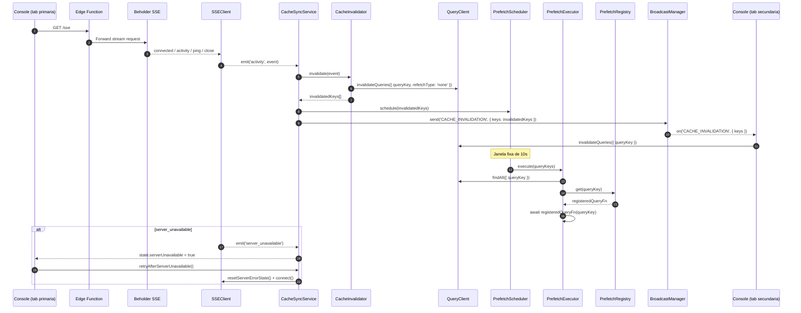
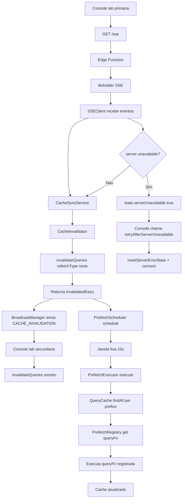

# Realtime Cache Sync (SSE + Invalidation + Prefetch)

> Fonte de verdade para sincronizacao em tempo real no Console: SSE, invalidacao de cache, prefetch agregado e sincronizacao entre abas.

---

## 1. Objetivo

Este documento descreve como o Console mantem dados atualizados com baixa latencia e sem explosao de requests quando eventos chegam em rajada.

Principios do fluxo atual:

1. Receber eventos SSE apenas na aba primaria.
2. Invalidar queries sem refetch imediato (`refetchType: 'none'`).
3. Agregar invalidacoes por janela fixa (10s).
4. Executar prefetch com funcoes registradas por padrao de `queryKey`.
5. Propagar invalidacao para abas secundarias via `BroadcastChannel`.

---

## 2. Arquitetura de alto nivel

```
SSE (aba primaria)
  -> CacheInvalidator
    -> queryClient.invalidateQueries({ refetchType: 'none' })
      -> PrefetchScheduler (janela fixa 10s)
        -> PrefetchExecutor
          -> prefetchRegistry (queryKey pattern -> queryFn)
            -> service layer

Em paralelo:
  CacheSyncService
    -> BroadcastManager.send('CACHE_INVALIDATION', { keys })
      -> abas secundarias invalidam cache local
```

### 2.1 Fluxo completo (Mermaid)



### 2.2 Fluxo completo (Flowchart)



Componentes principais:

| Componente          | Responsabilidade                                      | Arquivo                                                         |
| ------------------- | ----------------------------------------------------- | --------------------------------------------------------------- |
| `SSEClient`         | Conexao SSE, parse de eventos, reconexao              | `src/services/v2/base/sse/sse-client.js`                        |
| `CacheSyncService`  | Orquestracao SSE + invalidacao + prefetch + broadcast | `src/services/v2/base/cache-sync/cache-sync-service.js`         |
| `CacheInvalidator`  | Evento SSE -> `queryKeys` para invalidar              | `src/services/v2/base/cache-sync/cache-invalidator.js`          |
| `InvalidationMap`   | Regras de mapeamento por recurso/parent/descricao     | `src/services/v2/base/cache-sync/invalidation-map.js`           |
| `PrefetchScheduler` | Agregacao por timer fixo                              | `src/services/v2/base/cache-sync/prefetch-scheduler.js`         |
| `PrefetchExecutor`  | Coleta e execucao de prefetch por `queryKey`          | `src/services/v2/base/cache-sync/prefetch-executor.js`          |
| `PrefetchRegistry`  | Registro de pattern -> queryFn                        | `src/services/v2/base/cache-sync/prefetch-query-fn-registry.js` |
| `TabCoordinator`    | Eleicao de aba primaria                               | `src/services/v2/base/broadcast/tab-coordinator.js`             |
| `BroadcastManager`  | Comunicacao entre abas                                | `src/services/v2/base/broadcast/broadcast-manager.js`           |

---

## 3. Lifecycle do sistema

### 3.1 Inicializacao

O fluxo de cache sync nao e iniciado no bootstrap global da app. O inicio ocorre no lifecycle de sessao:

- `sessionManager.afterLogin()` executa prefetch inicial.
- Para conta cliente (`isClientAccount`), chama `startCacheSync()`.

Referencia: `src/services/v2/base/auth/sessionManager.js`.

### 3.2 Encerramento

Nos fluxos de `logout` e `switchAccount`, o sistema chama `resetCacheSync()` antes da limpeza de cache/sessao.

---

## 4. Configuracao por ambiente

### 4.1 Endpoint SSE do Console

No frontend do Console, o endpoint utilizado e:

- `'/sse'`

Referencia: `src/services/v2/base/cache-sync/cache-sync-service.js`.

### 4.2 Desenvolvimento local

No ambiente local, o `vite.config.js` faz proxy de `'/sse'` para `VITE_BEHOLDER_URL`.

Referencia: `vite.config.js`.

### 4.3 Producao

Em producao, documentar e considerar como arquitetura oficial:

- Fluxo: `Console -> Edge Function -> Beholder`.
- A Edge Function intermedia o acesso SSE antes do Beholder.
- Objetivo: abstrair a URL de origem, centralizar roteamento e controle operacional.

> Observacao: a implementacao da Edge Function nao vive neste repositorio, mas o Console depende desse desenho no ambiente de producao.

---

## 5. SSEClient

Arquivo: `src/services/v2/base/sse/sse-client.js`

### 5.1 Opcoes suportadas

- `url` (obrigatorio)
- `withCredentials` (default `true`)
- `reconnectMaxAttempts` (default `10`)
- `reconnectBaseDelay` (default `1000`)
- `reconnectMaxDelay` (default `30000`)
- `serverErrorMaxAttempts` (default `3`)
- `serverErrorMultiplier` (default `2`)
- `connectionStabilityThreshold` (default `5000`)

### 5.2 Estado

`getState()` retorna:

- `isConnected`
- `clientId`
- `reconnectAttempts`
- `lastError`
- `connectionEstablishedAt`
- `serverErrorAttempts`

### 5.3 Eventos emitidos

- `open`
- `message`
- `connected`
- `activity`
- `ping` (named SSE event)
- `error`
- `server_error`
- `server_unavailable`
- `maxReconnectAttempts`
- `close`

### 5.4 Reconexao

O cliente distingue heuristica de erro de servidor vs erro de rede:

- Erro de servidor: backoff dedicado, limite por `serverErrorMaxAttempts`.
- Erro de rede: exponential backoff tradicional ate `reconnectMaxAttempts`.

Tambem existe API explicita para retentativa manual apos indisponibilidade:

- `resetServerErrorState()`.

---

## 6. CacheSyncService

Arquivo: `src/services/v2/base/cache-sync/cache-sync-service.js`

### 6.1 Responsabilidades

- Inicializar registry de prefetch e scheduler.
- Coordenar eleicao de aba primaria (`TabCoordinator`).
- Conectar SSE apenas na aba primaria.
- Processar `activity`:
  - invalidar localmente;
  - agendar prefetch;
  - broadcast de invalidacao.
- Aplicar invalidacao remota recebida via `CACHE_INVALIDATION`.

### 6.2 Estado publico

- `isConnected`
- `clientId`
- `serverUnavailable`

### 6.3 API publica

- `startCacheSync()`
- `resetCacheSync()`
- `cacheSyncService.on(event, callback)`
- `cacheSyncService.off(event, callback)`
- `cacheSyncService.retryAfterServerUnavailable()`

---

## 7. Invalidation pipeline

### 7.1 Regra de prioridade

No `CacheInvalidator`, a resolucao de `queryKeys` segue esta ordem:

1. `resource.parent` (mais especifico)
2. `resource.type` + `activity_type`
3. `description` (fallback textual)

### 7.2 Regra de invalidacao

A invalidacao atual usa:

```javascript
queryClient.invalidateQueries({ queryKey: key, refetchType: 'none' })
```

Ou seja: marca stale sem disparar refetch imediato.

### 7.3 Retorno para os proximos estagios

`invalidate(event)` retorna o array de chaves invalidadas, usado para:

- agendamento no `PrefetchScheduler`;
- broadcast cross-tab (`CACHE_INVALIDATION`).

---

## 8. Prefetch agregado

### 8.1 Scheduler (janela fixa)

Arquivo: `src/services/v2/base/cache-sync/prefetch-scheduler.js`

- Janela default: `10000ms`.
- Usa `Set` para deduplicar chaves pendentes.
- Timer inicia no primeiro evento da janela e nao reinicia com novos eventos.
- Ao disparar, converte chaves e chama `executor.execute(queryKeys)`.

### 8.2 Executor (estado atual)

Arquivo: `src/services/v2/base/cache-sync/prefetch-executor.js`

Fluxo atual:

1. Recebe prefixos de `queryKey`.
2. Busca queries com `queryCache.findAll({ queryKey })` (match por prefixo).
3. Filtra com `shouldPrefetch(query)`:
   - rejeita se `isFetching`;
   - rejeita se `status === 'error'`;
   - rejeita se nao ha `queryFn` registrada no registry.
4. Para cada query valida, executa a `queryFn` registrada.

Importante: no estado atual, o check explicito de `state.isStale` esta comentado no codigo.

### 8.3 Registry

Arquivos:

- `src/services/v2/base/cache-sync/prefetch-query-fn-registry.js`
- `src/services/v2/base/cache-sync/prefetch-registrations.js`

Caracteristicas:

- Registro por padrao (prefixo), com suporte a `*`.
- Lookup por primeiro match.
- Ordem de registro importa (do mais especifico para o mais generico).

---

## 9. Sincronizacao entre abas

### 9.1 Eleicao de primaria

`TabCoordinator` usa heartbeat:

- `HEARTBEAT_INTERVAL = 10000`
- `INACTIVE_TIMEOUT = 20000`

Apenas a aba primaria mantem conexao SSE ativa.

### 9.2 Broadcast de invalidacao

Canal de app:

- `BroadcastManager('cache-sync')`

Mensagem:

- `CACHE_INVALIDATION` com `{ keys }`

Comportamento atual na aba remota:

- invalida `queryClient.invalidateQueries({ queryKey: key })`;
- nao agenda prefetch nesse handler remoto.

### 9.3 Broadcast nativo do TanStack Query

`broadcastQueryClient` permanece ativo como camada complementar com canais:

- producao: `app-azion-sync`
- stage/dev: `app-azion-sync-stage`

Arquivo: `src/services/v2/base/query/queryClient.js`.

---

## 10. Troubleshooting rapido

### 10.1 SSE nao conecta

Verificar:

- se `'/sse'` esta respondendo no ambiente atual;
- proxy/local env (`VITE_BEHOLDER_URL`);
- sessao/cookies validos.

### 10.2 Dados nao atualizam apos evento

Verificar:

- se o recurso esta mapeado em `invalidation-map`;
- se as `queryKeys` reais batem com o padrao esperado;
- se existe `queryFn` registrada no `prefetchRegistry`.

### 10.3 Modo degradado de SSE

Quando `serverUnavailable` ficar `true`:

- a UI pode exibir aviso;
- use `retryAfterServerUnavailable()` para nova tentativa manual.

---

## 11. Guia de evolucao

Ao adicionar um novo recurso ao fluxo SSE/prefetch:

1. Atualizar mapeamentos no `invalidation-map`.
2. Garantir correspondencia com `queryKeys` reais do modulo.
3. Registrar queryFn no `prefetch-registrations.js`.
4. Validar se o pattern no registry esta em ordem correta.
5. Atualizar este documento com o novo mapeamento.

---

## 12. Referencias

- `docs/ARCHITECTURE.md`
- `src/services/v2/base/sse/sse-client.js`
- `src/services/v2/base/cache-sync/cache-sync-service.js`
- `src/services/v2/base/cache-sync/cache-invalidator.js`
- `src/services/v2/base/cache-sync/invalidation-map.js`
- `src/services/v2/base/cache-sync/prefetch-scheduler.js`
- `src/services/v2/base/cache-sync/prefetch-executor.js`
- `src/services/v2/base/cache-sync/prefetch-query-fn-registry.js`
- `src/services/v2/base/cache-sync/prefetch-registrations.js`
- `src/services/v2/base/query/queryClient.js`
- `src/services/v2/base/auth/sessionManager.js`
