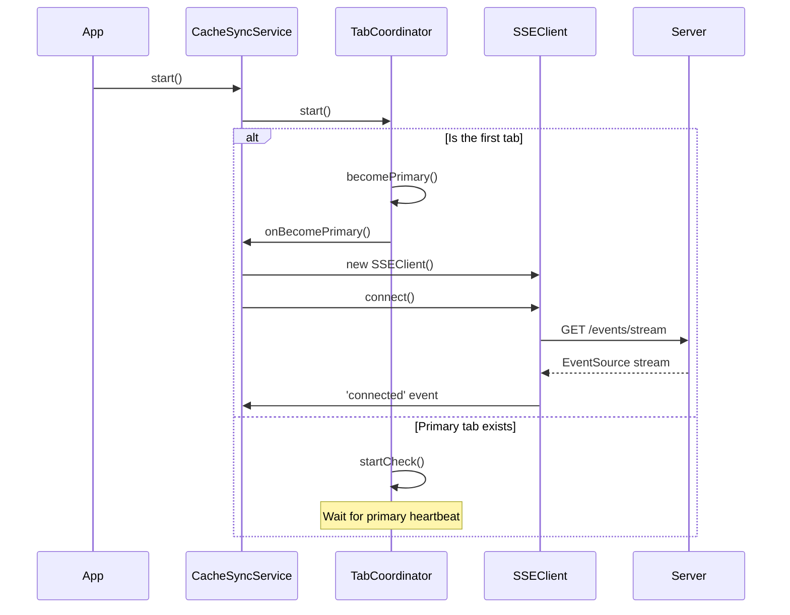
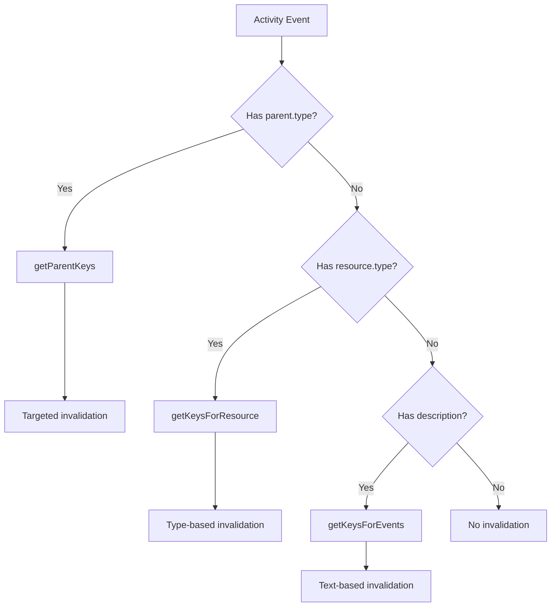

# SSE & Cache Sync - Server-Sent Events with Cache Invalidation

> This document describes the SSE (Server-Sent Events) implementation for real-time synchronization and automatic cache invalidation in the frontend.

---

## 1. Overview

### What is SSE?

Server-Sent Events (SSE) is a technology that allows the server to send updates to the client in real time through a persistent, unidirectional HTTP connection (server → client).

### Why SSE?

| Scenario                | Without SSE                          | With SSE                           |
| ----------------------- | ------------------------------------ | ---------------------------------- |
| User A edits a resource | User B sees stale data until refresh | User B sees updated data instantly |
| Multiple tabs open      | Each tab has isolated state          | Cache synchronized across all tabs |
| Periodic polling        | Resource waste                       | Updates only when needed           |

### High-Level Architecture

```
┌─────────────────────────────────────────────────────────────────────┐
│                         Frontend (Browser)                          │
├─────────────────────────────────────────────────────────────────────┤
│                                                                     │
│  ┌─────────────────┐    ┌─────────────────┐    ┌─────────────────┐  │
│  │   useSSE()      │    │  Vue Components │    │  TanStack Query │  │
│  │   Composable    │◄───┤                 │───►│    Cache        │  │
│  └────────┬────────┘    └─────────────────┘    └────────┬────────┘  │
│           │                                             ▲           │
│           ▼                                             │           │
│  ┌─────────────────────────────────────────────────────────────┐    │
│  │                    CacheSyncService                         │    │
│  │  (Singleton - orchestrates SSE + invalidation + broadcast)  │    │
│  └────────┬───────────────────────────────────────┬────────────┘    │
│           │                                       │                 │
│           ▼                                       ▼                 │
│  ┌───────────────────┐                   ┌──────────────────────┐   │
│  │   TabCoordinator  │◄──────────────────│   BroadcastManager   │   │
│  │ (Primary election)│                   │ (Cross-tab messaging)│   │
│  └────────┬──────────┘                   │ - PRIMARY_HEARTBEAT  │   │
│           │                              │ - CACHE_INVALIDATION │   │
│           ▼                              └──────────────────────┘   │
│  ┌─────────────────┐                   ┌──────────────────────┐     │
│  │    SSEClient    │───────────────────│   CacheInvalidator   │     │
│  │ (EventSource)   │                   │ (Query invalidation) │     │
│  └────────┬────────┘                   │ Returns invalidated  │     │
│           │                            │ keys for broadcast   │     │
│           │                            └──────────────────────┘     │
│           │                                       │                 │
└───────────┼───────────────────────────────────────┼─────────────────┘
            │                                       ▲
            ▼                                       │
┌─────────────────────────────────────────────────────────────────────┐
│                         Backend (API)                               │
│                                                                     │
│   GET /v4/events/stream  ───────►  EventSource connection           │
│   Events: connected, activity, ping, close                          │
└─────────────────────────────────────────────────────────────────────┘
```

> **Note:** The `CACHE_INVALIDATION` message is broadcast via `BroadcastManager` to ensure all tabs invalidate their cache when the primary tab receives an SSE activity event.

---

## 2. Core Components

### 2.1 SSEClient

**File:** `src/services/v2/base/sse/sse-client.js`

Wrapper around the native `EventSource` API with automatic reconnection and lifecycle management.

#### Responsibilities

- Connect to SSE endpoint
- Manage reconnections with exponential backoff
- Emit events to subscribers
- Provide connection state

#### Public API

```javascript
import { SSEClient } from '@/services/v2/base/sse/sse-client'

const client = new SSEClient({
  url: '/events/stream',
  withCredentials: true, // Send session cookies
  reconnectMaxAttempts: 10, // Maximum attempts
  reconnectBaseDelay: 1000, // Initial delay (ms)
  reconnectMaxDelay: 30000 // Maximum delay (ms)
})

// Connect
client.connect()

// Subscribe to events
const unsub = client.on('connected', (data) => {
  console.log('Client ID:', data.client_id)
})

client.on('activity', (event) => {
  console.log('Activity:', event.data)
})

client.on('error', (error) => {
  console.error('SSE error:', error)
})

// Disconnect
client.disconnect()

// Full cleanup
client.destroy()
```

#### Configuration

| Option                 | Type      | Default      | Description                   |
| ---------------------- | --------- | ------------ | ----------------------------- |
| `url`                  | `string`  | **required** | SSE endpoint                  |
| `withCredentials`      | `boolean` | `true`       | Send session cookies          |
| `reconnectMaxAttempts` | `number`  | `10`         | Maximum reconnection attempts |
| `reconnectBaseDelay`   | `number`  | `1000`       | Initial delay in ms           |
| `reconnectMaxDelay`    | `number`  | `30000`      | Maximum delay in ms           |

#### State

```javascript
client.getState()
// Returns:
{
  isConnected: boolean,
  clientId: string | null,
  reconnectAttempts: number,
  lastError: Error | null
}
```

#### Events

| Event                  | Payload                    | Description                              |
| ---------------------- | -------------------------- | ---------------------------------------- |
| `open`                 | `{}`                       | Connection established (HTTP)            |
| `connected`            | `{ client_id, timestamp }` | Server confirmed connection              |
| `activity`             | `{ type, data }`           | Activity in the system                   |
| `ping`                 | `{ type: 'ping' }`         | Keep-alive from server (named SSE event) |
| `close`                | `{}`                       | Connection closed                        |
| `error`                | `Error`                    | Connection error                         |
| `maxReconnectAttempts` | `{ attempts }`             | Exhausted attempts                       |

#### Exponential Backoff

```javascript
// Formula: delay = min(maxDelay, baseDelay * 2^attempts)
// Attempt 1: 1000ms
// Attempt 2: 2000ms
// Attempt 3: 4000ms
// Attempt 4: 8000ms
// ...
// Attempt N: 30000ms (maximum)
```

---

### 2.2 CacheSyncService

**File:** `src/services/v2/base/cache-sync/cache-sync-service.js`

Singleton that orchestrates all SSE + Cache synchronization.

#### Responsibilities

- Manage SSE lifecycle
- Coordinate primary tab election
- Delegate cache invalidation
- **Broadcast invalidation events to other tabs**
- **Handle remote invalidation broadcasts from other tabs**
- Provide connection state to the application

#### Dependency Diagram

```
CacheSyncService
├── TabCoordinator (primary tab election)
│   └── BroadcastManager (cross-tab messaging)
├── SSEClient (SSE connection - primary tab only)
├── CacheInvalidator (converts events to invalidations)
├── BroadcastManager (CACHE_INVALIDATION broadcast)
└── queryClient (direct invalidation for remote events)
```

#### Public API

```javascript
import {
  cacheSyncService,
  startCacheSync,
  resetCacheSync
} from '@/services/v2/base/cache-sync/cache-sync-service'

// Start service (typically in main.ts)
startCacheSync()

// Stop service
resetCacheSync()

// Access state
const state = cacheSyncService.state
// { isConnected: boolean, clientId: string | null }

// Subscribe to events (passes through to SSEClient)
const unsub = cacheSyncService.on('connected', (data) => {
  console.log('Connected:', data.client_id)
})

// Check connection
if (cacheSyncService.isConnected) {
  // SSE connected
}
```

#### Connection Flow



#### Reconnect on 'close'

When the server sends a `close` event, the service schedules a reconnection:

```javascript
// In cache-sync-service.js
#scheduleReconnect() {
  this.#closedReconnectTimeoutId = setTimeout(() => {
    this.#disconnectSSE()
    this.#connectSSE()
  }, 1000)
}
```

---

### 2.3 CacheInvalidator

**File:** `src/services/v2/base/cache-sync/cache-invalidator.js`

Single responsibility: convert activity events into query invalidations and return the invalidated keys for cross-tab propagation.

#### Responsibilities

- Parse activity events
- Resolve affected query keys
- Invalidate TanStack Query cache
- **Return invalidated keys for cross-tab broadcast**

#### Invalidation Flow

```javascript
// Input event (example)
{
  type: 'activity',
  data: {
    user: { email: 'user@example.com', name: 'User' },
    activity_type: 'updated',
    resource: {
      type: 'application',
      name: 'my-app',
      id: '12345',
      parent: { type: 'Application', id: '1772656941' }
    },
    timestamp: '2024-01-15T10:30:00Z',
    description: 'Application my-app was updated',
    metadata: { id: 12345 }
  }
}

// Resulting invalidation + return value
const invalidatedKeys = await invalidator.invalidate(event)
// Returns: [['application', 'detail', '1772656941']]
// These keys are then broadcast to other tabs
```

#### Invalidation Priority



#### Detailed Logic

```javascript
async invalidate(event) {
  const resourceType = event?.data?.resource?.type?.toLowerCase()
  const activityType = event?.data?.activity_type?.toLowerCase()
  const resourceId = event?.data?.metadata?.id
  const description = event?.data?.description
  const parentType = event?.data?.resource?.parent?.type?.toLowerCase()
  const parentId = event?.data?.resource?.parent?.id

  let keysToInvalidate = []

  // 1. Priority: Parent-based invalidation (most specific)
  if (parentType && parentType !== '-') {
    keysToInvalidate = getParentKeys(parentType, parentId)
  }
  // 2. Fallback: Resource type-based invalidation
  else if (resourceType) {
    keysToInvalidate = getKeysForResource(resourceType, activityType, resourceId)
  }
  // 3. Fallback: Description text-based invalidation
  else if (description) {
    keysToInvalidate = getKeysForEvents([description])
  }

  if (keysToInvalidate.length === 0) return []

  // Invalidate all found queries
  await Promise.allSettled(
    keysToInvalidate.map(key => queryClient.invalidateQueries({ queryKey: key }))
  )

  // Return keys for cross-tab broadcast
  return keysToInvalidate
}
```

> **Note:** The return value is used by `CacheSyncService` to broadcast invalidation events to other tabs via `BroadcastChannel`.

---

### 2.4 InvalidationMap

**File:** `src/services/v2/base/cache-sync/invalidation-map.js`

Maps resource types and events to TanStack Query query keys.

#### Structure

```javascript
// Resource type mapping → query keys
RESOURCE_TYPE_MAP = {
  application: {
    group: 'edge-app',
    getKeys: (resourceId) =>
      [['application', 'all'], resourceId ? ['application', 'detail', resourceId] : null].filter(
        Boolean
      )
  }
  // ...
}

// Parent types mapping → query keys
PARENT_TYPE_TO_QUERY_KEY = {
  Application: 'application',
  'Edge Application': 'application',
  Firewall: 'firewall'
  // ...
}

// Prefix-based text mapping (fallback)
INVALIDATION_MAP = [
  { prefix: 'Edge Application', group: 'edge-app', keys: [['application', 'all']] },
  { prefix: 'Firewall', group: 'edge-firewall', keys: [['firewall', 'all']] }
  // ...
]
```

#### Factory Functions

```javascript
// Simple mapping (only 'all')
createSimpleMapping(queryKeys.application, GROUPS.EDGE_APP)
// → { group: 'edge-app', getKeys: () => [['application', 'all']] }

// Detail mapping ('all' + 'detail')
createDetailMapping(queryKeys.application, GROUPS.EDGE_APP)
// → { group: 'edge-app', getKeys: (id) => [['application', 'all'], ['application', 'detail', id]] }

// Multi-key mapping (multiple query keys)
createMultiKeyMapping([queryKeys.edgeFunction, queryKeys.application])
// → { group: null, getKeys: () => [['edge-function', 'all'], ['application', 'all']] }
```

#### Deduplication Groups

```javascript
const GROUPS = {
  EDGE_APP: 'edge-app',
  EDGE_APP_FUNCTIONS: 'edge-app-functions',
  EDGE_APP_RULES_ENGINE: 'edge-app-rules-engine',
  EDGE_FIREWALL: 'edge-firewall',
  WORKLOADS: 'workloads',
  TEAMS: 'teams'
  // ...
}
```

Groups prevent duplicate invalidation when multiple events affect the same resource.

#### Exported Functions

```javascript
// Parent-based invalidation
getParentKeys(parentType, parentId)
// Ex: getParentKeys('Application', '123')
// → [['application', 'detail', '123']]

// Resource type-based invalidation
getKeysForResource(resourceType, activityType, resourceId)
// Ex: getKeysForResource('application', 'updated', '123')
// → [['application', 'all'], ['application', 'detail', '123']]

// Text-based invalidation
getKeysForEvents(['Edge Application my-app was updated'])
// → [['application', 'all']]
```

---

## 3. useSSE Composable

**File:** `src/composables/useSSE.js`

Vue 3 composable for accessing SSE state in components.

#### API

Returns an object with:

| Property          | Type                  | Description                                             |
| ----------------- | --------------------- | ------------------------------------------------------- |
| `isConnected`     | `Ref<boolean>`        | Whether SSE is connected                                |
| `clientId`        | `Ref<string\|null>`   | Server-assigned client ID                               |
| `connectionState` | `ComputedRef<string>` | `'connected'`, `'disconnected'`, or `'error'`           |
| `lastEvent`       | `Ref<Object\|null>`   | Last activity event received                            |
| `error`           | `Ref<Error\|null>`    | Last error encountered                                  |
| `subscribe`       | `Function`            | Subscribe to events: `(event, callback) => unsubscribe` |

#### Basic Usage

```vue
<script setup>
  import { useSSE } from '@/composables/useSSE'

  const { isConnected, connectionState, clientId } = useSSE()
</script>

<template>
  <div class="connection-status">
    <span
      v-if="isConnected"
      class="connected"
    >
      ● Connected ({{ clientId }})
    </span>
    <span
      v-else
      class="disconnected"
    >
      ○ {{ connectionState }}
    </span>
  </div>
</template>
```

#### Subscribing to Events

```vue
<script setup>
  import { useSSE } from '@/composables/useSSE'

  const { subscribe, lastEvent } = useSSE()

  // Auto-cleanup on unmount
  const unsubscribe = subscribe('activity', (event) => {
    console.log('New activity:', event.data.description)
  })
</script>
```

#### Complete Example

```vue
<script setup>
  import { useSSE } from '@/composables/useSSE'
  import { computed } from 'vue'

  const { isConnected, connectionState, clientId, lastEvent, error, subscribe } = useSSE()

  // Format last event
  const lastActivityDescription = computed(() => {
    return lastEvent.value?.data?.description ?? 'No recent activity'
  })

  // Status badge
  const statusBadge = computed(() => {
    switch (connectionState.value) {
      case 'connected':
        return { color: 'green', text: 'Connected' }
      case 'error':
        return { color: 'red', text: 'Error' }
      default:
        return { color: 'gray', text: 'Disconnected' }
    }
  })
</script>

<template>
  <div class="sse-status-panel">
    <!-- Status Badge -->
    <div
      class="status-badge"
      :class="statusBadge.color"
    >
      {{ statusBadge.text }}
      <span
        v-if="isConnected"
        class="client-id"
      >
        ({{ clientId?.slice(0, 8) }})
      </span>
    </div>

    <!-- Error -->
    <div
      v-if="error"
      class="error-message"
    >
      {{ error.message }}
    </div>

    <!-- Last Activity -->
    <div class="last-activity">
      <span class="label">Last activity:</span>
      <span class="description">{{ lastActivityDescription }}</span>
    </div>
  </div>
</template>
```

---

## 4. SSE Event Types

### 4.1 Connected

Emitted when the SSE connection is established.

**Example:**

```json
{
  "type": "connected",
  "client_id": "1705312345678-abc123def",
  "timestamp": "2024-01-15T10:30:00.000Z"
}
```

### 4.2 Activity

Emitted when an activity occurs in the system (resource created, updated, deleted, etc.).

**Example:**

```json
{
  "type": "activity",
  "data": {
    "user": {
      "email": "admin@example.com",
      "name": "Admin User"
    },
    "activity_type": "updated",
    "resource": {
      "type": "application",
      "name": "my-production-app",
      "id": "12345",
      "parent": {
        "type": "Application",
        "id": "1772656941"
      }
    },
    "timestamp": "2024-01-15T10:30:00.000Z",
    "description": "Application my-production-app was updated",
    "metadata": {
      "id": 12345
    }
  }
}
```

### 4.3 Ping

Keep-alive event sent as a **named SSE event**:

```
event: ping
data: {}
```

The client handles this via `addEventListener('ping', ...)` and emits `{ type: 'ping' }` to subscribers. No action required.

### 4.4 Close

Server requests connection closure. Client reconnects after a 1-second delay.

**Example:**

```json
{
  "type": "close",
  "reason": "timeout"
}
```

---

## 5. Multi-Tab Coordination

### 5.1 The Problem

With multiple tabs open:

- Each tab could create its own SSE connection → resource waste
- Cache could become inconsistent between tabs
- Race conditions in invalidation

### 5.2 Solution: Primary Tab Election

```
┌─────────────────────────────────────────────────────────────────────┐
│                           Browser                                   │
├─────────────────────────────────────────────────────────────────────┤
│                                                                     │
│  ┌──────────────────┐    BroadcastChannel    ┌──────────────────┐   │
│  │     Tab A        │◄──────────────────────►│     Tab B        │   │
│  │    (PRIMARY)     │    PRIMARY_HEARTBEAT   │   (SECONDARY)    │   │
│  │                  │                        │                  │   │
│  │  ┌────────────┐  │                        │                  │   │
│  │  │ SSEClient  │  │                        │                  │   │
│  │  │    ↓       │  │                        │                  │   │
│  │  │ Server     │  │                        │                  │   │
│  │  └────────────┘  │                        │                  │   │
│  └──────────────────┘                        └──────────────────┘   │
│                                                                     │
│  ┌──────────────────┐                                               │
│  │     Tab C        │                                               │
│  │   (SECONDARY)    │                                               │
│  │                  │                                               │
│  └──────────────────┘                                               │
│                                                                     │
└─────────────────────────────────────────────────────────────────────┘
```

### 5.3 TabCoordinator

**File:** `src/services/v2/base/broadcast/tab-coordinator.js`

#### Mechanism

1. **Heartbeat:** Primary tab sends `PRIMARY_HEARTBEAT` every 10s
2. **Check:** Secondary tabs verify if primary is active
3. **Election:** If primary inactive for 20s, the next tab takes over

```javascript
const HEARTBEAT_INTERVAL = 10000 // 10 seconds
const INACTIVE_TIMEOUT = HEARTBEAT_INTERVAL * 2 // 20 seconds
```

#### Callbacks

```javascript
const tabCoordinator = new TabCoordinator(broadcast, {
  onBecomePrimary: () => {
    // Connect SSE
  },
  onLosePrimary: () => {
    // Disconnect SSE
  }
})
```

### 5.4 BroadcastManager

**File:** `src/services/v2/base/broadcast/broadcast-manager.js`

Wrapper around `BroadcastChannel` API for cross-tab communication.

```javascript
const broadcast = new BroadcastManager('cache-sync')

broadcast.start()

broadcast.on('PRIMARY_HEARTBEAT', (data, fromTabId) => {
  // Received heartbeat from another tab
})

broadcast.send('PRIMARY_HEARTBEAT', { tabId: this.tabId })

broadcast.close()
```

---

## 6. Cache Synchronization

### 6.1 Overview

The project uses a **dual-layer approach** for cache synchronization across tabs:

1. **`broadcastQueryClient`** - TanStack Query's experimental cross-tab sync (backup mechanism)
2. **Manual `CACHE_INVALIDATION` broadcast** - Explicit invalidation propagation via BroadcastChannel

### 6.2 broadcastQueryClient (Backup)

The `broadcastQueryClient` from TanStack Query provides baseline cross-tab synchronization:

```javascript
// In queryClient.js
import { broadcastQueryClient } from '@tanstack/query-broadcast-client-experimental'

broadcastQueryClient(queryClient, {
  broadcastChannel: 'azion-query-sync'
})
```

### 6.3 Manual Cross-Tab Invalidation (Primary)

Due to limitations in `broadcastQueryClient` (it doesn't reliably propagate invalidation events when tabs don't have active query observers), the system implements **manual broadcasting** via `BroadcastManager`:

```
┌───────────────────────────────────────────────────────────────────────────────┐
│                              BROWSER                                          │
├───────────────────────────────────────────────────────────────────────────────┤
│                                                                               │
│  ┌────────────────────┐                     ┌────────────────────┐            │
│  │   Tab A (PRIMARY)  │                     │   Tab B (SECONDARY)│            │
│  ├────────────────────┤                     ├────────────────────┤            │
│  │                    │                     │                    │            │
│  │  SSEClient         │                     │                    │            │
│  │      ↓             │                     │                    │            │
│  │  Activity Event    │                     │                    │            │
│  │      ↓             │                     │                    │            │
│  │  CacheInvalidator  │                     │                    │            │
│  │      ↓             │   CACHE_INVALID-    │  BroadcastManager  │            │
│  │  queryClient       │───ATION broadcast──►│  .on('CACHE_INVALI-│            │
│  │  .invalidateQueries│                     │  DATION')          │            │
│  │      ↓             │                     │      ↓             │            │
│  │  BroadcastManager  │                     │  queryClient       │            │
│  │  .send('CACHE_INVAL│                     │  .invalidateQueries│            │
│  │  IDATION', {keys}) │                     │                    │            │
│  └────────────────────┘                     └────────────────────┘            │
│                                                                               │
│                        BroadcastChannel: 'cache-sync'                         │
└───────────────────────────────────────────────────────────────────────────────┘
```

### 6.4 Implementation Details

#### In `CacheSyncService`

```javascript
// Listen for cache invalidation broadcasts from other tabs
this.#broadcast.on('CACHE_INVALIDATION', ({ keys }) => ──{
  this.#handleRemoteInvalidation(keys)
})

// Handle activity event - invalidate locally AND broadcast
this.#client.on('activity', async (event) => {
  // 1. Invalidate local cache and get the keys that were invalidated
  const invalidatedKeys = await this.#invalidator.invalidate(event)

  // 2. Broadcast to other tabs (they will also invalidate)
  if (invalidatedKeys && invalidatedKeys.length > 0) {
    this.#broadcast.send('CACHE_INVALIDATION', { keys: invalidatedKeys })
  }
})
```

#### Remote Invalidation Handler

```javascript
#handleRemoteInvalidation(keys) {
  if (!keys || keys.length === 0) return

  keys.forEach((key) => {
    queryClient.invalidateQueries({ queryKey: key })
  })
}
```

### 6.5 Why Manual Broadcast?

| Issue with `broadcastQueryClient`                  | Manual Broadcast Solution                    |
| -------------------------------------------------- | -------------------------------------------- |
| Doesn't propagate when tab has no active observers | Works regardless of query subscription state |
| Only syncs state changes, not invalidation markers | Explicitly broadcasts invalidation keys      |
| Timing issues when tab is backgrounded             | Immediate broadcast via BroadcastChannel     |

### 6.6 Complete Flow

```
1. Server sends 'activity' event
   ↓
2. SSEClient (primary tab) receives it
   ↓
3. CacheInvalidator processes it and returns invalidated keys
   ↓
4. queryClient.invalidateQueries() (local)
   ↓
5. BroadcastManager.send('CACHE_INVALIDATION', { keys })
   ↓
6. Other tabs receive broadcast via BroadcastChannel
   ↓
7. Each tab calls queryClient.invalidateQueries() for each key
   ↓
8. All tabs refetch stale data
```

### 6.7 Edge Cases

| Scenario                                         | Behavior                                                                    |
| ------------------------------------------------ | --------------------------------------------------------------------------- |
| Tab becomes primary after receiving invalidation | New primary establishes SSE connection and starts receiving events directly |
| Primary tab closes                               | Secondary tabs detect timeout (20s) and one becomes primary                 |
| Multiple rapid activity events                   | Each event broadcasts separately; Vue Query handles deduplication           |
| Keys are `null` or empty                         | No broadcast sent (check in handler)                                        |

---

## 7. Error Handling

### 7.1 Automatic Reconnection

The `SSEClient` reconnects automatically with exponential backoff:

| Attempt | Delay     |
| ------- | --------- |
| 1       | 1s        |
| 2       | 2s        |
| 3       | 4s        |
| 4       | 8s        |
| 5       | 16s       |
| 6+      | 30s (max) |

### 7.2 Maximum Attempts

After 10 failed attempts, emits `maxReconnectAttempts`:

```javascript
client.on('maxReconnectAttempts', ({ attempts }) => {
  // Show notification to user
  showToast('Connection lost. Please refresh the page.', 'error')
})
```

### 7.3 Connection States

```javascript
const { connectionState } = useSSE()

// connectionState can be:
// - 'connected'   → SSE active
// - 'disconnected' → No connection
// - 'error'       → Connection error
```

---

## 8. Initialization

### 8.1 main.ts

```javascript
import { createApp } from 'vue'
import App from './App.vue'
import { startCacheSync } from '@/services/v2/base/cache-sync/cache-sync-service'

const app = createApp(App)

// Start synchronization after mounting
app.mount('#app')

// Start SSE (only primary tab will connect)
startCacheSync()
```

### 8.2 Cleanup

For tests or logout:

```javascript
import { resetCacheSync } from '@/services/v2/base/cache-sync/cache-sync-service'

// Before logout
resetCacheSync()
```

### 8.3 Authentication Integration

SSE lifecycle is tied to authentication. The connection only exists for authenticated users:

```javascript
// sessionManager.js
import { startCacheSync, resetCacheSync } from '@/services/v2/base/cache-sync'

export const sessionManager = {
  afterLogin() {
    const accountStore = useAccountStore()
    if (accountStore.isClientAccount) {
      startCacheSync() // SSE starts after login
    }
  },

  async logout() {
    resetCacheSync() // SSE stops on logout
    await clearAllData()
  }
}
```

This ensures:

- SSE only runs for authenticated users
- No orphaned connections after logout
- Clean reconnection on re-login

### 8.4 SSE Event Formats

The server can send events in two formats:

1. **Named SSE events** - Captured via `addEventListener`:

   ```
   event: ping
   data: {}
   ```

2. **JSON messages** - Captured via `onmessage`:
   ```
   data: {"type":"connected","client_id":"..."}
   ```

The SSEClient handles both formats transparently. The `ping` event uses the named format, while `connected` and `activity` use JSON messages.

---

## 9. Testing SSE

### 9.1 Mocking SSEClient

```javascript
// __mocks__/sse-client.js
export class SSEClient {
  constructor(options) {
    this.options = options
    this.listeners = new Map()
  }

  connect() {
    setTimeout(() => this.#emit('open', {}), 0)
    setTimeout(
      () =>
        this.#emit('connected', {
          type: 'connected',
          client_id: 'test-client-id',
          timestamp: new Date().toISOString()
        }),
      10
    )
  }

  disconnect() {
    this.#emit('close', {})
  }

  on(event, callback) {
    if (!this.listeners.has(event)) {
      this.listeners.set(event, new Set())
    }
    this.listeners.get(event).add(callback)
    return () => this.off(event, callback)
  }

  off(event, callback) {
    this.listeners.get(event)?.delete(callback)
  }

  #emit(event, data) {
    this.listeners.get(event)?.forEach((cb) => cb(data))
  }

  destroy() {
    this.listeners.clear()
  }
}
```

### 9.2 Testing the Composable

```javascript
import { describe, it, expect, vi, beforeEach } from 'vitest'
import { useSSE } from '@/composables/useSSE'

vi.mock('@/services/v2/base/cache-sync/cache-sync-service', () => ({
  cacheSyncService: {
    state: { isConnected: false, clientId: null },
    on: vi.fn((event, callback) => {
      return () => {}
    }),
    off: vi.fn()
  }
}))

describe('useSSE', () => {
  it('returns initial state', () => {
    const { isConnected, connectionState } = useSSE()

    expect(isConnected.value).toBe(false)
    expect(connectionState.value).toBe('disconnected')
  })

  it('subscribes to events on mount', () => {
    const { subscribe } = useSSE()
    const callback = vi.fn()

    subscribe('activity', callback)
    // Verify callback is called when event is emitted
  })
})
```

### 9.3 Testing CacheInvalidator

```javascript
import { describe, it, expect, vi } from 'vitest'
import { CacheInvalidator } from '@/services/v2/base/cache-sync/cache-invalidator'
import { queryClient } from '@/services/v2/base/query/queryClient'

vi.mock('@/services/v2/base/query/queryClient', () => ({
  queryClient: {
    invalidateQueries: vi.fn(() => Promise.resolve())
  }
}))

describe('CacheInvalidator', () => {
  it('invalidates based on parent type', async () => {
    const invalidator = new CacheInvalidator()

    const keys = await invalidator.invalidate({
      type: 'activity',
      data: {
        resource: {
          type: 'application',
          parent: { type: 'Application', id: '123' }
        },
        activity_type: 'updated'
      }
    })

    expect(queryClient.invalidateQueries).toHaveBeenCalledWith({
      queryKey: ['application', 'detail', '123']
    })

    // Should return invalidated keys for broadcast
    expect(keys).toContainEqual(['application', 'detail', '123'])
  })
})
```

### 9.4 Testing Cross-Tab Cache Invalidation

```javascript
import { describe, it, expect, vi, beforeEach } from 'vitest'
import { startCacheSync } from '@/services/v2/base/cache-sync/cache-sync-service'
import { queryClient } from '@/services/v2/base/query/queryClient'

const flushPromises = () => new Promise((resolve) => setTimeout(resolve, 0))

describe('Cross-tab cache invalidation', () => {
  it('should broadcast CACHE_INVALIDATION after receiving activity event', async () => {
    const mockSend = vi.fn()
    // ... setup mock broadcast with send spy ...

    startCacheSync()
    onBecomePrimaryCallback?.()

    const activityEvent = {
      data: {
        resource: { type: 'application' },
        activity_type: 'updated',
        metadata: { id: '123' }
      }
    }

    mockSSEClient._emit('activity', activityEvent)
    await flushPromises()

    expect(mockSend).toHaveBeenCalledWith('CACHE_INVALIDATION', {
      keys: expect.arrayContaining([
        ['application', 'all'],
        ['application', 'detail', '123']
      ])
    })
  })

  it('should invalidate local cache when receiving CACHE_INVALIDATION broadcast', () => {
    const mockInvalidate = vi.spyOn(queryClient, 'invalidateQueries')

    startCacheSync()

    // Simulate receiving broadcast from another tab
    const broadcastListener = mockBroadcast.on.mock.calls.find(
      (call) => call[0] === 'CACHE_INVALIDATION'
    )?.[1]

    broadcastListener({ keys: [['application', 'all']] })

    expect(mockInvalidate).toHaveBeenCalledWith({
      queryKey: ['application', 'all']
    })
  })

  it('should not broadcast when invalidation returns empty array', async () => {
    mockInvalidate.mockResolvedValueOnce([])

    startCacheSync()

    const activityEvent = {
      data: {
        resource: { type: 'unknown' },
        activity_type: 'updated'
      }
    }

    mockSSEClient._emit('activity', activityEvent)
    await flushPromises()

    expect(mockBroadcastInstance.send).not.toHaveBeenCalled()
  })
})
```

---

## 10. Troubleshooting

### 10.1 SSE not connecting

**Symptoms:**

- `isConnected` always `false`
- Console error: `EventSource error`

**Possible causes:**

1. Endpoint not accessible
2. CORS blocking credentials
3. Authentication expired

**Diagnosis:**

```javascript
// In browser console
const es = new EventSource('/events/stream', { withCredentials: true })
es.onerror = (e) => console.log('SSE error:', e)
es.onopen = () => console.log('SSE connected')
```

### 10.2 Cache not invalidating

**Symptoms:**

- `activity` event received but data not updating

**Possible causes:**

1. Resource type not mapped
2. Query key different from expected

**Diagnosis:**

```javascript
// Check queryClient cache state
import { queryClient } from '@/services/v2/base/query/queryClient'

console.log(
  queryClient
    .getQueryCache()
    .getAll()
    .map((q) => q.queryKey)
)
```

### 10.3 Multiple SSE connections

**Symptoms:**

- Multiple tabs connecting to SSE
- Duplicate logs

**Possible causes:**

1. `TabCoordinator` not started
2. `BroadcastChannel` not supported

**Diagnosis:**

```javascript
// Check if primary
import { cacheSyncService } from '@/services/v2/base/cache-sync/cache-sync-service'

// Should be true in only one tab
console.log('Is primary:', cacheSyncService.state.isPrimary)
```

---

## 11. HTTP/2 Proxy Requirement

### The Problem

SSE connections do not work correctly in the local development environment with Vite's default proxy.

#### Symptoms

- `EventSource` connection hangs/pending
- No headers received from the SSE stream
- Works in production but not locally

#### Root Cause Analysis

The issue is NOT related to:

- `withCredentials` configuration
- Cookie handling
- CORS settings

The actual cause is a **protocol mismatch**:

| Test Case                                                | Result         |
| -------------------------------------------------------- | -------------- |
| `curl https://stage-api.azion.com/v4/sse`                | Works (HTTP/2) |
| `curl --http1.1 https://stage-api.azion.com/v4/sse`      | Hangs/pending  |
| `curl http://localhost:5173/v4/sse` (Vite default proxy) | Hangs/pending  |

**Conclusion:**

- The `/v4/sse` endpoint requires HTTP/2 to function correctly
- Vite's default proxy uses `http-proxy`, which makes upstream connections in HTTP/1.1
- Therefore, SSE streams never open in local development with the standard proxy

### Why Vite's Native Solution Doesn't Work

#### Vite 7.2+ and HTTP/2 Support

Vite 7.2 introduced HTTP/2 support even when proxy is enabled ([PR #20869](https://github.com/vitejs/vite/pull/20869)). This was possible because `http-proxy-3` (the library used by Vite for proxying) added support for "incoming HTTP/2" ([PR #33](https://github.com/sagemathinc/http-proxy-3/pull/33)).

#### Limitation of http-proxy-3

The support added is **only for incoming connections** (browser → dev server). The proxy still makes upstream requests (dev server → backend) in HTTP/1.1:

| Direction                       | Vite < 7.2                  | Vite 7.2+            |
| ------------------------------- | --------------------------- | -------------------- |
| Browser → Dev Server (incoming) | HTTP/1.1 when proxy enabled | HTTP/2               |
| Dev Server → Backend (upstream) | HTTP/1.1                    | HTTP/1.1 (no change) |

As described in the `http-proxy-3` PR:

> _"For full http2 support, the proxy server should forward the request as http2, if possible, but this will require a much larger effort, because the https client currently used can't make h2 requests and the http2 client can't make http1 requests."_

#### Conclusion

A custom middleware using `node:http2` **remains necessary** even after updating to Vite 7.2+. There is no native Vite parameter that allows configuring the upstream proxy to use HTTP/2.

### The Solution: Custom HTTP/2 Proxy Plugin

A dedicated Vite plugin was created in `src/plugins/sse-http2-proxy/` to proxy SSE using HTTP/2.

#### What It Does

- Intercepts requests to `/v4/sse`
- Uses native `node:http2` for the upstream connection
- Forwards relevant headers:
  - `accept: text/event-stream`
  - `cookie`
  - `last-event-id` (when present)
- Returns the upstream response as an SSE stream with:
  - `content-type: text/event-stream`
  - `cache-control: no-cache`

#### Configuration in vite.config.js

```javascript
import { sseHttp2ProxyPlugin } from './src/plugins/sse-http2-proxy'

// ...
plugins: [
  vue(),
  vueJsx(),
  sseHttp2ProxyPlugin({ target: 'https://api.azion.com' })
  // ...
]
```

#### Plugin Parameters

| Parameter | Type     | Default    | Description                                 |
| --------- | -------- | ---------- | ------------------------------------------- |
| `target`  | `string` | (required) | Backend URL (e.g., `https://api.azion.com`) |
| `path`    | `string` | `/v4/sse`  | Path prefix to intercept                    |

### Compatibility Matrix

| Component                            | Protocol                           | Notes                              |
| ------------------------------------ | ---------------------------------- | ---------------------------------- |
| Browser → Dev Server                 | HTTP/1.1 or HTTP/2                 | Vite 7.2+ supports HTTP/2 incoming |
| Dev Server → Proxy Handler           | HTTP/1.1                           | Vite default proxy                 |
| Proxy Handler → Backend `/v4/sse`    | **HTTP/2** (via custom middleware) | Required for SSE to work           |
| Proxy Handler → Backend other routes | HTTP/1.1                           | Default proxy is sufficient        |

---

## 12. Integration Checklist

When adding a new resource to the system:

- [ ] Add mapping in `RESOURCE_TYPE_MAP`
- [ ] Add group in `GROUPS` (if applicable)
- [ ] Add entry in `PARENT_TYPE_TO_QUERY_KEY` (if has parent)
- [ ] Add entry in `INVALIDATION_MAP` (text fallback)
- [ ] Test invalidation manually
- [ ] Document used query keys

### Example Addition

```javascript
// Adding support for 'edge_function'

// 1. RESOURCE_TYPE_MAP
RESOURCE_TYPE_MAP['edge_function'] = createDetailMapping(
  queryKeys.edgeFunction,
  GROUPS.EDGE_FUNCTIONS
)

// 2. GROUPS
const GROUPS = {
  // ...
  EDGE_FUNCTIONS: 'edge-functions'
}

// 3. PARENT_TYPE_TO_QUERY_KEY
PARENT_TYPE_TO_QUERY_KEY['Edge Function'] = 'edgeFunction'

// 4. INVALIDATION_MAP (fallback)
INVALIDATION_MAP.push(
  createInvalidationEntry('Edge Function', GROUPS.EDGE_FUNCTIONS, [queryKeys.edgeFunction.all])
)
```

---

## 13. References

- [MDN: Server-Sent Events](https://developer.mozilla.org/en-US/docs/Web/API/Server-sent_events)
- [TanStack Query: Invalidations](https://tanstack.com/query/latest/docs/vue/guides/invalidations-from-mutations)
- [BroadcastChannel API](https://developer.mozilla.org/en-US/docs/Web/API/Broadcast_Channel_API)
- [ARCHITECTURE.md](./ARCHITECTURE.md) - Project architecture guide
