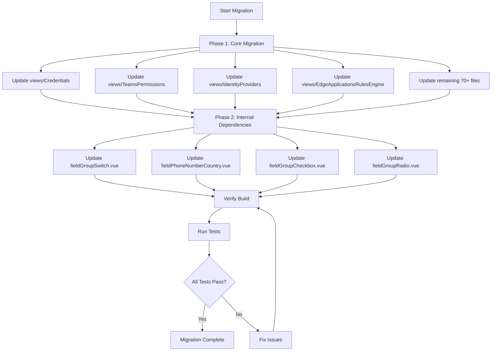

# Form Fields Migration Plan: Local to @aziontech/webkit

## Overview

This document outlines the migration plan for replacing local form-fields-inputs components with components from `@aziontech/webkit` package.

## Component Mapping

### Available Webkit Exports

| Webkit Export | Local Component | Status |
|---------------|-----------------|--------|
| `@aziontech/webkit/field-auto-complete` | `fieldAutoComplete.vue` | ✅ Ready |
| `@aziontech/webkit/field-checkbox-block` | `fieldCheckboxBlock.vue` | ✅ Ready |
| `@aziontech/webkit/field-dropdown` | `fieldDropdown.vue` | ✅ Ready |
| `@aziontech/webkit/field-dropdown-icon` | `fieldDropdownIcon.vue` | ✅ Ready |
| `@aziontech/webkit/field-dropdown-lazy-loader` | `fieldDropdownLazyLoader.vue` | ✅ Ready |
| `@aziontech/webkit/field-dropdown-lazy-loader-dynamic` | `fieldDropdownLazyLoaderDinaminc.vue` | ✅ Ready |
| `@aziontech/webkit/field-dropdown-lazy-loader-with-filter` | `fieldDropdownLazyLoaderWithFilter.vue` | ✅ Ready |
| `@aziontech/webkit/field-dropdown-multi-select-lazy-loader` | `fieldDropdownMultiSelectLazyLoader.vue` | ✅ Ready |
| `@aziontech/webkit/field-group-checkbox` | `fieldGroupCheckbox.vue` | ✅ Ready |
| `@aziontech/webkit/field-group-radio` | `fieldGroupRadio.vue` | ✅ Ready |
| `@aziontech/webkit/field-group-switch` | `fieldGroupSwitch.vue` | ✅ Ready |
| `@aziontech/webkit/field-input-group` | `fieldInputGroup.vue` | ✅ Ready |
| `@aziontech/webkit/field-multi-select` | `fieldMultiSelect.vue` | ✅ Ready |
| `@aziontech/webkit/field-number` | `fieldNumber.vue` | ✅ Ready |
| `@aziontech/webkit/field-phone-number` | `fieldPhoneNumber.vue` | ✅ Ready |
| `@aziontech/webkit/field-phone-number-country` | `fieldPhoneNumberCountry.vue` | ✅ Ready |
| `@aziontech/webkit/field-pick-list` | `fieldPickList.vue` | ✅ Ready |
| `@aziontech/webkit/field-radio-block` | `fieldRadioBlock.vue` | ✅ Ready |
| `@aziontech/webkit/field-switch` | `fieldSwitch.vue` | ✅ Ready |
| `@aziontech/webkit/field-switch-block` | `fieldSwitchBlock.vue` | ✅ Ready |
| `@aziontech/webkit/field-text` | `fieldText.vue` | ✅ Ready |
| `@aziontech/webkit/field-text-area` | `fieldTextArea.vue` | ✅ Ready |
| `@aziontech/webkit/field-text-icon` | `fieldTextIcon.vue` | ✅ Ready |
| `@aziontech/webkit/field-password` | `fieldPassword.vue` | ✅ Ready |

### Components NOT in Webkit (Internal Dependencies)

These files are internal renderers and should remain local:

| Local Path | Notes |
|------------|-------|
| `jsonform-custom-render/input-text/inputTextControlRenderer.vue` | Uses local fieldText internally |
| `jsonform-custom-render/input-password/inputPasswordControlRenderer.vue` | Uses local fieldPassword internally |
| `jsonform-custom-render/input-number/inputNumberControlRenderer.vue` | Uses local fieldNumber internally |
| `jsonform-custom-render/textarea/textareaControlRenderer.vue` | Uses local fieldTextArea internally |
| `jsonform-custom-render/dropdown/dropdownControlRenderer.vue` | Uses local fieldDropdown internally |

## Import Transformation

### Pattern

```javascript
// OLD
import FieldText from '@/templates/form-fields-inputs/fieldText'

// NEW
import FieldText from '@aziontech/webkit/field-text'
```

### Complete Import Mapping Table

| Old Import | New Import |
|------------|------------|
| `@/templates/form-fields-inputs/fieldText` | `@aziontech/webkit/field-text` |
| `@/templates/form-fields-inputs/fieldTextArea` | `@aziontech/webkit/field-text-area` |
| `@/templates/form-fields-inputs/fieldTextIcon` | `@aziontech/webkit/field-text-icon` |
| `@/templates/form-fields-inputs/fieldPassword` | `@aziontech/webkit/field-password` |
| `@/templates/form-fields-inputs/fieldDropdown` | `@aziontech/webkit/field-dropdown` |
| `@/templates/form-fields-inputs/fieldDropdownIcon` | `@aziontech/webkit/field-dropdown-icon` |
| `@/templates/form-fields-inputs/fieldDropdownLazyLoader` | `@aziontech/webkit/field-dropdown-lazy-loader` |
| `@/templates/form-fields-inputs/fieldDropdownLazyLoaderDinaminc` | `@aziontech/webkit/field-dropdown-lazy-loader-dynamic` |
| `@/templates/form-fields-inputs/fieldDropdownLazyLoaderWithFilter` | `@aziontech/webkit/field-dropdown-lazy-loader-with-filter` |
| `@/templates/form-fields-inputs/fieldDropdownMultiSelectLazyLoader` | `@aziontech/webkit/field-dropdown-multi-select-lazy-loader` |
| `@/templates/form-fields-inputs/fieldAutoComplete` | `@aziontech/webkit/field-auto-complete` |
| `@/templates/form-fields-inputs/fieldNumber` | `@aziontech/webkit/field-number` |
| `@/templates/form-fields-inputs/fieldMultiSelect` | `@aziontech/webkit/field-multi-select` |
| `@/templates/form-fields-inputs/fieldSwitch` | `@aziontech/webkit/field-switch` |
| `@/templates/form-fields-inputs/fieldSwitchBlock` | `@aziontech/webkit/field-switch-block` |
| `@/templates/form-fields-inputs/fieldCheckboxBlock` | `@aziontech/webkit/field-checkbox-block` |
| `@/templates/form-fields-inputs/fieldRadioBlock` | `@aziontech/webkit/field-radio-block` |
| `@/templates/form-fields-inputs/fieldGroupCheckbox` | `@aziontech/webkit/field-group-checkbox` |
| `@/templates/form-fields-inputs/fieldGroupRadio` | `@aziontech/webkit/field-group-radio` |
| `@/templates/form-fields-inputs/fieldGroupSwitch` | `@aziontech/webkit/field-group-switch` |
| `@/templates/form-fields-inputs/fieldInputGroup` | `@aziontech/webkit/field-input-group` |
| `@/templates/form-fields-inputs/fieldPhoneNumber` | `@aziontech/webkit/field-phone-number` |
| `@/templates/form-fields-inputs/fieldPhoneNumberCountry` | `@aziontech/webkit/field-phone-number-country` |
| `@/templates/form-fields-inputs/fieldPickList` | `@aziontech/webkit/field-pick-list` |

## Files to Modify

### Summary Statistics

- **Total files with imports**: 79 unique files
- **Total import occurrences**: 109 occurrences
- **Unique component types used**: 24 different components

### Files by Directory

#### src/views/Credentials/FormFields/
- `FormFieldsCredential.vue` - FieldText, FieldMultiSelect

#### src/views/TeamsPermissions/FormFields/
- `FormFieldsTeamPermissions.vue` - FieldText, FieldSwitchBlock

#### src/views/IdentityProviders/FormFields/
- `FormFieldsCreateIdentityProvider.vue` - FieldGroupRadio, FieldText, FieldTextArea

#### src/views/EdgeApplicationsRulesEngine/FormFields/
- `FormFieldsEdgeApplicationsRulesEngine.vue` - FieldAutoComplete, FieldDropdown, FieldDropdownLazyLoader, FieldGroupRadio, FieldSwitchBlock, FieldText, FieldTextArea

#### src/views/RealTimeEvents/FormFields/
- `FormFieldsCreateEdgeApplications.vue` - FieldText

#### src/views/EdgeApplications/V3/FormFields/
- `FormFieldsCreateEdgeApplications.vue` - FieldDropdown, FieldGroupRadio, FieldGroupSwitch, FieldSwitchBlock, FieldText

#### src/views/Playground/
- `PlaygroundView.vue` - FieldDropdownMultiSelectLazyLoader

#### src/views/EdgeFirewallRulesEngine/FormFields/
- `FormFieldsEdgeFirewallRulesEngine.vue` - FieldDropdown, FieldDropdownLazyLoader, FieldDropdownIcon, FieldNumber, FieldSwitchBlock, FieldText

#### src/views/RealTimePurge/FormFields/
- `FormFieldsCreateRealTimePurge.vue` - FieldTextArea, FieldGroupRadio

#### src/views/EdgeApplications/FormFields/block/
- `generalEdgeApp.vue` - FieldText
- `statusEdgeApp.vue` - FieldSwitchBlock
- `debugEdgeApp.vue` - FieldSwitchBlock
- `moduleEdgeApp.vue` - FieldGroupSwitch

#### src/views/ClientsManagement/FormFields/
- `FormFieldsCreateClients.vue` - FieldDropdown, FieldSwitchBlock, FieldText

#### src/views/Domains/FormFields/
- `FormFieldsCreateDomains.vue` - FieldDropdownLazyLoader, FieldTextArea, FieldText, FieldGroupRadio, FieldSwitchBlock
- `FormFieldsEditDomains.vue` - FieldDropdownLazyLoader, FieldTextArea, FieldText, FieldGroupRadio, FieldSwitchBlock

#### src/views/Home/FormFields/
- `FormFieldsHome.vue` - FieldText, FieldDropdown (partially migrated)

#### src/templates/dialog-copy-key/
- `index.vue` - FieldText

#### src/views/EdgeApplicationsCacheSettings/FormFields/
- `FormFieldsEdgeApplicationCacheSettings.vue` - FieldText
- `blocks/TieredCache.vue` - FieldDropdown, FieldSwitchBlock
- `blocks/BrowserCache.vue` - FieldGroupRadio
- `blocks/EdgeCache.vue` - FieldDropdown, FieldGroupRadio, FieldSwitchBlock
- `blocks/ApplicationAccelerator.vue` - FieldDropdown, FieldDropdownMultiSelectLazyLoader, FieldGroupCheckbox, FieldSwitchBlock, FieldTextArea

#### src/views/NetworkLists/FormFields/
- `FormFieldsCreateNetworkLists.vue` - FieldGroupRadio, FieldTextArea, FieldText
- `FormFieldsEditNetworkLists.vue` - FieldGroupRadio, FieldTextArea, FieldText

#### src/views/EdgeApplicationsOrigins/FormFields/
- `FormFieldsEdgeApplicationsOrigins.vue` - FieldDropdown, FieldGroupRadio, FieldSwitchBlock, FieldText, InputNumber (uses fieldNumber)

#### src/views/DataStream/FormFields/
- `FormFieldsTemplate.vue` - FieldText
- `blocks/GeneralSection.vue` - FieldText
- `blocks/InputSection.vue` - FieldDropdown
- `blocks/OutputSection.vue` - FieldDropdown, FieldGroupRadio, FieldNumber, FieldText, FieldTextArea
- `blocks/StatusSection.vue` - FieldSwitchBlock
- `blocks/TransformSection.vue` - FieldGroupRadio, FieldNumber, FieldPickList, FieldSwitchBlock
- `blocks/RenderTemplateSection.vue` - FieldDropdownLazyLoader

#### src/views/AccountSettings/FormFields/
- `FormFieldsAccountSettings.vue` - FieldDropdown, FieldGroupSwitch, FieldTextArea, FieldText

#### src/views/EdgeFirewall/FormFields/
- `FormFieldsEdgeFirewall.vue` - FieldGroupSwitch, FieldSwitchBlock, FieldText

#### src/views/PersonalTokens/FormFields/
- `FormFieldsPersonalToken.vue` - FieldText, FieldTextArea

#### src/views/YourSettings/FormFields/
- `FormFieldsYourSettings.vue` - FieldDropdown, FieldPhoneNumberCountry, FieldSwitchBlock, FieldText

#### src/views/ImportGitHub/FormFields/
- `FormFieldsImportGithub.vue` - FieldDropdown, FieldText

#### src/views/ResellersManagement/FormFields/
- `FormFieldsCreateResellers.vue` - FieldDropdown, FieldSwitchBlock, FieldText

#### src/views/Users/FormsFields/
- `FormFieldsUsers.vue` - FieldDropdown, FieldGroupSwitch, FieldPhoneNumber, FieldSwitchBlock, FieldText

#### src/views/EdgeServices/FormFields/
- `FormFieldsDrawerResource.vue` - FieldDropdown, FieldGroupRadio, FieldText
- `FormFieldsEdgeService.vue` - FieldSwitchBlock, FieldText

#### src/views/WafRules/
- `FormFields/FormFieldsAllowed.vue` - FieldDropdown, FieldSwitchBlock, FieldText
- `FormFields/FormFieldsWafRules.vue` - FieldDropdown, FieldGroupSwitch, FieldSwitchBlock, FieldText
- `ListWafRulesTuning.vue` - FieldDropdownLazyLoader
- `Drawer/index.vue` - FieldDropdownLazyLoader

#### src/views/EdgeConnectors/FormFields/blocks/
- `General.vue` - FieldText
- `OriginIpAcl.vue` - FieldSwitchBlock
- `LoadBalancerConfiguration.vue` - FieldDropdown, FieldNumber
- `ConnectionOptions.vue` - FieldDropdown, FieldDropdownLazyLoader, FieldSwitchBlock, FieldText
- `Status.vue` - FieldSwitchBlock
- `Modules.vue` - FieldSwitchBlock
- `Address.vue` - FieldDropdown, FieldNumber, FieldSwitchBlock, FieldText
- `hmac.vue` - FieldSwitchBlock, FieldText, FieldTextIcon
- `MutualAuthenticationSettings.vue` - FieldDropdownLazyLoader, FieldDropdownMultiSelectLazyLoader, FieldSwitchBlock
- `ConnectorType.vue` - FieldGroupRadio

#### src/views/DigitalCertificates/FormFields/
- `FormFieldsEditDigitalCertificates.vue` - FieldText, FieldTextArea
- `blocks/General.vue` - FieldText
- `blocks/ImportServerCertificate.vue` - FieldTextArea
- `blocks/RequestCertificate.vue` - FieldDropdown, FieldTextArea, FieldText
- `blocks/ImportRequestCertificate.vue` - FieldGroupRadio

#### src/views/EdgeFirewallFunctions/FormFields/
- `FormFieldsEdgeApplicationsFunctions.vue` - FieldDropdownLazyLoader, FieldText

#### src/views/EdgeDNS/FormFields/
- `FormFieldsRecords.vue` - FieldDropdown, FieldNumber, FieldTextArea
- `FormFieldsEditEdgeDns.vue` - FieldSwitchBlock, FieldText, FieldTextIcon
- `FormFieldsEdgeDns.vue` - FieldSwitchBlock, FieldText, FieldTextIcon

#### src/views/EdgeApplicationsDeviceGroups/FormFields/
- `FormFieldsEdgeApplicationsDeviceGroups.vue` - FieldText, FieldTextArea

#### src/views/EdgeFunctions/FormFields/
- `FormFieldsCreateEdgeFunctions.vue` - FieldGroupRadio, FieldSwitchBlock, FieldText, FieldTextIcon
- `FormFieldsEditEdgeFunctions.vue` - FieldGroupRadio, FieldSwitchBlock, FieldText, FieldTextIcon

#### src/views/EdgeStorage/FormFields/
- `FormFieldsCredential.vue` - FieldMultiSelect, FieldText
- `FormFieldsEdgeStorage.vue` - FieldDropdown, FieldText

#### src/views/Variables/FormFields/
- `FormFieldsVariables.vue` - FieldSwitchBlock, FieldText

#### src/views/CustomPages/
- `FormFields/CustomPages.vue` - FieldSwitchBlock
- `Blocks/customPageBlock.vue` - FieldText
- `Blocks/statusConfigurationBlock.vue` - FieldDropdown
- `Blocks/responseDetailsBlock.vue` - FieldDropdownLazyLoader, FieldNumber, FieldText, FieldTextIcon, FieldTextarea

#### src/views/EdgeSQL/FormFields/
- `FormFieldsCreateDatabase.vue` - FieldText
- `FormFieldsMainSettings.vue` - FieldSwitchBlock, FieldText

#### src/views/Workload/FormFields/
- `FormFieldsWorkload.vue` - FieldSwitchBlock
- `FormFieldsCreateDomains.vue` - FieldDropdown, FieldDropdownLazyLoader, FieldGroupRadio, FieldSwitchBlock, FieldTextArea, FieldText
- `FormFieldsEditDomains.vue` - FieldDropdown, FieldDropdownLazyLoader, FieldGroupRadio, FieldSwitchBlock, FieldTextArea, FieldText
- `blocks/mutualAuthenticationSettingsBlock.vue` - FieldDropdownLazyLoaderWithFilter, FieldDropdownMultiSelectLazyLoader, FieldGroupRadio, FieldSwitchBlock
- `blocks/protocolSettingsBlock.vue` - FieldDropdown, FieldSwitchBlock
- `blocks/domainsBlock.vue` - FieldDropdown, FieldInputGroup, FieldSwitchBlock, FieldText
- `blocks/infrastructureBlock.vue` - FieldGroupRadio
- `blocks/generalBlock.vue` - FieldText
- `blocks/deploymentSettingsBlock.vue` - FieldDropdownLazyLoader

#### src/views/EdgeNode/FormFields/
- `FormFieldsDrawerService.vue` - FieldDropdown
- `FormFieldsEdgeNode.vue` - FieldSwitchBlock, FieldText

#### src/templates/
- `clone-block/index.vue` - FieldText
- `signup-block/additional-data-form-block.vue` - FieldGroupRadio, FieldSwitchBlock
- `add-payment-method-block/add-address.vue` - FieldDropdown, FieldText
- `template-engine-block/engine-azion.vue` - FieldDropdown

#### src/templates/form-fields-inputs/ (Internal Dependencies)
- `fieldGroupSwitch.vue` - FieldSwitchBlock (internal component)
- `fieldPhoneNumberCountry.vue` - FieldPhoneNumber (internal component)
- `fieldGroupCheckbox.vue` - FieldCheckboxBlock (internal component)
- `fieldGroupRadio.vue` - FieldRadioBlock (internal component)
- `jsonform-custom-render/*` - Various internal renderers

## Implementation Approach

### Phase 1: Core Migration
1. Update all external imports in view files
2. Update imports in template files (excluding internal dependencies)

### Phase 2: Internal Components
1. Update internal form-fields-inputs components to use webkit imports where applicable
2. Keep jsonform-custom-render components using local imports since they are internal wrappers

### Phase 3: Cleanup (Optional)
1. Remove unused local component files after migration is verified
2. Keep internal components that wrap others (fieldGroupSwitch, fieldGroupCheckbox, etc.)

## Migration Execution Order



## Risk Assessment

### Low Risk
- Components with identical APIs between local and webkit versions
- FieldText, FieldDropdown, FieldTextArea have been verified to have matching APIs

### Medium Risk
- Components with potential API differences
- Need to verify each component's props and events match

### Mitigation Strategy
1. Migrate one component type at a time
2. Run tests after each batch of changes
3. Keep local files until migration is verified

## Questions for User

Before proceeding with implementation, please confirm:

1. **Migration scope**: Should we migrate all components at once or in phases?
2. **Cleanup strategy**: Should we remove local component files after successful migration, or keep them as fallback?
3. **Testing requirements**: What level of testing is required before considering the migration complete?
4. **Naming conventions**: Should we maintain the current PascalCase component names (e.g., `FieldText`) or follow the webkit naming (e.g., `field-text`)?
