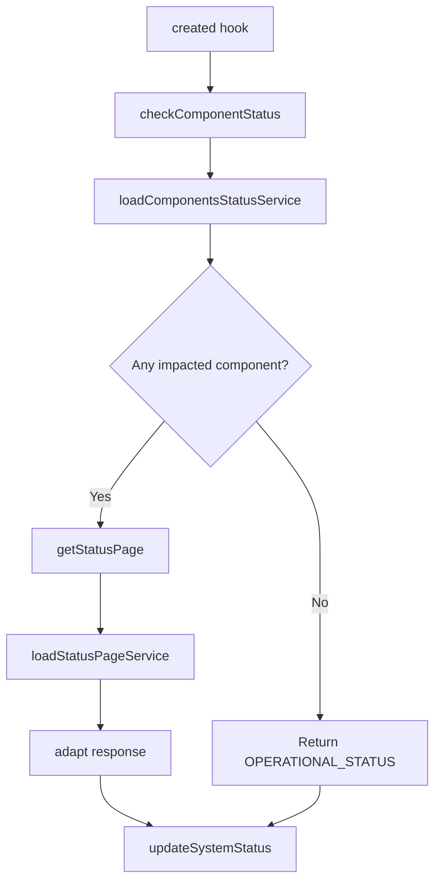

# System Status Bar Block Refactoring Plan

## Overview

Refactor [`index.vue`](src/templates/system-status-bar-block/index.vue) to remove external service dependencies and implement all HTTP logic directly using `fetch` instead of `axios`.

## Current Implementation Analysis

### Dependencies to Remove

The component currently imports from [`@/services/status-page-services`](src/services/status-page-services/index.js):

- [`loadComponentsStatusService()`](src/services/status-page-services/load-components-status-service.js:4) - Fetches `/components.json`
- [`loadStatusPageService()`](src/services/status-page-services/load-status-page-service.js:4) - Fetches `/status.json`

### API Details

| Endpoint | URL | Purpose |
|----------|-----|---------|
| Components | `https://status.azion.com/api/v2/components.json` | Get list of system components and their status |
| Status | `https://status.azion.com/api/v2/status.json` | Get overall system status |

### Response Structures

**Components Response:**
```json
{
  "components": [
    {
      "status": "operational" | "partial_outage" | "major_outage" | "degraded_performance",
      // ... other fields
    }
  ]
}
```

**Status Response:**
```json
{
  "status": {
    "indicator": "none" | "minor" | "major" | "critical" | "maintenance",
    "description": "string"
  }
}
```

### Current Logic Flow



## Implementation Plan

### Step 1: Define Constants

Move these constants to the top of the script section - they already exist:

```javascript
const STATUS_PAGE = {
  none: 'operational',
  minor: 'minor-outage',
  major: 'partial-outage',
  critical: 'major-outage',
  maintenance: 'maintenance'
}

const STATUS_PAGE_COLORS = {
  none: '#8bc249',
  minor: '#fec111',
  major: '#f3652b',
  critical: '#ff4141',
  maintenance: '#6e7cf7'
}

const OPERATIONAL_STATUS = {
  indicator: 'none',
  description: 'All Systems Operational'
}

const STATUS_API_BASE_URL = 'https://status.azion.com/api/v2'
```

### Step 2: Create Fetch Helper Function

Create a generic fetch wrapper for the status API:

```javascript
async function fetchStatusApi(endpoint) {
  const response = await fetch(`${STATUS_API_BASE_URL}${endpoint}`, {
    method: 'GET',
    headers: {
      'Content-Type': 'application/json'
    }
  })

  if (!response.ok) {
    throw new Error(`HTTP error! status: ${response.status}`)
  }

  return response.json()
}
```

### Step 3: Create Internal Methods

Replace service calls with internal fetch methods:

```javascript
async fetchComponentsStatus() {
  return fetchStatusApi('/components.json')
}

async fetchStatusPage() {
  const data = await fetchStatusApi('/status.json')
  
  // Adapt response - same logic as load-status-page-service.js
  if (data && data.status) {
    return {
      indicator: data.status.indicator,
      description: data.status.description
    }
  }
  
  return {
    indicator: 'none',
    description: 'All System Operational'
  }
}
```

### Step 4: Update Existing Methods

Modify [`checkComponentStatus()`](src/templates/system-status-bar-block/index.vue:55) to use internal fetch:

```javascript
async checkComponentStatus() {
  try {
    const data = await this.fetchComponentsStatus()
    const components = data?.components || []

    const checkComponents = (component) =>
      component.status !== 'operational' && component.status !== 'partial_outage'
    
    const hasImpactedComponent = components.some(checkComponents)

    const status = await this.getStatus(hasImpactedComponent)
    this.updateSystemStatus(status)
  } catch (error) {
    this.error = true
    console.error(error)
  }
}
```

Update [`getStatusPage()`](src/templates/system-status-bar-block/index.vue:82):

```javascript
async getStatusPage() {
  return this.fetchStatusPage()
}
```

### Step 5: Remove External Imports

Remove these imports from the component:

```javascript
// REMOVE:
import {
  loadStatusPageService,
  loadComponentsStatusService
} from '@/services/status-page-services'
```

## Final Component Structure

```vue
<script>
import PrimeButton from 'primevue/button'

// Constants
const STATUS_PAGE = { /* ... */ }
const STATUS_PAGE_COLORS = { /* ... */ }
const OPERATIONAL_STATUS = { /* ... */ }
const STATUS_API_BASE_URL = 'https://status.azion.com/api/v2'

// Helper function outside export default
async function fetchStatusApi(endpoint) {
  const response = await fetch(`${STATUS_API_BASE_URL}${endpoint}`, {
    method: 'GET',
    headers: {
      'Content-Type': 'application/json'
    }
  })

  if (!response.ok) {
    throw new Error(`HTTP error! status: ${response.status}`)
  }

  return response.json()
}

export default {
  name: 'SystemStatusBarBlock',
  components: { PrimeButton },
  data() {
    return {
      error: false,
      status: '',
      label: '',
      link: 'https://status.azion.com',
      color: STATUS_PAGE_COLORS.none
    }
  },
  created() {
    this.checkComponentStatus()
  },
  computed: {
    colorStatus() {
      return { color: this.color }
    }
  },
  methods: {
    redirectToLink() {
      window.open(this.link, '_blank')
    },
    async fetchComponentsStatus() {
      return fetchStatusApi('/components.json')
    },
    async fetchStatusPage() {
      const data = await fetchStatusApi('/status.json')
      if (data && data.status) {
        return {
          indicator: data.status.indicator,
          description: data.status.description
        }
      }
      return OPERATIONAL_STATUS
    },
    async checkComponentStatus() {
      try {
        const data = await this.fetchComponentsStatus()
        const components = data?.components || []

        const checkComponents = (component) =>
          component.status !== 'operational' && component.status !== 'partial_outage'
        
        const hasImpactedComponent = components.some(checkComponents)
        const status = await this.getStatus(hasImpactedComponent)
        this.updateSystemStatus(status)
      } catch (error) {
        this.error = true
        console.error(error)
      }
    },
    async getStatus(checkStatusPage) {
      if (checkStatusPage) {
        return this.fetchStatusPage()
      }
      return OPERATIONAL_STATUS
    },
    updateSystemStatus({ indicator, description }) {
      this.status = STATUS_PAGE[indicator]
      this.color = STATUS_PAGE_COLORS[indicator]
      this.label = description
    }
  }
}
</script>
```

## Benefits of This Approach

1. **Self-contained component** - No external service dependencies
2. **Native fetch API** - No axios dependency for simple GET requests
3. **Same functionality** - Preserves all existing behavior
4. **Cleaner code** - All logic in one file, easier to understand and maintain
5. **No breaking changes** - Component API remains the same

## Files to Modify

| File | Action |
|------|--------|
| [`src/templates/system-status-bar-block/index.vue`](src/templates/system-status-bar-block/index.vue) | Replace axios services with fetch logic |

## Files No Longer Needed (Optional Cleanup)

After this change, the following files may become unused if no other components use them:

- [`src/services/status-page-services/index.js`](src/services/status-page-services/index.js)
- [`src/services/status-page-services/load-components-status-service.js`](src/services/status-page-services/load-components-status-service.js)
- [`src/services/status-page-services/load-status-page-service.js`](src/services/status-page-services/load-status-page-service.js)

**Note:** Should verify no other components import these services before deleting.
