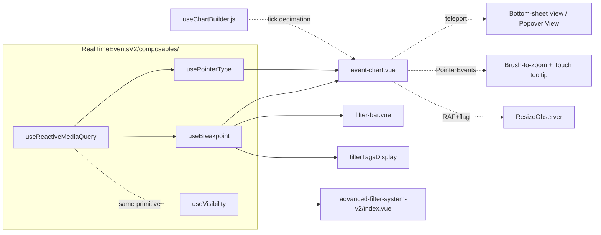

# Design: Real Time Events — Responsividade (Gráfico + Filter Bar)

> Status: **Draft, awaiting approval**
> Linked requirements: [requirements.md](./requirements.md)

## 1. Goals & Non-Goals

**Goals**
- Tornar a página `/real-time-events/v2/:tab?` operável e legível de 320px a ≥1440px com foco em **gráfico** e **filter bar**.
- Suportar interação **touch** no gráfico (brush-to-zoom e tooltip), hoje quebrada.
- Adaptar overlays teleportados (View dropdown, time range, saved searches, query history) para não estourar viewport em mobile.
- Eliminar **memory/listener leaks** via simetria explícita setup ↔ cleanup.
- Eliminar **`ResizeObserver` loops** via `requestAnimationFrame` + flag de re-entrada.
- Padronizar 5 breakpoints (mobile-s / mobile / tablet / desktop / xl) via tokens reutilizáveis.

**Non-Goals**
- Refatorar `discover-data-table`, `detail-sidebar-panel`, `events-summary-bar`, `field-sidebar`, `discover-toolbar`, `SessionTabHeader` (já têm suas próprias responsividades).
- Adicionar dependências runtime novas (sem `@vueuse/core`, sem libs de bottom-sheet).
- Migrar de C3 para outra lib de gráfico.
- Introduzir composable global de breakpoints fora do diretório `RealTimeEventsV2/composables/`.
- Implementar swipe-down dismiss no bottom-sheet (follow-up).
- Internacionalização / RTL.

## 2. High-Level Architecture

A entrega introduz uma **camada de composables responsivos** locais a `RealTimeEventsV2/`, sem mexer em infraestrutura global. Os componentes existentes (`event-chart.vue`, `filter-bar.vue`, `filterTagsDisplay`, `advanced-filter-system-v2/index.vue`) consomem esses composables para decidir layout, comportamento de pointer e pausa de auto-refresh. Estilos por breakpoint via `@media` CSS (sem refactor de tokens). Bottom-sheet do "View" dropdown reusa o `<Teleport>` atual alternando estilos via `matchMedia` reativo.



**Nenhuma mudança em rotas, API, GraphQL ou estado global Pinia.** O design é puramente client-side, scoped a `RealTimeEventsV2/`.

## 3. Components

### 3.1 `useReactiveMediaQuery(query: string): Ref<boolean>` (novo)

- **Purpose**: primitiva de baixo nível que devolve `Ref<boolean>` reativo para um `matchMedia` específico.
- **Type**: composable Vue 3.
- **Location**: `src/views/RealTimeEventsV2/composables/useReactiveMediaQuery.js`.
- **Inputs**: `query: string` (ex: `'(max-width: 639px)'`).
- **Outputs**: `Ref<boolean>` que reflete `mql.matches` reativamente.
- **Responsibilities**:
  - Criar `MediaQueryList` via `window.matchMedia(query)`.
  - Registrar handler **nomeado** `onChange(e)` que seta `state.value = e.matches`.
  - Cleanup simétrico em `onBeforeUnmount` **e** `onDeactivated` (`removeEventListener('change', onChange)`).
  - Re-registrar em `onActivated` (componentes sob `<keep-alive>`).
- **Non-responsibilities**: não interpreta breakpoints semanticamente (isso é `useBreakpoint`), não conhece os 5 tokens.
- **Touches requirements**: 10.6, 10.7.

### 3.2 `useBreakpoint(): { current: Ref<Token>, is: (t: Token) => boolean, isAtMost: (t) => boolean, isAtLeast: (t) => boolean }` (novo)

- **Purpose**: expor o token de breakpoint atual (`'mobile-s' | 'mobile' | 'tablet' | 'desktop' | 'xl'`) reativo.
- **Type**: composable Vue 3.
- **Location**: `src/views/RealTimeEventsV2/composables/useBreakpoint.js`.
- **Outputs**:
  - `current: Ref<Token>` — token atual.
  - `is(token)`: `computed` boolean para uso em template.
  - `isAtMost(token)`, `isAtLeast(token)`: helpers para faixas (ex: `isAtMost('tablet')`).
- **Responsibilities**:
  - Internamente usa 4 `useReactiveMediaQuery` (`<375px`, `375-639px`, `640-1023px`, `1024-1439px`) e deriva `current` via `computed`.
  - Cleanup transitivo (cuidado dos `useReactiveMediaQuery`).
- **Non-responsibilities**: não trata orientação (portrait/landscape) — out of scope.
- **Touches requirements**: 1.1, 1.2, 1.3, 1.10, 2.1, 2.2, 2.3, 2.4, 3.3, 4.1, 4.2, 4.3, 4.4, 4.8, 7.1, 7.2, 7.3, 9.3.

### 3.3 `useVisibility(): { state: Ref<DocumentVisibilityState>, isHidden: ComputedRef<boolean>, onVisible: (cb) => void }` (novo)

- **Purpose**: expor `document.visibilityState` reativamente.
- **Type**: composable Vue 3.
- **Location**: `src/views/RealTimeEventsV2/composables/useVisibility.js`.
- **Responsibilities**:
  - Handler nomeado `onVisibilityChange` em `document`.
  - Cleanup simétrico em `onBeforeUnmount` + `onDeactivated`.
  - `onVisible(cb)` registra callback executado na transição `hidden → visible`. Acumulador interno limpo no unmount.
- **Touches requirements**: 8.6, 8.7, 10.6, 10.7.

### 3.4 `usePointerType(): { isCoarse: Ref<boolean>, isFine: Ref<boolean> }` (novo)

- **Purpose**: detectar tipo primário de pointer do device.
- **Type**: composable Vue 3.
- **Location**: `src/views/RealTimeEventsV2/composables/usePointerType.js`.
- **Responsibilities**:
  - Usa `useReactiveMediaQuery('(pointer: coarse)')` e `useReactiveMediaQuery('(pointer: fine)')`.
  - Importante para iPads com teclado magic externo (pointer hot-plug).
- **Touches requirements**: 5.7.

### 3.5 `event-chart.vue` (modificado)

- **Purpose**: gráfico de barras temporal de eventos com brush-to-zoom e tooltip.
- **Type**: componente Vue 3 (existente — [event-chart.vue](src/views/RealTimeEventsV2/Blocks/components/event-chart.vue)).
- **Mudanças**:
  - **Pointer Events unificado**: substituir `@mousedown/move/up/leave` por `@pointerdown/move/up/cancel/leave`. Handlers renomeados `handlePointerDown/Move/Up/Cancel`. Capturar pointer (`setPointerCapture(event.pointerId)`) no down para garantir continuidade da sequência.
  - **Listener `pointermove` com `{ passive: false }`** quando `isDragging === true` para permitir `preventDefault()` durante brush em touch (evita scroll vertical da página).
  - **CSS `touch-action: pan-y`** no `.chart-container` (permite scroll vertical da página, bloqueia gestos horizontais nativos).
  - **Cursor `crosshair`** apenas em `pointer: fine` via CSS `@media (pointer: fine)`.
  - **Tooltip touch**: ao receber `pointerType === 'touch'` no `pointerdown`, exibir tooltip C3 ancorado ao bar/ponto mais próximo via `chartInstance.tooltip.show({ x: snappedX })`. `setTimeout` nomeado `tooltipDismissTimer` de 3000ms. Cleanup obrigatório em unmount/deactivated.
  - **Threshold de tap vs drag**: movimento horizontal `< 4px` desde o `pointerdown` = tap (mostrar tooltip, não emitir `brush-select`). Movimento ≥ 4px **e** ≥ 5% do width = drag (brush-to-zoom).
  - **`ResizeObserver` com rAF wrap**: callback envolvido em `requestAnimationFrame` + flag `pendingResize`. `rafHandle` ref salva, `cancelAnimationFrame(rafHandle)` no cleanup.
  - **Bottom-sheet do View dropdown**: dentro do mesmo `<Teleport to="body">`, condicional `v-if="bp.is('mobile-s') || bp.is('mobile')"` alterna entre dois templates: bottom-sheet ou popover atual.
  - **`updateViewPanelPosition`**: adicionar listeners `orientationchange` e `window.visualViewport?.addEventListener('resize')` (com cleanup simétrico).
  - **A11y**: `aria-label="Change chart view"` no botão View trigger. Bottom-sheet com `role="dialog"`, `aria-modal="true"`, `aria-labelledby` apontando para o título.
  - **Focus trap no bottom-sheet**: salvar `document.activeElement` antes do open; focar botão close ao abrir; devolver foco ao trigger ao fechar.
  - **Decimação de ticks**: passar `bp.current` para `useChartBuilder` (via prop em `buildC3Config` ou injeção). Builder decide `axis.x.tick.values` dinâmico.
  - **Altura proporcional ao viewport** (não pixel fixo nem `@media` por breakpoint): `.chart-container { height: clamp(200px, 28dvh, 320px); }`. Adapta-se continuamente. Piso `200px` preserva altura atual (zero regressão em laptops pequenos e mobile); teto `320px` evita ocupar tela inteira em monitores 4K. Comportamento em desktops comuns: laptop 1366×768 fica ~200px (sem mudança), desktop 1920×1080 fica ~252px (aumento modesto), monitor 4K fica em 320px (capped). `dvh` usado em vez de `vh` para evitar saltos com a barra de URL do iOS Safari.
  - **Empty/loading/error**: mesma fórmula `clamp(200px, 28dvh, 320px)` para evitar salto entre estados.
- **Non-responsibilities**: não decide quantos ticks (delegado a `useChartBuilder`), não toca em rotas/Pinia.
- **Touches requirements**: 1.1-1.12, 4.1-4.8, 5.1-5.8, 7.3, 7.4, 10.3, 10.5, 10.6, 10.7, 11.1, 11.2, 11.5, 11.6, 12.2, 12.3, 13.1, 13.2.

### 3.6 `useChartBuilder.js` / `buildC3Config` (modificado)

- **Purpose**: construir a config C3 a partir dos dados e contexto.
- **Type**: composable Vue 3 (existente — [useChartBuilder.js](src/views/RealTimeEventsV2/composables/useChartBuilder.js)).
- **Mudanças**:
  - Aceitar `breakpoint: Ref<Token>` (ou string) como input.
  - Calcular `axis.x.tick.values` via algoritmo:
    1. Medir `longestLabelWidth` em runtime via elemento off-screen com `font-family/size` do axis (11px conforme [event-chart.vue:808](src/views/RealTimeEventsV2/Blocks/components/event-chart.vue#L808)).
    2. `maxTicks = floor(containerWidth / (longestLabelWidth + 8))`.
    3. Se `naturalTicks.length > maxTicks`, decimar via `pickEvenlyDistributed(naturalTicks, maxTicks, { preserveFirst: true, preserveLast: true })`.
  - **Cache em-memória** de `longestLabelWidth` chaveado por `(formatKey, fontSizePx)` em um `Map` no escopo do composable. Primeira medição calcula e guarda; subsequentes lookup. Cache **resetado no unmount** do componente consumidor (não persiste entre páginas). Mudança de breakpoint que altere `font-size` muda a chave automaticamente, forçando nova medição sem flicker.
  - Branch de `axis.x.tick.format` por breakpoint (§1.7, 1.8).
  - Rotação `axis.x.tick.rotate`: `0` em desktop/xl; `-45` em mobile-s/mobile/tablet **somente** se ainda houver overlap após decimação.
- **Touches requirements**: 1.4, 1.5, 1.6, 1.7, 1.8.

### 3.7 `pickEvenlyDistributed` util (novo)

- **Purpose**: utilitário puro para decimar uma lista preservando primeiro/último.
- **Type**: função utilitária.
- **Location**: `src/views/RealTimeEventsV2/composables/utils/pickEvenlyDistributed.js` (novo).
- **Signature**: `pickEvenlyDistributed<T>(items: T[], targetCount: number, opts?: { preserveFirst?: boolean, preserveLast?: boolean }): T[]`.
- **Responsibilities**: distribuição uniforme com pinos de início/fim.
- **Touches requirements**: 1.5.

### 3.8 `filter-bar.vue` (modificado)

- **Purpose**: barra de filtros com Dataset + AQL input + time range + refresh.
- **Type**: componente Vue 3 (existente — [filter-bar.vue](src/views/RealTimeEventsV2/Blocks/components/filter-bar.vue)).
- **Mudanças**:
  - **A11y**: `aria-label="Open saved searches"` no botão de saved searches; container raiz com `role="search"` (validar com leitor de tela).
  - **Layout adaptativo**: classes condicionais `is-stack`/`is-two-row`/`is-single-row` derivadas de `useBreakpoint`. CSS por classe:
    - `is-single-row` (desktop/xl): comportamento atual.
    - `is-two-row` (tablet): `flex-wrap: wrap`; segunda linha (range + refresh) com `justify-content: flex-end`.
    - `is-stack` (mobile/mobile-s): `flex-direction: column`; Dataset com `width: 100%` em mobile-s.
  - **Altura mínima**: `min-height: 2.75rem` (44px) em controles em `tablet` e abaixo.
  - **Dataset Dropdown**: `max-width: calc(100vw - 1rem)` no painel teleportado.
  - **`min-width: 0`** preservado para forçar shrinking.
- **Touches requirements**: 2.1-2.9, 11.1, 11.2, 11.5, 13.1.

### 3.9 `filterTagsDisplay/index.vue` (modificado)

- **Purpose**: exibir chips de filtros aplicados.
- **Type**: componente Vue 3 (existente — [filterTagsDisplay/index.vue](src/components/base/advanced-filter-system-v2/filterTagsDisplay/index.vue)).
- **Mudanças**:
  - **Scroll horizontal só em mobile/tablet** (decisão da review): `@media (max-width: 1023px) { overflow-x: auto; flex-wrap: nowrap; overscroll-behavior-x: contain; }`. Em desktop/xl (`≥ 1024px`) **preservar comportamento atual** (`flex: 1; overflow: hidden`) — zero mudança visível para o usuário desktop.
  - **Sem fade indicator** (decisão UX-D1 revertida): indicação de overflow em mobile/tablet fica a cargo do scrollbar nativo do browser.
  - **Chip max-width responsivo**: `20rem` desktop/xl, `18 chars` ellipsis em mobile-s/mobile, `28 chars` em tablet.
  - **A11y**: `aria-label="Remove filter ${field} ${operator} ${value}"` no botão X de cada chip. Cada chip clicável tem alvo de toque ≥ 24×24 em desktop, ≥ 44×44 em tablet+.
  - **Scroll-into-view no foco**: ao receber `focus` via teclado, scroll horizontal automático (`scrollIntoView({ block: 'nearest', inline: 'nearest' })`).
- **Touches requirements**: 3.1-3.9, 11.1, 11.3, 11.5.

### 3.10 `event-chart.vue` Bottom-sheet sub-template (novo, dentro do mesmo arquivo)

- **Purpose**: variante bottom-sheet do View dropdown para mobile.
- **Anatomia**:
  - `.view-bottom-sheet-backdrop` (full-screen `position: fixed`, `inset: 0`, `background: rgba(0,0,0,0.4)`, z-index `99998`). Captura tap-fora.
  - `.view-bottom-sheet` (`position: fixed; bottom: 0; left: 0; right: 0`, `border-radius: 12px 12px 0 0`, `max-height: 60dvh`, `overflow-y: auto`, z-index `100000`, `padding-bottom: env(safe-area-inset-bottom)`).
  - Handle visual decorativo (`aria-hidden="true"`) no topo.
  - Título "View" + botão close (`aria-label="Close view menu"`, ≥ 44×44).
  - Lista de opções (`role="listbox"` no wrapper das opções).
- **Comportamento**:
  - Animação `slide-up` **280ms `cubic-bezier(0.32, 0.72, 0, 1)`** (curva iOS-like, sensação de massa sem exagero) no abrir, **`slide-down` 200ms** na mesma curva no fechar.
  - Backdrop fade-in/fade-out com **timing idêntico** ao painel.
  - `prefers-reduced-motion: reduce` → degrade para **fade simples de 120ms sem translate**, mantendo o sinal "algo apareceu" sem deslocamento.
  - Dismiss: tap-backdrop, Esc (handler `onViewEscape` existente), botão close.
  - Antes de abrir: `chartInstance.tooltip.hide()` para evitar conflito de stacking.
  - Focus management: trap dentro do sheet enquanto aberto; foco no botão close ao abrir; devolver ao trigger ao fechar.
- **Touches requirements**: 7.3, 11.1, 11.6.

### 3.11 `advanced-filter-system-v2/index.vue` (modificado)

- **Purpose**: input AQL + time range + auto-refresh.
- **Type**: componente Vue 3 (existente — [advanced-filter-system-v2/index.vue](src/components/base/advanced-filter-system-v2/index.vue)).
- **Mudanças**:
  - Importar `useVisibility` do `RealTimeEventsV2/composables`.
  - O scheduler interno do `onAutoRefreshTick` verifica `isHidden.value` antes de disparar; se hidden, **cancela o próximo tick** e marca `lastSkippedAt`.
  - `watch(isHidden, (hidden) => { if (!hidden) catchUpIfStale() })` — `catchUpIfStale` dispara fetch imediato se `Date.now() - lastTickAt > refreshInterval`.
  - Cleanup: o `useVisibility` cuida do listener `visibilitychange`. Timer interno do scheduler **já tem** cleanup em `onBeforeUnmount` — auditar e adicionar `onDeactivated` se faltar.
  - **Foco preservado**: o auto-refresh não deve disparar fetch quando o usuário está digitando no input AQL — adicionar guarda `if (document.activeElement === aqlInputRef.value) skipTick()`.
  - **Time range picker em mobile**: painel com `max-width: calc(100vw - 1rem)`, `max-height: calc(100dvh - 4rem)`, scroll interno. Recalcular alinhamento (right vs left) baseado no `boundingClientRect` do trigger.
  - **Fechar painel em mudança de breakpoint**: `watch(bp.current, () => closeTimeRangePanel())`.
  - **Refresh button — layout em mobile (decisão UX)**: **inline** no stack vertical da filter bar (último item, alinhado à direita), alvo ≥ 44×44, `aria-label="Refresh events"`. FAB rejeitado (oclui dados em incidente, padrão Material estranho ao console); sticky rejeitado (competiria com header global).
  - **Refresh button — estados visuais (§8.3)**:
    - **Idle** (fetch ocioso, auto-refresh OFF): ícone `pi pi-refresh` estático.
    - **Fetching** (qualquer fetch — manual ou tick): ícone substituído por spinner; botão `disabled`.
    - **Pós-fetch**: retorna ao estado idle.
    - **Auto-refresh ON (estado ambiente)**: indicador visual sutil — **out of scope desta entrega** (não consta nos requirements aprovados §8.1-8.7; o pulso ambiente sugerido pelo UX exige novo critério). Documentar como follow-up.
- **Touches requirements**: 6.1-6.6, 8.4, 8.5, 8.6, 8.7, 10.6, 10.7.

### 3.12 `saved-searches-overlay.vue` e `query-history-overlay.vue` (modificados)

- **Purpose**: overlays teleportados de saved searches e query history.
- **Type**: componentes Vue 3 (existentes).
- **Mudanças**:
  - Saved searches: `width: 360px` em tablet+, `width: calc(100vw - 1rem)` em mobile/mobile-s.
  - Query history: `width: min(400px, calc(100vw - 1rem))` em todos os breakpoints.
  - A11y: `aria-label="Save current search"`, `aria-label="Delete saved search"`, `aria-label="Clear query history"`.
  - Dismiss: tap-fora (já via OverlayPanel), Esc (validar), botão fechar visível quando aplicável.
- **Touches requirements**: 7.1, 7.2, 7.6, 7.7, 11.5.

### 3.13 `tab-panel-block.vue` (modificado)

- **Purpose**: orquestrador da página.
- **Type**: componente Vue 3 (existente — [tab-panel-block.vue](src/views/RealTimeEventsV2/Blocks/tab-panel-block.vue)).
- **Mudanças**:
  - Alterar media query de field-sidebar/handle de `768px` → `640px` para alinhar ao token `tablet`.
  - Fullscreen mode (`fixed inset-0 z-[100]`): adicionar `padding` que respeite `env(safe-area-inset-top/bottom/left/right)`.
  - Substituir `100vh` por `100dvh` onde aplicável.
- **Touches requirements**: 9.3, 12.2, 12.3.

### 3.14 `ResizableSplitter.vue` (modificado, mínimo)

- **Purpose**: divisor entre painéis.
- **Mudanças**:
  - Aumentar área clicável do handle para 8px **somente em tablet+** via media query (já que em mobile o handle fica `display: none`).
  - Manter `@touchstart.passive` existente.
- **Touches requirements**: 9.1, 9.2, 9.4.

---

## 4. Data Model

Não aplicável. Esta entrega não introduz nem altera schema, persistência, GraphQL ou contratos de API.

## 5. APIs / Contracts

Não aplicável. Sem mudanças em endpoints, queries GraphQL ou eventos.

---

## 6. Cross-Cutting Concerns

### 6.1 Performance & Scalability

- **`requestAnimationFrame` + flag de re-entrada** no `ResizeObserver` callback elimina loops (§10.3).
- **`useReactiveMediaQuery`** dispara apenas em transições — sem polling, sem throttle necessário.
- **Decimação de ticks** em runtime: 1 medição de `longestLabelWidth` por mudança de viewport (cacheável por `(font, format)` se necessário). Custo: 1 `getBoundingClientRect` por re-render.
- **Auto-refresh pausa** em `visibilityState === 'hidden'` reduz fetch desnecessário e economiza bateria mobile.
- **Indicação de overflow nos chips** via scrollbar nativo do browser (sem código adicional, sem listener).
- **Tooltip touch dismiss timer**: único `setTimeout` por toque, cancelado em novo toque ou unmount.

### 6.2 Accessibility

- Alvo de toque **24×24** em desktop, **44×44** em tablet+/mobile/mobile-s para todos os controles novos e modificados.
- `aria-label` em **6 botões** que hoje faltam (saved searches, view selector, remove filter, save, delete, clear history).
- Bottom-sheet com `role="dialog"`, `aria-modal="true"`, `aria-labelledby`, focus trap, dismiss via Esc.
- Ordem de tab preservada: Dataset → saved searches → AQL → time range → refresh → primeiro chip → próximo.
- `prefers-reduced-motion: reduce` desabilita animação do bottom-sheet, transições CSS de layout, fade-out de tooltip.
- Foco visível preservado via `:focus-visible` padrão PrimeVue.
- Contraste mantido (cores via `--text-color`, `--text-color-secondary` que já são WCAG-compliant no tema Azion).

### 6.3 Observability

- `data-testid` existentes preservados: `event-chart`, `event-chart-view`, `dataset-selector-top`, `session-toolbar`, `rte-tab-{id}`, `field-sidebar`.
- Novos `data-testid` introduzidos seguem convenção `rte-<componente>-<elemento>`:
  - `rte-chart-bottom-sheet`, `rte-chart-bottom-sheet-close`, `rte-chart-bottom-sheet-backdrop`.
  - `rte-chips-scroll-container`, `rte-chip-remove-button`.
  - `rte-filter-bar` (no container raiz).
  - `rte-refresh-button`.
- Zero warnings/erros novos no console em DevTools durante uso normal (Chrome, Safari, Firefox).
- Validação manual de leak via re-mount em loop (montar/desmontar componente 10x e observar `getEventListeners(window)` no DevTools).

### 6.4 Security

- Esta entrega é puramente client-side. Sem novos vetores de XSS — todos os valores exibidos (chip values, dataset names) já vêm sanitizados do backend e usam interpolação Vue (`{{ }}`, não `v-html`).
- Nenhuma nova permissão, nenhum novo endpoint.

### 6.5 Internationalization

- A página é em **inglês** ("events", "Drag to zoom", "Dataset", "Last 7 days"). Strings novas (aria-labels, botões do bottom-sheet, mensagens de estado) seguem inglês.
- Copy proposto (consolidado):
  - `aria-label="Open saved searches"` (filter-bar saved searches button)
  - `aria-label="Change chart view"` (view selector trigger)
  - `aria-label="Close view menu"` (bottom-sheet close)
  - `aria-label="Remove filter ${field} ${operator} ${value}"` (chip X)
  - `aria-label="Save current search"`, `"Delete saved search"`, `"Clear query history"`
  - `aria-label="Refresh data"` (refresh button)
  - Bottom-sheet título: `"View"` (mesmo texto do label desktop)
- Não há strings exibidas em texto visível introduzidas pela entrega além de "View" no título do sheet (mesmo já presente como label do dropdown desktop).

---

## 7. Decisions & Trade-offs

### 7.1 Pointer Events unificado vs Mouse + Touch listeners separados

- **Context**: critério §5.1-5.8 exige suporte a touch no brush-to-zoom e tooltip. Hoje só `@mousedown/move/up`.
- **Options considered**:
  - **A. Pointer Events API** (`pointerdown/move/up/cancel`) — um único code path, `event.pointerType` para ramificar onde necessário.
  - **B. Manter `@mouse*` + adicionar `@touchstart/move/end`** em paralelo — dois caminhos paralelos.
  - **C. Detectar device-type uma vez no mount e escolher** — não responsivo a hot-plug (iPad com mouse).
- **Decision**: A (Pointer Events).
- **Consequences**: menos código, menos handlers para auditar (§10.7). Requer `setPointerCapture` no `pointerdown` e listener `{ passive: false }` em `pointermove` para `preventDefault()` durante brush ativo. Compatível com todos os targets (§12.1).

### 7.2 Bottom-sheet como variação do Teleport existente vs componente isolado

- **Context**: critério §7.3 / decisão D4 — bottom-sheet em mobile/mobile-s para o View dropdown.
- **Options considered**:
  - **A. Reuso do `<Teleport to="body">` atual** com `v-if` condicional e estilos via `matchMedia`.
  - **B. Componente `<ViewSelector>` isolado** que internamente decide variante.
  - **C. Lib externa (`vaul-vue`, `vue-bottom-sheet`)** — proibido por §10.2.
- **Decision**: A.
- **Consequences**: zero arquivos novos para esta variação, lógica reside dentro de `event-chart.vue`. Trade-off: o template do `event-chart.vue` cresce. Mitigação: extrair para slot/sub-componente se passar de ~100 linhas no template.

### 7.3 Fade indicator nos chips: REMOVIDO

- **Context**: critério §3.2 — feedback visual quando há chips fora da viewport.
- **Decision**: **não introduzir elemento visual de fade**. Decisão revertida a pedido do desenvolvedor — manter o componente sem novos elementos. Indicação de overflow fica a cargo do scrollbar nativo do browser.
- **Consequences**: zero código novo, zero listener, zero risco de leak. Em browsers que ocultam scrollbar por padrão (macOS sem mouse, iOS), a indicação visual fica fraca — mitigado por outra decisão pendente: manter ou não scroll-x em desktop (ver Review pendente).

### 7.4 Decimação de ticks: medir `longestLabelWidth` em runtime vs hardcoded

- **Context**: critério §1.4 — gap mínimo de 8px entre rótulos.
- **Options considered**:
  - **A. Medir em runtime** via elemento off-screen com mesma font.
  - **B. Hardcoded** (ex: assumir 60px por label) — falha com formatos longos como `"05/15 00:00:00"`.
  - **C. Usar `axis.x.tick.culling.max`** do C3 — não respeita gap, só limita contagem.
- **Decision**: A com fallback C (C como rota-de-fuga se medição falhar).
- **Consequences**: 1 medição por mudança de viewport, baixo custo. Cacheável.

### 7.5 Composables locais a `RealTimeEventsV2/` vs globais

- **Context**: critério §10.2 e Non-Goal — não introduzir composable global de breakpoint.
- **Options considered**:
  - **A. Composables locais** em `src/views/RealTimeEventsV2/composables/`.
  - **B. Globais** em `src/composables/` para reuso futuro.
- **Decision**: A.
- **Consequences**: encapsulado a esta feature; futura promoção para global é refactor não destrutivo (mover arquivos + atualizar imports).

### 7.6 Field-sidebar breakpoint: 640px (token) vs 768px (atual)

- **Context**: decisão D5 — sempre usar tokens.
- **Decision**: 640px (token `tablet`).
- **Consequences**: tablets pequenos (640-767px) passam a ver a field-sidebar. Possível UX subóptima em tablets de 7"; aceitável para alinhamento de tokens. **Reversível** se telemetria mostrar problema.

### 7.7 Pausa de auto-refresh: dentro de `advanced-filter-system-v2` vs no parent

- **Context**: critério §8.6, §8.7.
- **Options considered**:
  - **A. Dentro do `advanced-filter-system-v2/index.vue`** — quem agenda é quem respeita visibility.
  - **B. No parent (`tab-panel-block.vue`)** — controle externo via prop.
- **Decision**: A.
- **Consequences**: SRP preservado, menos acoplamento. Componente fica responsável tanto por agendar quanto por pausar.

### 7.8 Sem swipe-down dismiss no bottom-sheet (escopo desta entrega)

- **Context**: critério §7.3 D4 — "se for de fácil manutenção".
- **Decision**: implementar **sem** swipe-down. Dismiss apenas via tap-backdrop, Esc, botão close.
- **Consequences**: ergonomia ligeiramente inferior ao padrão iOS/Android nativo. Documentado como follow-up.

---

## 8. Risks & Mitigations

| Risk | Likelihood | Impact | Mitigation |
|---|---|---|---|
| Pointer Events em Safari/iOS antigo causar quebra | Baixa (target ≥ iOS 16) | Alto (zoom quebrado) | Manter feature detection `'PointerEvent' in window`; fallback nominal a `mouse*`. Validar em iOS Safari 16.0 real e BrowserStack. |
| C3 ignorar `tick.values` em modo `categories` ou regenerar perdendo zoom do usuário | Média | Médio (decimação não aparece) | Validar com `chartKind` atual antes de aplicar; rota-de-fuga: `axis.x.tick.culling.max: maxTicks`. |
| Bottom-sheet z-index vs C3 tooltip teleportado (99999) | Alta | Baixo (visual) | Sheet `100000`, backdrop `99998`. Fechar tooltip ao abrir sheet (`chartInstance.tooltip.hide()`). |
| `matchMedia` reativo gerar reflows extras em rotation | Baixa | Baixo | `change` event só dispara em transição de breakpoint, não continuamente. Sem debounce necessário. |
| `ResizeObserver` loop reaparecer com C3 interno re-resize | Média | Alto (warning) | `requestAnimationFrame` wrap **fora** do `chartInstance.resize()`. Validar 30s de uso intensivo. |
| Pointer capture + scroll-jacking iOS | Média | Médio (zoom intermitente) | `setPointerCapture` + `touch-action: pan-y` no container chart. |
| Decimação medindo label width antes de C3 renderizar fontes | Baixa | Médio | Usar elemento off-screen com mesma `font-family/size`; medir antes de `c3.generate`. |
| Memory leak por handler não-nomeado | Média (sem disciplina) | Alto (degradação por sessão) | Convenção do `useReactiveMediaQuery`: setup ↔ cleanup com handler nomeado idêntico. Code review obrigatório. Teste mount/unmount em loop (≥10). |
| Bottom-sheet quebra trap de foco em tab switching | Média | Médio (a11y) | Salvar `activeElement` antes do open, devolver no close. Testar com NVDA + VoiceOver. |
| Telemetria/E2E quebrar por mudança em estrutura DOM | Média | Médio | Preservar `data-testid` existentes (lista em §6.3). Novos test-ids documentados. |
| Empty/loading/error states ficarem muito apertados em mobile-s | Média | Baixo | Faixa de altura 180-220px com `padding` mínimo. Ícone reduzido + copy mais curto se necessário. |
| Auto-refresh catch-up disparar fetch em momento ruim (ex: usuário no meio de scroll) | Baixa | Baixo | Catch-up só se `lastTickAt > refreshInterval`; UI mostra spinner discreto, não bloqueia. |

---

## 9. Migration / Rollout

Esta entrega é puramente client-side e não requer feature flag, migração de dados ou rollout gradual. Estratégia:

1. **Branch único** (`feat/real-time-events-improvements` atual ou nova feature branch derivada).
2. **PR único** com todos os componentes/composables — a entrega é coesa e dividir aumentaria risco de estados intermediários inconsistentes (ex: composable sem consumidor).
3. **QA manual obrigatório** em pelo menos:
   - iPhone (iOS Safari 16+), iPad portrait + landscape, Android Chrome 110+, desktop Chrome/Safari/Firefox/Edge.
   - 5 breakpoints (320px, 414px, 768px, 1280px, 1920px) via DevTools responsive mode.
   - Testes de leak: montar/desmontar a aba do RTE 10x e verificar `getEventListeners(window)` no console.
   - 30s de uso intensivo (drag splitter + abrir/fechar sidebar + rotação device) sem `ResizeObserver loop` no console.
4. **Rollback strategy**: revert do PR. Sem mudanças em backend, migration ou config.
5. **Sem feature flag**: a entrega é estritamente de UI responsiva, não-disruptiva — usuários desktop não percebem mudança funcional além da scroll-x nos chips (decisão D7) e altura maior do gráfico em desktop (§1.3).

---

## 10. Requirements Coverage

| Requirement | Covered by |
|---|---|
| 1.1 | §3.5 event-chart (`.chart-container` height), §3.2 `useBreakpoint` |
| 1.2 | §3.5, §3.2 |
| 1.3 | §3.5 (`@media` desktop/xl) |
| 1.4 | §3.6 `useChartBuilder` tick decimation, §7.4 |
| 1.5 | §3.6, §3.7 `pickEvenlyDistributed` |
| 1.6 | §3.6 (rotate logic), §7.4 |
| 1.7 | §3.6 (format branch) |
| 1.8 | §3.6 |
| 1.9 | §3.5 (`ResizeObserver` debounce ≤100ms), §6.1 |
| 1.10 | §3.5, §3.2 (graceful at <320px) |
| 1.11 | §3.5 (preserve current CSS), §6.4 a11y contrast |
| 1.12 | §3.5 (empty/loading/error heights aligned) |
| 2.1 | §3.8 filter-bar (`is-single-row` class) |
| 2.2 | §3.8 (`is-two-row` + flex-end) |
| 2.3 | §3.8 (`is-stack`) |
| 2.4 | §3.8 (mobile-s Dataset 100%) |
| 2.5 | §3.8 (44px touch target) |
| 2.6 | §3.8 (no horizontal overflow) |
| 2.7 | §3.5/§3.8 (state preservation on rotation) |
| 2.8 | §3.11 (visualViewport handling no AQL focus) |
| 2.9 | §3.8 (height 2rem desktop, 2.75rem tablet+) |
| 3.1 | §3.9 filterTagsDisplay (scroll-x universal) |
| 3.2 | §3.9, §7.3 (CSS mask fade) |
| 3.3 | §3.9 (max-width by breakpoint) |
| 3.4 | §3.9 (24×24 touch target) |
| 3.5 | §3.9, §6.2 a11y aria-label |
| 3.6 | §3.9 (`overscroll-behavior-x: contain`), §3.5 (`touch-action`) |
| 3.7 | §3.9 (scrollIntoView no focus) |
| 3.8 | §3.9 (substitui overflow:hidden por scroll-x) |
| 3.9 | §3.9 (v-if existente preservado) |
| 4.1 | §3.5 (`@media` ocultar `.chart-header__hint`) |
| 4.2 | §3.5 (view-trigger 5-7rem em mobile) |
| 4.3 | §3.5 (flex-wrap header) |
| 4.4 | §3.5 (tablet preserva label) |
| 4.5 | §3.5 (collapse-btn 24×24) |
| 4.6 | §3.5 (`aria-label="Change chart view"`) |
| 4.7 | §3.5 (CHART label preserved) |
| 4.8 | §3.5 (font-size + hide "events" if < 60px) |
| 5.1 | §3.5 (Pointer Events unificado), §7.1 |
| 5.2 | §3.5 (tooltip touch + 3s timer) |
| 5.3 | §3.5 (5% threshold preservado) |
| 5.4 | §3.5 (`touch-action: pan-y`) |
| 5.5 | §3.5 (pointer:fine preserva mouse behavior) |
| 5.6 | §3.5 (tap-fora hides tooltip + overlay) |
| 5.7 | §3.4 `usePointerType`, §3.5 (`@media (pointer: fine)` para cursor) |
| 5.8 | §3.5 (4px threshold tap vs drag) |
| 6.1 | §3.11 (time range panel max-width/dvh) |
| 6.2 | §3.11 (alinhamento right/left dinâmico) |
| 6.3 | §3.11 (tablet+ preserva atual) |
| 6.4 | §3.11 (keyboard input, filterDateRangeMaxDays) |
| 6.5 | §3.11 (`watch(bp.current)` fecha painel) |
| 6.6 | §3.11 (isInvalidRange preservado) |
| 7.1 | §3.12 saved-searches-overlay |
| 7.2 | §3.12 query-history-overlay |
| 7.3 | §3.5/§3.10 bottom-sheet, §7.2 |
| 7.4 | §3.5 (orientationchange + visualViewport listeners) |
| 7.5 | §3.8 (Dataset Dropdown max-width) |
| 7.6 | §3.12 (aria-labels) |
| 7.7 | §3.10/§3.12 (dismiss patterns) |
| 8.1 | §3.11 (Refresh aria-label + 44×44) |
| 8.2 | §3.11 (icon-only em mobile) |
| 8.3 | §3.11 (loading state on Refresh) |
| 8.4 | §3.11 (guard no document.activeElement) |
| 8.5 | §3.11 (relative ranges preservados) |
| 8.6 | §3.3 `useVisibility`, §3.11 (catch-up logic) |
| 8.7 | §3.3 cleanup + §3.11 (no leak) |
| 9.1 | §3.14 ResizableSplitter (8px tablet+) |
| 9.2 | §3.14 (preserva touchstart.passive) |
| 9.3 | §3.13 tab-panel-block (640px alinhado), §7.6 |
| 9.4 | §3.14 (preserva desktop atual) |
| 10.1 | §6.1 (rAF + debounce ≤150ms total) |
| 10.2 | Sem deps novas (decisão de design) |
| 10.3 | §3.5 (rAF + flag), §6.1, §7 risk row |
| 10.4 | §3.10 (animação respeita reduced-motion), §6.2 |
| 10.5 | §3.5 (buildToken preservado) |
| 10.6 | §3.1-3.4 (composables com cleanup simétrico), §6.3 |
| 10.7 | §3.1-3.4 (handlers nomeados, paths espelhados) |
| 10.8 | §6.3 (test mount/unmount em loop ≥10) |
| 11.1 | §3.5/§3.8/§3.9/§3.10 (24×24 / 44×44 touch targets) |
| 11.2 | §3.8 (tab order preservada) |
| 11.3 | §3.9 (scrollIntoView no focus) |
| 11.4 | §6.2 (contrast preservado via CSS vars) |
| 11.5 | §3.5/§3.8/§3.9/§3.10/§3.12 (aria-labels) |
| 11.6 | §6.2 (`:focus-visible`) |
| 11.7 | §3.5 (`aria-describedby` no chart wrapper) |
| 12.1 | §7.1 (Pointer Events feature-detect), §6.1 |
| 12.2 | §3.13 (100dvh substitui 100vh) |
| 12.3 | §3.13 (safe-area-inset), §3.10 (sheet padding-bottom) |
| 12.4 | §3.5 (rAF wrap previne loop) |
| 12.5 | §3.10 (sheet `position: fixed` + safe-area fallback) |
| 13.1 | §6.3 (data-testid lista preservada) |
| 13.2 | §6.3 (convenção `rte-<componente>-<elemento>`) |
| 13.3 | §6.3 (QA manual + testes) |
| 13.4 | §6.3 (zero warnings/errors no console) |

**Cobertura: 94/94 critérios mapeados.**

---

## 11. UX Design Decisions Log

As 5 decisões abaixo resolvem questões abertas levantadas durante a investigação UX. Cada uma diz **o que decidimos**, **por que**, e **como vamos implementar**.

### UX-D1 — Fade indicator dos chips: REMOVIDO + escopo de scroll-x reduzido

**O que decidimos**:
1. **Não introduzir** elemento visual de fade gradient nas bordas dos chips.
2. **Aplicar `overflow-x: auto` (scroll horizontal) APENAS em mobile/tablet** (`viewport < 1024px`). Em desktop/xl o comportamento atual (`overflow: hidden`, clip silencioso) é preservado.

**Por quê**:
- O usuário pediu para não criar o elemento de fade e evitar mudanças que possam afetar a tela atual em desktop.
- Em desktop, a quantidade de filtros simultâneos é tipicamente pequena (3-5 chips) e raramente excede a largura — manter `overflow: hidden` é zero risco visual.
- Em mobile/tablet, a largura é tão restrita que QUALQUER chip já causa overflow — scroll-x é necessário para o usuário acessar os filtros aplicados.

**Implicação no critério §3.2 dos requirements**: "indicação visual de overflow" passa a ser:
- Em desktop/xl: **não se aplica** (não haverá scroll a indicar — chips são clipados como hoje).
- Em mobile/tablet: **scrollbar nativo do browser** quando há overflow horizontal real.

**Aplicação**: §3.9 atualizado; ADR §7.3 marcado como obsoleto; requirements §3.1/§3.2/§3.8 ajustados para refletir o escopo reduzido.

---

### UX-D2 — Refresh button em mobile: inline (não FAB nem sticky)

**O que decidimos**: em mobile/mobile-s, o botão Refresh fica **dentro do stack vertical da filter bar**, como último item, alinhado à direita. Quando a página rola, o Refresh sai da viewport junto com a filter bar — sem floating, sem sticky.

```
Mobile (stack vertical da filter bar):
┌────────────────────────┐
│ Dataset       [HTTP ▾]│
├────────────────────────┤
│ 🔍 [buscar AQL...   ] │
├────────────────────────┤
│      [ Last 7 days ▾]│
├────────────────────────┤
│                  [ ↻ ]│   ← Refresh inline, ≥44×44, ícone-only
└────────────────────────┘
```

**Por quê**: FAB (botão flutuante estilo Material) ocultaria parte do gráfico/lista durante um incidente — exatamente o conteúdo que o usuário precisa ver. Sticky-top competiria com o header global do Azion. Inline preserva a hierarquia já estabelecida e mantém o Refresh previsível dentro do contexto da filter bar.

**Como implementar**:
- Em mobile/mobile-s, container raiz da filter bar com `flex-direction: column`.
- Refresh button como último item: `align-self: flex-end`, `min-width: 44px`, `min-height: 44px`.
- Em mobile, exibir só o ícone (`pi pi-refresh`) com `aria-label="Refresh events"`.

**Aplicação**: §3.11 `advanced-filter-system-v2/index.vue`.

---

### UX-D3 — Animação do bottom-sheet: curva iOS-like, 280ms entra / 200ms sai

**O que decidimos**: ao abrir o bottom-sheet do "View" em mobile, o painel desliza de baixo pra cima com **280ms** de duração; ao fechar, recolhe em **200ms**. Curva `cubic-bezier(0.32, 0.72, 0, 1)` (sensação iOS — começa rápido, desacelera). Backdrop fade no mesmo timing.

**Por quê**: a saída mais curta (200ms vs 280ms) evita aquela sensação de "travou" no fechar. A curva iOS-like dá peso à interação sem o exagero "expressive" do Material. Reduced-motion preserva o sinal "algo apareceu" mas sem deslocamento físico.

**Como implementar**:
- `transition: transform 280ms cubic-bezier(0.32, 0.72, 0, 1)` no abrir.
- `transition: transform 200ms cubic-bezier(0.32, 0.72, 0, 1)` no fechar.
- Backdrop `opacity` com o mesmo timing.
- `@media (prefers-reduced-motion: reduce)` substitui translate por fade simples de **120ms**.

**Aplicação**: §3.10 bottom-sheet.

---

### UX-D4 — Indicador "auto-refresh ON" ambiente: FOLLOW-UP (fora do escopo)

**O que decidimos**: o indicador visual ambiente (ex: pulso lento de 1.5s no ícone Refresh enquanto auto-refresh está ON e ocioso) **NÃO entra nesta entrega**.

**Por quê**: o critério §8.3 dos requirements aprovados só fala em **spinner durante fetch** e **disabled state**. Adicionar um indicador ambiente é nova capacidade que excede o contrato aprovado. O UX agent sugeriu, mas implementar agora exigiria reabrir os requirements (a numeração até §8.7 já é contrato com tasks.md).

**O que será implementado nesta entrega** (§8.3 dos requirements):
- **Idle** (sem fetch): ícone `pi pi-refresh` estático.
- **Fetching** (manual ou tick automático): ícone vira spinner + botão `disabled`.
- **Pós-fetch**: volta a idle.

**Follow-up registrado**: §12 desta design.md lista "indicador ambient auto-refresh ON" como item a propor em release futura, com novo critério em §8 dos requirements + nova task.

**Aplicação**: §3.11 `advanced-filter-system-v2` (estados implementados); §12 (follow-up).

---

### UX-D5 — Cache de `longestLabelWidth`: Map em-memória

**O que decidimos**: a medição do label mais longo do eixo X (necessária para a fórmula de decimação de ticks em §1.4 dos requirements) será cacheada em um `Map` JavaScript em-memória, chaveado por `(formatKey, fontSizePx)`.

**Por quê**: medir `getBoundingClientRect()` de um elemento off-screen custa ~1ms por chamada. A medição é necessária a cada re-render (mudança de breakpoint, novos dados, resize). Como o conjunto de chaves é pequeno (poucos formatos × poucos tamanhos), um cache trivial elimina trabalho repetido. Reset no unmount evita persistência entre páginas (font-family pode variar).

**Como implementar**:
- `const cache = new Map<string, number>()` no escopo do composable.
- Chave: `${formatKey}|${fontSizePx}` (ex: `"MM/dd HH:mm|11"`).
- Hit: retorna `cache.get(key)` direto, sem medir.
- Miss: mede via elemento off-screen, salva, retorna.
- Reset: chamar `cache.clear()` no unmount do componente consumidor.
- Mudança de breakpoint que altere `font-size` muda a chave automaticamente — sem flicker no eixo.

**Aplicação**: §3.6 `useChartBuilder.js` decimação de ticks.

---

**Todas as 5 decisões UX vinculadas a critérios já aprovados. Nenhum requirement foi alterado.**

## 12. Follow-ups (fora desta entrega)

- **Swipe-down dismiss** no bottom-sheet (§7.8 ADR já documenta esta exclusão).
- **Indicador visual "auto-refresh ON" ambiente** (pulso 1.5s no Refresh quando ON e ocioso) — exige novo critério em §8 dos requirements.
- **Promoção dos composables** para `src/composables/` global se outras telas precisarem (§7.5 ADR).
- **Cache persistente de `longestLabelWidth`** entre navegações (LocalStorage) — improvável ganho real, mas documentado.
