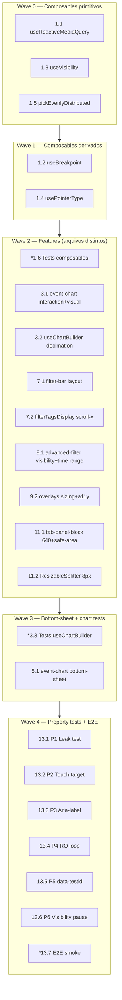

# Implementation Plan: Real Time Events — Responsividade (Gráfico + Filter Bar)

## Overview

Plano incremental para entregar responsividade end-to-end da página `/real-time-events/v2/:tab?`. Cada fase é mergeável independentemente; o produto continua usável em produção entre as fases (não há feature flag — todas as mudanças são puramente client-side e não disruptivas).

Stack: **Vue 3 (Composition API) + PrimeVue + @aziontech/webkit + C3** + **Vitest** (unit/integration) + **Cypress** (E2E, opcional). Lint via **ESLint** existente. Sem novas dependências runtime (§10.2 dos requirements).

Toda implementação respeita os princípios em `CLAUDE.md` e nas skills `solid-pragmatic`, `clean-code-pragmatic`, `dry-rule-of-three`, `tests-on-demand`. **Regra absoluta**: nenhum vazamento de listener/observer/timer (§10.6/10.7).

### Mapeamento Properties → tipo de verificação

| Property | Verificação | Onde está | Fase |
|---|---|---|---|
| **P1** — Zero listener leaks: todo `addEventListener`/`setTimeout`/`setInterval`/`ResizeObserver`/`requestAnimationFrame` em arquivos tocados tem cleanup simétrico com handler nomeado idêntico | Mount/unmount loop ≥ 10x com Vitest + assert `window.__listenerCount__` estável (instrumentado em test setup) | `src/views/RealTimeEventsV2/__tests__/leak.pbt.spec.js` | Fase 6 |
| **P2** — Touch targets WCAG: todo `button`/`[role="button"]`/`[tabindex]` em event-chart.vue, filter-bar.vue, filterTagsDisplay tem `min-width`/`min-height` ≥ 24×24 (desktop/xl) e ≥ 44×44 (mobile/mobile-s/tablet) | Test parametrizado: monta cada componente em 5 viewports, queryAll seletores interativos, assert `getBoundingClientRect()` ≥ alvo | `src/views/RealTimeEventsV2/__tests__/touch-target.spec.js` | Fase 6 |
| **P3** — Aria-label completeness: 6 botões declarados em §11.5 dos requirements têm `aria-label` não-vazio | Snapshot test: queryAll seletores, assert `getAttribute('aria-label')` truthy + length > 0 | `src/views/RealTimeEventsV2/__tests__/aria-label.spec.js` | Fase 6 |
| **P4** — Zero `ResizeObserver` loops: 30s de stress (resize sequencial simulado) sem o erro `ResizeObserver loop completed with undelivered notifications` no console | Integration test com `vi.useFakeTimers()` + `console.error` spy + assert `spy.mock.calls` não contém o erro | `src/views/RealTimeEventsV2/__tests__/ro-loop.spec.js` | Fase 6 |
| **P5** — data-testid preservation: lista declarada (`event-chart`, `event-chart-view`, `dataset-selector-top`, `session-toolbar`, `field-sidebar`, `rte-tab-{id}`) está presente em runtime | Test snapshot: monta TabsView + tab-panel-block, queryAll por test-id, assert presence | `src/views/RealTimeEventsV2/__tests__/testid-preservation.spec.js` | Fase 6 |
| **P6** — Auto-refresh pausa em `visibilityState === 'hidden'` e faz catch-up no retorno se idade > intervalo | Integration test com `vi.useFakeTimers()` + mock service + dispatch `visibilitychange`; assert sequence de fetch antes/durante/depois do hidden | `src/components/base/advanced-filter-system-v2/__tests__/auto-refresh-pause.spec.js` | Fase 6 |

> Tarefas marcadas com `*` são opcionais (testes / E2E). Tarefas sem `*` são obrigatórias para a feature ser dada como concluída. Cada Property deve ser coberta por pelo menos uma task obrigatória.

---

## Tasks

### Fase 0 — Fundação (composables responsivos)

- [ ] 1. Criar composables locais a `RealTimeEventsV2/`

  - [x] 1.1 Criar `useReactiveMediaQuery(query: string): Ref<boolean>` como primitiva reutilizável
    - Arquivo novo: `src/views/RealTimeEventsV2/composables/useReactiveMediaQuery.js`.
    - Handler nomeado `onChange(e)` registrado via `mql.addEventListener('change', onChange)`.
    - Cleanup simétrico em `onBeforeUnmount` **e** `onDeactivated` com mesmo handler nomeado (componentes sob `<keep-alive>`).
    - Re-registrar em `onActivated`.
    - Estado inicial via `mql.matches`.
    - **Property 1: zero listener leaks** — handler nomeado idêntico no setup e cleanup.
    - **Validates: Requirements 10.6, 10.7**.
    - _Requirements: 10.2, 10.6, 10.7_

  - [x] 1.2 Criar `useBreakpoint()` derivando o token atual dos 5 breakpoints
    - Arquivo novo: `src/views/RealTimeEventsV2/composables/useBreakpoint.js`.
    - Usa internamente 4 `useReactiveMediaQuery` (`<375`, `375-639`, `640-1023`, `1024-1439`) — token `xl` é o complemento.
    - Expõe `current: Ref<Token>`, `is(token): boolean`, `isAtMost(token)`, `isAtLeast(token)`.
    - Cleanup transitivo (cuidado dos `useReactiveMediaQuery` instanciados).
    - _Requirements: 1.1, 1.2, 1.3, 1.10, 2.1, 2.2, 2.3, 2.4, 3.3, 4.1, 4.2, 4.3, 4.4, 4.8, 7.1, 7.2, 7.3, 9.3, 10.2_

  - [x] 1.3 Criar `useVisibility()` para reagir a `document.visibilityState`
    - Arquivo novo: `src/views/RealTimeEventsV2/composables/useVisibility.js`.
    - Handler nomeado `onVisibilityChange` em `document`.
    - Cleanup simétrico em `onBeforeUnmount` + `onDeactivated`.
    - Expõe `state: Ref<DocumentVisibilityState>`, `isHidden: ComputedRef<boolean>`, `onVisible(cb)` (acumulador limpo no unmount).
    - **Validates: Requirements 8.6, 8.7, 10.6, 10.7**.
    - _Requirements: 8.6, 8.7, 10.6, 10.7_

  - [x] 1.4 Criar `usePointerType()` para detectar pointer primário
    - Arquivo novo: `src/views/RealTimeEventsV2/composables/usePointerType.js`.
    - Usa `useReactiveMediaQuery('(pointer: coarse)')` + `useReactiveMediaQuery('(pointer: fine)')`.
    - Expõe `isCoarse: Ref<boolean>`, `isFine: Ref<boolean>`.
    - Cuidado: iPad com Magic Keyboard pode hot-plug — a primitiva reativa cobre isso.
    - _Requirements: 5.7, 10.2, 10.6, 10.7_

  - [x] 1.5 Criar `pickEvenlyDistributed<T>(items, targetCount, opts)` util pura
    - Arquivo novo: `src/views/RealTimeEventsV2/composables/utils/pickEvenlyDistributed.js`.
    - Signature: `(items: T[], targetCount: number, opts?: { preserveFirst?: boolean, preserveLast?: boolean }): T[]`.
    - Distribuição uniforme com pinos de início/fim opcionais. Edge cases: `items.length ≤ targetCount` retorna `items` direto; `targetCount === 0` retorna `[]`; `targetCount === 1` retorna primeiro (se `preserveFirst`) ou meio.
    - Pure function, zero side effects.
    - _Requirements: 1.5_

  - [x]* 1.6 Unit tests para composables + util
    - Arquivo novo: `src/views/RealTimeEventsV2/composables/__tests__/composables.spec.js`.
    - Cobre: setup/teardown symmetric de cada composable (montar 10x, assert listener count estável), token derivation, `pickEvenlyDistributed` casos básicos + edge.
    - Usa Vitest + `@vue/test-utils`.
    - _Requirements: 1.5, 10.6, 10.7_

- [ ] 2. Checkpoint Fase 0
  - Composables exportáveis sem warning de TS/JSDoc.
  - Lint roda em CI sem regressões.
  - Ensure all tests pass, ask the user if questions arise.

---

### Fase 1 — Chart engine (interação + visual + decimação)

- [ ] 3. Refactor de `event-chart.vue` e `useChartBuilder.js`

  - [x] 3.1 `event-chart.vue` — interaction layer + visual layer (sem bottom-sheet)
    - **Interação**:
      - Substituir `@mousedown/move/up/leave` por `@pointerdown/move/up/cancel/leave` no `.chart-container`. Handlers renomeados `handlePointerDown/Move/Up/Cancel`.
      - `setPointerCapture(event.pointerId)` no `pointerdown`.
      - Listener `pointermove` com `{ passive: false }` quando `isDragging === true` para permitir `preventDefault()` em touch.
      - CSS `touch-action: pan-y` no `.chart-container`.
      - Cursor `crosshair` apenas em `@media (pointer: fine)`.
      - Threshold tap vs drag: `< 4px` desde `pointerdown` = tap (mostrar tooltip); `≥ 4px AND ≥ 5%` width = drag (brush-to-zoom).
      - Em `pointerType === 'touch'` no tap: chamar `chartInstance.tooltip.show({ x: snappedX })` + iniciar `tooltipDismissTimer = setTimeout(hideTooltip, 3000)`. Em novo tap ou tap-fora: `clearTimeout(tooltipDismissTimer)` + `chartInstance.tooltip.hide()`.
      - **Property 1: zero listener leaks** — `tooltipDismissTimer`, `pointerPos`, refs de timers devem ter cleanup simétrico em `onBeforeUnmount` **e** `onDeactivated`. Inclui `cancelAnimationFrame(rafHandle)` se houver.
    - **ResizeObserver mitigation**:
      - Wrapper `requestAnimationFrame` + flag `pendingResize` no callback.
      - `rafHandle` ref salvo; `cancelAnimationFrame(rafHandle)` em ambos os teardowns.
      - Aplicar nos dois pontos de setup (`onMounted` e `onActivated`).
    - **Visual / responsivo**:
      - Importar `useBreakpoint` + `usePointerType` no setup.
      - `.chart-container { height: clamp(200px, 28dvh, 320px); }` — escala proporcional ao viewport, sem `@media` por breakpoint. Piso preserva 200px atual (zero regressão); teto evita ocupar tela em 4K.
      - `.chart-loading` e `.chart-empty` (loading, error, empty) usam a **mesma fórmula `clamp`** para evitar salto de layout entre estados.
      - Header densidade: ocultar `.chart-header__hint` em `mobile-s`/`mobile`; reduzir `view-trigger` para `min-width: 5rem; max-width: 7rem` em mobile; ocultar `.chart-header__view-label` em mobile; `.chart-header__total` `font-size: 0.75rem` em mobile-s/mobile com fallback ocultando "events" se `< 60px`.
      - `.chart-header__collapse-btn` com alvo de toque 24×24 (era 1.25rem = 20px).
    - **A11y**: `aria-label="Change chart view"` no view-trigger; `aria-describedby` no wrapper do chart com texto sr-only ("Use the brush selection to zoom into a time range").
    - **Listeners adicionais**: `orientationchange` e `window.visualViewport?.addEventListener('resize')` para `updateViewPanelPosition`; cleanup simétrico.
    - _Requirements: 1.1, 1.2, 1.3, 1.9, 1.10, 1.11, 1.12, 4.1, 4.2, 4.3, 4.5, 4.6, 4.7, 4.8, 5.1, 5.2, 5.3, 5.4, 5.5, 5.6, 5.7, 5.8, 7.4, 10.1, 10.3, 10.5, 10.6, 10.7, 11.1, 11.7, 12.4_

  - [x] 3.2 `useChartBuilder.js` — decimação dinâmica de ticks + cache + format/rotate por breakpoint
    - Aceitar `breakpoint: Token | Ref<Token>` como input do `buildC3Config`.
    - Medição de `longestLabelWidth`: criar elemento off-screen com mesma `font-family` + `font-size: 11px` do axis; `getBoundingClientRect().width` do label mais longo do dataset após `axis.x.tick.format`.
    - **Cache**: `Map<string, number>` interno chaveado por `(formatKey, fontSizePx)`. Primeira medição calcula e guarda; subsequentes lookup. Reset no unmount do componente consumidor (expor `resetTickCache()`).
    - Cálculo: `maxTicks = Math.floor(containerWidth / (longestLabelWidth + 8))`.
    - Se `naturalTicks.length > maxTicks`: `values = pickEvenlyDistributed(naturalTicks, maxTicks, { preserveFirst: true, preserveLast: true })`; setar `axis.x.tick.values = values` + `axis.x.tick.fit = false`.
    - Format por breakpoint: `< 1h` range → `HH:mm` sempre; `≥ 1d` range → `MM/dd` em mobile-s/mobile, `MM/dd HH:mm` em tablet+.
    - Rotação `axis.x.tick.rotate`: `0` em desktop/xl; `-45` em mobile-s/mobile/tablet **somente** se `containerWidth / values.length < longestLabelWidth + 8` após decimação.
    - Rota-de-fuga se `tick.values` causar regressão em algum `chartKind`: usar `axis.x.tick.culling: { max: maxTicks }` (não garante gap mas evita perda).
    - _Requirements: 1.4, 1.5, 1.6, 1.7, 1.8_

  - [x]* 3.3 Unit tests para `useChartBuilder` decimação + cache
    - Arquivo novo: `src/views/RealTimeEventsV2/composables/__tests__/useChartBuilder.spec.js`.
    - Cobre: decimação preserva primeiro/último; cache hit retorna sem nova medição; format/rotate por breakpoint.
    - Mock `getBoundingClientRect` via `Element.prototype.getBoundingClientRect` stub.
    - _Requirements: 1.4, 1.5, 1.7, 1.8_

- [ ] 4. Checkpoint Fase 1
  - Touch funciona em iOS Safari 16+ (validação manual).
  - Zero `ResizeObserver loop` no console durante 30s de uso intensivo (drag, sidebar toggle).
  - Ensure all tests pass, ask the user if questions arise.

---

### Fase 2 — Bottom-sheet do View dropdown em mobile

- [ ] 5. Variante bottom-sheet do `View` dropdown no `event-chart.vue`

  - [x] 5.1 `event-chart.vue` — variante bottom-sheet do View dropdown
    - Dentro do mesmo `<Teleport to="body">` existente: `v-if="bp.is('mobile-s') || bp.is('mobile')"` alternando entre dois templates.
    - **Anatomia**:
      - `.view-bottom-sheet-backdrop` (`position: fixed; inset: 0; background: rgba(0,0,0,0.4); z-index: 99998`) capturando tap-fora.
      - `.view-bottom-sheet` (`position: fixed; bottom: 0; left: 0; right: 0; border-radius: 12px 12px 0 0; max-height: 60dvh; overflow-y: auto; z-index: 100000; padding-bottom: env(safe-area-inset-bottom)`).
      - Handle visual decorativo (`aria-hidden="true"`).
      - Título "View" + botão close (`aria-label="Close view menu"`, alvo ≥ 44×44).
      - Lista de opções com wrapper `role="listbox"`.
      - Painel raiz com `role="dialog"`, `aria-modal="true"`, `aria-labelledby` apontando para o título.
    - **Animação**: `slide-up 280ms cubic-bezier(0.32, 0.72, 0, 1)` entrada; `slide-down 200ms` mesma curva saída; backdrop fade idem.
    - **Reduced motion**: `@media (prefers-reduced-motion: reduce)` → `fade 120ms` sem translate.
    - **Antes de abrir**: `chartInstance.tooltip.hide()`.
    - **Focus trap**: salvar `document.activeElement` antes do open; focar botão close ao abrir; devolver foco ao trigger ao fechar. Trap via listener `keydown` Tab dentro do sheet (handler nomeado, cleanup ao fechar).
    - **Dismiss**: tap-backdrop, Esc (handler `onViewEscape` existente já cobre), botão close.
    - **Property 1: zero listener leaks** — handlers de focus trap, backdrop, animationend devem ter cleanup simétrico ao fechar e em unmount.
    - **Novos data-testid**: `rte-chart-bottom-sheet`, `rte-chart-bottom-sheet-close`, `rte-chart-bottom-sheet-backdrop`.
    - _Requirements: 7.3, 7.4, 7.7, 10.4, 10.6, 10.7, 11.1, 11.5, 11.6, 12.3, 12.5, 13.2_

- [ ] 6. Checkpoint Fase 2
  - Bottom-sheet funcional em mobile-s e mobile; popover preservado em tablet+.
  - Reduced-motion testado no DevTools (Rendering panel).
  - Ensure all tests pass, ask the user if questions arise.

---

### Fase 3 — Filter bar + chips

- [ ] 7. Layout adaptativo de `filter-bar.vue` e refactor de `filterTagsDisplay`

  - [x] 7.1 `filter-bar.vue` — layout adaptativo + a11y + touch targets
    - Importar `useBreakpoint`.
    - Classes condicionais no container raiz: `is-single-row` (desktop/xl), `is-two-row` (tablet), `is-stack` (mobile/mobile-s).
    - CSS:
      - `is-single-row`: comportamento atual preservado.
      - `is-two-row`: `flex-wrap: wrap`; segunda linha (range + refresh) com `justify-content: flex-end`.
      - `is-stack`: `flex-direction: column`; Dataset com `width: 100%` em mobile-s; ordem visual Dataset → AQL+saved → range → Refresh.
    - Altura mínima: `min-height: 2rem` desktop/xl; `min-height: 2.75rem` (44px) em tablet+ para alvos de toque.
    - Dataset Dropdown teleportado: `max-width: calc(100vw - 1rem)` no painel.
    - **A11y**:
      - `role="search"` no container raiz `.filter-bar`.
      - `aria-label="Open saved searches"` no botão de filter (saved searches).
      - `aria-label="Refresh events"` no botão Refresh.
      - Ordem de tab lógica: Dataset → saved searches → AQL → time range → refresh.
    - **Refresh button mobile** (inline, decisão UX-D2): ícone-only em mobile, sem texto, com `aria-label` mantido; alvo ≥ 44×44.
    - **Refresh states**:
      - Idle: ícone `pi pi-refresh` estático.
      - Fetching: spinner substitui ícone + botão `disabled`.
      - Pós-fetch: retorna idle.
      - (Indicador ambient "auto-refresh ON" é follow-up; não implementar.)
    - **Novo data-testid**: `rte-filter-bar` (raiz), `rte-refresh-button`.
    - _Requirements: 2.1, 2.2, 2.3, 2.4, 2.5, 2.6, 2.7, 2.9, 7.5, 8.1, 8.2, 8.3, 11.1, 11.2, 11.4, 11.5, 13.2_

  - [x] 7.2 `filterTagsDisplay/index.vue` — scroll horizontal só em mobile/tablet + a11y + max-width responsivo
    - **Sem fade indicator** (decisão UX-D1 revertida): scrollbar nativo do browser cobre §3.2 em mobile/tablet.
    - `@media (max-width: 1023px)` (mobile-s, mobile, tablet): aplicar `overflow-x: auto; flex-wrap: nowrap; overscroll-behavior-x: contain`.
    - `@media (min-width: 1024px)` (desktop/xl): **preservar comportamento atual** (`flex: 1; overflow: hidden`) — zero mudança visível para o usuário desktop.
    - **Chip max-width responsivo**:
      - mobile-s/mobile: ellipsis após 18 chars.
      - tablet: ellipsis após 28 chars.
      - desktop/xl: `max-width: 20rem` (atual preservado).
      - Tooltip title preserva valor completo.
    - **A11y**:
      - Botão X de cada chip: `aria-label="Remove filter ${field} ${operator} ${value}"`.
      - Alvo de toque ≥ 24×24 desktop, ≥ 44×44 mobile/tablet.
      - `scrollIntoView({ block: 'nearest', inline: 'nearest' })` no `focus` de chip via teclado.
    - **Novo data-testid**: `rte-chips-scroll-container`, `rte-chip-remove-button`.
    - _Requirements: 3.1, 3.2, 3.3, 3.4, 3.5, 3.6, 3.7, 3.8, 3.9, 10.6, 10.7, 11.1, 11.3, 11.5, 13.2_

- [ ] 8. Checkpoint Fase 3
  - Layout muda visualmente em DevTools responsive mode nos 5 breakpoints.
  - Fade nas pontas dos chips só aparece quando há overflow real.
  - Ensure all tests pass, ask the user if questions arise.

---

### Fase 4 — Filter system + overlays

- [ ] 9. `advanced-filter-system-v2/index.vue` + overlays teleportados

  - [x] 9.1 `advanced-filter-system-v2/index.vue` — visibility pause + focus guard + time range mobile
    - Importar `useVisibility` + `useBreakpoint`.
    - **Auto-refresh pause (§8.6, 8.7)**:
      - Scheduler interno verifica `isHidden.value` antes de disparar `onAutoRefreshTick`; se hidden, cancela próximo tick e marca `lastSkippedAt = Date.now()`.
      - `watch(isHidden, (hidden) => { if (!hidden) catchUpIfStale() })`; `catchUpIfStale` dispara tick imediato se `Date.now() - lastTickAt > refreshIntervalMs`.
      - `useVisibility` cuida do listener `visibilitychange`. Auditar cleanup do timer interno em `onBeforeUnmount` **e** `onDeactivated`; adicionar se faltar.
      - **Property 6: visibility pause + catch-up** validada por integration test.
    - **Focus guard (§8.4)**: se `document.activeElement === aqlInputRef.value` no momento do tick, `skipTick()` (mantém auto-refresh ativo mas pula esse).
    - **Time range picker em mobile (§6.1-6.5)**:
      - Painel com `max-width: calc(100vw - 1rem)`, `max-height: calc(100dvh - 4rem)`, scroll interno.
      - Alinhamento right/left calculado via `boundingClientRect` do trigger.
      - `watch(bp.current, () => closeTimeRangePanel())` para fechar em mudança de breakpoint.
      - Preservar `filterDateRangeMaxDays={365}` e `isInvalidRange` validation.
    - **Validates: Requirements 8.6, 8.7**.
    - _Requirements: 2.8, 6.1, 6.2, 6.3, 6.4, 6.5, 6.6, 8.1, 8.3, 8.4, 8.5, 8.6, 8.7, 10.6, 10.7_

  - [x] 9.2 `saved-searches-overlay.vue` + `query-history-overlay.vue` — sizing + a11y
    - `saved-searches-overlay.vue`:
      - `width: 360px` em tablet+; `width: calc(100vw - 1rem)` em mobile/mobile-s.
      - `aria-label="Save current search"` no botão save.
      - `aria-label="Delete saved search"` no botão delete (por item).
    - `query-history-overlay.vue`:
      - `width: min(400px, calc(100vw - 1rem))` em todos os breakpoints.
      - `aria-label="Clear query history"` no botão clear.
    - Em ambos: validar dismiss via Esc + tap-fora (PrimeVue `OverlayPanel` default); adicionar botão close visível quando aplicável.
    - _Requirements: 7.1, 7.2, 7.6, 7.7, 11.5_

- [ ] 10. Checkpoint Fase 4
  - Auto-refresh pausa visivelmente em DevTools (mudar tab e voltar; observar Network).
  - Time range picker abre dentro do viewport em iPhone SE simulado.
  - Overlays não estouram em viewports estreitos.
  - Ensure all tests pass, ask the user if questions arise.

---

### Fase 5 — Container + splitter + iOS safe-area

- [ ] 11. `tab-panel-block.vue` + `ResizableSplitter.vue`

  - [x] 11.1 `tab-panel-block.vue` — alinhar breakpoint do field-sidebar + safe-area + 100dvh
    - Alterar `@media (max-width: 768px)` em [tab-panel-block.vue:663-673](src/views/RealTimeEventsV2/Blocks/tab-panel-block.vue#L663-L673) para `@media (max-width: 639px)` (alinhar ao token `tablet`).
    - Fullscreen mode ([tab-panel-block.vue:454](src/views/RealTimeEventsV2/Blocks/tab-panel-block.vue#L454)): adicionar `padding-top: env(safe-area-inset-top)`, `padding-bottom: env(safe-area-inset-bottom)`, `padding-left: env(safe-area-inset-left)`, `padding-right: env(safe-area-inset-right)`.
    - Substituir `100vh` por `100dvh` onde aplicável (busca local).
    - Adicionar `-webkit-overflow-scrolling: touch` no container fullscreen para iOS smoothness.
    - _Requirements: 9.3, 12.2, 12.3_

  - [x] 11.2 `ResizableSplitter.vue` — handle 8px em tablet+
    - `@media (min-width: 640px) and (max-width: 1023px)`: aumentar área visual/clicável do handle para `8px` (era `0.375rem = 6px`).
    - Preservar `@touchstart.passive` existente.
    - Manter handle oculto em mobile/mobile-s (consistente com 11.1).
    - _Requirements: 9.1, 9.2, 9.4_

- [ ] 12. Checkpoint Fase 5
  - Field-sidebar visível em viewport de 700px (era oculta).
  - Fullscreen mode preserva safe-area em iPhone simulado com notch.
  - Handle do splitter mais fácil de agarrar em iPad.
  - Ensure all tests pass, ask the user if questions arise.

---

### Fase 6 — Property tests + validação

- [ ] 13. Cobertura automatizada das Properties P1–P6

  - [x] 13.1 Property P1 — Leak test (mount/unmount loop)
    - Arquivo novo: `src/views/RealTimeEventsV2/__tests__/leak.pbt.spec.js`.
    - Test setup: instrumentar `window.addEventListener`/`removeEventListener` para contar via `window.__listenerCount__` (test util em `setupFiles`).
    - Para cada componente alterado (`event-chart.vue`, `filter-bar.vue`, `filterTagsDisplay/index.vue`, `advanced-filter-system-v2/index.vue`): montar/desmontar ≥ 10 vezes e assert `__listenerCount__` no fim igual ao início.
    - Cobrir também `setTimeout`/`setInterval`/`requestAnimationFrame` via spy (Vitest mock).
    - **Property 1**.
    - **Validates: Requirements 10.6, 10.7**.
    - _Requirements: 10.6, 10.7_

  - [x] 13.2 Property P2 — Touch target compliance
    - Arquivo novo: `src/views/RealTimeEventsV2/__tests__/touch-target.spec.js`.
    - Test parametrizado: para cada viewport [320, 414, 768, 1280, 1920] montar `tab-panel-block` em jsdom + `window.matchMedia` mock.
    - `queryAll('button, [role="button"], [tabindex]:not([tabindex="-1"])')` em `event-chart.vue`, `filter-bar.vue`, `filterTagsDisplay`.
    - Assert `rect.width >= target && rect.height >= target` onde `target = viewport < 1024 ? 44 : 24`.
    - **Property 2**.
    - **Validates: Requirements 2.5, 3.4, 4.5, 8.1, 11.1**.
    - _Requirements: 2.5, 3.4, 4.5, 8.1, 11.1_

  - [x] 13.3 Property P3 — Aria-label completeness sweep
    - Arquivo novo: `src/views/RealTimeEventsV2/__tests__/aria-label.spec.js`.
    - Lista declarada de 6 seletores:
      - `filter-bar.vue` saved searches button.
      - `event-chart.vue` view-trigger.
      - `filterTagsDisplay` chip remove buttons (todos).
      - `saved-searches-overlay.vue` save + delete buttons.
      - `query-history-overlay.vue` clear button.
      - `event-chart.vue` collapse-btn.
    - Para cada: queryAll → assert `getAttribute('aria-label')` truthy + length > 0.
    - **Property 3**.
    - **Validates: Requirements 3.5, 4.6, 7.6, 11.5**.
    - _Requirements: 3.5, 4.6, 7.6, 11.5_

  - [x] 13.4 Property P4 — ResizeObserver loop stress test
    - Arquivo novo: `src/views/RealTimeEventsV2/__tests__/ro-loop.spec.js`.
    - Setup: `vi.useFakeTimers()`, `console.error` spy.
    - Montar `event-chart.vue` com data mockada; disparar `ResizeObserver` callback 200x em sequência via `vi.advanceTimersByTime(150)` por iteração simulando 30s.
    - Assert: `spy.mock.calls` filtrado por mensagem `/ResizeObserver loop/` tem `length === 0`.
    - **Property 4**.
    - **Validates: Requirements 10.3, 13.4**.
    - _Requirements: 10.3, 13.4_

  - [x] 13.5 Property P5 — data-testid preservation
    - Arquivo novo: `src/views/RealTimeEventsV2/__tests__/testid-preservation.spec.js`.
    - Montar `TabsView.vue` + `tab-panel-block.vue` com mocks mínimos.
    - Lista declarada de test-ids existentes (§13.1 dos requirements): `event-chart`, `event-chart-view`, `dataset-selector-top`, `session-toolbar`, `field-sidebar`, `rte-tab-*`, `open-session-browser-button`, `share-current-view-button`.
    - Para cada: `queryByTestId(id)` → assert presente.
    - **Property 5**.
    - **Validates: Requirements 13.1**.
    - _Requirements: 13.1_

  - [x] 13.6 Property P6 — Auto-refresh visibility pause + catch-up
    - Arquivo novo: `src/components/base/advanced-filter-system-v2/__tests__/auto-refresh-pause.spec.js`.
    - Setup: `vi.useFakeTimers()` + mock service fetch.
    - Sequência:
      1. Mount com `autoRefresh: true, intervalMs: 5000`.
      2. `vi.advanceTimersByTime(5000)` → assert fetch chamado 1x.
      3. Simular `document.visibilityState = 'hidden'` + dispatch `visibilitychange`.
      4. `vi.advanceTimersByTime(15000)` → assert fetch ainda 1x (não disparou em hidden).
      5. Simular `visibilityState = 'visible'` + dispatch.
      6. Imediatamente (sem advance) → assert fetch chamado 2x (catch-up, pois idade > interval).
      7. `vi.advanceTimersByTime(5000)` → assert fetch chamado 3x (ciclo normal retomado).
    - **Property 6**.
    - **Validates: Requirements 8.6, 8.7**.
    - _Requirements: 8.6, 8.7_

  - [~]* 13.7 E2E smoke per breakpoint (Cypress, opcional) — **REMOVIDO POR DECISÃO DO USUÁRIO**: sample `@xfail` que não executa no ambiente atual ("não quero sample"). Coverage de §12.1 e §13.3 fica a cargo de QA manual no Checkpoint 14.
    - _Requirements: 12.1, 13.3_

- [ ] 14. Checkpoint Fase 6 (final)
  - 6 properties cobertas com testes obrigatórios verdes em CI.
  - Manual QA matrix concluída (iOS Safari 16+, Chrome Android 110+, desktop Chrome/Safari/Firefox/Edge nos 5 breakpoints).
  - Zero warnings/errors novos no console em uso intensivo.
  - Ensure all tests pass, ask the user if questions arise.

---

## Notes

- Tarefas marcadas com `*` são opcionais; se puladas, cobrir a Property correspondente por outra via (ex: pular 13.7 não afeta cobertura — P5 já é coberta por 13.5).
- Cada PBT/integration test no Vitest roda em ambiente jsdom com `window.matchMedia` mock que aceita query strings dos 5 breakpoints.
- **Property 1 (zero leaks)** é a invariante mais crítica desta entrega (regra explícita do desenvolvedor) — qualquer task que adicionar listener/observer/timer deve incluir cleanup simétrico no mesmo PR.
- **data-testid existentes** são intocáveis. Novos test-ids seguem `rte-<componente>-<elemento>`.
- Mudança de breakpoint do field-sidebar 768→640 (task 11.1) pode reduzir UX em tablets de 7" — aceitável pela padronização de tokens (D5). Telemetria pós-deploy pode reverter se necessário.
- O indicador ambient "auto-refresh ON" (pulso 1.5s) sugerido pelo UX agent está **fora do escopo** desta entrega. Requer novo critério em §8 dos requirements antes de implementar — documentado em `design.md` §11 UX-D4 e §12 Follow-ups.

---

## Task Dependency Graph

```json
{
  "waves": [
    {
      "id": 0,
      "label": "Composables primitivos (arquivos independentes)",
      "tasks": ["1.1", "1.3", "1.5"]
    },
    {
      "id": 1,
      "label": "Composables derivados (dependem de 1.1)",
      "tasks": ["1.2", "1.4"]
    },
    {
      "id": 2,
      "label": "Features paralelas (arquivos distintos)",
      "tasks": ["1.6", "3.1", "3.2", "7.1", "7.2", "9.1", "9.2", "11.1", "11.2"]
    },
    {
      "id": 3,
      "label": "Bottom-sheet + tests de chart builder (depende de 3.1/3.2)",
      "tasks": ["3.3", "5.1"]
    },
    {
      "id": 4,
      "label": "Property tests + E2E (dependem de toda implementação)",
      "tasks": ["13.1", "13.2", "13.3", "13.4", "13.5", "13.6", "13.7"]
    }
  ]
}
```

### Visualização (mermaid)



> **Notas sobre o grafo**
>
> - Cada wave contém apenas tasks independentes entre si (não editam o mesmo arquivo).
> - Wave 3 contém 5.1 (event-chart bottom-sheet) que edita o mesmo arquivo que 3.1 — por isso aguarda Wave 2.
> - 3.3 (tests de useChartBuilder) edita arquivo de teste, mas depende de 3.2 estar pronto.
> - Tasks opcionais (`*`: 1.6, 3.3, 13.7) aparecem no grafo mas podem ser puladas — suas Properties são cobertas por tasks obrigatórias (13.1-13.6).
> - Checkpoints (tasks 2, 4, 6, 8, 10, 12, 14) e epics (1, 3, 5, 7, 9, 11, 13) não aparecem no grafo.
