# Implementation Plan: Real-Time Events v2 — Correções de estabilidade, performance e reatividade

## Overview

Plano incremental para corrigir os 3 defeitos (leak keep-alive, remontagem do Fields, staleness/AQL do metrics) via abstrações coesas e compartilhadas. Cada fase é **mergeável independentemente** e ordenada por **risco crescente / comportamento-invisível primeiro** (W1 filtro byte-equivalente e W2 lifecycle não mudam comportamento; W3–W5 mudam/melhoram comportamento). **Mandato zero-regressão**: nada que funciona hoje pode parar de funcionar — cada fase só fecha com a suíte RTE v2 verde, lint limpo, verificação de comportamento e dead-code sweep gated.

Stack: Vue 3 `<script setup>`, c3.js, PrimeVue/@aziontech/webkit; testes Vitest + fast-check (PBT) + @vue/test-utils; ESLint. Toda implementação respeita `CLAUDE.md` e as skills `code-craft-pragmatic`, `tests-on-demand`, `azion-design-system`.

### Mapeamento Properties → tipo de verificação

| Property                                                                                                                   | Verificação                                       | Onde está                                                     | Fase     |
| -------------------------------------------------------------------------------------------------------------------------- | ------------------------------------------------- | ------------------------------------------------------------- | -------- |
| **P1** — No máximo 1 ResizeObserver vivo por EventChart; contagem volta ao baseline após mount/activate/deactivate/unmount | Integration (mock ResizeObserver, contador)       | `event-chart.__tests__/observer-lifecycle.spec.js`            | Fase 2   |
| **P2** — Todo recurso keep-alive (RO/listeners) é liberado em onBeforeUnmount **e** onDeactivated via useKeepAliveResource | Unit do composable + integration                  | `composables/__tests__/useKeepAliveResource.spec.js`          | Fase 2   |
| **P3** — `buildFilter` é byte-equivalente ao `buildApiFilters` legado                                                      | PBT fast-check ≥100 iter                          | `_shared/filter/__tests__/build-filter.byteequiv.pbt.spec.js` | Fase 1   |
| **P4** — Nenhum campo não suportado sobrevive na query de metrics                                                          | PBT ≥100 iter                                     | `_shared/filter/__tests__/build-for-target.pbt.spec.js`       | Fase 1   |
| **P5** — `partial=true` sse-e-somente-se ≥1 campo aplicável-no-events foi descartado no metrics                            | PBT + unit indicador                              | `_shared/filter/__tests__/build-for-target.pbt.spec.js`       | Fase 1/5 |
| **P6** — Toggle do Fields não chama `c3.generate` nem recria a instância do chart                                          | Integration (spy em c3.generate)                  | `Blocks/__tests__/fields-toggle-no-rebuild.spec.js`           | Fase 3   |
| **P7** — Reload de metrics: resposta obsoleta nunca sobrescreve a mais recente; 1 reload por ação                          | Integration + fake timers                         | `composables/__tests__/metrics-reactivity.spec.js`            | Fase 4   |
| **P8** — Suíte RTE v2 inteira (baseline 431) permanece verde a cada fase                                                   | CI gate (`vitest run src/views/RealTimeEventsV2`) | pipeline / checkpoints                                        | todas    |

> Tarefas marcadas com `*` são opcionais (testes). Tarefas sem `*` são obrigatórias para a feature ser dada como concluída. Toda Property acaba coberta por alguma task.

### Status de execução (atualizado)

Todas as 5 fases implementadas via multi-agentes com gate de testes por fase. **Suíte RTE v2 + composables: 590/590 verde** (baseline era 502; +88 testes). **ESLint limpo** nos paths tocados. Dead-code removido/movido (−339 linhas de produção). Zero-regressão confirmada: as 2 únicas falhas da suíte completa do projeto são artefatos de ambiente pré-existentes (3 testes TZ-sensitive de `real-time-metrics` que passam com `TZ=UTC`; 1 teste `account-guard` disparado pelo `.env.local` local `VITE_DEBUG_LOGIN=true`) — nenhuma no diff desta feature.

- `1.2*` (testes de caracterização como task separada) — **pulado**: as Properties/testes por fase (3.6, 3.7, 5.2, 5.6, 7.2, 9.5, 11.4) cobrem a rede de segurança.
- **Pendente (recomendado antes do merge):** verificação em navegador real (Fields sem flash, metrics atualizando, indicador de divergência) — complementa os testes de integração.

---

## Tasks

### Fase 0 — Fundação / rede de segurança (zero-regressão)

- [x] 1. Baseline verde + testes de caracterização
  - [x] 1.1 Estabelecer e registrar o baseline verde
    - Rodar `vitest run src/views/RealTimeEventsV2` + `vitest run src/services/real-time-events-service-v2` + lint; registrar contagem (baseline 431) e zero warnings novos como referência (**P8**).
    - _Requirements: N.1_
  - [ ]\* 1.2 Testes de caracterização onde a cobertura é fraca (capturar comportamento ATUAL antes de refatorar)
    - Caracterizar: `buildApiFilters` (formas and/in/or) e `filterForMetrics` (cleaned/partial, `.or` intacto, `status*`); ciclo de vida de observers do `event-chart`/`log-field-badges`/`ResizableSplitter`; `useMetricsChart.load` (branch fallback `if(result.loaded)`); reação atual do chart ao toggle do Fields.
    - _Requirements: N.1, N.5_

- [x] 2. Checkpoint Fase 0
  - Baseline registrado verde; caracterização commitada. Confirmar com o usuário antes de mexer em produção.

---

### Fase 1 — L1 Domínio de filtro (W1, comportamento-invisível/byte-equivalente)

- [x] 3. Consolidar construção e capacidade de filtro
  - [x] 3.1 Criar `_shared/filter/build-filter.js`
    - Mover `coerceFilterValue` + `buildFilterGroup`; expor `buildFilter(fields) → {and,in,or}`. SRP, framework-agnostic (N.6).
    - _Requirements: 5.2, N.6_
  - [x] 3.2 Criar `_shared/filter/field-capability.js`
    - Mover `METRICS_FILTER_FIELDS`; expor `isFieldSupported(valueField, target)` e `resolveCapabilityTarget(config)` (4 formas de dataset). **Não** reusar `aggregableFieldsByDataset` (concern distinto). Default conservador (não suportado → nunca enviado).
    - _Requirements: 5.1, 6.2, 6.3, N.6_
  - [x] 3.3 Criar adapters em `_shared/filter/`
    - `cleanBuiltFilterForMetrics(built, dataset) → {cleaned, partial}` (para o caminho events→metrics; `.or` intacto; `status*` preservado) e `buildForTarget(fields, target) → {filter, droppedFields, partial}` (para o metrics-VIEW; suportado-ou-descarta, sem remapper lossy).
    - _Requirements: 5.3, 5.4, 6.1_
  - [x] 3.4 `useEventsData.buildApiFilters` delega para `buildFilter`; **DELETAR** `coerceFilterValue`/`buildFilterGroup`/corpo inline
    - Grep de referências antes de deletar; comportamento byte-equivalente.
    - _Requirements: 5.2, 5.5_
  - [x] 3.5 `load-events-aggregation.js` usa `cleanBuiltFilterForMetrics`; **DELETAR** `filterForMetrics`/`extractBaseField`/`METRICS_FILTER_FIELDS` locais
    - Preservar `{cleaned, partial}`, `.or` passthrough e `status*`.
    - _Requirements: 5.3, 5.4, 5.5_
  - [x]\* 3.6 PBT byte-equivalência do builder de events
    - **Property 3: `buildFilter` byte-equivalente ao `buildApiFilters` legado**
    - **Validates: Requirements 5.2, 5.5**
    - Corpus: flat AND, In, OR-split, tipos mistos, vazio, operador ausente.
  - [x]\* 3.7 PBT capacidade/partial
    - **Property 4: nenhum campo não suportado sobrevive; Property 5: `partial` correto**
    - **Validates: Requirements 5.3, 5.4, 6.2, 6.3**

- [x] 4. Checkpoint Fase 1
  - Suíte RTE v2 verde (**P8**); P3 verde (byte-equiv); **dead-code sweep W1** (grep confirma zero referências às funções removidas); lint limpo. Confirmar antes da próxima fase.

---

### Fase 2 — L2 Ciclo de vida keep-alive (W2, comportamento-invisível)

- [x] 5. Composable de recurso + delegação
  - [x] 5.1 Criar `src/composables/useKeepAliveResource.js` (local **neutro**)
    - `useKeepAliveResource(acquire, release)` com guarda `isActive`, `try/finally` no release (reset garantido — 1.3 error path), SSR-safe. Reutilizável (N.2).
    - _Requirements: 1.1, 1.2, 1.4, 1.6, N.2_
  - [x]\* 5.2 Testes unitários do composable
    - **Property 2: cleanup keep-alive simétrico (acquire 1×, release em ambos, reset em throw)**
    - **Validates: Requirements 1.1, 1.2, 1.6, N.2**
  - [x] 5.3 `event-chart.vue` delega RO + 6 listeners ao composable; **DELETAR** blocos duplicados (onMounted/onActivated create + onBeforeUnmount/onDeactivated remove) e o `let resizeObserver`
    - Manter `initChart`, limpeza de timers/rAF, `chartInstance.destroy`, `resetTickCache`, `closeViewMenu`, e o refit no `onActivated`.
    - _Requirements: 1.1, 1.2, 1.3, 1.4, 1.6, 1.7, 2.1, 2.3_
  - [x] 5.4 `log-field-badges.vue` delega ao composable; adiciona simetria activate/deactivate; re-mede overflow no activate
    - _Requirements: 1.5, 2.2_
  - [x] 5.5 `src/components/Splitter/ResizableSplitter.vue` delega ao composable; adiciona `onDeactivated`; `applyInitialSizes` no activate
    - **NÃO** tocar `src/components/ResizableSplitter.vue` (componente distinto, fora de escopo).
    - _Requirements: 1.3, 1.4, 3.4_
  - [x]\* 5.6 Integração: invariante de observers + refit + overflow
    - **Property 1: ≤1 observer vivo por EventChart; volta ao baseline**
    - **Validates: Requirements 1.1, 1.2, 1.7, 2.1, 2.2, 2.3**

- [x] 6. Checkpoint Fase 2
  - Suíte verde (**P8**); P1/P2 verdes; **dead-code sweep W2**; confirmar que `src/components/ResizableSplitter.vue` permanece intocado; lint limpo.

---

### Fase 3 — Remover remontagem do Fields (W3, observável — melhoria)

- [x] 7. Eliminar o `:key` do splitter
  - [x] 7.1 Remover `:key="String(sidebarVisible)"` do `ResizableSplitter` em `tab-panel-block.vue`; adicionar `watch(sidebarVisible)` → `nextTick` → `eventChartRef.resize()` (salvaguarda de largura)
    - Manter a classe `splitter--sidebar-collapsed` (já esconde o painel); cache de field-stats preservado por não remontar.
    - _Requirements: 3.1, 3.3, 3.4, 3.5, 3.6_
  - [x]\* 7.2 Integração: sem rebuild no toggle
    - **Property 6: toggle do Fields não chama `c3.generate` nem recria a instância**
    - **Validates: Requirements 3.1, 3.2, 3.4, N.3**

- [x] 8. Checkpoint Fase 3
  - Suíte verde (**P8**); P6 verde; **verificação da APP**: alternar Fields sem flash, chart/tabela ocupam a largura, linhas preservadas; brush/zoom e troca de aba OK.

---

### Fase 4 — Reatividade do metrics chart (W4, observável — corrige bug)

- [x] 9. Reatividade + robustez do metrics
  - [x] 9.1 `useMetricsChart`: `runLoad(config)` com token de supersessão (preservar `if(result.loaded)` do fallback) + `load(config)` debounced (50ms) + `onScopeDispose(clearTimeout)`
    - `isLoading` correto sob supersessão.
    - _Requirements: 4.5, 4.6, 4.7, N.4_
  - [x] 9.2 `useChartConfig`: `watch(() => [filterData.tsRange, filterData.fields], {deep:true})` guardado por `selectedMetricsDashboard` (sem `immediate`) → `reloadActiveMetrics()`; expor `reloadActiveMetrics()` zero-arg; **remover** o `loadMetricsChart` direto do `handleBrushSelect` (dedup)
    - _Requirements: 4.1, 4.2, 4.4, 4.8_
  - [x] 9.3 `tab-panel-block`: `onActivated` chama `reloadActiveMetrics()` se metrics view ativa; reset de view órfã na troca de dataset (via `metricsViewItemsFlat`)
    - _Requirements: 4.3, 4.9_
  - [x] 9.4 Preservar o caminho de erro `onMetricsError` (toast + fallback para `events:none`) — verificar intacto
    - _Requirements: 4.10_
  - [x]\* 9.5 Testes: matriz de reload + supersessão + dedup + reset de dataset + erro
    - **Property 7: resposta obsoleta nunca sobrescreve; 1 reload por ação**
    - **Validates: Requirements 4.1, 4.2, 4.3, 4.4, 4.5, 4.6, 4.7, 4.8, 4.9, 4.10, N.4**

- [x] 10. Checkpoint Fase 4
  - Suíte verde (**P8**); P7 verde; **verificação da APP**: metrics atualiza ao mudar data/AQL; brush dispara 1 reload; troca de aba recarrega; erro cai no fallback.

---

### Fase 5 — AQL suportado no metrics + indicador (W5, observável — melhoria)

- [x] 11. Aplicar AQL suportado + indicador de divergência
  - [x] 11.1 `useMetricsChart`: aplicar `buildForTarget(fields, resolveCapabilityTarget(config))` (subconjunto suportado, suportado-ou-descarta) e **expor `partial`**
    - _Requirements: 6.1_
  - [x] 11.2 `metrics-chart-service`: aceitar o subconjunto suportado dos adapters; nunca enviar campo não suportado
    - _Requirements: 6.1, 6.3_
  - [x] 11.3 Criar `Blocks/components/divergence-indicator.vue` (prop-driven, a11y: aria-label + foco por teclado, tokens Azion) e cabear `partial` por props (`useMetricsChart` → `useChartConfig` → `tab-panel` → header do `event-chart`); regras de visibilidade (só metrics view + partial)
    - _Requirements: 7.1, 7.2, 7.3, 7.4, 7.5_
  - [x]\* 11.4 Testes: show/hide do indicador + subconjunto AQL aplicado
    - **Property 5 (extensão): indicador visível sse-e-somente-se partial**
    - **Validates: Requirements 7.1, 7.3, N.7, 6.1**

- [x] 12. Checkpoint Fase 5
  - Suíte verde (**P8**); N.7 verde; **dead-code sweep final** (imports/exports órfãos, código comentado/legado); **verificação da APP**: indicador aparece só na divergência; metrics honra o AQL suportado. Feature completa.

---

## Notes

- Tarefas `*` são opcionais na execução, mas cada Property precisa acabar coberta por alguma via.
- Cada PBT roda ≥100 iterações com fast-check.
- **P8 é gate de merge de toda fase** — nenhuma wave avança com a suíte vermelha (mandato zero-regressão).
- **Dead-code**: só remover o comprovadamente não referenciado (grep + suíte verde); não apagar código não criado nesta feature sem confirmar morto — em dúvida, reportar.
- Fences de escopo: não tocar `src/components/ResizableSplitter.vue`; não reescrever concerns intactos do `event-chart` (tooltip, brush).
- Verificação da APP (fases 3–5) usa o skill de run/verify — não substitui, complementa os testes unitários.

---

## Task Dependency Graph

```json
{
  "waves": [
    { "id": 0, "tasks": ["1.1", "1.2"] },
    { "id": 1, "tasks": ["3.1", "3.2"] },
    { "id": 2, "tasks": ["3.3"] },
    { "id": 3, "tasks": ["3.4", "3.5"] },
    { "id": 4, "tasks": ["3.6", "3.7"] },
    { "id": 5, "tasks": ["5.1"] },
    { "id": 6, "tasks": ["5.2"] },
    { "id": 7, "tasks": ["5.3", "5.4", "5.5"] },
    { "id": 8, "tasks": ["5.6"] },
    { "id": 9, "tasks": ["7.1"] },
    { "id": 10, "tasks": ["7.2"] },
    { "id": 11, "tasks": ["9.1"] },
    { "id": 12, "tasks": ["9.2", "9.3", "9.4"] },
    { "id": 13, "tasks": ["9.5"] },
    { "id": 14, "tasks": ["11.1", "11.2"] },
    { "id": 15, "tasks": ["11.3"] },
    { "id": 16, "tasks": ["11.4"] }
  ]
}
```

### Visualização (mermaid)

```mermaid
flowchart TD
  subgraph F0["Fase 0 — Baseline"]
    T11["1.1 baseline verde"]
    T12["1.2* caracterização"]
  end
  subgraph F1["Fase 1 — L1 filtro (byte-equiv)"]
    T31["3.1 build-filter"]
    T32["3.2 field-capability"]
    T33["3.3 adapters"]
    T34["3.4 useEventsData delega"]
    T35["3.5 load-agg delega"]
    T36["3.6* PBT byte-equiv"]
    T37["3.7* PBT capacidade"]
  end
  subgraph F2["Fase 2 — L2 lifecycle"]
    T51["5.1 useKeepAliveResource"]
    T52["5.2* testes composable"]
    T53["5.3 event-chart delega"]
    T54["5.4 log-badges delega"]
    T55["5.5 splitter delega"]
    T56["5.6* observer invariant"]
  end
  subgraph F3["Fase 3 — Fields :key"]
    T71["7.1 remover :key + resize"]
    T72["7.2* no-rebuild"]
  end
  subgraph F4["Fase 4 — metrics reativo"]
    T91["9.1 token+debounce"]
    T92["9.2 watch+reloadActiveMetrics"]
    T93["9.3 onActivated+reset dataset"]
    T94["9.4 preservar onMetricsError"]
    T95["9.5* testes reatividade"]
  end
  subgraph F5["Fase 5 — AQL + indicador"]
    T111["11.1 aplicar AQL suportado"]
    T112["11.2 service aceita subset"]
    T113["11.3 DivergenceIndicator"]
    T114["11.4* testes indicador"]
  end
  F0 --> F1 --> F2 --> F3 --> F4 --> F5
```



> **Notas sobre o grafo**
>
> - Cada onda contém apenas tarefas independentes entre si (sem edição do mesmo arquivo).
> - Ondas posteriores dependem de todas as anteriores; fases são gated por checkpoint (cada uma mergeável).
> - Tarefas opcionais (`*`) aparecem mas podem ser puladas se a Property for coberta por outra via.
> - Checkpoints e epics (sem decimal) não aparecem no grafo.
