# Implementation Plan: Real-Time Events V2 Improvements

## Overview

Plano incremental para implementar compartilhamento de queries, corrigir erros GraphQL em 5 datasets, restaurar persistência de buscas salvas, e estabilizar a largura do modal de filtro. Cada fase é mergeável independentemente.

Stack: Vue 3 (Composition API), GraphQL (REST POST), PrimeVue, @aziontech/webkit, localStorage, Clipboard API. Toda implementação respeita os princípios em `CLAUDE.md` e nas skills `code-craft-pragmatic`, `tests-on-demand`, `azion-design-system`.

**Não altera Add Filter modal a11y nesta versão** (deferred per user request).

### Mapeamento Properties → Verificação

| Property | Verificação | Onde está | Fase |
|---|---|---|---|
| **P1** — Share URL é base64-encoded e URL-safe | Lint custom: check `encodeShareState` output matches `[A-Za-z0-9+/=]*`; PBT: encode/decode roundtrip | `src/services/panels-service/` | Fase 0 |
| **P2** — Clipboard write é async-awaited; toast sucesso após resolve | Integration test: mock clipboard, assert toast fires **after** write promise resolves, not before | `src/views/RealTimeEventsV2/composables/useSessionManager.js` | Fase 1 |
| **P3** — Queries GraphQL em 5 datasets nunca passam unsupported groupBy | Lint custom AST: scan `loadEventsChartFromEventsApi` calls, assert `groupByField` in `DATASET_SUPPORTS_GROUPBY[dataset]` or is null | `src/services/real-time-events-service-v2/load-events-aggregation.js` | Fase 3 |
| **P4** — Saved searches validadas ao carregar; entradas corrompidas puladas | PBT: corrupt entries in localStorage, assert load skips them + logs, valid ones loaded | `src/views/RealTimeEventsV2/composables/useSavedSearches.js` | Fase 2 |
| **P5** — Modal width estável across field/operator changes | Playwright visual: measure modal width on field change, assert no resize; Mermaid diagram in design confirms constraint | `src/components/base/advanced-filter-system-v2/filterFields/` | Fase 4 |
| **P6** — Share state import valida schema version | PBT: decode malformed payloads (missing `ver`, wrong `ver`), assert returns null or error | `src/views/RealTimeEventsV2/composables/useSessionManager.js` | Fase 1 |
| **P7** — localStorage unavailable gracefully degraded com warning toast | Integration test: mock localStorage.setItem to throw QuotaExceededError, assert `localStorageAvailable=false` + toast shown | `src/views/RealTimeEventsV2/composables/useSavedSearches.js` | Fase 2 |

> Tarefas marcadas com `*` são opcionais (testes, stories, a11y checks). Tarefas sem `*` são obrigatórias para a feature ser completa.

---

## Tasks

### Fase 0 — Fundação & Utilities

- [ ] 1. Setup & Lint Rules for Share URL Encoding
  - [ ] 1.1 Criar estrutura de diretórios e arquivos base
    - Validar que `specs/real-time-events-v2-improvements/` existe com requirements.md, design.md, tasks.md
    - Confirmar imports e paths estão corretos no codebase existente
    - _Requirements: 1.1, 1.2, 1.3_

  - [ ] 1.2 Adicionar lint rule para validar saída de `encodeShareState()`
    - **Property P1: Share URL é base64-encoded e URL-safe**
    - **Validates: Requirements 1.1, 1.2, N.7**
    - Criar rule customizado ESLint ou comentário de verificação (post-lint) para verificar que `encodeShareState` usa `btoa(encodeURIComponent(...))` pattern
    - Rule falha se encontra `navigator.clipboard.writeText()` sem `await` (pré-fix para P2)
    - _Requirements: 1.1, 1.2, N.7_

  - [ ]* 1.3 Setup Property tests para encoding/decoding
    - Criar `src/services/panels-service/__tests__/encode-decode.pbt.js`
    - PBT: generate random ShareState objects, roundtrip via encode → decode, assert idempotent
    - Min 100 iterações com fast-check
    - _Requirements: 1.1, 1.2, N.2_

- [ ] 2. Create Fallback Copy Dialog Component
  - [ ] 2.1 Implementar `FallbackCopyDialog.vue`
    - Dialog (PrimeVue Dialog) com read-only URL field + "Copy" button
    - Feature-detect: se `navigator.clipboard` falha, show this dialog
    - Button usa `select()` + `execCommand('copy')` as secondary fallback
    - Exportar ref para `TabsView.vue` usar via `fallbackCopyDialogRef.value.show(url)`
    - _Requirements: 1.4, N.8_

  - [ ]* 2.2 Story: Testar fallback em ambiente sem Clipboard API
    - Manual: disable `navigator.clipboard` no browser (Chrome DevTools), clicar Share, verificar dialog aparece
    - Verificar que URL pode ser copiada via button
    - _Requirements: 1.4, N.8_

- [ ] 3. Checkpoint Fase 0
  - Lint rules rodam em CI sem regressions
  - PBT roundtrip encoding/decoding passa 100+ iterações
  - `FallbackCopyDialog.vue` renderiza e tem botão funcional
  - Ensure all tests pass, ask the user if questions arise.

---

### Fase 1 — Query Sharing Feature (Share URL Generation & Import)

- [ ] 4. Fix `shareCurrentView()` — Async/Await Clipboard Write
  - [ ] 4.1 Converter `shareCurrentView()` para `async` function
    - **Property P2: Clipboard write é async-awaited; toast sucesso após resolve**
    - **Validates: Requirements 1.3, 1.4, N.1, N.8, N.9**
    - [useSessionManager.js:317-357](src/views/RealTimeEventsV2/composables/useSessionManager.js#L317-L357)
    - Add `async` keyword
    - AWAIT `navigator.clipboard.writeText(url.toString())`
    - Guard: check `!navigator.clipboard || !window.isSecureContext` before write
    - If unavailable, throw error → catch block → call `fallbackCopyDialogRef.show(url)`
    - Emit success toast **only after await resolves** (not in try block before await)
    - Log success: `{ event: 'share_url_copied', success: true, timestamp, url_length }`
    - _Requirements: 1.1, 1.3, 1.4, N.1, N.8, N.9_

  - [ ] 4.2 Update `TabsView.vue` `handleShare()` to await `shareCurrentView()`
    - [TabsView.vue:306-321](src/views/RealTimeEventsV2/TabsView.vue#L306-L321)
    - Convert to `async` or attach `await` if needed
    - Ensure `fallbackCopyDialogRef` is available (create via `ref(null)`, pass to `FallbackCopyDialog.vue`)
    - _Requirements: 1.1, 1.3, 1.4_

  - [ ]* 4.3 Property Test: Clipboard Promise Handling
    - Mock `navigator.clipboard.writeText` to return a deferred promise
    - Assert that success toast fires **after** promise resolves, not immediately
    - Assert error toast fires on reject
    - _Requirements: 1.3, 1.4, N.9_

- [ ] 5. Implement Share State Import & URL Decoding
  - [ ] 5.1 Verificar `handleShareImport()` e `pendingShareViewState` integration
    - [useSessionManager.js:373-430](src/views/RealTimeEventsV2/composables/useSessionManager.js#L373-L430)
    - **Property P6: Share state import valida schema version**
    - **Validates: Requirements 1.5, 1.6, 1.7, N.2**
    - Call `decodeShareState(route.query.shareState)` → validate `ver` field
    - If invalid, show error toast + remove `shareState` param
    - If valid, set `pendingShareViewState` (for pinned Events tab) or `pendingEventsTabState` (for additional Events tabs)
    - If `panelConfig` presente, create ephemeral shared tab (type: 'shared', not persisted)
    - _Requirements: 1.5, 1.6, 1.7, N.2_

  - [ ] 5.2 Implement `applyInitialShareState()` in tab-panel-block.vue
    - [tab-panel-block.vue](src/views/RealTimeEventsV2/Blocks/tab-panel-block.vue)
    - Apply `pendingViewState` filters, pageSize, selectedFields to tab on mount
    - Integration with `useViewSync` composable (already wired)
    - _Requirements: 1.5, N.2_

  - [ ]* 5.3 Property Test: Share State Validation
    - **Property P6: Share state import valida schema version**
    - **Validates: Requirements 1.7, N.2**
    - PBT: generate malformed payloads (missing `ver`, `ver=999`, bad JSON), assert `decodeShareState` returns null
    - PBT: generate valid ShareState objects, encode → decode → verify equality
    - _Requirements: 1.5, 1.7, N.2_

  - [ ]* 5.4 E2E Story: Share URL Round-Trip
    - Start on Real-Time Events V2 with filters applied
    - Click Share button → copy URL
    - Open URL in new tab → verify same filters/dataset/pageSize appear
    - _Requirements: 1.1, 1.2, 1.3, 1.5_

- [ ] 6. Checkpoint Fase 1
  - Share button generates URL e copia para clipboard
  - Fallback dialog appears se Clipboard API unavailable
  - URL com `?shareState=<encoded>` é importada corretamente na nova tab
  - PBT roundtrip encoding/decoding passa
  - E2E share round-trip funciona
  - Ensure all tests pass, ask the user if questions arise.

---

### Fase 2 — Saved Searches Persistence

- [ ] 7. Implement `useSavedSearches` Composable with localStorage CRUD
  - [ ] 7.1 Criar/atualizar `useSavedSearches.js` com schema localStorage
    - [useSavedSearches.js](src/views/RealTimeEventsV2/composables/useSavedSearches.js)
    - Storage key: `rte:saved-searches:{tenant_id}:{user_id}`
    - Schema per entry: `{ id, name, dataset, filters, pageSize, selectedFields, description, createdAt, updatedAt }`
    - Exportar: `savedSearches` (reactive array), `save()`, `delete()`, `apply()`, `load()`, `localStorageAvailable` (flag)
    - **Property P4: Saved searches validadas ao carregar; entradas corrompidas puladas**
    - **Validates: Requirements 3.1, 3.2, 3.4, 3.6, N.3, N.10**
    - On load: iterate entries, wrap each in try/catch `JSON.parse`, skip invalid + log to console
    - On save: generate unique ID (`saved-{timestamp}-{random}`), serialize, write to localStorage
    - On delete: remove from localStorage
    - On quota exceeded: set `localStorageAvailable = false`, log error
    - _Requirements: 3.1, 3.2, 3.3, 3.4, 3.5, 3.6, N.3, N.10_

  - [ ] 7.2 Add Warning Toast for localStorage Unavailable
    - Emit one-time warning toast: "Saved searches unavailable in this session" (info severity, 4s)
    - Fire on first attempt to save when quota exceeded or localStorage unavailable
    - Use `localStorageAvailable` flag to gate toast
    - _Requirements: 3.5, N.6_

  - [ ]* 7.3 Property Test: Saved Search Persistence & Validation
    - **Property P4: Saved searches validadas ao carregar; entradas corrompidas puladas**
    - **Validates: Requirements 3.1, 3.2, 3.6, N.3**
    - PBT: generate valid SavedSearch objects, save to mock localStorage, load, assert equality
    - PBT: corrupt one entry in localStorage (invalid JSON), assert load skips it + logs, valid entries still loaded
    - PBT: 50+ entries, assert load < 200ms
    - _Requirements: 3.1, 3.2, 3.6, N.3_

  - [ ]* 7.4 Property Test: localStorage Unavailable Graceful Degradation
    - **Property P7: localStorage unavailable gracefully degraded com warning toast**
    - **Validates: Requirements 3.5, N.6**
    - Mock localStorage.setItem to throw QuotaExceededError
    - Assert save() fails gracefully, `localStorageAvailable = false`, warning toast shown
    - Assert app continues to function without crash
    - _Requirements: 3.5, N.6_

- [ ] 8. Update Saved Searches Overlay UI (if needed)
  - [ ] 8.1 Verificar `saved-searches-overlay.vue` carrega buscas salvas
    - [saved-searches-overlay.vue](src/views/RealTimeEventsV2/Blocks/components/saved-searches-overlay.vue)
    - Pull `useSavedSearches()` composable
    - Display `savedSearches` com dataset badge (já existe)
    - On click: call `applySavedSearch(search)` → apply filters/dataset/pageSize
    - On delete: call `deleteSavedSearch(search.id)`
    - Flat list interpretation per Decision 7.4 (no filter-by-dataset, keep badge)
    - _Requirements: 3.2, 3.3, 3.4, 3.7_

  - [ ] 8.2 Add Save Searches Button/Dialog (Create New Saved Search)
    - Probably already exists via session save flow; confirm integration with `useSavedSearches`
    - User enters name, optional description → save to localStorage
    - _Requirements: 3.1, 3.3_

- [ ] 9. Checkpoint Fase 2
  - Saved searches criadas, carregadas, aplicadas, deletadas
  - localStorage unavailable gracefully degraded com warning toast
  - PBT roundtrip persistence passes
  - PBT corrupted entry handling passes
  - Ensure all tests pass, ask the user if questions arise.

---

### Fase 3 — GraphQL Query Fixes (5 Datasets)

- [ ] 10. Build DATASET_SUPPORTS_GROUPBY Map
  - [ ] 10.1 Create validation map in load-events-aggregation.js
    - [load-events-aggregation.js:749-878](src/services/real-time-events-service-v2/load-events-aggregation.js)
    - **Property P3: Queries GraphQL em 5 datasets nunca passam unsupported groupBy**
    - **Validates: Requirements 2.1-2.7, N.9**
    - Reference `CURATED_DATASET_FIELDS` from `_shared/dataset-fields.js` (authoritative field list per dataset)
    - Build `DATASET_SUPPORTS_GROUPBY` map:
      ```javascript
      const DATASET_SUPPORTS_GROUPBY = {
        workloadEvents: new Set(['status', 'requestMethod', 'upstreamCacheStatus']),
        functionEvents: new Set([]), // No groupBy fields
        functionConsoleEvents: new Set([]),
        dataStreamedEvents: new Set([]),
        edgeDnsQueriesEvents: new Set([]),
        activityHistoryEvents: new Set([]),
        // ... others
      };
      ```
    - _Requirements: 2.1, 2.2, 2.3, 2.4, 2.5, 2.6_

  - [ ] 10.2 Add Client-Side Guard in loadEventsChartFromEventsApi
    - Early in function, check: `if (groupByField && !DATASET_SUPPORTS_GROUPBY[dataset]?.has(groupByField)) { groupByField = null; console.warn(...); }`
    - Fallback to time-series only (`groupBy: ['ts']`) if field unsupported
    - _Requirements: 2.1, 2.2, 2.3, 2.4, 2.5, 2.6, N.9_

  - [ ] 10.3 Add Service-Level Guard (Defense in Depth)
    - Same check in `loadEventsChartFromEventsApi` at query-build time (catch missed calls)
    - If `groupByField` dropped, log: `{ event: 'unsupported_groupby', dataset, field, fallback_to_ts }`
    - _Requirements: 2.1-2.7, N.9_

  - [ ]* 10.4 Integration Test: GraphQL Query Validation
    - **Property P3: Queries GraphQL em 5 datasets nunca passam unsupported groupBy**
    - **Validates: Requirements 2.1-2.7, N.9**
    - For each of 5 problematic datasets (functionEvents, functionConsoleEvents, dataStreamedEvents, edgeDnsQueriesEvents, activityHistoryEvents):
      - Mock GraphQL endpoint
      - Call `loadEventsChartFromEventsApi({ dataset, groupByField: 'status', ... })`
      - Assert query sent does NOT contain `groupBy: [..., 'status']`
      - Assert fallback query with `groupBy: ['ts']` only is sent
    - Test that workloadEvents still supports `groupBy: ['ts', 'status']` (positive control)
    - _Requirements: 2.1-2.7, N.9_

  - [ ]* 10.5 Story: Verify Tabs Load Without Errors
    - Manual: open Real-Time Events V2
    - Click each tab: Function Events, Function Console Events, Data Stream Events, Edge DNS Queries, Activity History
    - Verify no GraphQL error toast; data loads (or empty state if no data, but no error)
    - _Requirements: 2.1-2.7, 2.6_

- [ ] 11. Add User-Facing Error Handling for GraphQL Failures
  - [ ] 11.1 Implement friendly error message for GraphQL failures
    - In composable/service catch block, map error to friendly text (Decision 7.5)
    - Emit error toast: "Error loading events. Please try again or contact support."
    - Log raw error to console: `console.error({ ...error, dataset, groupByField })`
    - _Requirements: 2.7, N.9_

  - [ ]* 11.2 Story: Manual Test GraphQL Error Handling
    - Manual: block GraphQL endpoint in DevTools → click on problematic tab → verify error toast appears with friendly text
    - Open console → verify raw error logged for debugging
    - _Requirements: 2.7, N.9_

- [ ] 12. Checkpoint Fase 3
  - All 5 problematic datasets render data without groupBy errors
  - workloadEvents still supports HTTP-specific groupBy fields
  - GraphQL error toast shows friendly message + logs technical detail
  - Integration tests pass for each dataset
  - Ensure all tests pass, ask the user if questions arise.

---

### Fase 4 — Add Filter Modal Width Stability

- [ ] 13. Stabilize Add Filter Modal Width (Responsive)
  - [ ] 13.1 Update filterFields/index.vue — Fixed Responsive Width
    - [filterFields/index.vue:16-35](src/components/base/advanced-filter-system-v2/filterFields/index.vue#L16-L35)
    - **Property P5: Modal width estável across field/operator changes**
    - **Validates: Requirements 4.1, 4.2, 4.3, 4.4, 4.5, 4.6**
    - Replace current `w-[min(90vw,56rem)]` with responsive breakpoints using design-system tokens:
      - Desktop (≥ 1024px): `w-[35rem]` (fixed `560px`)
      - Tablet (640–1023px): `w-[min(35rem,90vw)]`
      - Mobile (< 640px): `w-[calc(100vw-1rem)]`
    - Apply via CSS media queries (no JS reflow)
    - OverlayPanel root gets the width constraint
    - _Requirements: 4.1, 4.2, 4.3, 4.4, 4.5, 4.6_

  - [ ] 13.2 Update filterPanel/index.vue — Inner min-width Constraint
    - [filterPanel/index.vue](src/components/base/advanced-filter-system-v2/filterFields/filterPanel/index.vue)
    - Add `min-width: 35rem` to inner `<div>` root (or via class if using design tokens)
    - Ensure `max-width: 100%` is not accidentally set (allow full width on mobile)
    - _Requirements: 4.4, 4.5_

  - [ ] 13.3 Audit Child Field Components for Responsive Reflow
    - Verify all field-input components (multiselect-filter.vue, select-filter.vue, dialog-filter.vue, etc.) use `w-full` + `min-w-0`
    - No hardcoded widths that could push outer bounds
    - Spot-check 2–3 key components
    - _Requirements: 4.2, 4.3, 4.4_

  - [ ]* 13.4 Playwright Visual Test: Modal Width Stability
    - **Property P5: Modal width estável across field/operator changes**
    - **Validates: Requirements 4.1-4.6**
    - Playwright: open Add Filter modal on desktop/tablet/mobile
    - Change filter field (e.g., string → multiselect) → measure modal width
    - Change operator (e.g., equals → contains → in) → measure modal width
    - Assert width does not change (tolerance ±2px for rounding)
    - Test on 3 breakpoints (desktop 1024px, tablet 800px, mobile 375px)
    - _Requirements: 4.1-4.6_

  - [ ]* 13.5 Story: Manual Mobile Testing
    - Manual: test on iPhone/iPad (or Chrome mobile emulation)
    - Open Add Filter modal → select different fields/operators
    - Verify no jank, no resize animation
    - Verify modal fits screen without horizontal scroll
    - _Requirements: 4.1-4.6, N.5_

- [ ] 14. Checkpoint Fase 4
  - Modal width stays fixed across breakpoints
  - No resize/jank on field/operator change
  - Playwright test passes all 3 breakpoints
  - Manual mobile testing confirms stable UX
  - Ensure all tests pass, ask the user if questions arise.

---

### Fase 5 — Integration & Final Testing

- [ ] 15. End-to-End Test Suite
  - [ ] 15.1 E2E: Share URL Round-Trip (already partially in Fase 1, expand here)
    - Playwright: open Real-Time Events, apply filters → share button → copy URL → open in new tab → verify filters present
    - Verify works with custom panels (ephemeral shared tab creation)
    - _Requirements: 1.1-1.7, N.1_

  - [ ] 15.2 E2E: Saved Searches Full Workflow
    - Playwright: apply filters → save as search → reload page → search appears in dropdown → click search → filters reapply
    - _Requirements: 3.1-3.7, N.3_

  - [ ] 15.3 E2E: All 5 Problematic Dataset Tabs Load
    - Playwright: click each tab (Function, Function Console, Data Stream, DNS, Activity History) → verify data loads (or empty state) without error
    - _Requirements: 2.1-2.7, 2.6_

  - [ ]* 15.4 Story: Cross-Browser Testing
    - Manual: test Share URL on Chrome, Firefox, Safari (if possible)
    - Verify Clipboard API works or fallback dialog appears
    - _Requirements: 1.3, 1.4, N.8_

  - [ ]* 15.5 Story: Accessibility Review
    - Manual: test with screen reader (NVDA / JAWS / macOS VoiceOver)
    - Share toast is announced
    - Saved searches dropdown is navigable via keyboard
    - Error toasts are readable
    - _Requirements: N.4, N.5, N.6_

  - [ ]* 15.6 Story: Mobile Responsiveness (All 4 Features)
    - Manual: test on mobile viewport
    - Share button accessible and clickable
    - Fallback copy dialog appears on small screen
    - Saved searches overlay scrollable and usable
    - Add Filter modal width stable
    - _Requirements: 4.1-4.6, N.4_

- [ ] 16. Documentation & Cleanup
  - [ ] 16.1 Update docs (if applicable)
    - Add note to Real-Time Events V2 docs about query sharing feature
    - Document saved searches localStorage schema
    - Document fallback clipboard behavior
    - _Requirements: All_

  - [ ] 16.2 Clean up any feature flags or temporary code
    - If feature flags were added in Fase 0, remove them now
    - Ensure all code is production-ready
    - _Requirements: All_

  - [ ] 16.3 Update CHANGELOG (optional)
    - List 4 improvements: query sharing, GraphQL fixes, saved searches, modal width
    - _Requirements: All_

- [ ] 17. Checkpoint Fase 5 — Final
  - All E2E tests pass
  - Accessibility review completes
  - Mobile testing on real devices (or emulation) succeeds
  - Docs updated
  - Feature flags removed
  - Code ready for production
  - Ensure all tests pass, ask the user if questions arise.

---

## Notes

- Tarefas marcadas com `*` são opcionais; cobrir Properties por outra via se puladas.
- Cada PBT roda no mínimo 100 iterações com fast-check.
- Properties **estruturais** (lint, P1/P3) bloqueiam o build em CI.
- Properties **comportamentais** (testes, P2/P4/P6/P7) ficam em `__tests__/*.pbt.js` ou integração.
- GraphQL error na user message deve ser amigável; detalhe técnico vai para console.
- Clipboard fallback é crítico para compliance com req 1.4; testar em ambiente sem Clipboard API.
- Saved searches localStorage schema é estável; nenhuma migração needed (primeiro uso cria vazio).
- Add Filter modal width **não** inclui changes de a11y (focus trap) — adiado per user request.

---

## Task Dependency Graph

```json
{
  "waves": [
    {
      "id": 0,
      "label": "Fundação & Setup",
      "tasks": ["1.1", "1.2", "2.1"]
    },
    {
      "id": 1,
      "label": "Share URL (Gen & Import)",
      "tasks": ["4.1", "4.2", "5.1", "5.2"]
    },
    {
      "id": 2,
      "label": "Saved Searches (CRUD & Validation)",
      "tasks": ["7.1", "7.2", "8.1", "8.2"]
    },
    {
      "id": 3,
      "label": "GraphQL Query Fixes",
      "tasks": ["10.1", "10.2", "10.3", "11.1"]
    },
    {
      "id": 4,
      "label": "Modal Width Stability",
      "tasks": ["13.1", "13.2", "13.3"]
    },
    {
      "id": 5,
      "label": "Optional Tests & Stories (Waves 0–4)",
      "tasks": ["1.3", "2.2", "4.3", "5.3", "5.4", "7.3", "7.4", "8.1", "10.4", "10.5", "11.2", "13.4", "13.5"]
    },
    {
      "id": 6,
      "label": "Integration & Final Testing",
      "tasks": ["15.1", "15.2", "15.3"]
    },
    {
      "id": 7,
      "label": "Optional Manual & Accessibility Testing",
      "tasks": ["15.4", "15.5", "15.6"]
    },
    {
      "id": 8,
      "label": "Docs & Cleanup",
      "tasks": ["16.1", "16.2", "16.3"]
    }
  ]
}
```

### Visualização (Mermaid)

```mermaid
flowchart TD
  subgraph W0["Wave 0 — Fundação & Setup"]
    T1_1["1.1 Setup dir/files"]
    T1_2["1.2 Lint rule share URL"]
    T2_1["2.1 FallbackCopyDialog.vue"]
  end

  subgraph W1["Wave 1 — Share URL (Gen & Import)"]
    T4_1["4.1 shareCurrentView() async/await"]
    T4_2["4.2 TabsView.vue handleShare()"]
    T5_1["5.1 handleShareImport() decoder"]
    T5_2["5.2 applyInitialShareState()"]
  end

  subgraph W2["Wave 2 — Saved Searches"]
    T7_1["7.1 useSavedSearches CRUD"]
    T7_2["7.2 Warning toast localStorage unavailable"]
    T8_1["8.1 saved-searches-overlay.vue integration"]
    T8_2["8.2 Save searches button/dialog"]
  end

  subgraph W3["Wave 3 — GraphQL Fixes"]
    T10_1["10.1 DATASET_SUPPORTS_GROUPBY map"]
    T10_2["10.2 Client-side guard"]
    T10_3["10.3 Service-level guard"]
    T11_1["11.1 Error handling + friendly message"]
  end

  subgraph W4["Wave 4 — Modal Width"]
    T13_1["13.1 filterFields/index.vue responsive width"]
    T13_2["13.2 filterPanel/index.vue min-width"]
    T13_3["13.3 Audit child components"]
  end

  subgraph W5["Wave 5 — Optional Tests"]
    T1_3["1.3* PBT encode/decode"]
    T4_3["4.3* PBT clipboard promise"]
    T5_3["5.3* PBT share state validation"]
    T5_4["5.4* E2E share round-trip"]
    T7_3["7.3* PBT persistence & validation"]
    T7_4["7.4* PBT localStorage unavailable"]
    T10_4["10.4* Integration test query validation"]
    T10_5["10.5* Story verify tabs load"]
    T11_2["11.2* Story error handling"]
    T13_4["13.4* Playwright visual test width"]
    T13_5["13.5* Story mobile testing"]
  end

  subgraph W6["Wave 6 — Integration & E2E"]
    T15_1["15.1 E2E share round-trip"]
    T15_2["15.2 E2E saved searches"]
    T15_3["15.3 E2E 5 datasets load"]
  end

  subgraph W7["Wave 7 — Optional Manual & A11y"]
    T15_4["15.4* Story cross-browser"]
    T15_5["15.5* Story accessibility"]
    T15_6["15.6* Story mobile responsiveness"]
  end

  subgraph W8["Wave 8 — Docs & Cleanup"]
    T16_1["16.1 Update docs"]
    T16_2["16.2 Cleanup feature flags"]
    T16_3["16.3 Update CHANGELOG"]
  end

  W0 --> W1
  W1 --> W2
  W2 --> W3
  W3 --> W4
  W4 --> W5
  W5 --> W6
  W6 --> W7
  W7 --> W8
```



---

## Requirements Coverage Checklist

Todas as 31 requirements cobertas:

- ✅ 1.1 — Task 4.1, 4.2
- ✅ 1.2 — Task 4.1, 4.2, 1.2
- ✅ 1.3 — Task 4.1, 4.2
- ✅ 1.4 — Task 2.1, 4.1
- ✅ 1.5 — Task 5.1, 5.2
- ✅ 1.6 — Task 5.1
- ✅ 1.7 — Task 5.1, 5.3
- ✅ 2.1–2.5 — Task 10.1, 10.2, 10.3
- ✅ 2.6 — Task 10.1, 10.2, 10.3, 10.5
- ✅ 2.7 — Task 11.1, 11.2
- ✅ 3.1 — Task 7.1, 8.2
- ✅ 3.2 — Task 7.1, 8.1
- ✅ 3.3 — Task 7.1, 8.1
- ✅ 3.4 — Task 7.1, 8.1
- ✅ 3.5 — Task 7.2
- ✅ 3.6 — Task 7.1
- ✅ 3.7 — Task 7.1, 8.1
- ✅ 4.1–4.6 — Task 13.1, 13.2, 13.3
- ✅ N.1 — Task 4.1
- ✅ N.2 — Task 5.1, 5.3
- ✅ N.3 — Task 7.1, 7.3
- ✅ N.4 — Inherent in design (aria-label already present)
- ✅ N.5 — Deferred (not in scope for this phase)
- ✅ N.6 — Task 7.2, 11.1
- ✅ N.7 — Task 1.2
- ✅ N.8 — Task 4.1, 2.1
- ✅ N.9 — Task 4.1, 10.3, 11.1
- ✅ N.10 — Task 7.1

