# Implementation Plan: Real-Time Events v2 — Refactor & Hardening

## Overview

Refactor incremental de toda a solução RTE v2, cada fase **mergeável** e **zero-regressão** (N.1 gate duro). Ordem por risco/ROI: rede de segurança → tabela virtualizada+dataset (co-dependentes) → correções → decomposição/orquestração → derivados lazy/limitados+SoT → DRY → a11y/DS + testes reais. Reusa as abstrações da spec `real-time-events-v2-fixes` (`useKeepAliveResource`, `_shared/filter/`, `DivergenceIndicator`) — não duplica. Decisões fixas: tabela = corpo próprio vestido com webkit; export teto 10.000; brush = corrige sr-only; buckets = regra única de maior granularidade (mudança intencional no gráfico empilhado, caracterizada).

Stack: Vue 3.5 `<script setup>`, @aziontech/webkit (PrimeVue 3.35), c3, Pinia; testes Vitest + fast-check (PBT) + @vue/test-utils; ESLint. Respeita `CLAUDE.md`, `code-craft-pragmatic`, `tests-on-demand`, `azion-design-system`.

### Ajustes de coerência (revisão do conjunto — antes da execução)

Revisão do plano **como um todo** (não peças isoladas) alinhou o sequenciamento aos **contratos-espinha** do design §2.1, para nada ser construído isolado e depois refeito:

1. **Identidade `row.id` + seleção id-based → Fase 1** (era 9.5): o windowing recicla DOM por id; seleção posicional quebraria no recycle. `P10` passa a ser da Fase 1.
2. **Contrato `dataset.rows`/`indexOfId` fixado na Fase 1**: a tabela consome esse contrato (adaptador fino sobre `useEventsData` na Fase 1); F3/F4 trocam só o **produtor** atrás dele → tabela ligada **1×** (não re-religada 3×).
3. **Eviction gated OFF até a Fase 4**: o teto do buffer existe na Fase 1, mas só **evicta** quando search/stats viram id-keyed (9.1/9.2). Os invariantes §1 (observer/DOM O(viewport)) vêm do **windowing**, não da eviction — a Fase 1 os cumpre e passa P1/P2 sem evictar.
4. **Count SoT → Fase 3** (era 5.5): co-entregue com `7.1 loadEventsCount` (um só dono/wave — o produtor numérico e a disciplina single-writer entram juntos).
5. **`reload(reason)` enumera os writers que substitui** (7.3): watch(`stackByField`), watch(`selectedMetricsDashboard`), watch(`filterData`), `useViewSync.reloadListTableWithHash`, `onActivated loadData` — garante ≤1+≤1.
6. **keydown + series-cache co-localizados na Fase 3** (7.6 + 7.8, era 9.7): o bloco de lifecycle do `tab-panel` é reescrito **1× por um só dono**.
7. **`view-protocol` nos composables do RTE** (não em `services/_shared`) — é concern de view, já compartilhado por 2 consumidores.

### Mapeamento Properties → tipo de verificação

| Property                                                                                               | Verificação                        | Onde está                                                  | Fase  |
| ------------------------------------------------------------------------------------------------------ | ---------------------------------- | ---------------------------------------------------------- | ----- |
| **P1** — contagem de `ResizeObserver` vivos da tabela é IGUAL em N=100 e N=10000                       | integration + mock RO/contador     | `Blocks/__tests__/results-grid.scaling.spec.js`            | 1     |
| **P2** — linhas montadas ≤ visíveis+overscan; nós DOM(10k) ≤ nós(100)+margem fixa                      | integration + contador de nós      | idem                                                       | 1     |
| **P3** — consolidações DRY byte-equivalentes (e bucket = NOVA granularidade caracterizada)             | PBT/golden ≥100 iter               | `_shared/**/__tests__/*.golden.spec.js`                    | 5     |
| **P4** — 1 ação de View/filtro ⇒ ≤1 fetch events-list + ≤1 fetch metrics                               | integration + spy de service       | `composables/__tests__/reload-dedup.spec.js`               | 3     |
| **P5** — stats retêm ≤K por campo e `total` permanece EXATO (bucket "other")                           | PBT ≥100 iter                      | `composables/__tests__/field-stats.kbound.spec.js`         | 4     |
| **P6** — listeners globais (keydown) adicionados 1× por ciclo, removidos simetricamente                | unit + spy add/removeEventListener | `composables/__tests__/keydown-listener.spec.js`           | 3     |
| **P7** — indicador de divergência aparece sse metrics descartou filtro aplicável a events (preservado) | integration                        | `Blocks/components/__tests__/divergence-indicator.test.js` | 6     |
| **P8** — falha de load do chart ⇒ estado de erro montado (não vazio)                                   | integration                        | `Blocks/components/__tests__/event-chart.error.spec.js`    | 2     |
| **P9** — índice de busca liberado (entry count 0) quando busca inativa                                 | unit                               | `composables/__tests__/search-index.lifecycle.spec.js`     | 4     |
| **P10** — seleção/active/expanded preservados por identidade sob recycle/evict/reorder                 | integration                        | `composables/__tests__/selection-identity.spec.js`         | 1     |
| **P11** — suíte RTE v2 (baseline) verde a cada fase                                                    | CI gate (`vitest run`)             | pipeline / checkpoints                                     | todas |

> Tarefas `*` são opcionais (testes); tarefas sem `*` são obrigatórias. Toda Property acaba coberta por alguma task.

---

## Tasks

### Fase 0 — Fundação / rede de segurança

- [x] 1. Baseline, caracterização e infra de medição real
  - [x] 1.1 Registrar baseline verde
    - Rodar `TZ=UTC vitest run src/views/RealTimeEventsV2 src/services/real-time-events-service-v2 src/composables/__tests__/useKeepAliveResource.spec.js` + lint; registrar contagem e zero warnings novos (**P11**). Estabelece o gate de merge por fase (verde + lint limpo + critério mensurável).
    - **Escopo corrigido:** os testes RTE v2 vivem sob `src/views/RealTimeEventsV2/**` e `src/services/real-time-events-service-v2/**` (o composable compartilhado `useKeepAliveResource` fica em `src/composables/__tests__/`); o path `src/composables/__tests__` sozinho **não** cobre a suíte.
    - **Baseline registrado:** 60 arquivos / **590 testes** verdes. Após a rede de segurança (1.2+1.3): 67 arquivos / **650 testes** verdes.
    - _Requirements: N.1, N.3_
  - [x]\* 1.2 Testes de caracterização (antes de qualquer refactor)
    - Capturar comportamento ATUAL: brush → range emitido; admissão/limite de aba + vizinho no close; remoção de chip; share-state round-trip; count exibido; sort/expand/seleção.
    - **Entregue (42 testes, todos verdes, verificados como guards reais):** `event-chart.brush-select.spec.js` (6), `useSessionManager.closeTab.neighbor.test.js` (7), `useEventsData.displayed-total.spec.js` (6), `discover-data-table.characterization.test.js` (14), `useFilterActions.removeFilter.spec.js` (6), `shareView.roundtrip.spec.js` (3). Bugs conhecidos (C4 neighbor, chip posicional, count parse-back) fixados como CURRENT com comentário da wave que os altera.
    - _Requirements: N.2, N.1_
  - [x]\* 1.3 Infra de medição real (test helpers)
    - Helper que conta `ResizeObserver` vivos (via mock global), nós DOM e linhas montadas; helper de spy de service-calls. Base das P1/P2/P4.
    - **Entregue:** `src/views/RealTimeEventsV2/__tests__/_helpers/measurement.js` — `installResizeObserverCounter`, `countMountedRows`, `countDomNodes`, `makeServiceCallSpy` + self-test (18 testes verdes).
    - **Property 1 & 2 (infra): contagens de observer/DOM/rows mensuráveis**
    - _Requirements: 7.1, N.4_
- [x] 2. Checkpoint Fase 0 — baseline verde (650); caracterização + infra commitadas.

---

### Fase 1 — Tabela virtualizada + dataset limitado (CO-DEPENDENTES)

> **Átomo desta fase (contratos-espinha §2.1):** virtualização + `useEventDataset` **expondo o contrato `dataset.rows`/`indexOfId`** + **seleção id-based** (o windowing recicla por id). A **eviction fica gated OFF** até a Fase 4 — os invariantes §1 vêm do windowing.

- [x] 3. VirtualEventTable + useEventDataset
  - [x] 3.1 Spike/POC do `VirtualEventTable` (valida §12.1/§12.2)
    - Provar o windower de altura dinâmica dentro do `<table>` próprio vestido com webkit; medir observer/DOM/rows.
    - _Requirements: 1.1, 1.7_
  - [x] 3.2 `useRowWindow` (novo)
    - Cache de alturas por `row.id`, offsets prefix-sum + busca binária, overscan fixo, âncora de scroll (correção acima da 1ª visível/expand), `resetToken`.
    - _Requirements: 1.1, 1.6, 1.7_
  - [x] 3.3 `useOverflowMeasure` (novo) — 1 `ResizeObserver` compartilhado
    - "+N more" só quando existe a coluna Document (`selectedFields.length===0`); via `useKeepAliveResource`.
    - **Property 1: observer da tabela é O(1) em relação a docs**
    - **Validates: Requirements 1.2, 1.5, 4.5**
  - [x] 3.4 `useEventDataset` (novo) — **contrato de dados da tabela** (contrato-espinha 2 e 3)
    - Expõe `rows: shallowRef<Row[]>` + `indexOfId(id)`: na Fase 1 é **adaptador fino** sobre `useEventsData`; F3/F4 trocam o produtor atrás desse contrato → a tabela é ligada **1×**.
    - Índice `Map<id,summaryMap>` (célula O(1)), `hasMore` única, `resetToken` único.
    - Buffer com teto `maxRows` presente, mas **eviction DESLIGADA até a Fase 4** — os invariantes §1 (observer/DOM O(viewport)) vêm do windowing; a eviction FIFO liga em 9.2, junto do search/stats id-keyed.
    - Transporte via callbacks (DIP).
    - _Requirements: 4.1, 4.4, 4.10, 3.7_
  - [x] 3.5 `VirtualEventTable.vue` (novo, drop-in) + substituir `discover-data-table.vue`
    - Own `<table>/<thead>/<tbody>`; reusa tokens + PrimeButton/Skeleton/EmptyResultsBlock/LogFieldBadges/EventDocumentView; `table-layout:fixed`; spacers `<td>`; sort/resize client-side; expansão; `data-testid="table-body-row"`; props/emits/defineExpose byte-idênticos.
    - Consome o contrato `dataset.rows`/`indexOfId` (3.4) como fonte de dados — não liga direto no `useEventsData` (contrato-espinha 2).
    - `exportCSV`/`dataTableRef` expostos são **shim de compatibilidade** que delega ao `useExportData` (3.7), não à instância PrimeVue nem à janela montada (contrato-espinha 9).
    - _Requirements: 1.1, 1.4, 1.7, 1.8_
  - [x] 3.6 `log-field-badges.vue` slimmed
    - Recebe `hiddenCount` por prop; remove RO próprio; highlight pré-escapado (sem re-parse).
    - _Requirements: 1.2, 4.5_
  - [x] 3.7 `useExportData` — export sobre resultado lógico + teto
    - `EXPORT_MAX_ROWS=10000`; re-busca range atual; trunca as 10k mais recentes + aviso; não usa a janela montada. É o alvo do shim `exportCSV` da tabela (3.5).
    - _Requirements: 1.8, 4.10_
  - [x] 3.10 Seleção/active/expanded por identidade (`focusedId`/`Set<id>`) — **movido da Fase 4** (contrato-espinha 1)
    - O windowing recicla DOM por `row.id`; seleção/active/expanded posicional quebraria no recycle → id-based já na Fase 1, no mesmo átomo de `useRowWindow`/`useEventDataset` (composable próprio, não edita `VirtualEventTable`).
    - **Property 10: seleção/active/expanded preservados por identidade sob recycle/reorder**
    - **Validates: Requirements 4.13**
  - [x]\* 3.8 Testes de escala (medição real)
    - **Property 1 & 2 & 10: observer/rows/DOM constantes em N=100 vs 10000; recycle delta==0; seleção por identidade**
    - **Validates: Requirements 1.1, 1.2, 1.3, 1.5, 1.6, 4.13, 7.1, 7.2, N.4**
  - [x] 3.9 App-verify Fase 1
    - Muitos docs: sort/resize/expand/seleção/export/scroll OK, sem flash, memória estável.
    - **Verificado em nível automatizado:** mount-level integration (`results-grid.scaling.spec.js` N=100 vs 10000), build/lint limpos, suíte 739 verde. ⚠️ **App-verify no browser (click-through real) fica como QA manual** — não executável em ambiente headless.
    - _Requirements: N.5, 1.4_
- [x] 4. Checkpoint Fase 1 — suíte verde (P11: 739); P1/P2/P10 verdes; drop-in confirmado; contrato-espinha `dataset.rows`/`resetToken` ligado; dead-code sweep (discover-data-table removido). ⚠️ app-verify browser = QA manual pendente.

---

### Fase 2 — Correções

- [x] 5. Bugs confirmados
  - [x] 5.1 Tab-limit único (ceiling-aware restore; computed estável) _Requirements: 2.1, 2.5_
    - **Feito:** `MAX_OPEN_TABS` removido; teto único `MAX_TOTAL_TABS`; `canOpenNewTab` computed estável; restore ceiling-aware; `handleShareImport` checa admissão (2.5/C7).
  - [x] 5.2 `closeTab(panelId, nextActiveId?)` + vizinho do `combinedTabOrder` _Requirements: 2.2_
  - [x] 5.3 Remoção de chip por identidade + imutável, **sem reordenar** o emit do componente base _Requirements: 2.3, 4.9_
    - **Feito:** base v2 emite `__source` (item cru); RTE remove por identidade via `toRaw` (resolve display→raw); teste-repro que falha no código antigo.
  - [x] 5.4 Error state do chart pelo caminho events (`chartHasError` cabeado) _Requirements: 2.4_
  - _Count SoT (numérico single-writer, req 2.7): **movido para a Fase 3**, co-entregue com `7.1 loadEventsCount` (um só dono/wave — contrato-espinha 5). Era 5.5._
  - [x] 5.6 Remover re-export morto do barrel + teste-guarda _Requirements: 2.6_
  - [x]\* 5.7 Testes: tab-limit/neighbor, chip identity, **error-state render (P8)**
    - **Property 8: falha de load ⇒ estado de erro montado**
    - **Validates: Requirements 2.1, 2.2, 2.3, 2.4, 7.8**
- [x] 6. Checkpoint Fase 2 — suíte verde (770); P8; correções confirmadas por grep + revisão adversarial.

---

### Fase 3 — Decomposição & orquestração

- [x] 7. Seam único + quebra de god-components
  - [x] 7.1 `loadEventsCount` service + **count SoT** (numérico single-writer)
    - Service numérico; **reusa** `buildFilterParts`/`build-filter`; preserva auth/tenant; `AbortSignal`; NÃO reusa `get-total-records`.
    - Count vira **um único ref numérico single-writer-por-recência**: retira o caminho `@total-computed`→`setRecordsFound` e o parse-back de string; a divergência passa a derivar do valor numérico (contrato-espinha 5, era 5.5).
    - _Requirements: 3.3, 3.6, 2.7, N.6_
  - [x] 7.2 Rotina de load única + `computeHasMoreData` (fonte única) _Requirements: 3.7_
  - [x] 7.3 `useEventsExplorer` (agregador) + `reload(reason)` por intent — seam de reload único
    - **Feito:** `reload(reason)` com reasons enumerados; double-fires eliminados (view→loadChart 1×; metrics ≤1; page-size skipChart). **Nota de coerência:** o CRUD de chip (add/exclude/range/remove) chama a MESMA implementação de reload (`_reloadListTableWithHash`) diretamente em vez da fachada `explorer.reload('filter')` — lógica única (future-wave-safe), pré-existente e benigno (CRUD só na aba ativa).
    - `reload(reason)` **substitui explicitamente** os writers atuais (contrato-espinha 6): watch(`stackByField`), watch(`selectedMetricsDashboard`), watch(`filterData`), `useViewSync.reloadListTableWithHash`, `onActivated loadData`. Nenhum consumidor dispara fetch fora desse seam.
    - **Property 4: 1 ação ⇒ ≤1 fetch events-list + ≤1 metrics**
    - **Validates: Requirements 3.2, 4.7**
  - [x] 7.4 Split `event-chart` → `chart-render` + `ViewSelector` + `useChartBrush` (shell fino preserva contrato) _Requirements: 3.1, 3.4, 3.5_
  - [x] 7.5 Decompor `useChartBuilder` (config/series-order/pivot/scaling/formatting) _Requirements: 3.1_
  - [x] 7.6 Lifecycle do `tab-panel` reescrito 1× (dono único) — keydown + reset de series-cache
    - Listeners globais (keydown) via `useKeepAliveResource` (1× por ciclo, simétrico); **no mesmo passo** remove as chamadas `resetSeriesOrderCache` do bloco `onMounted/onActivated/onDeactivated/onBeforeUnmount` (contrato-espinha 7) — o bloco de lifecycle é reescrito por um só dono.
    - **Property 6: listener global 1× por ciclo, simétrico**
    - **Validates: Requirements 7.7**
  - [x] 7.8 Series cache por-tab em `useChartBuilder` (remove singleton `SERIES_ORDER_CACHE`) — **movido da Fase 4** (co-localizado com 7.6; contrato-espinha 7)
    - Cache de ordem de série deixa de ser singleton de módulo → por-instância/por-tab; casa com a remoção das chamadas de reset feita em 7.6.
    - _Requirements: 4.15_
  - [x]\* 7.7 Testes: P4 (dedup), P6 (keydown), auth de `loadEventsCount`, **count SoT numérico single-writer**, series-cache por-tab _Requirements: 4.7, 7.7, 3.6, 2.7, 4.15_
- [x] 8. Checkpoint Fase 3 — suíte verde (802); P4/P6 verdes; double-fires eliminados + chart preservado; eslint 0. Nota: seam de reload é lógica-única (fachada não-universal para CRUD de chip — documentado em 7.3, future-wave-safe).

---

### Fase 4 — Derivados lazy/limitados + Single-Source-of-Truth

> A **eviction** do `useEventDataset` (gated desde a Fase 1) **liga aqui** (9.2), depois que search (9.1) e stats (9.2) estão **id-keyed** — assim eviction/reorder não desalinham índices posicionais.

- [x] 9. Estado enxuto e correto
  - [x] 9.1 `searchIndex` lazy (só com busca ativa) + teardown, **id-keyed** (pré-requisito da eviction)
    - Índice keyed por `row.id` (não posicional) para sobreviver à eviction/reorder; lazy + teardown.
    - **Property 9: índice liberado (0) quando busca inativa** — **Validates: Requirements 4.2, 4.16**
  - [x] 9.2 top-K field-stats (≤K + bucket "other", `total` EXATO, `uniqueCount`, **id-keyed**, teardown) + **liga a eviction do dataset**
    - **Feito:** eviction FIFO ligada (`evictionEnabled:true`) + `evict()` cabeado no watch de append (trima `tableData` para `maxRows` → **corrige buffer ilimitado**); guard `evicting` impede resetToken bump; stats corretos via rebuild-on-shrink id-keyed (P5 verde). Nota: `onEvict` incremental fica como seam não-cabeado (produção usa rebuild O(maxRows) — otimização futura, não bug).
    - Stats keyed por `row.id`; com 9.1 + stats id-keyed, **habilita a eviction FIFO** do `useEventDataset` (gated desde a Fase 1 — contrato-espinha 3).
    - **Property 5: stats ≤K e total exato** — **Validates: Requirements 4.3, 7.5, 4.1**
  - [x] 9.3 Filtro SoT + hash derivado (único writer; honra `initialLoadDone`) _Requirements: 4.11, 4.9_
  - [x] 9.4 View SoT (`selectedView` writable; derivados computeds injetados no `useChartConfig`; `useMetricsChart` deixa de possuir `selectedDashboard` — recebe como computed injetado) _Requirements: 4.12_
  - _Seleção por identidade (req 4.13, P10): **movido para a Fase 1 (3.10)** — o windowing recicla por id, então precede a eviction (contrato-espinha 1). Era 9.5._
  - [x] 9.6 Reativação sem reload se inputs iguais (guarda dentro de `useEventsExplorer.reload`, por reason) _Requirements: 4.14_
  - _Series cache por-tab (req 4.15): **movido para a Fase 3 (7.6 + 7.8)** — co-localizado com o rewrite do lifecycle do tab-panel (contrato-espinha 7). Era 9.7._
  - [x] 9.8 Remover hack de version-ref (`statsDirty` real) _Requirements: 4.8_
  - [x] 9.9 Release/rehydrate no keep-alive (dataset/index/stats) _Requirements: 4.6_
  - [x]\* 9.10 Testes: P5, P9, reload-on-activate guard, eviction sob id-keyed search/stats _Requirements: 4.2, 4.3, 4.6, 4.14, 4.16, 7.5_
- [x] 10. Checkpoint Fase 4 — suíte verde (833); P5/P9 verdes; eviction ligada e cabeada (buffer trimado, sem desalinhar search/stats); release/rehydrate sem leaks; View/filtro SoT único; version-ref removido; eslint 0. Nota: `onEvict` incremental é seam futuro (perf, não correção).

---

### Fase 5 — Consolidação DRY

- [x] 11. Fontes únicas
  - [x] 11.1 `_shared/graphql/metrics-filter-inline` (5 sites reais; preserva drop de `or`) _Requirements: 5.1_
  - [x] 11.2 `_shared/graphql/pivot-timeseries` (`pickValue` obrigatório por site; `sort` opcional) _Requirements: 5.2_
    - **Nota:** consolidou a maioria dos sites; **3 loops inline restantes** em `load-events-aggregation.js` (requestMethod/cacheStatus) ficam byte-equivalentes e serão roteados no cleanup da **Fase 7** (mesmo arquivo do bug 15.3).
  - [x] 11.3 `_shared/service/parse-graphql-response` (switch de status; 10/11 sites — 2 divergentes mantidos por byte-equivalência) _Requirements: 5.3_
  - [x] 11.4 `view-protocol` (scheme:key num só lugar) — **nos composables do RTE**, não em `services/_shared` (concern de view, já compartilhado por 2 consumidores; contrato-espinha 8) _Requirements: 5.4_
  - [x] 11.5 `ts-normalize` + overload `normalizeTsBounds` (timestamp 1×) _Requirements: 5.5_
  - [x] 11.6 Buckets: **regra única de maior granularidade** (`_shared/buckets.js` consumido por load-agg + pivot + useChartBucketing; gráfico empilhado mais fino — intencional) _Requirements: 5.7_
  - [x]\* 11.7 Oracle golden (byte-equiv p/ 5.1–5.5, PBT ≥100 iter) + caracterização da NOVA granularidade p/ 11.6
    - **Property 3: consolidações byte-equivalentes (bucket = nova granularidade caracterizada)**
    - **Validates: Requirements 5.1, 5.2, 5.3, 5.4, 5.5, 5.6, 5.7**
- [x] 12. Checkpoint Fase 5 — suíte verde (957); P3 (oracles byte-equiv + bucket nova granularidade); dead-code removido; eslint 0. Follow-up: 3 sites de pivot restantes → cleanup na Fase 7.

---

### Fase 6 — A11y / Design-System + testes de medição real (restantes)

- [x] 13. Acessibilidade, tokens e testes reais
  - [x] 13.1 Detail sidebar `role=complementary`/`region` + `aria-label` + close com nome (NÃO modal, sem focus-trap) _Requirements: 6.2_
  - [x] 13.2 `useFocusTrap` (em `src/composables/`) só para o bottom-sheet real do chart _Requirements: 6.2_
  - [x] 13.3 Afordâncias em elementos interativos (keyboard-operável) _Requirements: 6.3_
  - [x] 13.4 Severidade não-só-cor (tokens de foreground existentes + ícone + sr-only) _Requirements: 6.4_
  - [x] 13.5 Tokens do design system no surface auditado (0 raw hex/rgba; surface-\* são tokens webkit válidos no @aziontech/theme) _Requirements: 6.5_
  - [x] 13.6 Estado `no-metrics` (distinto de loading/erro) _Requirements: 6.6_
  - [x] 13.7 Corrigir/remover o texto sr-only do brush (copy acurado: brush é pointer-only; SR usa o date-picker) _Requirements: 6.1_
  - [x]\* 13.8 Testes reais restantes: a11y comportamental (teclado/foco/roles), composables extraídos, indicador de divergência (P7), substituir o bench de falsa confiança (`.bench.js` nem rodava no glob → `.spec.js` com medição real)
    - **Property 7: indicador de divergência preservado**
    - **Validates: Requirements 6.1, 6.2, 6.3, 7.3, 7.4, 7.6, N.7**
  - [x] 13.9 **[app-verify]** Filtro (Add-filter popover / `advanced-filter-system-v2`) responsivo — layout fluido (flex-wrap / max-width / overflow controlado) + teste `filter-row-responsive.spec.js`. _App-verify finding (além dos 66)_
  - [x] 13.10 **[app-verify]** Date-picker (calendar) — `< >` movidos pro fluxo do Quick TabPanel (não mais overlay `absolute` sobre a nav) → Now nunca sobrepõe; usa componentes @aziontech/webkit. _App-verify finding (além dos 66)_
- [x] 14. Checkpoint Fase 6 (final) — suíte verde (979); Properties verdes; token sweep 0-raw (surface-\* válidos no theme); bench real substituindo o antigo; 13.9/13.10 (UX) resolvidos; eslint 0.

---

### Fase 7 — Correções de app-verify (regressões pós-refactor + loop)

> Achados em teste real da app (Jul 2026). Endereçar **após a Fase 5** — o loop (15.3) toca `load-events-aggregation.js`, que a Fase 5 edita; por isso serializado depois (evita colisão + investiga o arquivo já no estado pós-Fase-5). Zero-regressão: **caracterizar/reproduzir o bug com teste que falha hoje** antes do fix; suíte verde + eslint 0.

- [ ] 15. Correções de comportamento observável
  - [~] 15.1 **[regressão Fase 1]** Coluna DOCUMENT — o binding `:summary="item.row.summary"` já estava correto (unit-test de conteúdo verde); o "diverge do filtro" era na verdade o **15.2** (URI truncada no dado). **Blank em produção suspeito de CSS-clip** (`.log-badges-container max-height:45px; overflow:hidden` + `td overflow:hidden`) — sob revisão de layout do 15.5. Teste de conteúdo add. _App-verify; relaciona 1.4, N.1_
  - [x] 15.2 **[regressão Fase 1]** URI **encurtada perdia o valor real** — CONFIRMADO em `build-summary.js truncateRequestUri` (cortava a 50 chars no DADO). **Fix:** removida a truncagem no dado (valor completo preservado) + `v-tooltip` webkit com URI completa; cópia/filtro usam o valor real. Repro RED provado. _App-verify; relaciona 1.4, 6.3_
  - [x] 15.3 **[loop — bug recorrente]** CONFIRMADO em `load-events-count.js` (walk de fallback 24h nunca travava no zero). **Fix:** `if (grandTotal === 0) break` no 1º batch todo-zero → assume o total do metrics. Repro RED provado (spy: ≤1 request após o 1º zero). _App-verify; relaciona 2.7, N.1_
  - [x]\* 15.4 Testes reais: conteúdo da coluna Document (15.1), tooltip/valor real da URI (15.2), **trava do loop no 1º zero (15.3)** via spy de requests. (Pivot cleanup: 2/3 sites roteados; `metrics-chart-service pivotGroupedData` topN fica inline — `pivotTimeseries` não tem keep-list topN; follow-up opcional.)
  - [x] 15.5 **[app-verify — CRÍTICO]** Página gigante (~15.000px) — **Fix:** `<ContentBlock fillHeight>` + tab-content `flex flex-1 flex-col min-h-0` (cadeia limitada); guard `bounded-height-chain.spec.js`. ✅ app-verify: página não estica mais.
  - [~] 15.6 **[app-verify]** Badge "Documents found" — display já correto (`recordsFound`: `null→'—'`, número→`Intl.NumberFormat`); "—" era sintoma do loop (15.3). Confirmar em app-verify.
  - [x] 15.7 **[deep-dive ROOT A — CRÍTICO]** Só ~7 linhas renderizavam + lazy-load inalcançável. **Raiz (provada por teste jsdom):** `viewportHeight` travado em 0 — o `ResizeObserver` do viewport só era anexado em `onMounted`/`onActivated`, mas o `.virtual-table-viewport` fica atrás do `v-else` do `v-if="isLoading"`; no 1º load o elemento não existia no mount e **nada re-anexava** quando `isLoading→false`. → windower montava só overscan+1=7 linhas. **Fix:** `watch(scrollParentRef)` re-anexa o observer no viewport recém-montado (release-then-acquire, sem leak). Guard: `viewport-reacquire.spec.js` (>7 linhas após load). ⚠️ **confirmar scroll/lazy-load em app-verify.**
  - [x] 15.8 **[deep-dive ROOT B — CRÍTICO]** Coluna Document vazia (só Time). **Raiz:** em `table-layout:fixed`, `min-width` de célula é **ignorado**; a coluna Document (só `min-width`, sem `width`) é a única auto → colapsa a ~0 quando o `<table>` (filho de viewport `display:flex`) faz shrink-to-fit → `overflow:hidden` clipa os badges (por isso o `width:100%` anterior não fez nada — 100% de 0 = 0). **Fix:** `tableMinWidth` computed (chevron+time+fields+DOCUMENT_MIN) no `:style` da `<table>` → container estreito rola horizontal em vez de colapsar; Document preenche quando largo. ⚠️ **browser-only — confirmar badges visíveis em app-verify.**
  - [x] 15.9 **[regressão do sweep]** Fonte roxa nos nomes de campo — meu token sweep trocou laranja `#fba86f` por `var(--accent)` (=`#756FE5` roxo). **Revertido** pra `var(--series-one-color, #fba86f)` em `event-document-view` + `VirtualEventTable`. Também removido token inválido `var(--text-body-xss)` do font-family.
- [~] 16. Checkpoint Fase 7 — suíte verde (996); eslint 0; fixes de código confirmados (URI valor real + tooltip, loop trava no 1º zero, coluna Document binding correto, cadeia de altura restaurada + guard). ⚠️ **app-verify visual pendente**: (a) página com altura correta / virtualização ativa; (b) badge de total mostrando número; (c) coluna Document renderiza em produção (suspeita de CSS-clip se ainda vazia).

---

## Notes

- `*` = opcional na execução, mas cada Property tem de acabar coberta.
- PBTs ≥100 iterações (fast-check). **P11 é gate de merge de toda fase.**
- Fase 1 é **atômica**: `VirtualEventTable`, `useEventDataset` (contrato `dataset.rows`) e a **seleção id-based** co-dependem (teto/eviction sozinhos não cumprem §1; recycle exige identidade).
- **Eviction gated**: presente na Fase 1, ligada só na Fase 4 (9.2) após search/stats id-keyed. Até lá o buffer cresce como hoje (sem regressão), e o windowing garante O(viewport).
- Dead-code só sai com grep de referências + suíte verde; nada não-criado nesta feature é apagado sem confirmar morto.
- App-verify (run/verify) nas fases observáveis (1, 2, 3, 6) complementa os unit.

---

## Task Dependency Graph

```json
{
  "waves": [
    { "id": 0, "tasks": ["1.1", "1.2", "1.3"] },
    { "id": 1, "tasks": ["3.1"] },
    { "id": 2, "tasks": ["3.2", "3.4"] },
    { "id": 3, "tasks": ["3.3", "3.6", "3.7", "3.10"] },
    { "id": 4, "tasks": ["3.5"] },
    { "id": 5, "tasks": ["3.8", "3.9"] },
    { "id": 6, "tasks": ["5.1", "5.3", "5.4", "5.6"] },
    { "id": 7, "tasks": ["5.2"] },
    { "id": 8, "tasks": ["5.7"] },
    { "id": 9, "tasks": ["7.2", "7.4", "7.5"] },
    { "id": 10, "tasks": ["7.1", "7.8"] },
    { "id": 11, "tasks": ["7.3"] },
    { "id": 12, "tasks": ["7.6"] },
    { "id": 13, "tasks": ["7.7"] },
    { "id": 14, "tasks": ["9.1", "9.4"] },
    { "id": 15, "tasks": ["9.2", "9.3"] },
    { "id": 16, "tasks": ["9.6", "9.8"] },
    { "id": 17, "tasks": ["9.9"] },
    { "id": 18, "tasks": ["9.10"] },
    { "id": 19, "tasks": ["11.3", "11.4"] },
    { "id": 20, "tasks": ["11.1"] },
    { "id": 21, "tasks": ["11.2"] },
    { "id": 22, "tasks": ["11.5"] },
    { "id": 23, "tasks": ["11.6"] },
    { "id": 24, "tasks": ["11.7"] },
    { "id": 25, "tasks": ["13.1", "13.2", "13.3", "13.4"] },
    { "id": 26, "tasks": ["13.5"] },
    { "id": 27, "tasks": ["13.6"] },
    { "id": 28, "tasks": ["13.7"] },
    { "id": 29, "tasks": ["13.8"] }
  ]
}
```

> **Notas de serialização (mesmo arquivo → ondas separadas):**
>
> - **Fase 1:** `3.5` (VirtualEventTable) depende do contrato `dataset.rows` (3.4), da seleção id-based (3.10), do overflow (3.3), do badge slim (3.6) e do export shim (3.7) → onda 4 sozinha.
> - **Fase 3:** `event-chart.vue` é tocado por 7.4 (split) e 7.1 (retira `@total-computed`) → ondas 9→10; `useChartBuilder` por 7.5 (decompor) e 7.8 (singleton) → ondas 9→10; `tab-panel-block.vue` por 7.1, 7.3 e 7.6 → serializados 10→11→12.
> - **Fase 4:** stats/search (`useFieldStats`/`useDocumentSearch`) tocados por 9.1/9.2/9.8 → separados; a eviction (9.2) exige 9.1 antes; lifecycle do keep-alive (9.6/9.9) serializado.
> - **Fases 5–6:** módulos grandes (`load-events-aggregation.js`, `metrics-chart-service.js`, `event-chart.vue`) → 11.1/11.2/11.5/11.6 e 13.x em ondas separadas.

### Visualização (mermaid)

```mermaid
flowchart TD
  subgraph F0["Fase 0 — Fundação"]
    T11["1.1 baseline"]; T12["1.2* caracterização"]; T13["1.3* infra medição"]
  end
  subgraph F1["Fase 1 — Tabela + dataset + seleção id (co-dep)"]
    T31["3.1 spike"]; T32["3.2 useRowWindow"]; T34["3.4 useEventDataset (contrato rows)"]; T33["3.3 useOverflowMeasure"]; T36["3.6 log-badges"]; T310["3.10 seleção id"]; T37["3.7 export≤10k"]; T35["3.5 VirtualEventTable"]; T38["3.8* escala"]; T39["3.9 app-verify"]
  end
  subgraph F2["Fase 2 — Correções"]
    T51["5.1 tab-limit"]; T52["5.2 close vizinho"]; T53["5.3 chip identidade"]; T54["5.4 error state"]; T56["5.6 re-export"]; T57["5.7* testes"]
  end
  subgraph F3["Fase 3 — Decomposição"]
    T71["7.1 loadEventsCount + count SoT"]; T72["7.2 load único"]; T73["7.3 useEventsExplorer"]; T74["7.4 split chart"]; T75["7.5 split builder"]; T76["7.6 lifecycle 1x (keydown+reset)"]; T78["7.8 series-cache por-tab"]; T77["7.7* testes"]
  end
  subgraph F4["Fase 4 — Derivados/SoT (liga eviction)"]
    T91["9.1 search lazy id-keyed"]; T92["9.2 top-K + liga eviction"]; T93["9.3 filtro SoT"]; T94["9.4 view SoT"]; T96["9.6 no-reload"]; T98["9.8 no version-ref"]; T99["9.9 release"]; T910["9.10* testes"]
  end
  subgraph F5["Fase 5 — DRY"]
    TA1["11.1 metrics-filter"]; TA2["11.2 pivot"]; TA3["11.3 parse"]; TA4["11.4 view-proto (composables)"]; TA5["11.5 ts"]; TA6["11.6 buckets"]; TA7["11.7* oracle"]
  end
  subgraph F6["Fase 6 — A11y/DS + testes"]
    TB1["13.1 sidebar role"]; TB2["13.2 focus-trap"]; TB3["13.3 afordâncias"]; TB4["13.4 severidade"]; TB5["13.5 tokens"]; TB6["13.6 no-metrics"]; TB7["13.7 brush sr-only"]; TB8["13.8* testes reais"]
  end
  F0 --> F1 --> F2 --> F3 --> F4 --> F5 --> F6
```



> **Notas do grafo:** ondas contêm só tarefas independentes (sem editar o mesmo arquivo em paralelo); ondas posteriores dependem de todas as anteriores; fases são gated por checkpoint (cada uma mergeável); tarefas `*` podem ser puladas se a Property for coberta por outra via; checkpoints/epics não aparecem.
